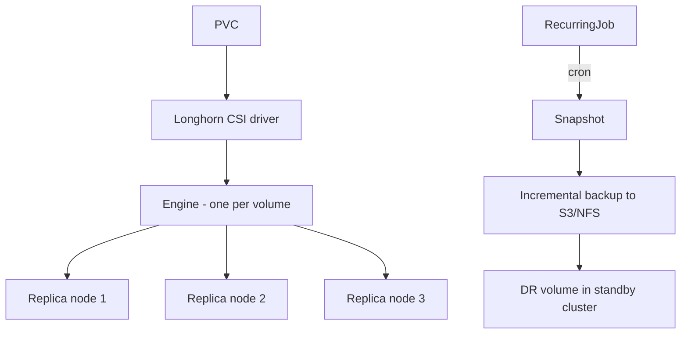

> 💡 **Quick Answer:** Longhorn (CNCF incubating, from SUSE/Rancher) turns local disks on your nodes into replicated block storage. Install `open-iscsi` (and `nfs-common` for RWX) on every node, run `helm install longhorn longhorn/longhorn -n longhorn-system --create-namespace`, and use the `longhorn` StorageClass. Each volume keeps N synchronous replicas on different nodes, and Longhorn adds snapshots, recurring backups to S3/NFS and DR volumes in a second cluster.
>
> **Gotcha:** Replicas protect against node loss, not deletion or corruption — configure a backup target and a recurring backup job.

## The Problem

On bare metal, edge and on-prem VMs there is no cloud disk CSI driver, and local PVs die with their node. You need persistent block storage that survives node failures, with snapshots and off-cluster backup, without operating a full Ceph cluster.

## The Solution

### Step 1: Node Prerequisites

```bash
# Ubuntu/Debian
sudo apt-get install -y open-iscsi nfs-common
sudo systemctl enable --now iscsid

# RHEL/Rocky
sudo dnf install -y iscsi-initiator-utils nfs-utils
sudo systemctl enable --now iscsid

# Check every node (longhornctl from github.com/longhorn/cli releases)
longhornctl check preflight
```

Longhorn stores data under `/var/lib/longhorn` by default — put that on a dedicated disk (ext4/xfs) sized for replicas.

### Step 2: Install Longhorn

```bash
kubectl -n longhorn-system create secret generic longhorn-s3-secret \
  --from-literal=AWS_ACCESS_KEY_ID=<key> \
  --from-literal=AWS_SECRET_ACCESS_KEY=<secret> \
  --from-literal=AWS_ENDPOINTS=https://s3.us-east-1.amazonaws.com   # or your MinIO URL
# (create the namespace first if it doesn't exist)

helm repo add longhorn https://charts.longhorn.io
helm repo update
helm install longhorn longhorn/longhorn \
  --namespace longhorn-system --create-namespace \
  --set defaultSettings.defaultReplicaCount=3 \
  --set persistence.defaultClassReplicaCount=3 \
  --set defaultBackupStore.backupTarget="s3://my-bucket@us-east-1/" \
  --set defaultBackupStore.backupTargetCredentialSecret=longhorn-s3-secret

kubectl -n longhorn-system get pods
kubectl get storageclass longhorn
kubectl -n longhorn-system port-forward svc/longhorn-frontend 8080:80   # UI (no auth — protect with an authenticated ingress)
```

Longhorn 1.8+ configures the backup target through `defaultBackupStore.*` (a `BackupTarget` CR); older releases used `defaultSettings.backupTarget` / `backupTargetCredentialSecret`.

### Step 3: Volumes

```yaml
# RWO block volume with 3 replicas (default StorageClass settings)
apiVersion: v1
kind: PersistentVolumeClaim
metadata:
  name: my-data
spec:
  accessModes: [ReadWriteOnce]
  storageClassName: longhorn
  resources:
    requests:
      storage: 10Gi
---
# Custom StorageClass: 2 replicas, strict placement, XFS
apiVersion: storage.k8s.io/v1
kind: StorageClass
metadata:
  name: longhorn-fast
provisioner: driver.longhorn.io
allowVolumeExpansion: true
reclaimPolicy: Delete
volumeBindingMode: Immediate
parameters:
  numberOfReplicas: "2"
  staleReplicaTimeout: "30"
  dataLocality: best-effort        # keep one replica on the consuming node
  fsType: xfs
  diskSelector: ssd
  recurringJobSelector: '[{"name":"daily-backup","isGroup":true}]'
```

`ReadWriteMany` works too: Longhorn exposes the volume through an NFSv4 share-manager pod (needs `nfs-common`/`nfs-utils` on nodes).

### Step 4: Snapshots and Recurring Backups

```yaml
# CSI snapshot (needs the external-snapshotter CRDs/controller)
apiVersion: snapshot.storage.k8s.io/v1
kind: VolumeSnapshotClass
metadata:
  name: longhorn-backup
driver: driver.longhorn.io
deletionPolicy: Delete
parameters:
  type: bak          # "bak" = backup to the backup target, "snap" = in-cluster snapshot
---
apiVersion: snapshot.storage.k8s.io/v1
kind: VolumeSnapshot
metadata:
  name: my-data-backup-1
spec:
  volumeSnapshotClassName: longhorn-backup
  source:
    persistentVolumeClaimName: my-data
---
# Recurring backups for every volume in the "default" group
apiVersion: longhorn.io/v1beta2
kind: RecurringJob
metadata:
  name: daily-backup
  namespace: longhorn-system
spec:
  cron: "0 2 * * *"
  task: backup
  retain: 7
  concurrency: 2
  groups: [default]
---
apiVersion: longhorn.io/v1beta2
kind: RecurringJob
metadata:
  name: hourly-snapshot
  namespace: longhorn-system
spec:
  cron: "0 * * * *"
  task: snapshot
  retain: 24
  concurrency: 2
  groups: [default]
```

### Step 5: Restore and Disaster Recovery

```yaml
# Restore a backup into a new PVC via a StorageClass with fromBackup
apiVersion: storage.k8s.io/v1
kind: StorageClass
metadata:
  name: longhorn-restore-my-data
provisioner: driver.longhorn.io
parameters:
  numberOfReplicas: "3"
  fromBackup: "s3://my-bucket@us-east-1/?backup=backup-abc123&volume=my-data"
---
apiVersion: v1
kind: PersistentVolumeClaim
metadata:
  name: restored-data
spec:
  accessModes: [ReadWriteOnce]
  storageClassName: longhorn-restore-my-data
  resources:
    requests:
      storage: 10Gi
```

Get the exact backup URL from the UI (*Backup → volume → backup → Copy URL*) or `kubectl -n longhorn-system get backups.longhorn.io`. Restoring from a CSI `VolumeSnapshot` of type `bak` (`dataSource` on the PVC) also works in the same cluster.

For warm standby, point a second cluster at the same backup target and create a **DR volume** (UI: *Backup → Create Disaster Recovery Volume*): it continuously restores the latest incremental backup and is activated when the primary site is lost. RPO = backup interval.


```mermaid
graph TD
    A[PVC] --> B[Longhorn CSI driver]
    B --> C[Engine - one per volume]
    C --> D[Replica node 1]
    C --> E[Replica node 2]
    C --> F[Replica node 3]
    G[RecurringJob] -->|cron| H[Snapshot]
    H --> I[Incremental backup to S3/NFS]
    I --> J[DR volume in standby cluster]
```

## Common Issues

**Volume stuck `Attaching` / pod `ContainerCreating`** — `iscsid` not running or `open-iscsi` missing on that node; `multipathd` claiming Longhorn devices (blacklist `^sd[a-z0-9]+` in `/etc/multipath.conf`).

**Volume `Degraded`** — fewer healthy replicas than configured (node down, disk full). Longhorn rebuilds automatically once capacity returns; check *Node* disk space and scheduling settings.

**PVC `Pending`: `insufficient storage`** — Longhorn reserves `storage-over-provisioning-percentage` / `storage-minimal-available-percentage`; add disks or reduce replica count.

**RWX volume fails to mount** — NFS client packages missing on nodes.

**Backup target `unavailable`** — wrong URL format (`s3://bucket@region/`), missing `AWS_ENDPOINTS` for MinIO, or bad credentials in the Secret.

## Best Practices

- **Dedicated disks** for `/var/lib/longhorn`, tag SSDs and use `diskSelector`
- **3 replicas** for production, 2 for replaceable data; replicas on different nodes (default anti-affinity)
- **Recurring backups off-cluster** plus snapshots for quick rollback
- **Don't stack replication** — for databases that replicate themselves (CloudNativePG, Kafka) use 1 replica or `dataLocality: strict-local`
- **Upgrade one minor version at a time** and check the upgrade path in release notes
- **Protect the UI** — it has no authentication of its own

## Frequently Asked Questions

### Longhorn vs Rook Ceph?

Longhorn is simpler to run and fine for small to medium clusters needing replicated block storage (RWX via NFS). Rook Ceph is heavier but offers native RWX filesystem, S3 object storage and petabyte scale. See [Rook Ceph storage](/recipes/storage/rook-ceph-storage-kubernetes/).

### How many nodes does Longhorn need?

It runs on one node, but three replicas need three schedulable nodes with disks. With fewer nodes, set `numberOfReplicas` accordingly.

### Are Longhorn snapshots backups?

No. Snapshots live in the same replicas as the volume. Backups are copied incrementally to an external target (S3 or NFS) and survive losing the cluster.

### Can I use Longhorn on OpenShift?

Yes — Longhorn documents OpenShift installs (Helm with `openshift.enabled=true` and the right SCC). Red Hat's supported alternative is OpenShift Data Foundation.

## Key Takeaways

- Longhorn replicates block volumes across node disks via a CSI driver
- Nodes need `open-iscsi` (and NFS client for RWX)
- Recurring snapshot + backup jobs protect against deletion and site loss
- Restore via `fromBackup` StorageClass, CSI snapshots, or standby DR volumes
