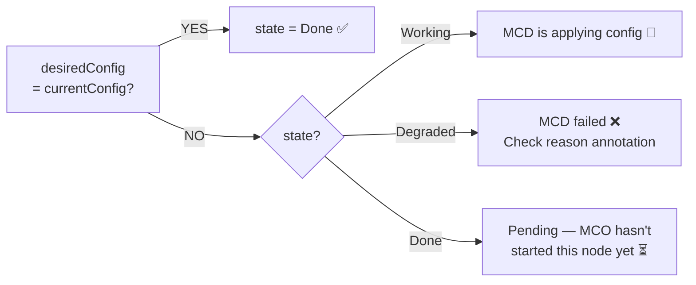

> 💡 **Quick Answer:** Every OpenShift node has MCO annotations showing its config state. Key annotations: `desiredConfig` (what MCO wants), `currentConfig` (what's applied), `state` (Done/Working/Degraded). Compare them to find nodes that are out of sync or stuck.

## The Problem

You need to understand which MachineConfig is applied to each node, whether nodes are in sync with the MCP, and which nodes are pending updates. The MCP shows aggregate status, but you need per-node detail.

## The Solution

### View All MCO Annotations

```bash
# Full annotation dump for a node
oc get node worker-1 -o json | jq '.metadata.annotations | with_entries(select(.key | startswith("machineconfiguration")))'
```

Key annotations:

| Annotation | Meaning |
|-----------|---------|
| `machineconfiguration.openshift.io/currentConfig` | Config hash currently applied |
| `machineconfiguration.openshift.io/desiredConfig` | Config hash MCO wants applied |
| `machineconfiguration.openshift.io/state` | `Done`, `Working`, or `Degraded` |
| `machineconfiguration.openshift.io/reason` | Reason for Degraded state |
| `machineconfiguration.openshift.io/currentImage` | OS image currently booted |
| `machineconfiguration.openshift.io/desiredImage` | OS image MCO wants |

### Compare All Nodes at a Glance

```bash
# One-liner: show all workers with config sync status
echo "NODE                STATE      MATCH  CURRENT-CONFIG"
for node in $(oc get nodes -l node-role.kubernetes.io/worker= -o name); do
  name=${node#node/}
  desired=$(oc get $node -o jsonpath='{.metadata.annotations.machineconfiguration\.openshift\.io/desiredConfig}')
  current=$(oc get $node -o jsonpath='{.metadata.annotations.machineconfiguration\.openshift\.io/currentConfig}')
  state=$(oc get $node -o jsonpath='{.metadata.annotations.machineconfiguration\.openshift\.io/state}')
  match=$( [ "$desired" = "$current" ] && echo "YES" || echo "NO" )
  printf "%-20s %-10s %-6s %s\n" "$name" "$state" "$match" "${current:0:40}"
done
```

Output:
```
NODE                STATE      MATCH  CURRENT-CONFIG
worker-1            Done       YES    rendered-worker-4688e2fd8e3040e79ec48
worker-2            Done       YES    rendered-worker-4688e2fd8e3040e79ec48
worker-3            Working    NO     rendered-worker-3a1b2c3d4e5f6a7b8c9d
worker-4            Done       NO     rendered-worker-3a1b2c3d4e5f6a7b8c9d
worker-5            Done       NO     rendered-worker-3a1b2c3d4e5f6a7b8c9d
worker-6            Done       NO     rendered-worker-3a1b2c3d4e5f6a7b8c9d
```

**Reading this:** Worker-1 and -2 are updated. Worker-3 is currently being updated (`Working`). Workers 4-6 are pending.

### Check What Changed Between Configs

```bash
# Compare rendered configs
CURRENT="rendered-worker-3a1b2c3d4e5f6a7b8c9d"
DESIRED="rendered-worker-4688e2fd8e3040e79ec48"

# View the rendered MachineConfigs
oc get mc "$CURRENT" -o yaml > /tmp/current.yaml
oc get mc "$DESIRED" -o yaml > /tmp/desired.yaml
diff /tmp/current.yaml /tmp/desired.yaml
```

### Check Degraded Node Reason

```bash
# If a node shows state=Degraded
oc get node worker-3 -o jsonpath='{.metadata.annotations.machineconfiguration\.openshift\.io/reason}'
# "unexpected on-disk state validating against rendered-worker-..."
```



## Common Issues

### Config Hash Looks Random

Rendered config names are hashes of all merged MachineConfigs for that role. A new hash means something changed — use `diff` to find what.

### Node Shows "Done" but Config Doesn't Match

MCO processes nodes sequentially. If `state=Done` but `desired ≠ current`, the node is queued — MCO will get to it after finishing the current node.

## Best Practices

- **Script the annotation check** — run it before and after MachineConfig changes
- **Compare config hashes** to quickly see which nodes are updated
- **Check `reason` on Degraded nodes** — it tells you exactly what went wrong
- **Monitor `state` during MCP rollouts** — `Working` means actively updating

## Key Takeaways

- MCO annotations are the source of truth for per-node config state
- `desired ≠ current` = node needs update; `state` tells you where in the process
- `state=Done` + configs match = fully updated
- `state=Degraded` + `reason` annotation = specific failure to investigate
- Use the one-liner to get cluster-wide MCP rollout status at a glance
