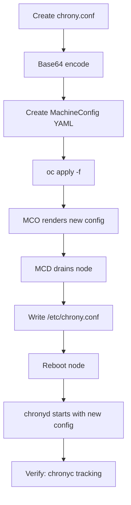

> 💡 **Quick Answer:** Create a MachineConfig with a base64-encoded `/etc/chrony.conf` specifying your NTP servers. Apply it to the worker or master MCP. The MCO will drain each node, write the config, restart chronyd, and reboot.

## The Problem

Your OpenShift cluster nodes are drifting in time. Certificate validation fails, log timestamps are inconsistent, and etcd elections are unstable. The default RHCOS chrony configuration points to public NTP pools, but your corporate network requires internal NTP servers — or the public pools are unreachable behind a firewall.

## The Solution

### Step 1: Create the Chrony Configuration

```bash
# Create your desired chrony.conf
cat > /tmp/chrony.conf << 'EOF'
# Internal NTP servers (replace with your own)
server ntp1.internal.example.com iburst
server ntp2.internal.example.com iburst
server ntp3.internal.example.com iburst

# Fallback to public pool (remove if air-gapped)
pool 2.rhel.pool.ntp.org iburst

# Record the rate at which the system clock gains/losses time
driftfile /var/lib/chrony/drift

# Allow the system clock to be stepped in the first three updates
makestep 1.0 3

# Enable kernel synchronization of the real-time clock (RTC)
rtcsync

# Serve time to local subnet (optional — for nodes serving other hosts)
# allow 10.0.0.0/8

# Specify directory for log files
logdir /var/log/chrony
EOF

# Base64 encode it (single line, no wrapping)
CHRONY_B64=$(base64 -w0 /tmp/chrony.conf)
```

### Step 2: Create the MachineConfig

```yaml
apiVersion: machineconfiguration.openshift.io/v1
kind: MachineConfig
metadata:
  name: 99-worker-chrony
  labels:
    machineconfiguration.openshift.io/role: worker
spec:
  config:
    ignition:
      version: 3.2.0
    storage:
      files:
        - path: /etc/chrony.conf
          mode: 0644
          overwrite: true
          contents:
            source: "data:text/plain;charset=utf-8;base64,<BASE64_CONTENT>"
```

```bash
# Generate the full MachineConfig YAML
cat > 99-worker-chrony.yaml << EOF
apiVersion: machineconfiguration.openshift.io/v1
kind: MachineConfig
metadata:
  name: 99-worker-chrony
  labels:
    machineconfiguration.openshift.io/role: worker
spec:
  config:
    ignition:
      version: 3.2.0
    storage:
      files:
        - path: /etc/chrony.conf
          mode: 0644
          overwrite: true
          contents:
            source: "data:text/plain;charset=utf-8;base64,${CHRONY_B64}"
EOF

# Apply
oc apply -f 99-worker-chrony.yaml
```

### Step 3: Monitor the Rollout

```bash
# Watch MCP status
watch oc get mcp worker

# The MCO will:
# 1. Render new config (rendered-worker-<hash>)
# 2. Cordon worker-1
# 3. Drain worker-1
# 4. Write /etc/chrony.conf
# 5. Reboot worker-1
# 6. Uncordon worker-1
# 7. Repeat for worker-2, worker-3, etc.
```

### Step 4: Verify Time Sync

```bash
# Check chrony status on a node
oc debug node/worker-1 -- chroot /host chronyc tracking
# Reference ID    : 0A000001 (ntp1.internal.example.com)
# Stratum         : 3
# System time     : 0.000000123 seconds fast of NTP time
# Last offset     : +0.000000456 seconds

# Check NTP sources
oc debug node/worker-1 -- chroot /host chronyc sources -v
# MS Name/IP address         Stratum Poll Reach LastRx Last sample
# ^* ntp1.internal.example.com  2   6   377    34   +123us[ +456us] +/-  12ms
```



## Common Issues

### MCP Stuck After Applying Chrony Config

The drain step may be blocked by PDBs. See [Fix Stale MachineConfigPool Updates](/recipes/troubleshooting/mcp-blocked-stale-update/).

### Chrony Can't Reach NTP Servers

```bash
# Test from a node
oc debug node/worker-1 -- chroot /host chronyc activity
# 0 sources online   ← NTP servers unreachable

# Check firewall — NTP uses UDP port 123
oc debug node/worker-1 -- chroot /host curl -v telnet://ntp1.internal.example.com:123
```

### Wrong Base64 Encoding

```bash
# Verify your encoding is correct
echo "$CHRONY_B64" | base64 -d
# Should output your exact chrony.conf content
```

### Apply to Masters Too

Create a second MachineConfig with `machineconfiguration.openshift.io/role: master`:

```bash
sed 's/worker/master/g' 99-worker-chrony.yaml > 99-master-chrony.yaml
oc apply -f 99-master-chrony.yaml
```

## Best Practices

- **Use at least 3 NTP servers** for redundancy and accuracy
- **Use `iburst`** for faster initial synchronization after reboot
- **Apply to both master and worker MCPs** — all nodes need consistent time
- **Test NTP connectivity before applying** — a bad config means nodes reboot with broken time
- **Use `makestep 1.0 3`** to allow large initial corrections (important after long downtime)
- **Name MachineConfigs with `99-` prefix** — ensures they apply after default configs

## Key Takeaways

- RHCOS nodes use chrony for NTP — configure it via MachineConfig, never SSH
- Base64-encode the full chrony.conf and embed in the MachineConfig
- MCO rolls out the change node-by-node with drain → reboot → uncordon
- Verify with `chronyc tracking` and `chronyc sources` after rollout
- Time drift causes certificate errors, etcd instability, and log inconsistencies
