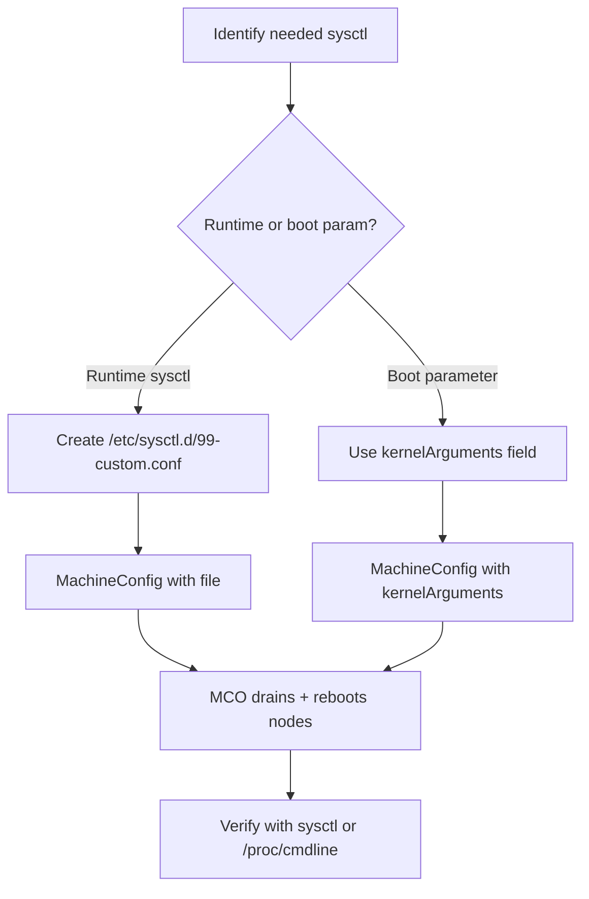

> 💡 **Quick Answer:** Create a MachineConfig with sysctl settings in the `kernelArguments` field or via a file at `/etc/sysctl.d/99-custom.conf`. The MCO drains, applies, and reboots each node sequentially.

## The Problem

Your Kubernetes workloads need custom kernel parameters — higher `net.core.somaxconn` for high-traffic Services, larger `vm.max_map_count` for Elasticsearch, or tuned `net.ipv4.tcp_*` settings for network performance. On RHCOS, you can't SSH in and run `sysctl -w` — changes must go through MachineConfig.

## The Solution

### Method 1: Sysctl File via MachineConfig

```bash
# Create sysctl config
cat > /tmp/99-custom-sysctl.conf << 'EOF'
# Network performance
net.core.somaxconn = 65535
net.core.netdev_max_backlog = 5000
net.ipv4.tcp_max_syn_backlog = 8192
net.ipv4.tcp_tw_reuse = 1

# Memory (for Elasticsearch, etc.)
vm.max_map_count = 262144

# File descriptors
fs.file-max = 2097152
fs.inotify.max_user_watches = 524288
EOF

# Base64 encode
SYSCTL_B64=$(base64 -w0 /tmp/99-custom-sysctl.conf)

# Create MachineConfig
cat > 99-worker-sysctl.yaml << EOF
apiVersion: machineconfiguration.openshift.io/v1
kind: MachineConfig
metadata:
  name: 99-worker-sysctl
  labels:
    machineconfiguration.openshift.io/role: worker
spec:
  config:
    ignition:
      version: 3.2.0
    storage:
      files:
        - path: /etc/sysctl.d/99-custom.conf
          mode: 0644
          overwrite: true
          contents:
            source: "data:text/plain;charset=utf-8;base64,${SYSCTL_B64}"
EOF

oc apply -f 99-worker-sysctl.yaml
```

### Method 2: Kernel Arguments (Boot Parameters)

```yaml
apiVersion: machineconfiguration.openshift.io/v1
kind: MachineConfig
metadata:
  name: 99-worker-kernel-args
  labels:
    machineconfiguration.openshift.io/role: worker
spec:
  kernelArguments:
    - "hugepagesz=2M"
    - "hugepages=1024"
    - "intel_iommu=on"
    - "iommu=pt"
```

### Verify After Rollout

```bash
# Check sysctl values
oc debug node/worker-1 -- chroot /host sysctl net.core.somaxconn vm.max_map_count
# net.core.somaxconn = 65535
# vm.max_map_count = 262144

# Check kernel arguments
oc debug node/worker-1 -- chroot /host cat /proc/cmdline
```



## Common Issues

### Sysctl Value Not Persisting

Runtime sysctls in `/etc/sysctl.d/` are loaded by `systemd-sysctl.service` on boot. If the file exists but values aren't set, check:
```bash
oc debug node/worker-1 -- chroot /host systemctl status systemd-sysctl
```

### Invalid Kernel Parameter

If you set an invalid parameter, the MachineConfig applies but the sysctl is ignored. Always test values first.

## Best Practices

- **Use `/etc/sysctl.d/99-custom.conf`** for runtime sysctls — the `99-` prefix ensures it overrides defaults
- **Use `kernelArguments`** for boot-time parameters (hugepages, IOMMU, etc.)
- **Apply to specific MCPs** — GPU nodes may need different sysctls than general workers
- **Test with `oc debug`** before creating the MachineConfig
- **Document why each sysctl is set** — comments in the conf file help future operators

## Key Takeaways

- RHCOS is immutable — use MachineConfig for all kernel tuning
- Runtime sysctls go in `/etc/sysctl.d/` files, boot params use `kernelArguments`
- MCO rolls out changes node-by-node with drain and reboot
- Always verify after rollout with `sysctl` or `/proc/cmdline`
