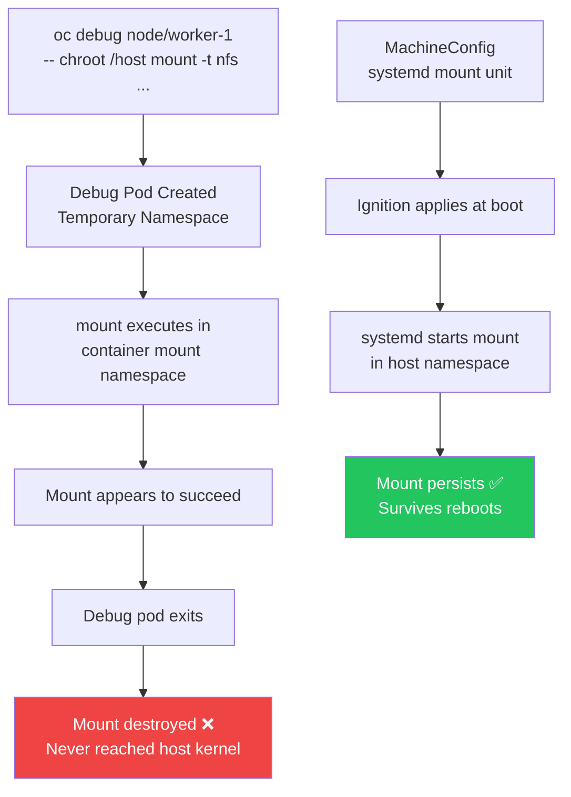

> 💡 **Quick Answer:** Create a MachineConfig with systemd `.mount` units — one per NFS share. This is the **only** supported way to mount NFS on OpenShift RHCOS nodes. `oc debug` mounts are silently discarded when the debug pod exits.

## The Problem

You need to mount NFS shares directly on OpenShift worker nodes (e.g., for fio benchmarking, legacy apps, or hostPath volumes). You tried `oc debug node` with `chroot /host` and `mount -t nfs`, but:

- The mount command appears to succeed
- `mount | grep nfs` shows nothing
- The mount disappears when the debug pod exits
- Pods using `hostPath` to the mount point see empty directories

**This is by design.** OpenShift 4.x blocks host mount operations from debug pods for security. The mount syscall executes inside the container namespace and is destroyed with the pod.

## The Solution

### Why `oc debug` Mounts Don't Work



### Step 1: Create the MachineConfig

Each NFS mount needs its own systemd `.mount` unit. The unit name **must match the mount path** with `/` replaced by `-` (systemd convention).

**Single NFS server example:**

```yaml
# 99-worker-nfs-mounts.yaml
apiVersion: machineconfiguration.openshift.io/v1
kind: MachineConfig
metadata:
  name: 99-worker-nfs-mounts
  labels:
    machineconfiguration.openshift.io/role: worker
spec:
  config:
    ignition:
      version: 3.2.0
    systemd:
      units:
        - name: mnt-nfsdata-server1.mount
          enabled: true
          contents: |
            [Unit]
            Description=Mount NFS server1
            After=network-online.target
            Wants=network-online.target

            [Mount]
            What=192.168.10.50:/exports/shared
            Where=/mnt/nfsdata/server1
            Type=nfs
            Options=rw,hard,nointr,rsize=1048576,wsize=1048576

            [Install]
            WantedBy=multi-user.target
```

### Step 2: Multiple NFS Servers

For multiple NFS endpoints, add one unit per server:

```yaml
apiVersion: machineconfiguration.openshift.io/v1
kind: MachineConfig
metadata:
  name: 99-worker-nfs-mounts
  labels:
    machineconfiguration.openshift.io/role: worker
spec:
  config:
    ignition:
      version: 3.2.0
    systemd:
      units:
        # Server 1
        - name: mnt-nfsdata-nfs01.mount
          enabled: true
          contents: |
            [Unit]
            Description=Mount NFS nfs01
            After=network-online.target
            Wants=network-online.target

            [Mount]
            What=192.168.10.50:/exports/shared
            Where=/mnt/nfsdata/nfs01
            Type=nfs
            Options=rw,hard,nointr,rsize=1048576,wsize=1048576

            [Install]
            WantedBy=multi-user.target

        # Server 2
        - name: mnt-nfsdata-nfs02.mount
          enabled: true
          contents: |
            [Unit]
            Description=Mount NFS nfs02
            After=network-online.target
            Wants=network-online.target

            [Mount]
            What=192.168.10.51:/exports/shared
            Where=/mnt/nfsdata/nfs02
            Type=nfs
            Options=rw,hard,nointr,rsize=1048576,wsize=1048576

            [Install]
            WantedBy=multi-user.target

        # Server 3
        - name: mnt-nfsdata-nfs03.mount
          enabled: true
          contents: |
            [Unit]
            Description=Mount NFS nfs03
            After=network-online.target
            Wants=network-online.target

            [Mount]
            What=192.168.10.52:/exports/shared
            Where=/mnt/nfsdata/nfs03
            Type=nfs
            Options=rw,hard,nointr,rsize=1048576,wsize=1048576

            [Install]
            WantedBy=multi-user.target
```

### Step 3: Generate MachineConfig for Many Servers (Script)

When you have many NFS endpoints, generate the YAML:

```bash
#!/bin/bash
# generate-nfs-machineconfig.sh

NFS_SERVERS=(
  "192.168.10.50"
  "192.168.10.51"
  "192.168.10.52"
  "192.168.10.53"
  "192.168.10.54"
)
EXPORT_PATH="/exports/shared"
MOUNT_ROOT="/mnt/nfsdata"
NFS_OPTIONS="rw,hard,nointr,rsize=1048576,wsize=1048576"

cat <<EOF
apiVersion: machineconfiguration.openshift.io/v1
kind: MachineConfig
metadata:
  name: 99-worker-nfs-mounts
  labels:
    machineconfiguration.openshift.io/role: worker
spec:
  config:
    ignition:
      version: 3.2.0
    systemd:
      units:
EOF

for IP in "${NFS_SERVERS[@]}"; do
  # Convert mount path to systemd unit name
  # /mnt/nfsdata/192.168.10.50 → mnt-nfsdata-192.168.10.50.mount
  UNIT_NAME=$(echo "${MOUNT_ROOT}/${IP}" | sed 's|^/||; s|/|-|g').mount
  MOUNT_PATH="${MOUNT_ROOT}/${IP}"

  cat <<EOF
        - name: ${UNIT_NAME}
          enabled: true
          contents: |
            [Unit]
            Description=Mount NFS ${IP}
            After=network-online.target
            Wants=network-online.target

            [Mount]
            What=${IP}:${EXPORT_PATH}
            Where=${MOUNT_PATH}
            Type=nfs
            Options=${NFS_OPTIONS}

            [Install]
            WantedBy=multi-user.target
EOF
done
```

```bash
# Generate and apply
chmod +x generate-nfs-machineconfig.sh
./generate-nfs-machineconfig.sh > 99-worker-nfs-mounts.yaml
oc apply -f 99-worker-nfs-mounts.yaml
```

### Step 4: Apply and Monitor Rollout

```bash
# Apply the MachineConfig
oc apply -f 99-worker-nfs-mounts.yaml

# ⚠️ This triggers a rolling reboot of all worker nodes!
# Monitor the MachineConfigPool
oc get mcp worker -w
# NAME     CONFIG             UPDATED   UPDATING   DEGRADED   MACHINECOUNT   READYMACHINECOUNT
# worker   rendered-worker-*  False     True       False      6              0

# Watch nodes rebooting one by one
oc get nodes -w

# Wait until all nodes are Ready and MCP shows UPDATED=True
```

### Step 5: Verify Mounts

```bash
# Check mounts on a specific node
oc debug node/worker-1 -- chroot /host sh -c "mount | grep nfsdata"
# 192.168.10.50:/exports/shared on /mnt/nfsdata/192.168.10.50 type nfs4 (rw,...)
# 192.168.10.51:/exports/shared on /mnt/nfsdata/192.168.10.51 type nfs4 (rw,...)
# 192.168.10.52:/exports/shared on /mnt/nfsdata/192.168.10.52 type nfs4 (rw,...)

# Check systemd mount unit status
oc debug node/worker-1 -- chroot /host systemctl status mnt-nfsdata-nfs01.mount
# ● mnt-nfsdata-nfs01.mount - Mount NFS nfs01
#      Loaded: loaded
#      Active: active (mounted)

# Verify data is accessible
oc debug node/worker-1 -- chroot /host ls -la /mnt/nfsdata/192.168.10.50/
```

### Step 6: Use in Pods via hostPath

```yaml
apiVersion: v1
kind: Pod
metadata:
  name: nfs-consumer
  namespace: my-project
spec:
  nodeSelector:
    node-role.kubernetes.io/worker: ""
  containers:
    - name: app
      image: registry.example.com/myapp:1.0
      securityContext:
        capabilities:
          drop: ["ALL"]
        seccompProfile:
          type: RuntimeDefault
      volumeMounts:
        - name: nfs-data
          mountPath: /data
          readOnly: false
  volumes:
    - name: nfs-data
      hostPath:
        path: /mnt/nfsdata/192.168.10.50
        type: Directory
```

### Teardown: Remove NFS Mounts

To unmount and remove all NFS mounts, delete the MachineConfig:

```bash
# This triggers another rolling reboot
oc delete machineconfig 99-worker-nfs-mounts

# Monitor rollout
oc get mcp worker -w
# Wait for UPDATED=True

# Verify mounts are gone
oc debug node/worker-1 -- chroot /host sh -c "mount | grep nfsdata"
# (no output = mounts removed)
```

Or replace with a config that explicitly disables the units:

```yaml
apiVersion: machineconfiguration.openshift.io/v1
kind: MachineConfig
metadata:
  name: 99-worker-nfs-mounts
  labels:
    machineconfiguration.openshift.io/role: worker
spec:
  config:
    ignition:
      version: 3.2.0
    systemd:
      units:
        - name: mnt-nfsdata-nfs01.mount
          enabled: false
          mask: true
```

### Verify Mounts Script

```bash
#!/bin/bash
# verify-nfs-mounts.sh — Check all NFS mounts on all worker nodes

NFS_SERVERS=(
  "192.168.10.50"
  "192.168.10.51"
  "192.168.10.52"
)

NODES=$(oc get nodes -l node-role.kubernetes.io/worker= -o jsonpath='{.items[*].metadata.name}')

echo "=== NFS Mount Verification ==="
FAILED=0

for NODE in $NODES; do
  echo ""
  echo "--- Node: $NODE ---"
  MOUNTS=$(oc debug node/$NODE -- chroot /host sh -c "mount | grep nfsdata" 2>/dev/null)

  for IP in "${NFS_SERVERS[@]}"; do
    if echo "$MOUNTS" | grep -q "$IP"; then
      echo "  ✅ $IP mounted"
    else
      echo "  ❌ $IP NOT mounted"
      FAILED=$((FAILED + 1))
    fi
  done
done

echo ""
if [ $FAILED -eq 0 ]; then
  echo "✅ All mounts verified on all nodes."
else
  echo "❌ $FAILED missing mount(s) detected!"
  exit 1
fi
```

## Common Issues

### Systemd Unit Name Must Match Mount Path

The unit filename must be the mount path with `/` → `-` and leading slash removed:
- Mount path: `/mnt/nfsdata/server1` → Unit name: `mnt-nfsdata-server1.mount`
- Mount path: `/data/nfs/prod` → Unit name: `data-nfs-prod.mount`

If the name doesn't match, systemd ignores the unit silently.

### NFS Server Unreachable at Boot

If the NFS server is down during node boot, the mount fails and the node may hang. Add `nofail` and `x-systemd.mount-timeout`:

```ini
[Mount]
Options=rw,hard,nofail,x-systemd.mount-timeout=30s
```

### PodSecurity Warnings with hostPath

`hostPath` volumes trigger PodSecurity warnings in `restricted` namespaces:
```
Warning: would violate PodSecurity "restricted:latest": restricted volume types (volume "nfs-volume" uses restricted volume type "hostPath")
```

**Fix:** Label the namespace to allow `privileged` or `baseline` workloads:
```bash
oc label namespace my-project \
  pod-security.kubernetes.io/enforce=baseline \
  pod-security.kubernetes.io/warn=baseline
```

### MCP Stuck Degraded After Apply

```bash
# Check which node is stuck
oc get nodes -o wide
oc get mcp worker -o yaml | grep -A5 conditions

# Check if NFS server is reachable from the node
oc debug node/worker-1 -- chroot /host ping -c3 192.168.10.50

# Check systemd journal for mount errors
oc debug node/worker-1 -- chroot /host journalctl -u mnt-nfsdata-nfs01.mount --no-pager -n 20
```

## Best Practices

- **Always use MachineConfig for node-level mounts** — `oc debug` mounts are ephemeral by design
- **One systemd unit per mount** — don't try to combine multiple mounts in one unit
- **Add `nofail`** if the NFS server might be temporarily unavailable during boot
- **Use `hard` mount option** — prevents silent data corruption on network interruption
- **Set `rsize/wsize=1048576`** — 1MB read/write buffers for optimal NFS throughput
- **Test on one node first** — apply to a custom MCP with a single node before rolling to all workers
- **Plan for rolling reboots** — MachineConfig changes trigger node-by-node restarts
- **Use NFS PersistentVolumes instead of hostPath** when possible — more portable and CSI-managed

## Key Takeaways

- `oc debug node` mounts are ephemeral — they vanish when the debug pod exits
- MachineConfig with systemd `.mount` units is the **only** supported way to persist NFS mounts on RHCOS
- Unit name must match the mount path exactly (`/mnt/x/y` → `mnt-x-y.mount`)
- Apply triggers rolling reboot of all nodes in the MachineConfigPool
- Add `nofail` to prevent boot hangs if NFS is temporarily unreachable
- For pods, use `hostPath` pointing to the node mount — or better yet, use NFS CSI PVs
