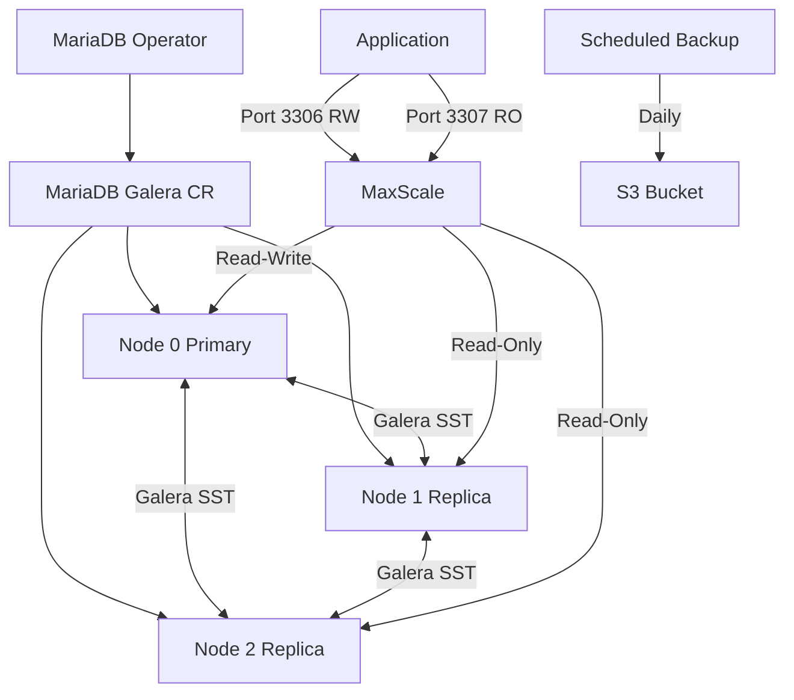

> 💡 **Quick Answer:** Install the MariaDB Operator via Helm, create a `MariaDB` CR for single-instance or `MariaDB` with `galera.enabled: true` for multi-node Galera clusters with automatic failover, S3 backups, and MaxScale connection routing.

## The Problem

Running MariaDB on Kubernetes with StatefulSets means manually configuring Galera replication, handling node joins/leaves, managing backups, and setting up connection routing. A single misconfigured Galera node can cause split-brain or data inconsistency.

## The Solution

The MariaDB Operator manages the complete MariaDB lifecycle including Galera cluster formation, primary failover, scheduled backups to S3, and MaxScale for intelligent query routing.

### Install MariaDB Operator

```bash
# Install via Helm
helm repo add mariadb-operator https://mariadb-operator.github.io/mariadb-operator
helm repo update

helm install mariadb-operator mariadb-operator/mariadb-operator \
  --namespace mariadb-system \
  --create-namespace \
  --set ha.enabled=true \
  --set webhook.enabled=true \
  --set metrics.enabled=true

# Verify
kubectl get pods -n mariadb-system
kubectl get crds | grep mariadb
```

### Single Instance MariaDB

```yaml
apiVersion: k8s.mariadb.com/v1alpha1
kind: MariaDB
metadata:
  name: mariadb-app
  namespace: production
spec:
  rootPasswordSecretKeyRef:
    name: mariadb-root
    key: password
    generate: true

  image: mariadb:11.4

  port: 3306

  storage:
    size: 50Gi
    storageClassName: gp3-encrypted

  resources:
    requests:
      cpu: 500m
      memory: 1Gi
    limits:
      cpu: "2"
      memory: 4Gi

  myCnf: |
    [mariadb]
    bind-address=*
    default_storage_engine=InnoDB
    binlog_format=ROW
    innodb_autoinc_lock_mode=2
    innodb_buffer_pool_size=2G
    max_connections=500
    character-set-server=utf8mb4
    collation-server=utf8mb4_unicode_ci

  metrics:
    enabled: true
```

### Galera Cluster (Multi-Node HA)

```yaml
apiVersion: k8s.mariadb.com/v1alpha1
kind: MariaDB
metadata:
  name: mariadb-galera
  namespace: production
spec:
  rootPasswordSecretKeyRef:
    name: mariadb-root
    key: password
    generate: true

  image: mariadb:11.4

  replicas: 3

  galera:
    enabled: true
    primary:
      podIndex: 0
      automaticFailover: true
    sst: mariabackup
    replicaThreads: 4
    agent:
      image: ghcr.io/mariadb-operator/mariadb-operator:latest
      gracefulShutdownTimeout: 5s
    recovery:
      enabled: true
      clusterHealthyTimeout: 3m
      clusterBootstrapTimeout: 10m
    initJob:
      metadata:
        labels:
          sidecar.istio.io/inject: "false"

  storage:
    size: 100Gi
    storageClassName: gp3-encrypted

  resources:
    requests:
      cpu: "1"
      memory: 2Gi
    limits:
      cpu: "4"
      memory: 8Gi

  affinity:
    antiAffinityEnabled: true

  myCnf: |
    [mariadb]
    bind-address=*
    default_storage_engine=InnoDB
    binlog_format=ROW
    innodb_autoinc_lock_mode=2
    innodb_buffer_pool_size=4G
    max_connections=1000
    wsrep_slave_threads=4

  metrics:
    enabled: true
```

### Database and User

```yaml
apiVersion: k8s.mariadb.com/v1alpha1
kind: Database
metadata:
  name: appdb
  namespace: production
spec:
  mariaDbRef:
    name: mariadb-galera
  characterSet: utf8mb4
  collate: utf8mb4_unicode_ci
---
apiVersion: k8s.mariadb.com/v1alpha1
kind: User
metadata:
  name: appuser
  namespace: production
spec:
  mariaDbRef:
    name: mariadb-galera
  passwordSecretKeyRef:
    name: appuser-password
    key: password
    generate: true
  maxUserConnections: 50
---
apiVersion: k8s.mariadb.com/v1alpha1
kind: Grant
metadata:
  name: appuser-grant
  namespace: production
spec:
  mariaDbRef:
    name: mariadb-galera
  privileges:
    - SELECT
    - INSERT
    - UPDATE
    - DELETE
    - CREATE
    - ALTER
    - DROP
    - INDEX
  database: appdb
  table: "*"
  username: appuser
  grantOption: false
```

### S3 Backups

```yaml
apiVersion: k8s.mariadb.com/v1alpha1
kind: Backup
metadata:
  name: mariadb-backup-s3
  namespace: production
spec:
  mariaDbRef:
    name: mariadb-galera
  schedule:
    cron: "0 2 * * *"        # Daily at 2 AM
    suspend: false
  maxRetention: 720h          # 30 days
  storage:
    s3:
      bucket: mariadb-backups
      prefix: galera/
      endpoint: s3.amazonaws.com
      region: us-east-1
      accessKeyIdSecretKeyRef:
        name: s3-creds
        key: access-key-id
      secretAccessKeySecretKeyRef:
        name: s3-creds
        key: secret-access-key
```

### Restore from Backup

```yaml
apiVersion: k8s.mariadb.com/v1alpha1
kind: Restore
metadata:
  name: mariadb-restore
  namespace: production
spec:
  mariaDbRef:
    name: mariadb-galera
  backupRef:
    name: mariadb-backup-s3
  targetRecoveryTime: "2026-03-13T02:00:00Z"
```

### MaxScale Connection Routing

```yaml
apiVersion: k8s.mariadb.com/v1alpha1
kind: MaxScale
metadata:
  name: maxscale
  namespace: production
spec:
  replicas: 2

  mariaDbRef:
    name: mariadb-galera

  services:
    - name: rw-router
      router: readwritesplit
      params:
        transaction_replay: "true"
        slave_selection_criteria: LEAST_CURRENT_OPERATIONS
      listener:
        port: 3306
        protocol: MariaDBProtocol
    - name: ro-router
      router: readconnroute
      params:
        router_options: slave
      listener:
        port: 3307
        protocol: MariaDBProtocol

  monitor:
    module: galeramon
    interval: 2s
    params:
      disable_master_failback: "false"

  resources:
    requests:
      cpu: 100m
      memory: 256Mi
    limits:
      cpu: 500m
      memory: 512Mi
```

### Application Connection

```yaml
apiVersion: apps/v1
kind: Deployment
metadata:
  name: myapp
  namespace: production
spec:
  template:
    spec:
      containers:
        - name: app
          image: myapp:latest
          env:
            # Via MaxScale (recommended)
            - name: DB_HOST
              value: maxscale.production.svc
            - name: DB_PORT
              value: "3306"
            # Or direct to MariaDB service
            # - name: DB_HOST
            #   value: mariadb-galera.production.svc
            - name: DB_NAME
              value: appdb
            - name: DB_USER
              value: appuser
            - name: DB_PASSWORD
              valueFrom:
                secretKeyRef:
                  name: appuser-password
                  key: password
```

### Verify Cluster

```bash
# Check MariaDB status
kubectl get mariadb -n production

# Galera cluster status
kubectl exec mariadb-galera-0 -n production -- \
  mariadb -u root -p$(kubectl get secret mariadb-root -n production -o jsonpath='{.data.password}' | base64 -d) \
  -e "SHOW STATUS LIKE 'wsrep_cluster%';"

# Check replication
kubectl exec mariadb-galera-0 -n production -- \
  mariadb -u root -p$ROOT_PW -e "SHOW STATUS LIKE 'wsrep_local_state_comment';"
# Should show: Synced

# List backups
kubectl get backups -n production

# MaxScale status
kubectl exec maxscale-0 -n production -- maxctrl list servers
kubectl exec maxscale-0 -n production -- maxctrl list services
```



## Common Issues

- **Galera cluster won't bootstrap** — check `clusterBootstrapTimeout`; verify all 3 PVCs are bound; check operator logs
- **Split-brain after network partition** — enable `recovery.enabled: true`; operator auto-detects and recovers
- **MaxScale can't find primaries** — verify `galeramon` module is configured; check `maxctrl list servers`
- **Backup to S3 fails** — verify S3 credentials and bucket permissions; check backup job logs
- **Connection refused after failover** — MaxScale handles routing; ensure apps connect via MaxScale, not directly

## Best Practices

- Use 3 or 5 Galera nodes (odd number for quorum)
- Enable `automaticFailover` for production clusters
- Use MaxScale for read/write splitting and connection routing
- Schedule daily backups with 30-day retention
- Set `antiAffinityEnabled: true` to spread nodes across Kubernetes nodes
- Create databases and users via CRDs (Database, User, Grant) — not SQL
- Monitor with Prometheus metrics (`metrics.enabled: true`)
- Use `mariabackup` SST method (not rsync) for non-blocking state transfer

## Key Takeaways

- MariaDB Operator manages single-instance and Galera clusters via CRDs
- Galera provides synchronous multi-primary replication
- MaxScale CRD provides intelligent read/write splitting and failover
- Database, User, and Grant CRDs manage schema declaratively
- S3 backups with point-in-time recovery via Backup/Restore CRDs
- `automaticFailover` + `recovery.enabled` for production resilience
