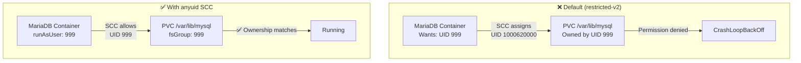

> 💡 **Quick Answer:** MariaDB's official container runs as UID 999 (mysql). OpenShift's default `restricted-v2` SCC assigns a random UID, which causes permission denied on `/var/lib/mysql`. Fix: create a ServiceAccount, grant `anyuid` SCC, and set `runAsUser: 999` + `fsGroup: 999` in the pod spec. For Galera clusters, use a StatefulSet with headless Service.

## The Problem

MariaDB containers expect to run as the `mysql` user (UID 999) and own `/var/lib/mysql`. OpenShift's `restricted-v2` SCC assigns a random high UID (e.g., 1000620000) from the namespace range. This causes:

1. `chown: changing ownership of '/var/lib/mysql': Operation not permitted`
2. `[ERROR] mysqld: Can't create/write to file '/var/lib/mysql/...'`
3. `CrashLoopBackOff` on every pod restart



## The Solution

### Step 1: Create ServiceAccount and Grant SCC

```bash
# Create namespace and service account
oc new-project mariadb

oc create serviceaccount mariadb-sa -n mariadb

# Grant anyuid SCC — allows running as specific UID
oc adm policy add-scc-to-user anyuid -z mariadb-sa -n mariadb

# Verify
oc adm policy who-can use scc anyuid | grep mariadb-sa
```

### Step 2: Create Secret for Root Password

```yaml
apiVersion: v1
kind: Secret
metadata:
  name: mariadb-secret
  namespace: mariadb
type: Opaque
stringData:
  MYSQL_ROOT_PASSWORD: "changeme-in-production"
  MYSQL_DATABASE: "appdb"
  MYSQL_USER: "appuser"
  MYSQL_PASSWORD: "appuser-password"
```

### Step 3: Deploy Single-Instance MariaDB

```yaml
apiVersion: v1
kind: PersistentVolumeClaim
metadata:
  name: mariadb-data
  namespace: mariadb
spec:
  accessModes: ["ReadWriteOnce"]
  resources:
    requests:
      storage: 20Gi
  storageClassName: gp3-csi            # Adjust to your storage class
---
apiVersion: v1
kind: ConfigMap
metadata:
  name: mariadb-config
  namespace: mariadb
data:
  my.cnf: |
    [mysqld]
    # Performance
    innodb_buffer_pool_size = 1G
    innodb_log_file_size = 256M
    innodb_flush_log_at_trx_commit = 2
    innodb_flush_method = O_DIRECT
    
    # Connections
    max_connections = 200
    wait_timeout = 600
    interactive_timeout = 600
    
    # Logging
    slow_query_log = 1
    slow_query_log_file = /var/lib/mysql/slow.log
    long_query_time = 2
    
    # Character set
    character-set-server = utf8mb4
    collation-server = utf8mb4_unicode_ci
    
    # Security
    skip-name-resolve
    local-infile = 0
---
apiVersion: apps/v1
kind: Deployment
metadata:
  name: mariadb
  namespace: mariadb
spec:
  replicas: 1
  strategy:
    type: Recreate                     # Don't run two instances on same PVC
  selector:
    matchLabels:
      app: mariadb
  template:
    metadata:
      labels:
        app: mariadb
    spec:
      serviceAccountName: mariadb-sa   # SA with anyuid SCC
      securityContext:
        runAsUser: 999                 # mysql user
        runAsGroup: 999                # mysql group
        fsGroup: 999                   # PVC ownership
        fsGroupChangePolicy: OnRootMismatch  # Fast ownership change
      containers:
        - name: mariadb
          image: docker.io/library/mariadb:11.4
          ports:
            - containerPort: 3306
              name: mysql
          env:
            - name: MYSQL_ROOT_PASSWORD
              valueFrom:
                secretKeyRef:
                  name: mariadb-secret
                  key: MYSQL_ROOT_PASSWORD
            - name: MYSQL_DATABASE
              valueFrom:
                secretKeyRef:
                  name: mariadb-secret
                  key: MYSQL_DATABASE
            - name: MYSQL_USER
              valueFrom:
                secretKeyRef:
                  name: mariadb-secret
                  key: MYSQL_USER
            - name: MYSQL_PASSWORD
              valueFrom:
                secretKeyRef:
                  name: mariadb-secret
                  key: MYSQL_PASSWORD
          resources:
            requests:
              cpu: 500m
              memory: 1Gi
            limits:
              cpu: 2
              memory: 2Gi
          readinessProbe:
            exec:
              command:
                - healthcheck.sh
                - --connect
                - --innodb_initialized
            initialDelaySeconds: 15
            periodSeconds: 10
          livenessProbe:
            exec:
              command:
                - healthcheck.sh
                - --connect
            initialDelaySeconds: 30
            periodSeconds: 30
            # ⚠️ Liveness does NOT check queries — only connection
            # Prevents thundering herd from full DB health checks
          volumeMounts:
            - name: data
              mountPath: /var/lib/mysql
            - name: config
              mountPath: /etc/mysql/conf.d
            - name: tmp
              mountPath: /tmp
      volumes:
        - name: data
          persistentVolumeClaim:
            claimName: mariadb-data
        - name: config
          configMap:
            name: mariadb-config
        - name: tmp
          emptyDir: {}
---
apiVersion: v1
kind: Service
metadata:
  name: mariadb
  namespace: mariadb
spec:
  selector:
    app: mariadb
  ports:
    - port: 3306
      targetPort: 3306
      name: mysql
```

### Galera Cluster (StatefulSet)

```yaml
# Headless service for Galera peer discovery
apiVersion: v1
kind: Service
metadata:
  name: mariadb-galera
  namespace: mariadb
  labels:
    app: mariadb-galera
spec:
  clusterIP: None
  selector:
    app: mariadb-galera
  ports:
    - port: 3306
      name: mysql
    - port: 4567
      name: galera-replication
    - port: 4568
      name: galera-ist
    - port: 4444
      name: galera-sst
---
apiVersion: v1
kind: Service
metadata:
  name: mariadb-galera-client
  namespace: mariadb
spec:
  selector:
    app: mariadb-galera
  ports:
    - port: 3306
      targetPort: 3306
      name: mysql
---
apiVersion: apps/v1
kind: StatefulSet
metadata:
  name: mariadb-galera
  namespace: mariadb
spec:
  serviceName: mariadb-galera
  replicas: 3
  podManagementPolicy: OrderedReady
  selector:
    matchLabels:
      app: mariadb-galera
  template:
    metadata:
      labels:
        app: mariadb-galera
    spec:
      serviceAccountName: mariadb-sa
      securityContext:
        runAsUser: 999
        runAsGroup: 999
        fsGroup: 999
        fsGroupChangePolicy: OnRootMismatch
      affinity:
        podAntiAffinity:
          requiredDuringSchedulingIgnoredDuringExecution:
            - labelSelector:
                matchLabels:
                  app: mariadb-galera
              topologyKey: kubernetes.io/hostname
      containers:
        - name: mariadb
          image: docker.io/library/mariadb:11.4
          ports:
            - containerPort: 3306
              name: mysql
            - containerPort: 4567
              name: galera-rep
            - containerPort: 4568
              name: galera-ist
            - containerPort: 4444
              name: galera-sst
          env:
            - name: MYSQL_ROOT_PASSWORD
              valueFrom:
                secretKeyRef:
                  name: mariadb-secret
                  key: MYSQL_ROOT_PASSWORD
            - name: MYSQL_INITDB_SKIP_TZINFO
              value: "yes"
            - name: POD_NAME
              valueFrom:
                fieldRef:
                  fieldPath: metadata.name
          args:
            - --wsrep-new-cluster
            - --wsrep-on=ON
            - --wsrep-provider=/usr/lib/galera/libgalera_smm.so
            - --wsrep-cluster-name=k8s-galera
            - --wsrep-cluster-address=gcomm://mariadb-galera-0.mariadb-galera,mariadb-galera-1.mariadb-galera,mariadb-galera-2.mariadb-galera
            - --wsrep-sst-method=mariabackup
            - --wsrep-node-name=$(POD_NAME)
            - --wsrep-node-address=$(POD_NAME).mariadb-galera
            - --binlog-format=ROW
            - --default-storage-engine=InnoDB
            - --innodb-autoinc-lock-mode=2
            - --innodb-buffer-pool-size=512M
          readinessProbe:
            exec:
              command:
                - bash
                - -c
                - "mariadb -u root -p$MYSQL_ROOT_PASSWORD -e 'SHOW STATUS LIKE \"wsrep_ready\"' | grep -q ON"
            initialDelaySeconds: 30
            periodSeconds: 10
          livenessProbe:
            exec:
              command:
                - healthcheck.sh
                - --connect
            initialDelaySeconds: 60
            periodSeconds: 30
          resources:
            requests:
              cpu: 500m
              memory: 1Gi
            limits:
              cpu: 2
              memory: 2Gi
          volumeMounts:
            - name: data
              mountPath: /var/lib/mysql
  volumeClaimTemplates:
    - metadata:
        name: data
      spec:
        accessModes: ["ReadWriteOnce"]
        storageClassName: gp3-csi
        resources:
          requests:
            storage: 20Gi
```

### Bitnami MariaDB (Pre-configured for OpenShift)

```bash
# Bitnami images support arbitrary UIDs out of the box
helm install mariadb oci://registry-1.docker.io/bitnamicharts/mariadb \
  --namespace mariadb \
  --set auth.rootPassword=changeme \
  --set auth.database=appdb \
  --set primary.persistence.size=20Gi \
  --set primary.containerSecurityContext.runAsUser=999 \
  --set primary.podSecurityContext.fsGroup=999 \
  --set serviceAccount.create=true

# For Galera:
helm install mariadb-galera oci://registry-1.docker.io/bitnamicharts/mariadb-galera \
  --namespace mariadb \
  --set rootUser.password=changeme \
  --set replicaCount=3 \
  --set persistence.size=20Gi \
  --set containerSecurityContext.runAsUser=999 \
  --set podSecurityContext.fsGroup=999
```

### Troubleshoot SCC Issues

```bash
# Check which SCC the pod got
oc get pod mariadb-0 -n mariadb -o jsonpath='{.metadata.annotations.openshift\.io/scc}'
# Should be: anyuid

# If pod won't start, check events
oc describe pod mariadb-0 -n mariadb | grep -A5 "Warning\|Error\|SCC"

# Test SCC before deploying
oc adm policy scc-subject-review -z mariadb-sa -n mariadb -f mariadb-pod.yaml

# Verify UID inside running container
oc exec -it mariadb-0 -n mariadb -- id
# uid=999(mysql) gid=999(mysql) groups=999(mysql)

# Check file ownership
oc exec -it mariadb-0 -n mariadb -- ls -la /var/lib/mysql/
# Should show mysql:mysql ownership
```

## Common Issues

| Issue | Cause | Fix |
|-------|-------|-----|
| `chown: Operation not permitted` | `restricted-v2` SCC, random UID | Grant `anyuid` SCC to ServiceAccount |
| `Permission denied` on `/var/lib/mysql` | Wrong `fsGroup` or SCC | Set `fsGroup: 999` + `anyuid` SCC |
| Galera nodes can't connect | Ports 4567-4568 blocked | Verify NetworkPolicy allows Galera ports |
| Slow PVC ownership on restart | `fsGroupChangePolicy: Always` (default) | Set `fsGroupChangePolicy: OnRootMismatch` |
| `wsrep_ready OFF` | Cluster bootstrap issue | Bootstrap first node with `--wsrep-new-cluster` |
| OOM kills | `innodb_buffer_pool_size` too large | Set to 50-70% of container memory limit |

## Best Practices

- **Grant `anyuid`, not `privileged`** — MariaDB only needs specific UID, not full privileges
- **Use `fsGroupChangePolicy: OnRootMismatch`** — avoids slow recursive chown on restarts
- **Set `strategy: Recreate` for single-instance** — prevents two pods writing to same PVC
- **Liveness probe: connect only** — don't query-check in liveness (causes thundering herd)
- **Readiness probe: check wsrep_ready for Galera** — prevents routing to unsynced nodes
- **Pod anti-affinity for Galera** — spread replicas across nodes for HA
- **Secrets for passwords** — never hardcode credentials in manifests

## Key Takeaways

- MariaDB needs UID 999 — grant `anyuid` SCC to the ServiceAccount
- Set `runAsUser: 999`, `runAsGroup: 999`, `fsGroup: 999` in pod security context
- `fsGroupChangePolicy: OnRootMismatch` prevents slow startup on large data volumes
- For Galera: StatefulSet + headless Service + pod anti-affinity
- Bitnami Helm charts are pre-configured for OpenShift arbitrary UIDs
- Always verify with `oc get pod -o jsonpath='{.metadata.annotations.openshift\.io/scc}'`
