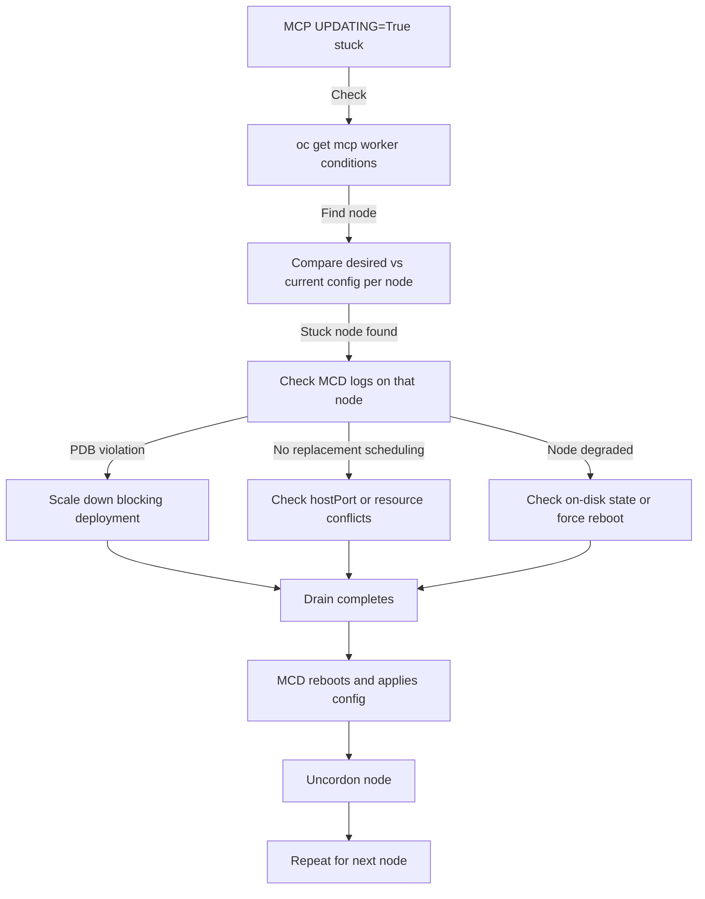

> 💡 **Quick Answer:** Run `oc get mcp` to check pool status. If `UPDATING=True` and `UPDATED=False` persists, find the blocked node with `oc get mcp worker -o jsonpath='{.status.conditions}'`, then check MachineConfigDaemon logs on that node to identify the blocker — usually a PDB violation or pod that cannot be evicted.

## The Problem

You applied a MachineConfig change (new registries.conf, kernel parameter, chrony config, etc.) and the MachineConfigPool shows `UPDATING=True` but never progresses. The MCP is stuck — nodes are not getting the new config, and `UPDATEDMACHINECOUNT` stays below `MACHINECOUNT`. This blocks all subsequent cluster changes.

## The Solution

### Step 1: Check MCP Status

```bash
oc get mcp
# NAME     CONFIG                                             UPDATED   UPDATING   DEGRADED   MACHINECOUNT   READYMACHINECOUNT   UPDATEDMACHINECOUNT   DEGRADEDMACHINECOUNT   AGE
# master   rendered-master-4688e2fd8e3040e79ec48fe88f433791   True      False      False      3              3                   3                     0                      12d
# worker   rendered-worker-43cbd983151c9e1eb24ef6d3906effe4   False     True       False      6              4                   4                     0                      12d
```

**Reading the output:**
- `MACHINECOUNT=6` — total worker nodes in the pool
- `UPDATEDMACHINECOUNT=4` — 4 nodes have the new config
- `READYMACHINECOUNT=4` — 4 nodes are Ready
- `UPDATING=True` — MCO is still trying to update remaining nodes
- **2 nodes remaining** (6 - 4 = 2 need updates)

### Step 2: Find Which Node Is Blocking

```bash
# Check MCP conditions for details
oc get mcp worker -o jsonpath='{.status.conditions}' | jq .

# Look for:
# "type": "Updating" — which node is being processed
# "type": "Degraded" — if there's an error
# "type": "NodeDegraded" — specific node failure
```

### Step 3: Identify the Stuck Node

```bash
# Compare desired vs current config on each worker
for node in $(oc get nodes -l node-role.kubernetes.io/worker= -o name); do
  desired=$(oc get $node -o jsonpath='{.metadata.annotations.machineconfiguration\.openshift\.io/desiredConfig}')
  current=$(oc get $node -o jsonpath='{.metadata.annotations.machineconfiguration\.openshift\.io/currentConfig}')
  state=$(oc get $node -o jsonpath='{.metadata.annotations.machineconfiguration\.openshift\.io/state}')
  echo "$node: state=$state desired=$desired current=$current match=$([ "$desired" = "$current" ] && echo YES || echo NO)"
done
```

Nodes where `match=NO` still need the update. The node with `state=Working` or `state=Degraded` is the current target.

### Step 4: Check MachineConfigDaemon Logs

```bash
# Find the MCD pod for the stuck node
NODE_NAME="worker-3"  # replace with your stuck node
MCD_POD=$(oc -n openshift-machine-config-operator get pods -o wide | grep "machine-config-daemon" | grep "$NODE_NAME" | awk '{print $1}')

# Check recent logs
oc -n openshift-machine-config-operator logs "$MCD_POD" -c machine-config-daemon --since=10m
```

**Common log patterns:**

```
# PDB violation (most common blocker)
Cannot drain node worker-3: eviction blocked by pod default/my-app-xxxxx because of PodDisruptionBudget

# Pod blocking eviction (no PDB, but cannot schedule replacement)
drain: pod openshift-ingress/router-custom-xxxxx cannot be evicted: no nodes available for scheduling replacement

# Node in degraded state
Node worker-3 is reporting: "unexpected on-disk state"
```

### Step 5: Unblock the Drain

Once you identify the blocking pod, see the [MCP Drain PDB Workaround](/recipes/troubleshooting/mcp-drain-pdb-workaround/) recipe for the fix.



## Common Issues

### MCP Shows DEGRADED=True

```bash
# Check which node is degraded
oc get nodes -l node-role.kubernetes.io/worker= -o json | \
  jq -r '.items[] | select(.metadata.annotations["machineconfiguration.openshift.io/state"]=="Degraded") | .metadata.name'

# Check the MCD logs on that node for the specific error
# Common: failed to apply rendered config, disk full, SELinux denial
```

### Multiple Nodes Stuck Simultaneously

MCO updates nodes sequentially (one at a time by default). If multiple nodes show `state=Working`, check `maxUnavailable` on the MCP:

```bash
oc get mcp worker -o jsonpath='{.spec.maxUnavailable}'
# Default: 1 (one node at a time)
```

### MCP Stuck After Removing a MachineConfig

If you deleted a MachineConfig and the MCP is now stuck with a mismatched rendered config:

```bash
# Force MCO to re-render
oc patch mcp worker --type merge -p '{"metadata":{"annotations":{"machineconfiguration.openshift.io/forceReconcile":""}}}'
```

## Best Practices

- **Always check MCP status after applying MachineConfig changes** — don't assume they applied
- **Monitor MCD logs during rollouts** — the MCD tells you exactly what's blocking
- **Use `maxUnavailable: 1`** for production — never update all workers simultaneously
- **Plan for PDB conflicts** — know which workloads have strict PDBs before starting
- **Create separate MCPs for GPU/compute nodes** — isolate rollout blast radius

## Key Takeaways

- MCP stuck at `UPDATING=True` means a node drain is blocked
- Compare `desiredConfig` vs `currentConfig` annotations to find stuck nodes
- MachineConfigDaemon logs reveal the exact blocker (PDB violation, scheduling failure)
- MCO processes nodes sequentially — fixing one node lets the rollout continue
- Always check `DEGRADEDMACHINECOUNT` — degraded nodes need manual intervention
