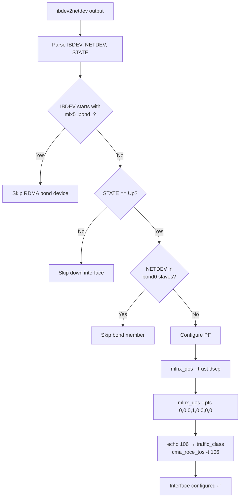

> 💡 **Quick Answer:** Deploy a privileged DaemonSet using the DOCA driver image that waits for Mellanox driver readiness, then iterates over physical functions via `ibdev2netdev` and applies `mlnx_qos --trust dscp`, PFC on priority 3, and `cma_roce_tos -t 106` (DSCP 26/AF31) — skipping bond members and bond RDMA devices.

## The Problem

GPU nodes with Mellanox ConnectX NICs need consistent RoCE QoS configuration across the fleet:
- **DSCP trust mode** so switches honor host markings instead of remarking to best-effort
- **PFC on priority 3** for lossless RDMA traffic
- **RoCE ToS 106** (DSCP 26 / AF31) so all RDMA traffic lands in the correct traffic class

MachineConfig can set sysctl values, but NIC-level configuration requires MOFED userspace tools (`mlnx_qos`, `cma_roce_tos`, `ibdev2netdev`). A DaemonSet with the DOCA driver image provides these tools and runs after the kernel driver is ready.

Key challenges:
- Must wait for MOFED driver to finish loading (race condition on boot)
- Must skip bond0 slave interfaces (bonding driver manages those)
- Must skip RDMA bond devices (`mlx5_bond_*`) — only configure physical functions
- Must only configure interfaces that are actually up

## The Solution

### DaemonSet Manifest

```yaml
apiVersion: apps/v1
kind: DaemonSet
metadata:
  name: mellanox-roce-dscp
  namespace: nvidia-network-operator
spec:
  selector:
    matchLabels:
      app: mellanox-roce-dscp
  template:
    metadata:
      labels:
        app: mellanox-roce-dscp
    spec:
      hostNetwork: true
      hostPID: true
      tolerations:
        - operator: Exists
      containers:
        - name: roce-qos
          image: nvcr.io/nvidia/mellanox/doca-driver:doca3.2.0-25.10-1.2.8.0-5.14.0-570.73.1.el9_6.x86_64-rhcos4.20-amd64
          imagePullPolicy: IfNotPresent
          securityContext:
            privileged: true
          command:
            - /bin/bash
            - -ceu
            - |
              set -euo pipefail

              DRIVER_READY_FILE="/run/mellanox/drivers/.driver-ready"
              WAIT_TIMEOUT=300

              echo "[INFO] Waiting for Mellanox drivers: $DRIVER_READY_FILE"

              # ── Step 0: Wait for driver readiness ──
              SECONDS_WAITED=0
              while [[ ! -f "$DRIVER_READY_FILE" ]]; do
                if (( SECONDS_WAITED >= WAIT_TIMEOUT )); then
                  echo "[ERROR] Timeout waiting for Mellanox drivers"
                  exit 1
                fi
                sleep 2
                ((SECONDS_WAITED+=2))
              done
              echo "[INFO] Mellanox drivers are ready"

              # ── Step 1: Collect bond0 slave interfaces ──
              declare -A BOND0_SLAVES
              if [[ -d /sys/class/net/bond0/bonding ]]; then
                echo "[DEBUG] bond0 detected, collecting slaves"
                for IFACE in $(< /sys/class/net/bond0/bonding/slaves); do
                  BOND0_SLAVES["$IFACE"]=1
                done
              fi

              # ── Step 2: Configure each Mellanox PF ──
              ibdev2netdev | while read -r IBDEV _ PORT _ NETDEV STATE; do

                # Skip RDMA bond devices
                if [[ "$IBDEV" == mlx5_bond_* ]]; then
                  echo "[DEBUG] Skipping RDMA bond device $IBDEV"
                  continue
                fi

                # Only configure Up interfaces
                if [[ "$STATE" != "(Up)" ]]; then
                  continue
                fi

                IFACE="$NETDEV"

                # Skip bond0 members
                if [[ -n "${BOND0_SLAVES[$IFACE]:-}" ]]; then
                  echo "[INFO] Skipping $IFACE (bond0 slave)"
                  continue
                fi

                echo "[INFO] Configuring $IFACE (RDMA device $IBDEV)"

                # Trust DSCP markings from the host
                mlnx_qos -i "$IFACE" --trust dscp

                # Enable PFC on priority 3 only
                mlnx_qos -i "$IFACE" --pfc 0,0,0,1,0,0,0,0

                # Set RoCE ToS = 106 (DSCP 26 = AF31)
                echo 106 > /sys/class/infiniband/"$IBDEV"/tc/1/traffic_class
                cma_roce_tos -d "$IBDEV" -t 106

              done

              echo "[INFO] RoCE DSCP QoS configuration completed"
              tail -f /dev/null
          volumeMounts:
            - name: host-run
              mountPath: /run
              readOnly: true
      volumes:
        - name: host-run
          hostPath:
            path: /run
            type: Directory
      nodeSelector:
        feature.node.kubernetes.io/pci-15b3.present: "true"
```

### How It Works

#### Driver Readiness Wait

The NVIDIA Network Operator (or MOFED DaemonSet) creates a sentinel file when drivers finish loading:

```
/run/mellanox/drivers/.driver-ready
```

The script polls for this file with a 300-second timeout. This prevents the race condition where `mlnx_qos` runs before the kernel module is loaded.

#### ibdev2netdev Parsing

`ibdev2netdev` outputs one line per RDMA port:

```
mlx5_0 port 1 ==> ens1f0 (Up)
mlx5_1 port 1 ==> ens1f1 (Up)
mlx5_bond_0 port 1 ==> bond0 (Up)
```

The script parses each line into: `IBDEV`, port number, `NETDEV`, and `STATE`.

#### Bond Exclusion Logic

Two types of bonds are excluded:

1. **RDMA bond devices** (`mlx5_bond_*`) — these are kernel-level RDMA aggregation devices managed by the bonding driver. Configuring them directly would conflict.

2. **bond0 slave interfaces** — if `ens1f0` and `ens1f1` are bonded, configuring PFC on individual slaves can break the bond's flow control negotiation. The bond driver manages QoS for its members.



#### ToS 106 Explained

The value **106** encodes both DSCP and ECN in the ToS byte:

```
ToS byte:  0 1 1 0 1 0 1 0
           └─DSCP──┘ └ECN┘
           
DSCP = 011010 = 26 (decimal) = AF31
ECN  = 10 = ECT(0) — ECN-Capable Transport
ToS  = 01101010 = 106 (decimal) = 0x6A
```

- **DSCP 26 (AF31)** maps to traffic class 3 on the switch → lossless queue
- **ECN bits = 10** signals the NIC is ECN-capable → switches can mark instead of drop
- `cma_roce_tos` sets this for RDMA CM (Connection Manager) connections
- Writing to `tc/1/traffic_class` sets it for the RDMA traffic class

#### DOCA Driver Image

The image tag encodes the full driver and OS stack:

```
nvcr.io/nvidia/mellanox/doca-driver:doca3.2.0-25.10-1.2.8.0-5.14.0-570.73.1.el9_6.x86_64-rhcos4.20-amd64
```

| Component | Value |
|-----------|-------|
| DOCA version | 3.2.0 |
| MOFED version | 25.10-1.2.8.0 |
| Kernel | 5.14.0-570.73.1.el9_6 |
| OS | RHCOS 4.20 |
| Arch | amd64 |

> ⚠️ The image tag must match your node's kernel and OS version exactly. Use `uname -r` on a node to verify.

#### Node Selection

```yaml
nodeSelector:
  feature.node.kubernetes.io/pci-15b3.present: "true"
```

NFD (Node Feature Discovery) automatically labels nodes with Mellanox PCI vendor ID `15b3`. This ensures the DaemonSet only runs on nodes with Mellanox NICs.

### Verification

```bash
# Check DaemonSet status
kubectl get ds mellanox-roce-dscp -n nvidia-network-operator

# Check logs on a specific node
kubectl logs -n nvidia-network-operator \
  $(kubectl get pods -n nvidia-network-operator -l app=mellanox-roce-dscp \
    --field-selector spec.nodeName=gpu-worker-0 -o name) | head -20

# Expected output:
# [INFO] Mellanox drivers are ready
# [DEBUG] bond0 detected, collecting slaves
# [INFO] Skipping ens1f0np0 (bond0 slave)
# [INFO] Configuring ens2f0np0 (RDMA device mlx5_2)
# [INFO] RoCE DSCP QoS configuration completed

# Verify on node
oc debug node/gpu-worker-0 -- chroot /host mlnx_qos -i ens2f0np0
# trust state: dscp
# PFC: 0,0,0,1,0,0,0,0

# Verify ToS
oc debug node/gpu-worker-0 -- chroot /host \
  cat /sys/class/infiniband/mlx5_2/tc/1/traffic_class
# 106
```

## Common Issues

**DaemonSet pod stuck in CrashLoopBackOff — driver readiness timeout**

The MOFED driver DaemonSet hasn't created `/run/mellanox/drivers/.driver-ready` within 300 seconds. Check:
```bash
kubectl get ds -n nvidia-network-operator | grep mofed
kubectl logs -n nvidia-network-operator <mofed-pod>
```

**Image pull fails — wrong kernel version in tag**

The DOCA driver image tag must match the node kernel exactly:
```bash
oc debug node/gpu-worker-0 -- uname -r
# 5.14.0-570.73.1.el9_6.x86_64
```
If the kernel was updated, you need a new DOCA driver image tag.

**`mlnx_qos` reports "Operation not supported" on VFs**

This DaemonSet only configures PFs (physical functions). VF QoS is inherited from the PF or configured via SR-IOV Network Operator policies. The bond exclusion logic already filters out non-PF devices.

**PFC counters incrementing rapidly after configuration**

PFC is working correctly — it's preventing drops. If counters grow too fast, add ECN (not configured by this DaemonSet — use the ECN MachineConfig recipe) to reduce PFC activation.

**bond0 slaves getting configured despite exclusion**

Check that `/sys/class/net/bond0/bonding/slaves` is readable. The DaemonSet mounts `/run` read-only — bond info is under `/sys` which is always available in `hostNetwork` + `hostPID` mode.

## Best Practices

- **Pin the DOCA driver image to your exact kernel** — mismatched images cause module load failures
- **Use `tail -f /dev/null`** to keep the container running after configuration — allows log inspection and `kubectl exec` for debugging
- **Node Feature Discovery label** (`pci-15b3.present`) is more reliable than manual node labels
- **Mount `/run` read-only** — only needs to read the driver-ready sentinel, not write anything
- **Run in `nvidia-network-operator` namespace** — collocates with MOFED and Network Operator pods
- **Add ECN configuration** alongside PFC for a complete lossless stack (see related ECN MachineConfig recipe)
- **Tolerate all taints** (`operator: Exists`) — GPU nodes often have taints to prevent non-GPU workloads
- **Log verbosity**: Uncomment `set -x` for full bash trace during debugging, re-comment for production

## Key Takeaways

- The DaemonSet pattern gives you MOFED tools (`mlnx_qos`, `cma_roce_tos`, `ibdev2netdev`) without installing RPMs on nodes
- Wait for `/run/mellanox/drivers/.driver-ready` before running any Mellanox CLI tools
- `ibdev2netdev` is the single source of truth for RDMA device → network interface mapping
- Skip bond devices (both `mlx5_bond_*` RDMA devices and bond0 slave interfaces)
- ToS 106 = DSCP 26 (AF31) + ECN ECT(0) — the standard RoCEv2 marking
- `cma_roce_tos` sets ToS for RDMA CM connections; `traffic_class` sysfs sets it for the RDMA TC
- DOCA driver image tag must match node kernel version exactly
- This DaemonSet handles PF configuration; VF QoS comes from SR-IOV Network Operator
