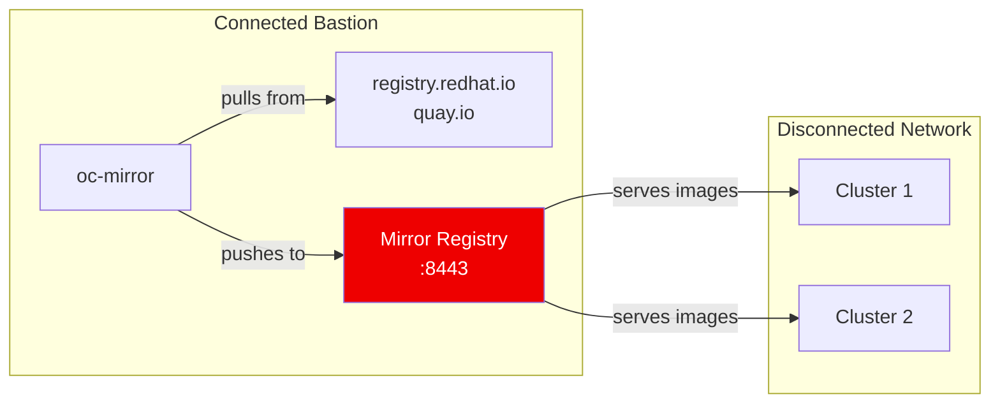

> 💡 **Quick Answer:** The mirror registry for Red Hat OpenShift is a small-scale Quay-based registry included in every OpenShift subscription. Run `./mirror-registry install` on a RHEL host to deploy a local registry on port 8443 — it auto-generates credentials, TLS certificates, and uses local or SQLite storage. Use it to bootstrap disconnected installs before migrating to production-grade Red Hat Quay.

## The Problem

Disconnected OpenShift installations need a container image registry accessible from within the air-gapped network. Without one:

- You can't pull release images during installation
- Operator catalogs are unreachable
- Upgrades fail because ClusterVersion can't fetch release payloads
- You need a Docker v2-2 compatible registry before you can even start

Setting up a production registry like Red Hat Quay requires an existing cluster — a chicken-and-egg problem for the first disconnected install.

## The Solution

### Architecture



### Prerequisites

- RHEL 8 or 9 with Podman 3.4.2+
- 2+ vCPUs, 8 GB RAM
- ~12 GB for OCP release images, ~358 GB with Operator images
- OpenSSL installed
- DNS-resolvable FQDN for the registry host

### Step 1: Install mirror-registry

```bash
# Download from Red Hat console (Downloads page)
# Or direct from Red Hat:
wget https://developers.redhat.com/content-gateway/rest/mirror/pub/openshift-v4/clients/mirror-registry/latest/mirror-registry.tar.gz

tar xzf mirror-registry.tar.gz

# Install on local host (default port 8443)
./mirror-registry install \
  --quayHostname registry.example.com \
  --quayRoot /opt/quay-install

# Output includes auto-generated credentials:
# Username: init
# Password: <auto-generated>
# Registry URL: https://registry.example.com:8443
```

For a remote host:

```bash
./mirror-registry install -v \
  --targetHostname registry.example.com \
  --targetUsername admin \
  -k ~/.ssh/id_rsa \
  --quayHostname registry.example.com \
  --quayRoot /opt/quay-install
```

### Step 2: Verify and Login

```bash
# Login with generated credentials
podman login -u init \
  -p '<generated-password>' \
  registry.example.com:8443 \
  --tls-verify=false

# Or trust the auto-generated CA first
cp /opt/quay-install/quay-rootCA/rootCA.pem \
  /etc/pki/ca-trust/source/anchors/quay-rootCA.pem
update-ca-trust

# Then login with TLS verification
podman login -u init \
  -p '<generated-password>' \
  registry.example.com:8443

# Access web UI
# https://registry.example.com:8443
```

### Step 3: Configure Pull Secret

```bash
# Extract the cluster global pull secret
oc extract secret/pull-secret -n openshift-config --confirm --to=.

# Add mirror registry credentials to .dockerconfigjson
MIRROR_AUTH=$(echo -n 'init:<password>' | base64 -w0)

cat .dockerconfigjson | jq --arg auth "$MIRROR_AUTH" \
  '.auths["registry.example.com:8443"] = {"auth": $auth, "email": "admin@example.com"}' \
  > pull-secret-updated.json

# Update the cluster pull secret (for existing clusters)
oc set data secret/pull-secret -n openshift-config \
  --from-file=.dockerconfigjson=pull-secret-updated.json
```

### Step 4: Add Registry CA to Cluster

```bash
# Create ConfigMap with the registry CA
# Note: Replace ":" with ".." in registry hostname for the key
oc create configmap mirror-registry-ca \
  --from-file=registry.example.com..8443=/opt/quay-install/quay-rootCA/rootCA.pem \
  -n openshift-config

# Patch the cluster image config to trust the CA
oc patch image.config.openshift.io/cluster \
  --patch '{"spec":{"additionalTrustedCA":{"name":"mirror-registry-ca"}}}' \
  --type=merge
```

### Registry Storage Options

| Option | Capacity | HA | Use Case |
|--------|----------|-----|----------|
| **mirror-registry** | Single host, local disk | No | Bootstrap, small labs |
| **Red Hat Quay** | Multi-TB, S3/NFS backends | Yes | Production, multi-cluster |
| **JFrog Artifactory** | Enterprise storage | Yes | Mixed artifact management |
| **Sonatype Nexus** | File/S3 backends | Optional | Existing Nexus infrastructure |
| **Harbor** | S3/GCS/Azure backends | Yes | Open-source alternative |

### Upgrading mirror-registry

```bash
# From v1.x to v2.x (PostgreSQL → SQLite migration)
# Constraints: single writer, no UI during upgrade, intermittent downtime
sudo ./mirror-registry upgrade -v \
  --quayHostname registry.example.com \
  --quayRoot /opt/quay-install

# PostgreSQL backup saved to:
# /opt/quay-install/quay-postgres-backup/

# Verify
podman ps
# registry.redhat.io/quay/quay-rhel8:v3.12.10
```

### Custom TLS Certificates

```bash
# Use your own CA-signed certificates
./mirror-registry install \
  --quayHostname registry.example.com \
  --quayRoot /opt/quay-install \
  --sslCert /path/to/ssl.crt \
  --sslKey /path/to/ssl.key

# Replace certificates on existing install
cp ~/ssl.crt /opt/quay-install/quay-config/ssl.crt
cp ~/ssl.key /opt/quay-install/quay-config/ssl.key
systemctl --user restart quay-app
```

### Uninstall

```bash
./mirror-registry uninstall -v \
  --quayRoot /opt/quay-install \
  --autoApprove
```

## Common Issues

**"pasta failed with exit code 1" on RHEL 9.5+**

Podman 5.0+ changed the default rootless networking from slirp4netns to pasta. If your host has no default route, add `default_rootless_network_cmd = "slirp4netns"` under `[network]` in `/etc/containers/containers.conf`, then run `podman system migrate`.

**Insufficient storage during mirroring**

Release images alone need ~12 GB; with Operators, plan for 358+ GB. Use Red Hat Quay's garbage collection to reclaim space. Consider `--quayStorage` on a dedicated volume.

**mirror-registry is not a production registry**

It's designed for bootstrapping. After your first cluster is running, deploy production Red Hat Quay and migrate content. Don't use mirror-registry for multi-cluster production.

## Best Practices

- **Use a DNS FQDN** — `--quayHostname` doesn't support bare IP addresses
- **Trust the CA early** — distribute the rootCA.pem to all bastion and cluster nodes before mirroring
- **Plan storage for your full upgrade path** — each OCP version adds ~5-10 GB of images
- **Keep credentials secure** — the init password is printed only at install time
- **Migrate to production Quay** — mirror-registry is for bootstrapping, not long-term use
- **Back up before upgrading** — v1→v2 migration can cause downtime

## Key Takeaways

- mirror-registry for Red Hat OpenShift bootstraps a Quay-based registry with a single command
- Auto-generates credentials, TLS certificates, and uses SQLite storage (v2.x)
- Required as the first step in any disconnected OpenShift installation
- Replace ":" with ".." in registry hostname when creating CA ConfigMap keys
- Plan for 12 GB minimum (releases only) or 358+ GB (releases + Operators)
- Migrate to production Red Hat Quay after bootstrapping your first cluster
