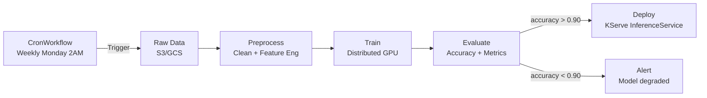

> 💡 **Quick Answer:** Use Kubeflow Pipelines for ML-specific workflows (data prep → train → evaluate → deploy) or Argo Workflows for general-purpose DAG execution. Define pipelines as Python code with the KFP SDK, compile to YAML, and schedule recurring runs for model retraining.

## The Problem

Manual ML workflows don't scale: data scientists run notebooks, manually copy model artifacts, test in staging, and deploy to production. Each step is error-prone and unreproducible. ML pipelines automate the full workflow — from raw data to deployed model — with versioning, caching, and monitoring.

## The Solution

### Kubeflow Pipeline (Python SDK)

```python
from kfp import dsl, compiler

@dsl.component(base_image="python:3.11")
def preprocess_data(input_path: str, output_path: dsl.Output[dsl.Dataset]):
    import pandas as pd
    df = pd.read_csv(input_path)
    df_clean = df.dropna()
    df_clean.to_csv(output_path.path)

@dsl.component(base_image="registry.example.com/pytorch:2.5")
def train_model(
    dataset: dsl.Input[dsl.Dataset],
    model: dsl.Output[dsl.Model],
    epochs: int = 10,
    lr: float = 0.001
):
    # Training logic here
    pass

@dsl.component
def evaluate_model(model: dsl.Input[dsl.Model]) -> float:
    # Evaluation logic
    return 0.94

@dsl.component
def deploy_model(model: dsl.Input[dsl.Model], accuracy: float):
    if accuracy > 0.90:
        # Deploy to KServe
        pass

@dsl.pipeline(name="ML Training Pipeline")
def training_pipeline(input_data: str = "s3://data/train.csv"):
    preprocess = preprocess_data(input_path=input_data)
    train = train_model(dataset=preprocess.outputs["output_path"], epochs=20)
    evaluate = evaluate_model(model=train.outputs["model"])
    deploy = deploy_model(
        model=train.outputs["model"],
        accuracy=evaluate.output
    )

compiler.Compiler().compile(training_pipeline, "pipeline.yaml")
```

### Argo Workflow Alternative

```yaml
apiVersion: argoproj.io/v1alpha1
kind: Workflow
metadata:
  name: ml-training
spec:
  entrypoint: ml-pipeline
  templates:
    - name: ml-pipeline
      dag:
        tasks:
          - name: preprocess
            template: preprocess
          - name: train
            template: train
            dependencies: [preprocess]
            arguments:
              artifacts:
                - name: data
                  from: "{{tasks.preprocess.outputs.artifacts.processed-data}}"
          - name: evaluate
            template: evaluate
            dependencies: [train]
          - name: deploy
            template: deploy
            dependencies: [evaluate]
            when: "{{tasks.evaluate.outputs.parameters.accuracy}} > 0.90"
    - name: train
      container:
        image: registry.example.com/training:1.0
        resources:
          limits:
            nvidia.com/gpu: 4
```

### Scheduled Retraining

```yaml
apiVersion: argoproj.io/v1alpha1
kind: CronWorkflow
metadata:
  name: weekly-retrain
spec:
  schedule: "0 2 * * 1"
  timezone: "UTC"
  workflowSpec:
    entrypoint: ml-pipeline
    # ... same pipeline spec
```



## Common Issues

**Pipeline step fails but cached result is used on retry**

KFP caches step outputs by default. Force re-execution: `dsl.pipeline(pipeline_root='...').set_caching_options(False)`.

**GPU step stuck in Pending**

Pipeline steps run as pods. Check GPU availability: `kubectl describe node | grep nvidia.com/gpu`. Set `activeDeadlineSeconds` to prevent indefinite waits.

## Best Practices

- **Version everything** — data, code, model artifacts, pipeline definition
- **Conditional deployment** — only deploy if evaluation metrics meet threshold
- **Cache intermediate steps** — don't reprocess data if only hyperparameters changed
- **Schedule weekly retraining** — models degrade as data distribution shifts
- **Alert on metric degradation** — automated monitoring of model accuracy

## Key Takeaways

- ML pipelines automate the full workflow: data → train → evaluate → deploy
- Kubeflow Pipelines for ML-specific workflows; Argo Workflows for general DAGs
- Python SDK compiles pipelines to Kubernetes-native YAML
- Caching avoids redundant computation — only re-run changed steps
- Scheduled retraining prevents model drift — critical for production ML
