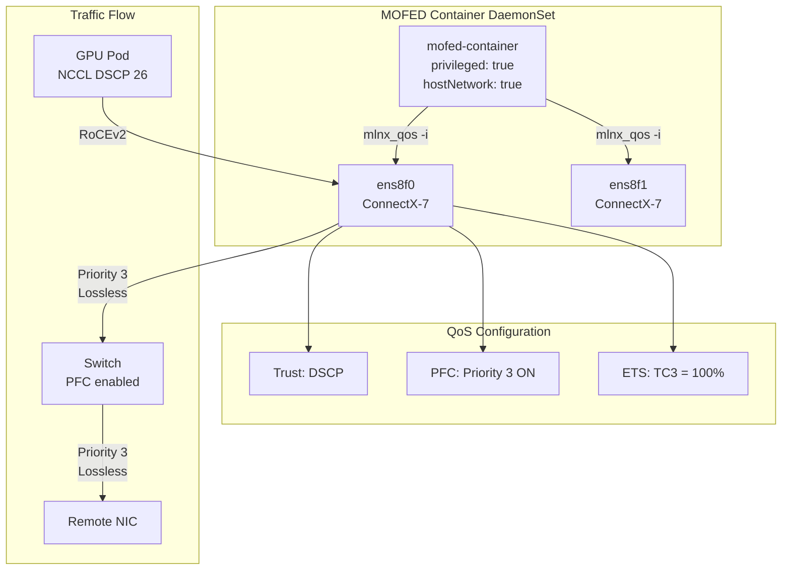

> 💡 **Quick Answer:** `mlnx_qos -i eth0` shows PFC, ETS, and DSCP trust configuration on Mellanox/NVIDIA ConnectX NICs. Run it from a MOFED (Mellanox OFED) privileged container DaemonSet with `hostNetwork: true` and access to `/dev/mst` devices.

## The Problem

Lossless RoCE for GPU training requires precise QoS configuration on every NIC:
- PFC (Priority Flow Control) must be enabled on the right traffic class (typically priority 3)
- ETS (Enhanced Transmission Selection) must allocate bandwidth correctly
- DSCP trust mode must be set so the NIC honors application-marked packets
- You need to verify and configure these settings across hundreds of nodes

The `mlnx_qos` tool is part of Mellanox OFED and doesn't ship in standard container images. Running it at scale requires a MOFED container with host-level access.

## The Solution

### Quick Reference: mlnx_qos Output

```bash
mlnx_qos -i eth0
```

Output breakdown:

```
Priority trust state: dscp

PFC configuration:
        priority    0   1   2   3   4   5   6   7
        enabled     0   0   0   1   0   0   0   0
        buffer      0   0   0   1   0   0   0   0

tc: 0 ratelimit: unlimited, tsa: ets, bw: 0%
tc: 1 ratelimit: unlimited, tsa: ets, bw: 0%
tc: 2 ratelimit: unlimited, tsa: ets, bw: 0%
tc: 3 ratelimit: unlimited, tsa: ets, bw: 100%
tc: 4 ratelimit: unlimited, tsa: ets, bw: 0%
tc: 5 ratelimit: unlimited, tsa: ets, bw: 0%
tc: 6 ratelimit: unlimited, tsa: ets, bw: 0%
tc: 7 ratelimit: unlimited, tsa: ets, bw: 0%
```

| Field | Expected for RoCE | Why |
|-------|-------------------|-----|
| Trust state | `dscp` | NIC uses DSCP field (not 802.1p VLAN PCP) to classify traffic |
| PFC priority 3 | `enabled: 1` | RoCEv2 default maps DSCP 26 (AF31) → priority 3 |
| PFC other priorities | `enabled: 0` | Only lossless on RDMA priority; lossy for everything else |
| TC 3 bandwidth | `100%` (or dominant share) | Ensure RDMA traffic gets the bandwidth it needs |
| TSA | `ets` | Enhanced Transmission Selection (IEEE 802.1Qaz) |

### MOFED Container DaemonSet

Deploy a MOFED tools container across all GPU/RDMA nodes:

```yaml
apiVersion: apps/v1
kind: DaemonSet
metadata:
  name: mofed-tools
  namespace: nvidia-network-operator
spec:
  selector:
    matchLabels:
      app: mofed-tools
  template:
    metadata:
      labels:
        app: mofed-tools
    spec:
      nodeSelector:
        feature.node.kubernetes.io/network-sriov.capable: "true"
      hostNetwork: true
      hostPID: true
      containers:
        - name: mofed
          image: nvcr.io/nvidia/mellanox/mofed-container:24.07-0.7.0.0
          securityContext:
            privileged: true
          command:
            - sleep
            - infinity
          volumeMounts:
            - name: dev
              mountPath: /dev
            - name: sys
              mountPath: /sys
            - name: host-etc
              mountPath: /host/etc
              readOnly: true
          resources:
            requests:
              cpu: 100m
              memory: 256Mi
            limits:
              cpu: 500m
              memory: 512Mi
      volumes:
        - name: dev
          hostPath:
            path: /dev
        - name: sys
          hostPath:
            path: /sys
        - name: host-etc
          hostPath:
            path: /etc
```

### Query QoS on All Nodes

```bash
# List MOFED pods
kubectl get pods -n nvidia-network-operator -l app=mofed-tools -o wide

# Check QoS on a specific node
kubectl exec -n nvidia-network-operator mofed-tools-abc12 -- mlnx_qos -i eth0

# Check all RDMA interfaces
kubectl exec -n nvidia-network-operator mofed-tools-abc12 -- bash -c '
for iface in $(ls /sys/class/infiniband/*/device/net/ 2>/dev/null); do
  echo "=== $iface ==="
  mlnx_qos -i $iface
  echo
done'

# Fleet-wide check (all nodes)
for pod in $(kubectl get pods -n nvidia-network-operator -l app=mofed-tools -o name); do
  node=$(kubectl get $pod -n nvidia-network-operator -o jsonpath='{.spec.nodeName}')
  echo "=== Node: $node ==="
  kubectl exec -n nvidia-network-operator ${pod##*/} -- mlnx_qos -i ens8f0 2>&1 | head -20
  echo
done
```

### Configure QoS from MOFED Container

```bash
# Set DSCP trust mode (required for RoCEv2)
kubectl exec -n nvidia-network-operator mofed-tools-abc12 -- \
  mlnx_qos -i eth0 --trust dscp

# Enable PFC on priority 3 only
kubectl exec -n nvidia-network-operator mofed-tools-abc12 -- \
  mlnx_qos -i eth0 --pfc 0,0,0,1,0,0,0,0

# Configure ETS: 100% bandwidth to TC 3
kubectl exec -n nvidia-network-operator mofed-tools-abc12 -- \
  mlnx_qos -i eth0 --tc_bw 0,0,0,100,0,0,0,0

# All in one command
kubectl exec -n nvidia-network-operator mofed-tools-abc12 -- \
  mlnx_qos -i eth0 --trust dscp --pfc 0,0,0,1,0,0,0,0 --tc_bw 0,0,0,100,0,0,0,0
```

### Fleet-Wide Configuration DaemonSet

For production, configure QoS at boot via an init container or startup script:

```yaml
apiVersion: apps/v1
kind: DaemonSet
metadata:
  name: roce-qos-config
  namespace: nvidia-network-operator
spec:
  selector:
    matchLabels:
      app: roce-qos-config
  template:
    metadata:
      labels:
        app: roce-qos-config
    spec:
      nodeSelector:
        feature.node.kubernetes.io/network-sriov.capable: "true"
      hostNetwork: true
      initContainers:
        - name: configure-qos
          image: nvcr.io/nvidia/mellanox/mofed-container:24.07-0.7.0.0
          securityContext:
            privileged: true
          command:
            - bash
            - -c
            - |
              # Configure all Mellanox interfaces
              for iface in $(ls /sys/class/infiniband/*/device/net/ 2>/dev/null); do
                echo "Configuring QoS on $iface"
                mlnx_qos -i $iface --trust dscp --pfc 0,0,0,1,0,0,0,0 --tc_bw 0,0,0,100,0,0,0,0
                echo "Verifying $iface:"
                mlnx_qos -i $iface
                echo "---"
              done
          volumeMounts:
            - name: dev
              mountPath: /dev
            - name: sys
              mountPath: /sys
      containers:
        - name: monitor
          image: nvcr.io/nvidia/mellanox/mofed-container:24.07-0.7.0.0
          securityContext:
            privileged: true
          command:
            - bash
            - -c
            - |
              while true; do
                for iface in $(ls /sys/class/infiniband/*/device/net/ 2>/dev/null); do
                  trust=$(mlnx_qos -i $iface 2>/dev/null | grep "trust state" | awk '{print $NF}')
                  pfc3=$(mlnx_qos -i $iface 2>/dev/null | grep -A1 "enabled" | tail -1 | awk '{print $4}')
                  if [ "$trust" != "dscp" ] || [ "$pfc3" != "1" ]; then
                    echo "WARNING: $iface QoS drift detected! trust=$trust pfc3=$pfc3"
                    echo "Re-applying QoS configuration..."
                    mlnx_qos -i $iface --trust dscp --pfc 0,0,0,1,0,0,0,0 --tc_bw 0,0,0,100,0,0,0,0
                  fi
                done
                sleep 300
              done
          volumeMounts:
            - name: dev
              mountPath: /dev
            - name: sys
              mountPath: /sys
      volumes:
        - name: dev
          hostPath:
            path: /dev
        - name: sys
          hostPath:
            path: /sys
```

### OpenShift MachineConfig Alternative

On OpenShift, you can set QoS via a systemd unit in MachineConfig:

```yaml
apiVersion: machineconfiguration.openshift.io/v1
kind: MachineConfig
metadata:
  name: 99-worker-roce-qos
  labels:
    machineconfiguration.openshift.io/role: worker
spec:
  config:
    ignition:
      version: 3.2.0
    systemd:
      units:
        - name: roce-qos.service
          enabled: true
          contents: |
            [Unit]
            Description=Configure RoCE QoS on Mellanox NICs
            After=network-online.target openibd.service
            Wants=network-online.target

            [Service]
            Type=oneshot
            RemainAfterExit=yes
            ExecStart=/bin/bash -c 'for iface in $(ls /sys/class/infiniband/*/device/net/ 2>/dev/null); do mlnx_qos -i $iface --trust dscp --pfc 0,0,0,1,0,0,0,0 --tc_bw 0,0,0,100,0,0,0,0; done'

            [Install]
            WantedBy=multi-user.target
```

### mlnx_qos Command Reference

```bash
# Show current configuration
mlnx_qos -i eth0

# Set DSCP trust (vs pcp for VLAN priority)
mlnx_qos -i eth0 --trust dscp

# Set PFC per priority (8 values: pri0,pri1,...,pri7)
mlnx_qos -i eth0 --pfc 0,0,0,1,0,0,0,0

# Set ETS bandwidth allocation per TC (must sum to 100)
mlnx_qos -i eth0 --tc_bw 10,0,0,90,0,0,0,0

# Set TSA type per TC (ets, strict, vendor)
mlnx_qos -i eth0 --tsa ets,ets,ets,ets,ets,ets,ets,ets

# Set rate limit per TC (in Gbps, 0 = unlimited)
mlnx_qos -i eth0 --ratelimit 0,0,0,0,0,0,0,0

# Set DSCP-to-priority mapping
mlnx_qos -i eth0 --dscp2prio set,26,3
# DSCP 26 (AF31) → priority 3

# Show cable info (bonus)
mlnx_qos -i eth0 --cable
```



## Common Issues

**`mlnx_qos: command not found`**

The tool is part of Mellanox OFED. Use the official MOFED container:
```bash
# Check if mlnx_qos exists
kubectl exec mofed-tools-abc12 -- which mlnx_qos
# /usr/bin/mlnx_qos (from mlnx-tools package)
```

On bare metal, install via: `apt install mlnx-tools` or `yum install mlnx-tools`.

**`mlnx_qos: No such device` or permission error**

The container needs `privileged: true` and `hostNetwork: true` to access host NICs:
```yaml
securityContext:
  privileged: true
hostNetwork: true
```

Also mount `/dev` and `/sys` from the host.

**Trust mode resets after reboot**

`mlnx_qos` settings are not persistent by default. Use one of:
1. DaemonSet init container (re-applies on pod restart)
2. MachineConfig systemd unit (OpenShift — runs at boot)
3. NMState NNCP with `ieee-802-1-Qaz` (declarative, reconciled by operator)

**PFC enabled but still seeing drops**

Both ends (NIC + switch port) must have PFC enabled on the same priority:
```bash
# Check PFC counters
ethtool -S eth0 | grep prio3
# rx_prio3_pause  — PFC frames received (switch is congested)
# tx_prio3_pause  — PFC frames sent (NIC buffer filling up)
# rx_prio3_discard — Drops DESPITE PFC (configuration mismatch)
```

If `rx_prio3_discard` is incrementing, the switch isn't honoring PFC — check switch-side config.

**ETS bandwidth percentages must sum to 100**

```bash
# Wrong: doesn't sum to 100
mlnx_qos -i eth0 --tc_bw 0,0,0,50,0,0,0,0
# Error or unexpected behavior

# Correct: allocate remaining to TC 0
mlnx_qos -i eth0 --tc_bw 10,0,0,90,0,0,0,0
```

**Different interface names across nodes**

Interface names vary by hardware and OS. Discover dynamically:
```bash
# Find all Mellanox interfaces
ls /sys/class/infiniband/*/device/net/

# Or by PCI vendor
for dev in /sys/class/net/*/device/vendor; do
  [ "$(cat $dev 2>/dev/null)" = "0x15b3" ] && basename $(dirname $(dirname $dev))
done
```

## Best Practices

- Deploy MOFED tools as a DaemonSet with `privileged: true` — always available for debugging
- Use init containers for fleet-wide QoS configuration at pod startup
- Add a monitoring loop to detect and correct QoS drift (firmware updates, driver reloads)
- Only enable PFC on the RDMA priority (3) — enabling on all priorities risks deadlocks
- Allocate dominant ETS bandwidth to the RDMA TC (80-100%)
- Set `--trust dscp` for RoCEv2 — PCP trust only works with VLAN-tagged traffic
- Map DSCP 26 (AF31) to priority 3 — this is the RoCEv2 default and matches switch expectations
- Verify both NIC and switch have matching PFC configuration — mismatched PFC causes drops
- Use `ethtool -S` PFC counters to monitor real-time flow control activity
- On OpenShift, prefer MachineConfig + systemd for persistence over DaemonSet (survives pod eviction)

## Key Takeaways

- `mlnx_qos -i <iface>` shows PFC, ETS, trust mode, and TC bandwidth in one command
- MOFED container (`nvcr.io/nvidia/mellanox/mofed-container`) provides `mlnx_qos` and all Mellanox tools
- Container needs `privileged: true` + `hostNetwork: true` + `/dev` + `/sys` mounts
- Settings are volatile — persist via DaemonSet init container, MachineConfig systemd, or NMState NNCP
- PFC priority 3 + DSCP trust + DSCP 26→priority 3 mapping = standard lossless RoCE config
- ETS bandwidth percentages across all TCs must sum to 100
- Monitor PFC counters (`ethtool -S`) to verify lossless behavior on the wire
- Switch-side PFC must match NIC-side — both ends must agree on which priority is lossless
