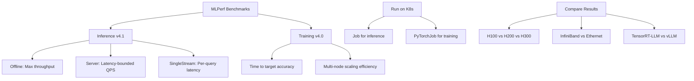

> 💡 **Quick Answer:** Run MLPerf benchmarks as Kubernetes Jobs using NVIDIA's optimized submission containers from NGC. MLPerf Inference tests throughput/latency under SLA, while MLPerf Training measures time-to-accuracy across multi-node GPU clusters.

## The Problem

How do you objectively compare GPU performance across hardware generations (H100 vs H200 vs H300), software stacks (TensorRT-LLM vs vLLM), and cluster configurations (InfiniBand vs Ethernet)? Vendor benchmarks are biased. You need standardized, reproducible, peer-reviewed benchmarks.

## The Solution

MLPerf (by MLCommons) is the industry-standard benchmark suite for ML workloads. It provides standardized models, datasets, and measurement rules. Run these benchmarks on your Kubernetes cluster to validate performance claims and optimize configurations.

### MLPerf Benchmark Categories

```yaml
# MLPerf Inference v4.1 scenarios:
Inference:
  scenarios:
    - Offline: "Maximum throughput, no latency constraint"
    - Server: "Poisson-distributed queries with latency SLA"
    - SingleStream: "One query at a time, measure latency"
    - MultiStream: "Fixed number of simultaneous queries"
  
  models:
    - "BERT-Large (NLP)"
    - "ResNet-50 (Vision)"
    - "RetinaNet (Object Detection)"
    - "3D-UNet (Medical Imaging)"
    - "GPT-J (LLM)"
    - "Llama 2 70B (LLM)"
    - "Stable Diffusion XL (Image Gen)"
    - "DLRM v2 (Recommendation)"
    - "Mixtral 8x7B (MoE LLM)"

# MLPerf Training v4.0 benchmarks:
Training:
  models:
    - "BERT-Large"
    - "ResNet-50"
    - "Mask R-CNN"
    - "GPT-3 175B"
    - "Stable Diffusion"
    - "LLaMA 2 70B"
    - "DLRM DCNv2"
  metric: "Time to target accuracy"
```

### MLPerf Inference on Kubernetes

```yaml
apiVersion: batch/v1
kind: Job
metadata:
  name: mlperf-inference-llama70b
  namespace: benchmarks
spec:
  backoffLimit: 0
  template:
    spec:
      restartPolicy: Never
      nodeSelector:
        nvidia.com/gpu.product: "NVIDIA-H200"
      containers:
        - name: mlperf
          image: nvcr.io/nvidia/mlperf/inference:24.12-llama2
          command:
            - python3
            - /workspace/run_benchmark.py
          args:
            - --scenario=Offline
            - --model=llama2-70b
            - --backend=tensorrt-llm
            - --precision=fp8
            - --gpu-count=8
            - --target-qps=50
            - --min-duration=600000
            - --output-dir=/results/llama70b-h200-offline
          env:
            - name: CUDA_VISIBLE_DEVICES
              value: "0,1,2,3,4,5,6,7"
            - name: NCCL_IB_DISABLE
              value: "0"
          resources:
            limits:
              nvidia.com/gpu: 8
          volumeMounts:
            - name: models
              mountPath: /models
            - name: datasets
              mountPath: /datasets
            - name: results
              mountPath: /results
            - name: dshm
              mountPath: /dev/shm
      volumes:
        - name: models
          persistentVolumeClaim:
            claimName: mlperf-models
        - name: datasets
          persistentVolumeClaim:
            claimName: mlperf-datasets
        - name: results
          persistentVolumeClaim:
            claimName: mlperf-results
        - name: dshm
          emptyDir:
            medium: Memory
            sizeLimit: 64Gi
```

### MLPerf Server Scenario (Latency-Bounded)

```yaml
apiVersion: batch/v1
kind: Job
metadata:
  name: mlperf-server-llama70b
  namespace: benchmarks
spec:
  backoffLimit: 0
  template:
    spec:
      restartPolicy: Never
      nodeSelector:
        nvidia.com/gpu.product: "NVIDIA-H200"
      containers:
        - name: mlperf
          image: nvcr.io/nvidia/mlperf/inference:24.12-llama2
          command:
            - python3
            - /workspace/run_benchmark.py
          args:
            - --scenario=Server
            - --model=llama2-70b
            - --backend=tensorrt-llm
            - --precision=fp8
            - --gpu-count=8
            # Server scenario enforces latency SLA
            - --target-latency-ms=2000       # TTFT
            - --target-latency-tpot-ms=100   # Per-token
            - --target-qps=30
            - --min-duration=600000
            - --output-dir=/results/llama70b-h200-server
          resources:
            limits:
              nvidia.com/gpu: 8
          volumeMounts:
            - name: models
              mountPath: /models
            - name: datasets
              mountPath: /datasets
            - name: results
              mountPath: /results
            - name: dshm
              mountPath: /dev/shm
      volumes:
        - name: models
          persistentVolumeClaim:
            claimName: mlperf-models
        - name: datasets
          persistentVolumeClaim:
            claimName: mlperf-datasets
        - name: results
          persistentVolumeClaim:
            claimName: mlperf-results
        - name: dshm
          emptyDir:
            medium: Memory
            sizeLimit: 64Gi
```

### MLPerf Training Benchmark

```yaml
apiVersion: kubeflow.org/v1
kind: PyTorchJob
metadata:
  name: mlperf-training-bert
  namespace: benchmarks
spec:
  pytorchReplicaSpecs:
    Worker:
      replicas: 8
      template:
        metadata:
          annotations:
            k8s.v1.cni.cncf.io/networks: rdma-net
        spec:
          nodeSelector:
            nvidia.com/gpu.product: "NVIDIA-H200"
          containers:
            - name: mlperf
              image: nvcr.io/nvidia/mlperf/training:24.12-bert
              command:
                - torchrun
                - --nnodes=8
                - --nproc_per_node=8
                - --rdzv_backend=c10d
                - --rdzv_endpoint=$(MASTER_ADDR):29500
                - /workspace/bert/run_pretraining.py
              args:
                - --target-accuracy=0.72
                - --max-steps=7100
                - --learning-rate=0.0036
                - --warmup-steps=287
                - --gradient-accumulation-steps=1
                - --fp16
                - --output-dir=/results/bert-training
              env:
                - name: NCCL_IB_DISABLE
                  value: "0"
                - name: NCCL_IB_HCA
                  value: "mlx5"
                - name: NCCL_NET_GDR_LEVEL
                  value: "5"
              resources:
                limits:
                  nvidia.com/gpu: 8
                  rdma/rdma_shared_device_a: 1
              volumeMounts:
                - name: datasets
                  mountPath: /datasets
                - name: results
                  mountPath: /results
                - name: dshm
                  mountPath: /dev/shm
          volumes:
            - name: datasets
              persistentVolumeClaim:
                claimName: mlperf-datasets
            - name: results
              persistentVolumeClaim:
                claimName: mlperf-results
            - name: dshm
              emptyDir:
                medium: Memory
                sizeLimit: 128Gi
```

### Collect and Compare Results

```bash
# View completed benchmark results
kubectl logs job/mlperf-inference-llama70b -n benchmarks

# Copy results from PVC
kubectl cp benchmarks/mlperf-inference-llama70b-pod:/results ./mlperf-results

# Parse MLPerf results
python3 -c "
import json
with open('mlperf-results/llama70b-h200-offline/mlperf_log_summary.txt') as f:
    for line in f:
        if 'Samples per second' in line or 'Result is' in line:
            print(line.strip())
"

# Compare H200 vs H100 results
echo "=== H200 Offline Throughput ==="
grep 'Samples per second' mlperf-results/llama70b-h200-offline/mlperf_log_summary.txt
echo "=== H100 Offline Throughput ==="
grep 'Samples per second' mlperf-results/llama70b-h100-offline/mlperf_log_summary.txt

# Validate compliance
python3 /workspace/tools/submission/submission_checker.py \
  --input=mlperf-results/ \
  --submitter="MyOrg"
```



## Common Issues

- **Benchmark fails compliance check** — ensure minimum run duration (600s for offline); verify loadgen version matches submission rules
- **Dataset download takes hours** — pre-download MLPerf datasets to PVC; BERT dataset is ~400GB, LLM datasets are larger
- **OOM during engine build** — TensorRT engine build needs extra memory; temporarily allocate more GPU memory or build on a larger instance
- **Results not reproducible** — set fixed random seeds; disable dynamic batching; use consistent GPU clocks (`nvidia-smi -lgc`)
- **NCCL errors in multi-node training** — verify InfiniBand connectivity; check RDMA device availability

## Best Practices

- Pre-download models and datasets to PVCs before running benchmarks
- Lock GPU clocks for reproducible results: `nvidia-smi -lgc 1980,1980`
- Run each scenario at least 3 times and take the median
- Use NVIDIA's optimized submission containers from NGC — they include tuned configurations
- Compare results against published MLPerf submissions at mlcommons.org
- Separate benchmark runs from production workloads — benchmarks saturate GPUs
- Save raw loadgen logs for compliance validation
- Use InfiniBand for multi-node training benchmarks — Ethernet adds 10-30% overhead

## Key Takeaways

- MLPerf is the industry-standard benchmark for comparing AI hardware and software
- Inference benchmarks measure throughput (Offline) and latency-bounded QPS (Server)
- Training benchmarks measure time-to-accuracy across GPU clusters
- Run as Kubernetes Jobs (inference) or PyTorchJobs (training)
- NVIDIA provides optimized containers on NGC for each benchmark model
- Pre-download datasets and models to PVCs for reliable execution
- Compare results against published submissions at mlcommons.org/results
