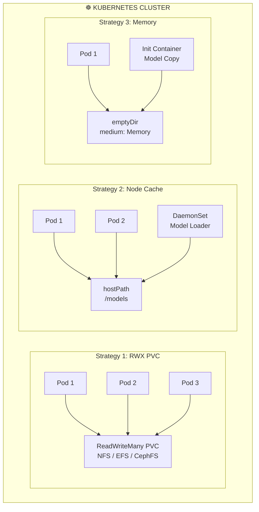

> 💡 **Quick Answer:** Use a ReadWriteMany PVC to store model weights once, shared across all inference pods. Pre-load models with an init container or a one-time Job. For fastest access, use `emptyDir` with `medium: Memory` for small models (<16GB) or `hostPath` with a DaemonSet model-loader for per-node caching of large models.
>
> **Key concept:** Loading a 16GB model from a shared PVC takes ~30s vs ~5min downloading from HuggingFace on every pod start.
>
> **Gotcha:** `emptyDir` with `medium: Memory` counts against the pod's memory limit. A 16GB model in memory means you need 16GB extra in your `limits.memory`.

## The Problem

Every LLM inference pod downloads or loads model weights at startup:

- **Duplicate downloads** waste bandwidth when scaling from 1 to 10 replicas
- **Cold start times** of 3-10 minutes make autoscaling impractical
- **Storage costs** multiply when each pod has its own model copy
- **Registry bandwidth** gets saturated pulling multi-GB model images

## The Solution

Share model weights across pods using Kubernetes storage primitives, choosing the right strategy based on model size and access patterns.

## Architecture Overview



## Strategy 1: ReadWriteMany PVC (Recommended)

```yaml
# model-store-pvc.yaml
apiVersion: v1
kind: PersistentVolumeClaim
metadata:
  name: model-store
  namespace: ai-inference
spec:
  accessModes: [ReadWriteMany]
  resources:
    requests:
      storage: 500Gi
  storageClassName: efs-sc    # Or nfs-csi, cephfs
---
# One-time job to download models
apiVersion: batch/v1
kind: Job
metadata:
  name: download-models
  namespace: ai-inference
spec:
  template:
    spec:
      containers:
        - name: downloader
          image: python:3.11-slim
          command: ["bash", "-c"]
          args:
            - |
              pip install huggingface_hub
              python -c "
              from huggingface_hub import snapshot_download
              import os
              models = [
                  ('meta-llama/Llama-3.1-8B-Instruct', '/models/llama-3.1-8b-instruct'),
                  ('mistralai/Mistral-7B-Instruct-v0.3', '/models/mistral-7b-instruct'),
              ]
              for repo_id, local_dir in models:
                  if not os.path.exists(local_dir):
                      print(f'Downloading {repo_id}...')
                      snapshot_download(repo_id=repo_id, local_dir=local_dir, token=os.environ['HF_TOKEN'])
                  else:
                      print(f'{repo_id} already cached')
              "
          env:
            - name: HF_TOKEN
              valueFrom:
                secretKeyRef:
                  name: hf-credentials
                  key: token
          volumeMounts:
            - name: models
              mountPath: /models
          resources:
            requests:
              cpu: "2"
              memory: 4Gi
      volumes:
        - name: models
          persistentVolumeClaim:
            claimName: model-store
      restartPolicy: Never
---
# Inference deployment using shared models
apiVersion: apps/v1
kind: Deployment
metadata:
  name: vllm-inference
  namespace: ai-inference
spec:
  replicas: 4
  selector:
    matchLabels:
      app: vllm-inference
  template:
    metadata:
      labels:
        app: vllm-inference
    spec:
      containers:
        - name: vllm
          image: vllm/vllm-openai:v0.6.4
          args:
            - "--model=/models/llama-3.1-8b-instruct"
            - "--gpu-memory-utilization=0.9"
          ports:
            - containerPort: 8000
          resources:
            limits:
              nvidia.com/gpu: 1
          volumeMounts:
            - name: models
              mountPath: /models
              readOnly: true
            - name: shm
              mountPath: /dev/shm
      volumes:
        - name: models
          persistentVolumeClaim:
            claimName: model-store
            readOnly: true
        - name: shm
          emptyDir:
            medium: Memory
            sizeLimit: 16Gi
```

## Strategy 2: Node-Level Cache with DaemonSet

```yaml
# model-cache-daemonset.yaml
apiVersion: apps/v1
kind: DaemonSet
metadata:
  name: model-cache-loader
  namespace: ai-inference
spec:
  selector:
    matchLabels:
      app: model-cache-loader
  template:
    metadata:
      labels:
        app: model-cache-loader
    spec:
      initContainers:
        - name: download
          image: python:3.11-slim
          command: ["bash", "-c"]
          args:
            - |
              if [ ! -f /cache/llama-3.1-8b-instruct/config.json ]; then
                pip install huggingface_hub
                python -c "
              from huggingface_hub import snapshot_download
              snapshot_download('meta-llama/Llama-3.1-8B-Instruct', local_dir='/cache/llama-3.1-8b-instruct')
              "
              fi
          env:
            - name: HF_TOKEN
              valueFrom:
                secretKeyRef:
                  name: hf-credentials
                  key: token
          volumeMounts:
            - name: cache
              mountPath: /cache
          resources:
            requests:
              cpu: "2"
              memory: 4Gi
      containers:
        - name: keepalive
          image: busybox
          command: ["sleep", "infinity"]
          volumeMounts:
            - name: cache
              mountPath: /cache
      volumes:
        - name: cache
          hostPath:
            path: /var/lib/model-cache
            type: DirectoryOrCreate
      nodeSelector:
        gpu.nvidia.com/class: A100_SXM4_80GB
---
# Inference pods use the hostPath cache
apiVersion: apps/v1
kind: Deployment
metadata:
  name: vllm-hostpath
  namespace: ai-inference
spec:
  replicas: 2
  selector:
    matchLabels:
      app: vllm-hostpath
  template:
    spec:
      containers:
        - name: vllm
          image: vllm/vllm-openai:v0.6.4
          args: ["--model=/models/llama-3.1-8b-instruct"]
          volumeMounts:
            - name: models
              mountPath: /models
              readOnly: true
          resources:
            limits:
              nvidia.com/gpu: 1
      volumes:
        - name: models
          hostPath:
            path: /var/lib/model-cache
            type: Directory
```

## Strategy 3: In-Memory with emptyDir

```yaml
# For small models (<8GB) that need fastest possible access
apiVersion: apps/v1
kind: Deployment
metadata:
  name: fast-inference
  namespace: ai-inference
spec:
  replicas: 2
  selector:
    matchLabels:
      app: fast-inference
  template:
    spec:
      initContainers:
        - name: load-model
          image: python:3.11-slim
          command: ["bash", "-c"]
          args:
            - |
              pip install huggingface_hub
              python -c "
              from huggingface_hub import snapshot_download
              snapshot_download('microsoft/phi-2', local_dir='/model-cache/phi-2')
              "
          env:
            - name: HF_TOKEN
              valueFrom:
                secretKeyRef:
                  name: hf-credentials
                  key: token
          volumeMounts:
            - name: model-mem
              mountPath: /model-cache
          resources:
            requests:
              memory: 8Gi
      containers:
        - name: inference
          image: vllm/vllm-openai:v0.6.4
          args: ["--model=/model-cache/phi-2"]
          volumeMounts:
            - name: model-mem
              mountPath: /model-cache
          resources:
            limits:
              nvidia.com/gpu: 1
              memory: 24Gi   # 8GB model + 16GB for inference
      volumes:
        - name: model-mem
          emptyDir:
            medium: Memory
            sizeLimit: 8Gi
```

## Comparison

| Strategy | Startup Time | Model Size | Multi-Node | Cost |
|----------|-------------|------------|------------|------|
| RWX PVC | ~30s | Unlimited | ✅ | Medium |
| hostPath + DaemonSet | ~5s | Limited by disk | ❌ per-node | Low |
| emptyDir Memory | ~60s (download) | <16GB | ❌ per-pod | High (RAM) |
| OCI Image (baked in) | 0s (pull time) | <10GB | ✅ | High (registry) |

## Common Issues

### Issue 1: NFS slow model loading

```bash
# Symptoms: Model loading takes 5+ minutes from NFS
# Solution: Use a faster storage backend
# EFS with provisioned throughput: 1 GB/s+
# Or use local NVMe with hostPath caching

# Check I/O throughput
kubectl exec -n ai-inference deploy/vllm-inference -- \
  dd if=/models/llama-3.1-8b-instruct/model-00001-of-00004.safetensors \
  of=/dev/null bs=1M count=1000 2>&1 | tail -1
```

### Issue 2: emptyDir OOMKilled

```bash
# Memory emptyDir counts against pod memory limits
# Increase memory limits to account for model size
resources:
  limits:
    memory: "32Gi"  # 16GB model + 16GB for application
```

## Best Practices

1. **Use RWX PVC for multi-node** — One download, all pods share
2. **Use hostPath + DaemonSet for single-model** — Fastest access, no network overhead
3. **Pre-download in Jobs, not init containers** — Init containers delay every pod start
4. **Set PVC to ReadOnly in inference pods** — Prevent accidental model corruption
5. **Use safetensors format** — Loads 2-5x faster than PyTorch .bin files via mmap
6. **Monitor storage I/O** — Slow NFS can bottleneck model loading more than download

## Key Takeaways

- **ReadWriteMany PVCs** are the most practical for multi-replica inference deployments
- **hostPath with DaemonSet** gives fastest access but requires per-node management
- **emptyDir Memory** is fastest for small models but expensive in RAM
- **Pre-downloading models** in a Job eliminates startup delays when scaling
- **safetensors format** enables memory-mapped loading for near-instant model access
