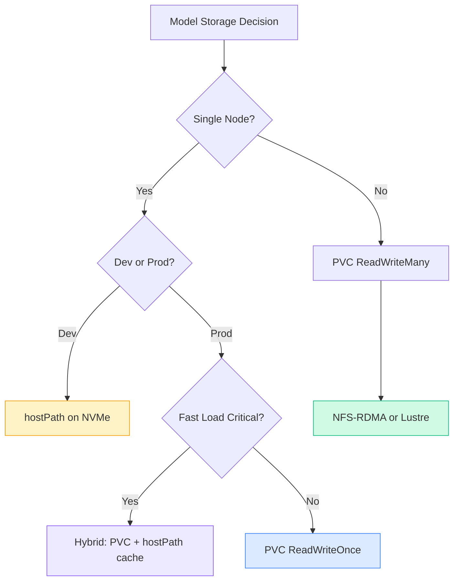

> 💡 **Quick Answer:** Use **hostPath** for single-node dev/test with pre-downloaded models on fast NVMe — zero network overhead but no portability. Use **PVC** (ReadWriteMany NFS/Lustre or ReadWriteOnce block) for production — portable, schedulable, supports multi-replica serving. For maximum throughput, combine PVC with GPU Direct Storage (GDS) to bypass CPU on NVMe→GPU transfers.

## The Problem

Large language models (7B–405B parameters) require 14GB–800GB of storage. Loading a 70B model from slow storage adds minutes to pod startup. Choosing the wrong storage backend causes:

- **Cold start delays** — pulling 140GB over 1Gbps network = 18+ minutes
- **Pod scheduling failures** — hostPath pins pods to specific nodes
- **Data loss** — hostPath doesn't survive node replacement
- **GPU idle time** — CPU bottlenecks on model loading from network storage

## The Solution

### Option 1: hostPath — Fast Local Storage

Best for single-node setups, development, and when models are pre-cached on NVMe.

```yaml
# hostpath-model-deployment.yaml
apiVersion: apps/v1
kind: Deployment
metadata:
  name: vllm-hostpath
  namespace: ai-inference
spec:
  replicas: 1  # hostPath = single node only
  selector:
    matchLabels:
      app: vllm-inference
  template:
    metadata:
      labels:
        app: vllm-inference
    spec:
      nodeSelector:
        kubernetes.io/hostname: gpu-node-01  # Pin to node with models
      containers:
        - name: vllm
          image: vllm/vllm-openai:v0.6.6
          args:
            - "--model=/models/Meta-Llama-3.1-70B-Instruct"
            - "--tensor-parallel-size=2"
            - "--gpu-memory-utilization=0.90"
            - "--max-model-len=8192"
          ports:
            - containerPort: 8000
              name: http
          resources:
            limits:
              nvidia.com/gpu: 2
              memory: "64Gi"
            requests:
              memory: "32Gi"
          volumeMounts:
            - name: model-storage
              mountPath: /models
              readOnly: true
            - name: shm
              mountPath: /dev/shm
      volumes:
        - name: model-storage
          hostPath:
            path: /data/models          # Pre-downloaded on node
            type: DirectoryOrCreate
        - name: shm
          emptyDir:
            medium: Memory
            sizeLimit: "16Gi"           # Shared memory for tensor parallel
```

#### Pre-download Models to Node

```bash
# SSH to GPU node and download model
ssh gpu-node-01

# Create model directory
sudo mkdir -p /data/models
sudo chown 1000:1000 /data/models

# Download with huggingface-cli
pip install huggingface-hub
huggingface-cli download meta-llama/Llama-3.1-70B-Instruct \
  --local-dir /data/models/Meta-Llama-3.1-70B-Instruct \
  --local-dir-use-symlinks False

# Verify download
du -sh /data/models/Meta-Llama-3.1-70B-Instruct/
# Expected: ~140GB for 70B model
```

#### DaemonSet for Multi-Node Model Distribution

```yaml
# model-preloader-daemonset.yaml
apiVersion: apps/v1
kind: DaemonSet
metadata:
  name: model-preloader
  namespace: ai-inference
spec:
  selector:
    matchLabels:
      app: model-preloader
  template:
    metadata:
      labels:
        app: model-preloader
    spec:
      nodeSelector:
        nvidia.com/gpu.present: "true"
      initContainers:
        - name: download-model
          image: python:3.11-slim
          command:
            - bash
            - -c
            - |
              if [ -d "/models/Meta-Llama-3.1-8B-Instruct/config.json" ]; then
                echo "Model already cached, skipping download"
                exit 0
              fi
              pip install -q huggingface-hub
              huggingface-cli download meta-llama/Llama-3.1-8B-Instruct \
                --local-dir /models/Meta-Llama-3.1-8B-Instruct \
                --local-dir-use-symlinks False
          env:
            - name: HF_TOKEN
              valueFrom:
                secretKeyRef:
                  name: huggingface-token
                  key: token
          volumeMounts:
            - name: model-cache
              mountPath: /models
      containers:
        - name: pause
          image: registry.k8s.io/pause:3.10
      volumes:
        - name: model-cache
          hostPath:
            path: /data/models
            type: DirectoryOrCreate
```

### Option 2: PVC — Production Portable Storage

Best for production, multi-replica serving, and when pods must be schedulable across nodes.

#### ReadWriteOnce (Block Storage)

```yaml
# pvc-model-rwo.yaml
apiVersion: v1
kind: PersistentVolumeClaim
metadata:
  name: model-store-rwo
  namespace: ai-inference
spec:
  accessModes:
    - ReadWriteOnce          # Single node attachment
  storageClassName: fast-nvme  # Use fastest available StorageClass
  resources:
    requests:
      storage: 200Gi
---
# One-time model download job
apiVersion: batch/v1
kind: Job
metadata:
  name: model-download
  namespace: ai-inference
spec:
  template:
    spec:
      restartPolicy: OnFailure
      containers:
        - name: downloader
          image: python:3.11-slim
          command:
            - bash
            - -c
            - |
              pip install -q huggingface-hub
              huggingface-cli download meta-llama/Llama-3.1-70B-Instruct \
                --local-dir /models/Meta-Llama-3.1-70B-Instruct \
                --local-dir-use-symlinks False
              echo "Download complete. Size:"
              du -sh /models/Meta-Llama-3.1-70B-Instruct/
          env:
            - name: HF_TOKEN
              valueFrom:
                secretKeyRef:
                  name: huggingface-token
                  key: token
          resources:
            requests:
              memory: "4Gi"
            limits:
              memory: "8Gi"
          volumeMounts:
            - name: model-pvc
              mountPath: /models
      volumes:
        - name: model-pvc
          persistentVolumeClaim:
            claimName: model-store-rwo
---
# Inference deployment using the PVC
apiVersion: apps/v1
kind: Deployment
metadata:
  name: vllm-pvc
  namespace: ai-inference
spec:
  replicas: 1  # RWO = single node
  selector:
    matchLabels:
      app: vllm-inference
  template:
    metadata:
      labels:
        app: vllm-inference
    spec:
      containers:
        - name: vllm
          image: vllm/vllm-openai:v0.6.6
          args:
            - "--model=/models/Meta-Llama-3.1-70B-Instruct"
            - "--tensor-parallel-size=2"
            - "--gpu-memory-utilization=0.90"
          ports:
            - containerPort: 8000
          resources:
            limits:
              nvidia.com/gpu: 2
              memory: "64Gi"
          volumeMounts:
            - name: model-pvc
              mountPath: /models
              readOnly: true
            - name: shm
              mountPath: /dev/shm
      volumes:
        - name: model-pvc
          persistentVolumeClaim:
            claimName: model-store-rwo
        - name: shm
          emptyDir:
            medium: Memory
            sizeLimit: "16Gi"
```

#### ReadWriteMany (NFS/Lustre) — Multi-Replica Serving

```yaml
# pvc-model-rwx.yaml
apiVersion: v1
kind: PersistentVolumeClaim
metadata:
  name: model-store-rwx
  namespace: ai-inference
spec:
  accessModes:
    - ReadWriteMany           # Multiple pods across nodes
  storageClassName: nfs-rdma  # NFS over RDMA for best throughput
  resources:
    requests:
      storage: 500Gi
---
# Multi-replica inference with shared model store
apiVersion: apps/v1
kind: Deployment
metadata:
  name: vllm-multi-replica
  namespace: ai-inference
spec:
  replicas: 4                  # Scale across nodes
  selector:
    matchLabels:
      app: vllm-multi
  template:
    metadata:
      labels:
        app: vllm-multi
    spec:
      affinity:
        podAntiAffinity:
          preferredDuringSchedulingIgnoredDuringExecution:
            - weight: 100
              podAffinityTerm:
                labelSelector:
                  matchLabels:
                    app: vllm-multi
                topologyKey: kubernetes.io/hostname
      containers:
        - name: vllm
          image: vllm/vllm-openai:v0.6.6
          args:
            - "--model=/models/Meta-Llama-3.1-8B-Instruct"
            - "--gpu-memory-utilization=0.90"
            - "--max-model-len=4096"
          ports:
            - containerPort: 8000
              name: http
          resources:
            limits:
              nvidia.com/gpu: 1
              memory: "32Gi"
          readinessProbe:
            httpGet:
              path: /health
              port: 8000
            initialDelaySeconds: 120   # Model loading takes time
            periodSeconds: 10
          volumeMounts:
            - name: model-pvc
              mountPath: /models
              readOnly: true
            - name: shm
              mountPath: /dev/shm
      volumes:
        - name: model-pvc
          persistentVolumeClaim:
            claimName: model-store-rwx
        - name: shm
          emptyDir:
            medium: Memory
            sizeLimit: "8Gi"
---
apiVersion: v1
kind: Service
metadata:
  name: vllm-multi
  namespace: ai-inference
spec:
  selector:
    app: vllm-multi
  ports:
    - port: 8000
      targetPort: 8000
  type: ClusterIP
```

### Option 3: Hybrid — hostPath Cache + PVC Source

Best of both worlds: PVC for durability, hostPath for speed.

```yaml
# hybrid-model-serving.yaml
apiVersion: apps/v1
kind: Deployment
metadata:
  name: vllm-hybrid
  namespace: ai-inference
spec:
  replicas: 1
  selector:
    matchLabels:
      app: vllm-hybrid
  template:
    metadata:
      labels:
        app: vllm-hybrid
    spec:
      initContainers:
        # Copy model from NFS PVC to local NVMe for fast loading
        - name: cache-model
          image: busybox:1.36
          command:
            - sh
            - -c
            - |
              MODEL="Meta-Llama-3.1-70B-Instruct"
              if [ -f "/local-cache/${MODEL}/.complete" ]; then
                echo "Model already cached locally"
                exit 0
              fi
              echo "Copying model from NFS to local NVMe..."
              mkdir -p /local-cache/${MODEL}
              cp -r /nfs-models/${MODEL}/* /local-cache/${MODEL}/
              touch /local-cache/${MODEL}/.complete
              echo "Cache complete"
          volumeMounts:
            - name: nfs-source
              mountPath: /nfs-models
              readOnly: true
            - name: local-cache
              mountPath: /local-cache
      containers:
        - name: vllm
          image: vllm/vllm-openai:v0.6.6
          args:
            - "--model=/models/Meta-Llama-3.1-70B-Instruct"
            - "--tensor-parallel-size=2"
            - "--gpu-memory-utilization=0.90"
          ports:
            - containerPort: 8000
          resources:
            limits:
              nvidia.com/gpu: 2
              memory: "64Gi"
          volumeMounts:
            - name: local-cache
              mountPath: /models
              readOnly: true
            - name: shm
              mountPath: /dev/shm
      volumes:
        - name: nfs-source
          persistentVolumeClaim:
            claimName: model-store-rwx       # Durable NFS storage
        - name: local-cache
          hostPath:
            path: /data/model-cache          # Fast local NVMe
            type: DirectoryOrCreate
        - name: shm
          emptyDir:
            medium: Memory
            sizeLimit: "16Gi"
```

## Comparison Matrix



| Feature | hostPath | PVC (RWO) | PVC (RWX) | Hybrid |
|---------|----------|-----------|-----------|--------|
| **Portability** | ❌ Node-pinned | ✅ Zone-portable | ✅ Cluster-wide | ⚠️ Node-pinned cache |
| **Multi-replica** | ❌ Single pod | ❌ Single node | ✅ Any node | ⚠️ Per-node cache |
| **Load speed** | ⚡ NVMe direct | ⚡ Block storage | ⚠️ Network bound | ⚡ Cached NVMe |
| **Durability** | ❌ Lost on node failure | ✅ Persistent | ✅ Persistent | ✅ PVC is durable |
| **Setup** | Simple | Moderate | Moderate | Complex |
| **Security** | ⚠️ Host access | ✅ Namespace isolated | ✅ Namespace isolated | ⚠️ Host access |
| **Cost** | Free (local disk) | $$ Block storage | $$$ NFS/Lustre | $$ + local disk |

## Performance Benchmarks

```bash
# Measure model load time from different storage backends
# Test with Llama 3.1 8B (~16GB)

# hostPath on NVMe (PCIe Gen4 x4)
# Sequential read: ~7 GB/s → load time: ~2.3s

# PVC on AWS gp3 EBS (3000 IOPS, 125 MB/s)
# Sequential read: ~125 MB/s → load time: ~128s

# PVC on AWS io2 (64K IOPS, 1000 MB/s)
# Sequential read: ~1000 MB/s → load time: ~16s

# PVC on NFS over 100GbE RDMA
# Sequential read: ~3-5 GB/s → load time: ~3-5s

# Benchmark storage throughput inside a pod
kubectl exec -it vllm-pvc -- bash
fio --name=seqread --rw=read --bs=1M --size=1G \
  --numjobs=4 --directory=/models --direct=1 \
  --group_reporting --output-format=json
```

## Security Considerations

### hostPath Security with Pod Security Standards

```yaml
# hostpath requires privileged namespace or PSA exception
apiVersion: v1
kind: Namespace
metadata:
  name: ai-inference
  labels:
    # Baseline allows hostPath with restrictions
    pod-security.kubernetes.io/enforce: baseline
    pod-security.kubernetes.io/warn: restricted
---
# For restricted namespaces, use a PV/PVC wrapper instead
apiVersion: v1
kind: PersistentVolume
metadata:
  name: local-model-pv
spec:
  capacity:
    storage: 500Gi
  accessModes:
    - ReadWriteOnce
  persistentVolumeReclaimPolicy: Retain
  storageClassName: local-nvme
  local:
    path: /data/models
  nodeAffinity:
    required:
      nodeSelectorTerms:
        - matchExpressions:
            - key: kubernetes.io/hostname
              operator: In
              values:
                - gpu-node-01
---
apiVersion: v1
kind: PersistentVolumeClaim
metadata:
  name: local-model-pvc
  namespace: ai-inference
spec:
  accessModes:
    - ReadWriteOnce
  storageClassName: local-nvme
  resources:
    requests:
      storage: 500Gi
```

### Read-Only Model Mounts

```yaml
# Always mount models read-only in inference pods
volumeMounts:
  - name: model-storage
    mountPath: /models
    readOnly: true    # Prevent model tampering

# Use securityContext for defense in depth
securityContext:
  runAsNonRoot: true
  runAsUser: 1000
  readOnlyRootFilesystem: true
  allowPrivilegeEscalation: false
```

## Common Issues

### Pod Stuck Pending with hostPath
```bash
# Symptom: pod won't schedule
kubectl describe pod vllm-hostpath
# Events: "0/5 nodes are available: 5 node(s) didn't match Pod's node selector"

# Fix: verify nodeSelector matches actual node label
kubectl get nodes --show-labels | grep gpu-node-01
# Ensure the hostname label exists
```

### PVC Model Download Timeout
```bash
# Large model downloads can exceed Job deadlines
# Set appropriate timeouts
spec:
  activeDeadlineSeconds: 7200   # 2 hours for large models
  backoffLimit: 3
```

### Model Corrupted After Interrupted Download
```bash
# Always verify model integrity after download
python3 -c "
from huggingface_hub import snapshot_download
snapshot_download(
    'meta-llama/Llama-3.1-70B-Instruct',
    local_dir='/models/Meta-Llama-3.1-70B-Instruct',
    local_dir_use_symlinks=False,
    resume_download=True    # Resume interrupted downloads
)
"
```

### NFS Throughput Bottleneck
```bash
# Check NFS mount options
mount | grep nfs
# Ensure: nfsvers=4.2,rsize=1048576,wsize=1048576,hard,timeo=600

# For RDMA-capable NFS, verify RDMA transport
cat /proc/mounts | grep rdma
# Should show proto=rdma
```

## Best Practices

1. **Dev/test**: Use hostPath on NVMe for fastest iteration — zero overhead, zero setup
2. **Production single-model**: PVC with ReadWriteOnce on fastest available block storage
3. **Production multi-replica**: PVC with ReadWriteMany (NFS-RDMA or Lustre) for shared model store
4. **Maximum performance**: Hybrid approach — PVC source + local NVMe cache per node
5. **Always mount read-only**: Inference pods should never write to model storage
6. **Set readinessProbe `initialDelaySeconds`**: Model loading takes 30s–5min depending on size and storage speed
7. **Use `emptyDir` with `medium: Memory`** for `/dev/shm` — required for tensor parallelism
8. **Pre-download with Jobs**: Don't download models inside inference containers — use separate download Jobs
9. **Consider GDS**: GPU Direct Storage bypasses CPU for NVMe→GPU transfers — 2-3x faster model loading

## Key Takeaways

- **hostPath** = fast + simple but fragile (no portability, no HA)
- **PVC RWO** = portable within a zone but single-node attachment
- **PVC RWX** = most flexible for multi-replica serving across nodes
- **Hybrid** = best performance for large models in production
- Storage choice directly impacts **cold start time** — critical for autoscaling inference
- Always separate model download from inference with init containers or Jobs
