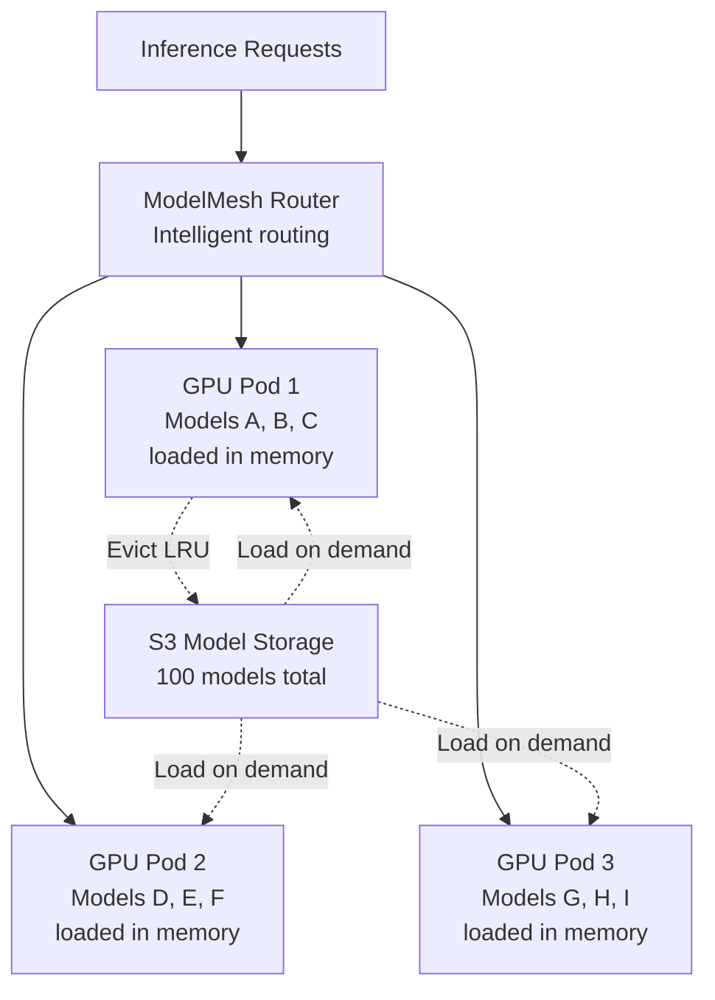

> 💡 **Quick Answer:** Deploy ModelMesh with KServe for intelligent multi-model serving on shared GPUs. ModelMesh automatically loads frequently accessed models into GPU memory and unloads idle models — serving 100+ models on infrastructure that would otherwise require 100 dedicated GPU pods.

## The Problem

Each ML model typically gets its own Deployment with a dedicated GPU. With 50-100 models in production, that's 50-100 GPUs — most sitting at <10% utilization. ModelMesh packs multiple models onto shared GPU pods, loading models on-demand and evicting idle ones, achieving 10-100x better GPU utilization.

## The Solution

### Install ModelMesh with KServe

```bash
# Install KServe with ModelMesh
kubectl apply -f https://github.com/kserve/kserve/releases/download/v0.13.0/kserve.yaml
kubectl apply -f https://github.com/kserve/modelmesh-serving/releases/download/v0.12.0/modelmesh.yaml
```

### ServingRuntime for Model Format

```yaml
apiVersion: serving.kserve.io/v1alpha1
kind: ServingRuntime
metadata:
  name: triton-modelmesh
  namespace: ml-serving
spec:
  supportedModelFormats:
    - name: onnx
      version: "1"
      autoSelect: true
    - name: tensorrt
      version: "8"
    - name: pytorch
      version: "1"
  multiModel: true
  grpcEndpoint: "port:8085"
  grpcDataEndpoint: "port:8001"
  containers:
    - name: triton
      image: nvcr.io/nvidia/tritonserver:24.07-py3
      resources:
        requests:
          cpu: "2"
          memory: 8Gi
          nvidia.com/gpu: 1
        limits:
          memory: 16Gi
          nvidia.com/gpu: 1
      args:
        - --model-control-mode=explicit
        - --strict-model-config=false
  replicas: 3
```

### Deploy Multiple Models

```yaml
apiVersion: serving.kserve.io/v1beta1
kind: InferenceService
metadata:
  name: sentiment-model
  namespace: ml-serving
  annotations:
    serving.kserve.io/deploymentMode: ModelMesh
spec:
  predictor:
    model:
      modelFormat:
        name: onnx
      storageUri: "s3://models/sentiment/v3"
---
apiVersion: serving.kserve.io/v1beta1
kind: InferenceService
metadata:
  name: translation-model
  namespace: ml-serving
  annotations:
    serving.kserve.io/deploymentMode: ModelMesh
spec:
  predictor:
    model:
      modelFormat:
        name: onnx
      storageUri: "s3://models/translation/v2"
---
apiVersion: serving.kserve.io/v1beta1
kind: InferenceService
metadata:
  name: classification-model
  namespace: ml-serving
  annotations:
    serving.kserve.io/deploymentMode: ModelMesh
spec:
  predictor:
    model:
      modelFormat:
        name: pytorch
      storageUri: "s3://models/classification/v1"
```

All 3 models share the same 3-replica Triton runtime — no dedicated pods per model.

### ModelMesh Behavior

```
100 models registered, 3 GPU pods (each 80GB):
  → 20 models actively loaded (fit in GPU memory)
  → 80 models on standby (on disk/S3)
  → Request for idle model → auto-load (200-500ms for small models)
  → LRU eviction when memory full → least-used model unloaded

Result: 100 models served by 3 GPUs instead of 100 GPUs
```



## Common Issues

**First request to a model is slow (cold load)**

Expected — ModelMesh needs to load the model from storage. For latency-sensitive models, use `serving.kserve.io/priority: high` annotation to keep them always loaded.

**Model evicted too frequently**

Increase GPU memory per pod or add more replicas. Check eviction frequency: `kubectl logs deploy/modelmesh-serving | grep evict`.

## Best Practices

- **ModelMesh for 10+ models on shared infrastructure** — single-model KServe for <10
- **Group similar model sizes on the same runtime** — prevents one large model from evicting many small ones
- **Set priority annotations** for critical models — prevents LRU eviction
- **S3-compatible storage** for model artifacts — consistent across environments
- **3 replicas minimum** for HA — ModelMesh distributes models across replicas

## Key Takeaways

- ModelMesh packs 10-100+ models onto shared GPU pods with intelligent memory management
- LRU eviction automatically loads frequently-used models and unloads idle ones
- 10-100x better GPU utilization compared to dedicated pod-per-model deployments
- Cold-load latency is 200-500ms for small models — use priority annotations for hot models
- Works with KServe InferenceService CRD — same API, just add deploymentMode annotation
