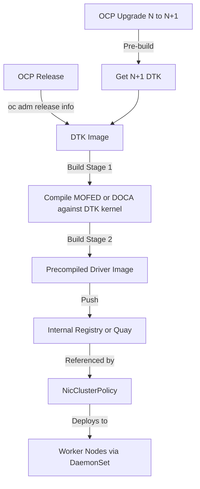

> 💡 **Quick Answer:** Extract the DTK image from your OCP release, use it as the build base in a multistage Containerfile, compile MOFED/DOCA against the exact kernel, push to your internal registry, and reference it in NicClusterPolicy with `ofedDriverImage`.

## The Problem

NVIDIA MOFED and DOCA drivers must match the exact kernel version running on OpenShift nodes. Red Hat kernels differ from upstream, and each OpenShift minor release ships a new kernel. Pre-built MOFED RPMs from NVIDIA don't match RHCOS kernels, causing module load failures and RDMA unavailability.

## The Solution

Use OpenShift's DriverToolKit (DTK) image — which contains the exact kernel headers for each OCP release — as a build base. Compile MOFED or DOCA against it, producing a precompiled driver image that loads correctly on RHCOS.

### Step 1: Extract DTK Image Reference

```bash
# Get DTK image for your OCP version
OCP_VERSION=$(oc get clusterversion version -o jsonpath='{.status.desired.version}')
DTK_IMAGE=$(oc adm release info --image-for=driver-toolkit quay.io/openshift-release-dev/ocp-release:${OCP_VERSION}-x86_64)

echo "OCP Version: ${OCP_VERSION}"
echo "DTK Image: ${DTK_IMAGE}"
# Example: quay.io/openshift-release-dev/ocp-v4.0-art-dev@sha256:abc123...
```

### Step 2: MOFED Driver Containerfile

```dockerfile
# Containerfile.mofed
# Stage 1: Build MOFED against DTK kernel headers
ARG DTK_IMAGE
ARG MOFED_VERSION=24.04-0.7.0.0

FROM ${DTK_IMAGE} as builder

ARG MOFED_VERSION
ARG RHEL_VERSION=9.4
ARG ARCH=x86_64

# Download MOFED source
RUN curl -fsSL https://linux.mellanox.com/public/keys/GPG-KEY-Mellanox.pub | rpm --import - && \
    dnf install -y createrepo rpm-build python3-devel && \
    curl -fsSL https://content.mellanox.com/ofed/MLNX_OFED-${MOFED_VERSION}/MLNX_OFED_SRC-${MOFED_VERSION}.tgz | \
    tar -xz -C /tmp

# Build MOFED kernel modules against DTK kernel
RUN cd /tmp/MLNX_OFED_SRC-${MOFED_VERSION} && \
    ./install.pl --kernel $(rpm -q --queryformat '%{VERSION}-%{RELEASE}.%{ARCH}' kernel-core) \
                 --kernel-sources /usr/src/kernels/$(rpm -q --queryformat '%{VERSION}-%{RELEASE}.%{ARCH}' kernel-core) \
                 --add-kernel-support \
                 --without-fw-update \
                 --force \
                 --skip-repo

# Collect built RPMs
RUN mkdir -p /opt/mofed-rpms && \
    find /tmp/MLNX_OFED_SRC-${MOFED_VERSION} -name "*.rpm" -exec cp {} /opt/mofed-rpms/ \; && \
    createrepo /opt/mofed-rpms

# Stage 2: Minimal runtime image
FROM registry.access.redhat.com/ubi9/ubi-minimal:latest

COPY --from=builder /opt/mofed-rpms /opt/mofed-rpms

RUN microdnf install -y \
    /opt/mofed-rpms/mlnx-ofa_kernel-*.rpm \
    /opt/mofed-rpms/kmod-mlnx-ofa_kernel-*.rpm \
    /opt/mofed-rpms/mlnx-tools-*.rpm \
    && microdnf clean all

# Entrypoint loads kernel modules
COPY entrypoint.sh /entrypoint.sh
RUN chmod +x /entrypoint.sh
ENTRYPOINT ["/entrypoint.sh"]
```

### Step 3: DOCA Driver Containerfile

```dockerfile
# Containerfile.doca
ARG DTK_IMAGE
ARG DOCA_VERSION=2.9.1

FROM ${DTK_IMAGE} as builder

ARG DOCA_VERSION
ARG DOCA_BASE_URL=https://linux.mellanox.com/public/repo/doca/${DOCA_VERSION}

# Install DOCA build dependencies
RUN dnf config-manager --add-repo ${DOCA_BASE_URL}/rhel9.4/x86_64/ && \
    rpm --import https://linux.mellanox.com/public/keys/GPG-KEY-Mellanox.pub && \
    dnf install -y \
      doca-ofed \
      doca-tools \
      mlnx-tools \
      --nogpgcheck && \
    dnf clean all

# Build precompiled kernel modules
RUN KVER=$(rpm -q --queryformat '%{VERSION}-%{RELEASE}.%{ARCH}' kernel-core) && \
    /usr/sbin/mlnxofedinstall --kernel ${KVER} \
      --kernel-sources /usr/src/kernels/${KVER} \
      --add-kernel-support \
      --without-fw-update \
      --force

# Stage 2: Precompiled runtime
FROM registry.access.redhat.com/ubi9/ubi-minimal:latest as precompiled

COPY --from=builder /lib/modules/ /lib/modules/
COPY --from=builder /usr/sbin/ibstat /usr/sbin/ibstat
COPY --from=builder /usr/sbin/rdma /usr/sbin/rdma
COPY --from=builder /usr/bin/ofed_info /usr/bin/ofed_info
COPY --from=builder /opt/mellanox /opt/mellanox

LABEL io.openshift.release.operator=true
LABEL description="DOCA ${DOCA_VERSION} precompiled for OpenShift"
```

### Step 4: Build with OpenShift BuildConfig

```yaml
apiVersion: build.openshift.io/v1
kind: BuildConfig
metadata:
  name: mofed-driver-build
  namespace: nvidia-network-operator
spec:
  source:
    type: Dockerfile
    dockerfile: |
      # Inline or reference from Git
      ARG DTK_IMAGE
      FROM ${DTK_IMAGE} as builder
      # ... (Containerfile content above)
  strategy:
    type: Docker
    dockerStrategy:
      buildArgs:
        - name: DTK_IMAGE
          value: "quay.io/openshift-release-dev/ocp-v4.0-art-dev@sha256:abc..."
        - name: MOFED_VERSION
          value: "24.04-0.7.0.0"
  output:
    to:
      kind: ImageStreamTag
      name: mofed-driver:24.04-ocp4.16
  triggers:
    - type: ConfigChange
---
apiVersion: image.openshift.io/v1
kind: ImageStream
metadata:
  name: mofed-driver
  namespace: nvidia-network-operator
```

### Step 5: Build with Podman (Disconnected)

```bash
# For disconnected environments — build locally with Podman
DTK_IMAGE=$(oc adm release info --image-for=driver-toolkit \
  quay.io/openshift-release-dev/ocp-release:4.16.5-x86_64)

# Pull DTK image (may need to mirror first in disconnected)
podman pull ${DTK_IMAGE}

# Build MOFED driver
podman build \
  --build-arg DTK_IMAGE=${DTK_IMAGE} \
  --build-arg MOFED_VERSION=24.04-0.7.0.0 \
  --target precompiled \
  -t quay.local.example.com/nvidia/mofed-driver:24.04-ocp4.16 \
  -f Containerfile.mofed .

# Push to internal registry
podman push quay.local.example.com/nvidia/mofed-driver:24.04-ocp4.16
```

### Step 6: Reference in NicClusterPolicy

```yaml
apiVersion: mellanox.com/v1alpha1
kind: NicClusterPolicy
metadata:
  name: nic-cluster-policy
spec:
  ofedDriver:
    image: mofed-driver
    repository: quay.local.example.com/nvidia
    version: 24.04-ocp4.16
    startupProbe:
      initialDelaySeconds: 10
      periodSeconds: 20
    livenessProbe:
      initialDelaySeconds: 30
      periodSeconds: 30
    upgradePolicy:
      autoUpgrade: false
      maxParallelUpgrades: 1
      drain:
        enable: true
        force: true
        timeoutSeconds: 300
```

### Pre-build for OCP Upgrades

```bash
#!/bin/bash
# Pre-build MOFED driver for next OCP version BEFORE upgrading
set -euo pipefail

CURRENT_VERSION="4.16.5"
TARGET_VERSION="4.16.8"
MOFED_VERSION="24.04-0.7.0.0"
REGISTRY="quay.local.example.com/nvidia"

# Get DTK for target version
TARGET_DTK=$(oc adm release info --image-for=driver-toolkit \
  quay.io/openshift-release-dev/ocp-release:${TARGET_VERSION}-x86_64)

echo "Building MOFED for OCP ${TARGET_VERSION}..."
echo "DTK: ${TARGET_DTK}"

podman build \
  --build-arg DTK_IMAGE=${TARGET_DTK} \
  --build-arg MOFED_VERSION=${MOFED_VERSION} \
  -t ${REGISTRY}/mofed-driver:${MOFED_VERSION}-ocp${TARGET_VERSION} \
  -f Containerfile.mofed .

podman push ${REGISTRY}/mofed-driver:${MOFED_VERSION}-ocp${TARGET_VERSION}

echo "Driver image ready. Safe to proceed with OCP upgrade to ${TARGET_VERSION}"
echo "Update NicClusterPolicy version to: ${MOFED_VERSION}-ocp${TARGET_VERSION}"
```



## Common Issues

- **Build fails: kernel-core not found** — DTK image version must match the target OCP version exactly; use `oc adm release info` to get the correct DTK
- **Module load fails on node** — kernel version mismatch; rebuild against the current running kernel; check `uname -r` on nodes
- **MOFED install.pl errors** — ensure DTK has all build deps; add `--without-fw-update` to skip firmware
- **Disconnected build: DTK pull fails** — mirror DTK image first via `oc mirror` or `skopeo copy`
- **NicClusterPolicy not picking up new image** — set `autoUpgrade: false` and manually update version; restart network-operator pod

## Best Practices

- Always pre-build driver images for N+1 OCP version before upgrading
- Use multistage builds to keep runtime image small
- Tag images with both MOFED/DOCA version and OCP version: `24.04-ocp4.16`
- Store Containerfiles in version control alongside cluster configs
- Use BuildConfig for connected clusters, Podman for disconnected
- Test driver loading on a single node before rolling out cluster-wide
- Keep previous driver images available for rollback

## Key Takeaways

- DTK provides exact kernel headers for each OCP release — required for driver compilation
- MOFED and DOCA must be recompiled for every OCP kernel change
- Multistage Containerfile: DTK build stage → minimal runtime stage
- Pre-build for N+1 before upgrading OCP to avoid RDMA downtime
- NicClusterPolicy references the precompiled image for DaemonSet deployment
