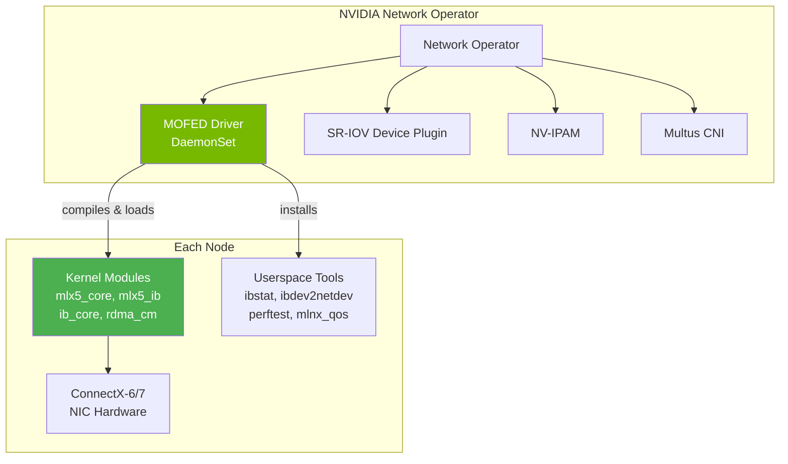
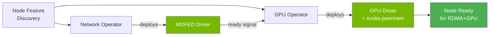

> 💡 **Quick Answer:** MOFED (Mellanox OpenFabrics Enterprise Distribution) is the userspace + kernel driver stack for NVIDIA/Mellanox ConnectX NICs, enabling RDMA, RoCE, SR-IOV, and GPUDirect. Deploy it in Kubernetes via the NVIDIA Network Operator's `ofedDriver` component, which runs a privileged DaemonSet that compiles and loads kernel modules on every node. Pin to a specific version (e.g., `24.07-0.7.0.0`) and never use `latest`.

## The Problem

Bare Kubernetes nodes use inbox mlx5 kernel drivers which support basic Ethernet, but NOT:

- RDMA verbs (ibverbs, RDMA CM)
- SR-IOV Virtual Functions with RDMA
- GPUDirect RDMA (peer memory)
- Advanced QoS (PFC, ECN, DSCP trust)
- RoCE v2 congestion management
- ConnectX firmware management tools
- Network diagnostic utilities (ibstat, ibdev2netdev, perftest)

MOFED replaces the inbox driver with a full-featured stack.

## The Solution

### Architecture



### Deploy via NVIDIA Network Operator

```bash
# Add NVIDIA Helm repo
helm repo add nvidia https://helm.ngc.nvidia.com/nvidia
helm repo update

# Install Network Operator with MOFED
helm install network-operator nvidia/network-operator \
  --namespace nvidia-network-operator \
  --create-namespace \
  --set ofedDriver.deploy=true \
  --set ofedDriver.version=24.07-0.7.0.0 \
  --set ofedDriver.upgradePolicy.autoUpgrade=false
```

### NicClusterPolicy Configuration

```yaml
apiVersion: mellanox.com/v1alpha1
kind: NicClusterPolicy
metadata:
  name: nic-cluster-policy
spec:
  ofedDriver:
    image: mofed
    repository: nvcr.io/nvidia/mellanox
    version: 24.07-0.7.0.0
    startupProbe:
      initialDelaySeconds: 10
      periodSeconds: 20
    livenessProbe:
      initialDelaySeconds: 30
      periodSeconds: 30
    readinessProbe:
      initialDelaySeconds: 10
      periodSeconds: 30
    terminationGracePeriodSeconds: 300
    forcePrecompiled: false     # Compile if no precompiled available
    env:
    - name: UNLOAD_STORAGE_MODULES
      value: "true"             # Unload inbox drivers before loading MOFED
    - name: RESTORE_DRIVER_ON_POD_TERMINATION
      value: "true"             # Restore inbox driver if pod dies
    nodeAffinity:
      requiredDuringSchedulingIgnoredDuringExecution:
        nodeSelectorTerms:
        - matchExpressions:
          - key: network.nvidia.com/operator.mofed.wait
            operator: DoesNotExist
          - key: nvidia.com/gpu.present
            operator: Exists
```

### MOFED Container — What It Does on Each Node

The MOFED DaemonSet pod runs privileged and:

1. **Detects kernel version** — matches against precompiled modules
2. **Compiles kernel modules** if no precompiled match (DKMS-style)
3. **Unloads inbox drivers** — `rmmod mlx5_ib mlx5_core`
4. **Loads MOFED drivers** — `modprobe mlx5_core mlx5_ib`
5. **Installs userspace tools** — ibverbs libraries, diagnostic tools
6. **Stays running** — liveness/readiness probes ensure driver health
7. **On termination** — optionally restores inbox drivers

### Verify MOFED Installation

```bash
# Check MOFED pods
kubectl get pods -n nvidia-network-operator -l app=mofed

# Check driver version on a node
kubectl exec -n nvidia-network-operator mofed-<node>-xxxxx -- ofed_info -s
# MLNX_OFED_LINUX-24.07-0.7.0.0

# Verify kernel modules loaded
kubectl exec -n nvidia-network-operator mofed-<node>-xxxxx -- lsmod | grep mlx5
# mlx5_ib               450560  0
# mlx5_core            2048000  1 mlx5_ib
# ib_core               430080  5 mlx5_ib,rdma_cm,iw_cm,ib_uverbs,ib_cm

# Check NIC firmware
kubectl exec -n nvidia-network-operator mofed-<node>-xxxxx -- \
  mst status
kubectl exec -n nvidia-network-operator mofed-<node>-xxxxx -- \
  flint -d /dev/mst/mt4125_pciconf0 query

# Verify RDMA devices
kubectl exec -n nvidia-network-operator mofed-<node>-xxxxx -- ibdev2netdev
# mlx5_0 port 1 ==> ens8f0 (Up)
# mlx5_1 port 1 ==> ens8f1 (Up)

# Check link status
kubectl exec -n nvidia-network-operator mofed-<node>-xxxxx -- ibstat
# CA 'mlx5_0'
#   CA type: MT4125
#   Number of ports: 1
#   Firmware version: 28.39.1002
#   Port 1:
#     State: Active
#     Physical state: LinkUp
#     Rate: 200
#     Link layer: Ethernet
```

### MOFED Version Matrix

| MOFED Version | CUDA Compat | NCCL | Key Features |
|--------------|-------------|------|--------------|
| 24.07-0.7.0.0 | CUDA 12.4+ | 2.22+ | GPUDirect RDMA, DOCA 2.8 |
| 24.04-0.6.6.0 | CUDA 12.3+ | 2.21+ | ConnectX-7 400GbE |
| 23.10-0.5.5.0 | CUDA 12.2+ | 2.19+ | Last pre-DOCA-2.7 |
| 5.9-0.5.6.0 | CUDA 12.1+ | 2.18+ | Legacy MOFED (pre-24.x) |

### Key MOFED Environment Variables

```yaml
env:
# Unload inbox storage modules (NVMe-oF, iSER)
- name: UNLOAD_STORAGE_MODULES
  value: "true"

# Restore inbox drivers on pod termination
- name: RESTORE_DRIVER_ON_POD_TERMINATION
  value: "true"

# Force precompiled modules only (fail if no match)
- name: FORCE_PRECOMPILED
  value: "false"

# Custom compile flags
- name: DKMS_EXTRA_FLAGS
  value: ""

# Skip firmware update
- name: SKIP_FW_UPDATE
  value: "false"

# HTTP proxy for downloading (air-gapped workaround)
- name: HTTP_PROXY
  value: "http://proxy.example.com:8080"
```

### OpenShift-Specific Configuration

```yaml
# MachineConfig for RDMA prerequisites
apiVersion: machineconfiguration.openshift.io/v1
kind: MachineConfig
metadata:
  name: 99-rdma-prerequisites
  labels:
    machineconfiguration.openshift.io/role: worker
spec:
  config:
    ignition:
      version: 3.2.0
    storage:
      files:
      # Enable RDMA namespace sharing
      - path: /etc/rdma/rdma.conf
        mode: 0644
        contents:
          source: data:text/plain;charset=utf-8,# RDMA shared mode%0Anldev_set_netns_mode shared%0A
      # Increase memlock for RDMA memory registration
      - path: /etc/security/limits.d/99-rdma-memlock.conf
        mode: 0644
        contents:
          source: data:text/plain;charset=utf-8,* soft memlock unlimited%0A* hard memlock unlimited%0A
    systemd:
      units:
      # Ensure CRI-O has unlimited memlock
      - name: crio.service
        dropins:
        - name: 10-memlock.conf
          contents: |
            [Service]
            LimitMEMLOCK=infinity
```

### MOFED + GPU Operator Integration

The GPU Operator must wait for MOFED before loading GPU drivers:

```yaml
# ClusterPolicy (GPU Operator)
apiVersion: nvidia.com/v1
kind: ClusterPolicy
metadata:
  name: gpu-cluster-policy
spec:
  driver:
    enabled: true
    useOpenKernelModules: true    # Required for GPUDirect RDMA
  rdma:
    enabled: true
    useHostMofed: true            # Use MOFED from Network Operator
  gds:
    enabled: true                 # GPUDirect Storage
```



Install order: **NFD → Network Operator (MOFED) → GPU Operator**

## Common Issues

**MOFED pod stuck in Init or CrashLoopBackOff**

Kernel headers missing or version mismatch. Check logs: `kubectl logs -n nvidia-network-operator mofed-<pod> -c mofed-container`. On RHCOS/CoreOS, precompiled modules are expected — if missing, DKMS compilation fails without kernel-devel.

**"module mlx5_core is in use" — can't unload inbox driver**

SR-IOV VFs or storage modules (NVMe-oF, iSER) are using mlx5_core. Set `UNLOAD_STORAGE_MODULES=true` and ensure no VFs are configured before MOFED starts.

**RDMA not working after MOFED install**

Check RDMA namespace mode: `rdma system show` should return `netns shared`. On OpenShift, apply the MachineConfig above. Also verify `ib_core` and `mlx5_ib` modules are loaded.

**MOFED version incompatible with kernel**

RHEL/CoreOS kernel updates can break precompiled MOFED modules. Pin kernel version or update MOFED to match. Check compatibility matrix at `network.nvidia.com`.

**GPU Operator not detecting MOFED**

GPU Operator needs `rdma.useHostMofed: true` in ClusterPolicy. Also ensure MOFED pods are Running and Ready before GPU Operator pods start.

**Node reboots during MOFED driver load**

Large ConnectX firmware updates trigger NIC reset, which can cause temporary link loss. Set `SKIP_FW_UPDATE=true` if firmware updates are managed separately.

## Best Practices

- **Pin MOFED version** — never use `latest`, always specify `24.07-0.7.0.0`
- **`autoUpgrade: false`** — upgrade MOFED manually during maintenance windows
- **Install order: NFD → Network Operator → GPU Operator** — MOFED must be ready before GPU drivers
- **`useOpenKernelModules: true`** in GPU Operator — mandatory for GPUDirect RDMA
- **Precompiled modules preferred** — DKMS compilation is slow and fragile
- **Test MOFED upgrades on one node first** — use node labels to target a single node
- **Monitor MOFED pod health** — degraded MOFED = no RDMA = failed GPU training jobs
- **Keep MOFED and NCCL versions aligned** — mismatches cause subtle performance regressions

## Key Takeaways

- MOFED replaces inbox mlx5 drivers with the full NVIDIA networking stack
- Deployed as a privileged DaemonSet via the NVIDIA Network Operator
- Enables RDMA, SR-IOV, GPUDirect RDMA, QoS tools, and firmware management
- Must be installed BEFORE the GPU Operator for GPUDirect to work
- Pin versions, disable auto-upgrade, and test on single nodes before rolling out
- OpenShift needs MachineConfig for memlock and RDMA namespace prerequisites
- Verify with `ofed_info -s`, `ibdev2netdev`, `ibstat` inside MOFED pod
