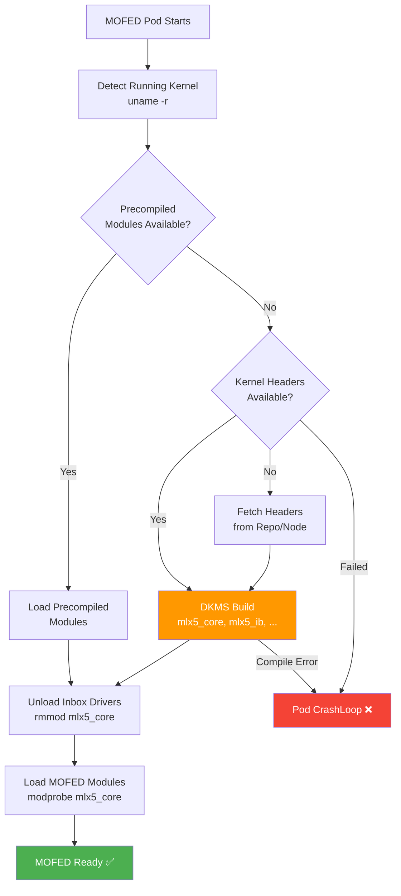

> 💡 **Quick Answer:** Set `forcePrecompiled: false` in the NicClusterPolicy `ofedDriver` spec and the Network Operator will automatically compile MOFED kernel modules on each node using DKMS when no precompiled modules match the running kernel. The MOFED container detects the kernel version, pulls kernel headers from the node or a configured repo, compiles `mlx5_core`, `mlx5_ib`, and supporting modules, then loads them — all without manual intervention.

## The Problem

Precompiled MOFED driver packages only exist for specific kernel versions. When your nodes run a kernel that doesn't have a precompiled match:

- Custom kernels (RT, low-latency, vendor-patched)
- Kernel updates between MOFED releases
- OpenShift z-stream updates that change the kernel
- Non-standard Linux distributions
- Air-gapped environments where precompiled images aren't mirrored

The operator needs to build the drivers on the node itself.

## The Solution

### NicClusterPolicy — Let the Operator Build

```yaml
apiVersion: mellanox.com/v1alpha1
kind: NicClusterPolicy
metadata:
  name: nic-cluster-policy
spec:
  ofedDriver:
    image: mofed
    repository: nvcr.io/nvidia/mellanox
    version: 24.07-0.7.0.0
    
    # Key setting: allow on-node compilation
    forcePrecompiled: false
    
    # Compilation timeout (large modules take time)
    terminationGracePeriodSeconds: 600
    
    startupProbe:
      initialDelaySeconds: 30
      periodSeconds: 30
      failureThreshold: 60     # 30min total for compilation
    livenessProbe:
      initialDelaySeconds: 600  # Wait for compile to finish
      periodSeconds: 30
    
    env:
    # Unload inbox drivers before loading compiled ones
    - name: UNLOAD_STORAGE_MODULES
      value: "true"
    # Restore inbox if pod terminates
    - name: RESTORE_DRIVER_ON_POD_TERMINATION
      value: "true"
    # Custom DKMS compile flags (optional)
    - name: DKMS_EXTRA_FLAGS
      value: ""
```

### How the Build Process Works



### `forcePrecompiled` Behavior

| Setting | Behavior |
|---------|----------|
| `forcePrecompiled: true` | Only use precompiled modules. Fail if no match. |
| `forcePrecompiled: false` (default) | Try precompiled first. If no match, compile on-node via DKMS. |

### Kernel Headers on Different Distros

The MOFED container needs kernel headers to compile. How they're provided varies:

**RHEL/Rocky/CentOS:**
```bash
# Headers typically at /usr/src/kernels/$(uname -r)
# MOFED container mounts host /usr/src and /lib/modules
```

**OpenShift (RHCOS):**
```yaml
# RHCOS is immutable — no dnf/yum available
# The MOFED container uses Driver Toolkit (DTK) or
# extensions to get kernel-devel packages
# Network Operator handles this automatically
env:
- name: DTK_OCP_VERSION
  value: "4.18"    # Operator auto-detects if omitted
```

**Ubuntu:**
```bash
# Headers at /usr/src/linux-headers-$(uname -r)
# Ensure linux-headers package installed on host
```

### OpenShift — Driver Toolkit Integration

On OpenShift, the MOFED container uses the Driver Toolkit (DTK) base image which includes kernel headers matching the cluster's RHCOS version:

```yaml
spec:
  ofedDriver:
    image: mofed
    repository: nvcr.io/nvidia/mellanox
    version: 24.07-0.7.0.0
    forcePrecompiled: false
    
    # The operator automatically selects the correct DTK image
    # for the running OpenShift version's kernel
    # No manual DTK configuration needed
```

The build sequence on OpenShift:

1. Operator queries cluster version → determines RHCOS kernel
2. Pulls DTK image matching that kernel
3. MOFED init container uses DTK for kernel-devel packages
4. Compiles MOFED modules against the DTK headers
5. Loads compiled modules into the running kernel

### Monitor the Build Process

```bash
# Watch MOFED pod — Init phase is the compile step
kubectl get pods -n nvidia-network-operator -l app=mofed -w
# NAME                  READY   STATUS     RESTARTS
# mofed-gpu-node-1      0/1     Init:0/1   0         ← Compiling
# mofed-gpu-node-1      1/1     Running    0         ← Done

# Watch compilation logs in real-time
kubectl logs -n nvidia-network-operator mofed-gpu-node-1 -c mofed-container -f
# Checking for precompiled modules... NOT FOUND
# Kernel version: 5.14.0-427.40.1.el9_4.x86_64
# Starting DKMS build for MLNX_OFED 24.07-0.7.0.0
# Building mlx5_core... OK
# Building mlx5_ib... OK
# Building rdma_rxe... OK
# ...
# Build complete. Loading modules.

# Check compile duration
kubectl describe pod -n nvidia-network-operator mofed-gpu-node-1 | grep -A5 "State:"
```

### Custom Compile Flags

```yaml
env:
# Add extra DKMS build flags
- name: DKMS_EXTRA_FLAGS
  value: "--force"          # Force rebuild even if cached

# Skip specific modules
- name: MLNX_OFED_SRC_SKIP_MODULES
  value: "isert iser srp"  # Skip storage modules

# Enable debug build
- name: MLNX_OFED_DEBUG
  value: "1"
```

### Precompiled vs On-Node Build

| Aspect | Precompiled | On-Node Build |
|--------|-------------|--------------|
| **Speed** | Seconds (load only) | 5-15 minutes (compile) |
| **Reliability** | High (pre-tested) | Medium (compile can fail) |
| **Kernel flexibility** | Fixed set | Any kernel |
| **Air-gapped** | Must mirror images | Needs headers only |
| **OpenShift** | Limited kernel versions | DTK covers all RHCOS |
| **Custom kernels** | Not supported | Fully supported |

### Air-Gapped Build Strategy

```yaml
# In disconnected environments, the MOFED container
# needs access to kernel-devel packages
spec:
  ofedDriver:
    image: mofed
    repository: registry.example.com:8443/nvidia/mellanox
    version: 24.07-0.7.0.0
    forcePrecompiled: false
    
    env:
    # Point to internal yum/dnf repo for kernel-devel
    - name: ADDITIONAL_YUM_REPOS
      value: "http://repo.example.com/rhel9-kernel-devel"
    
    # Or for OpenShift, the DTK image must be mirrored
    # oc-mirror handles this with the GPU/Network Operator catalog
```

### Troubleshooting Build Failures

```bash
# Check why build failed
kubectl logs -n nvidia-network-operator mofed-gpu-node-1 -c mofed-container | grep -i "error\|fail"

# Common: missing kernel headers
# "ERROR: Kernel source directory /usr/src/kernels/5.14.0-427.el9 not found"
# Fix: install kernel-devel on the node or ensure DTK is available

# Common: GCC version mismatch
# "ERROR: Compiler version mismatch"
# Fix: update MOFED version or pin kernel version

# Common: disk space
# "No space left on device"
# Fix: MOFED build needs ~2GB in /tmp — ensure node has space

# Force rebuild after fix
kubectl delete pod -n nvidia-network-operator mofed-gpu-node-1
# DaemonSet recreates it → fresh build attempt
```

### Validate After Build

```bash
# Confirm MOFED loaded (not inbox)
kubectl exec -n nvidia-network-operator mofed-gpu-node-1 -- ofed_info -s
# MLNX_OFED_LINUX-24.07-0.7.0.0

# Verify modules are MOFED-built (not inbox)
kubectl exec -n nvidia-network-operator mofed-gpu-node-1 -- \
  modinfo mlx5_core | grep -E "version|filename"
# version:        24.07-0.7.0.0
# filename:       /lib/modules/.../updates/dkms/mlx5_core.ko

# Check RDMA working
kubectl exec -n nvidia-network-operator mofed-gpu-node-1 -- ibv_devinfo
# hca_id: mlx5_0
# transport: InfiniBand (0)
# fw_ver: 28.39.1002

# Bandwidth test between two nodes
kubectl exec -n nvidia-network-operator mofed-gpu-node-1 -- \
  ib_write_bw -d mlx5_0 --report_gbits
```

## Common Issues

**Build takes >15 minutes — pod killed by liveness probe**

Increase `livenessProbe.initialDelaySeconds` to 900+ and `startupProbe.failureThreshold` to 120 for slow nodes.

**"Kernel source not found" on RHCOS**

DTK image not available or not mirrored. In disconnected OpenShift, mirror the DTK image matching your cluster version: `registry.redhat.io/openshift4/driver-toolkit-rhel9`.

**Compile succeeds but modules don't load — "symbol version mismatch"**

Kernel was updated between build start and module load. Reboot the node to ensure consistent kernel, then let MOFED rebuild.

**Build succeeds on some nodes but not others**

Different kernel versions across nodes (partial upgrade). Ensure all nodes in the MCP run the same kernel before MOFED deployment.

## Best Practices

- **`forcePrecompiled: false`** — let the operator fall back to compilation
- **Increase startup/liveness timeouts** — compilation takes 5-15 minutes
- **Pin kernel versions during MOFED rollout** — avoid kernel updates mid-deployment
- **Mirror DTK image in air-gapped** — MOFED on OpenShift needs DTK for headers
- **Test build on one node first** — label a single node, verify, then expand
- **Monitor build logs** — don't just wait for Running; check compile output
- **Keep /tmp clean on nodes** — DKMS needs ~2GB temp space

## Key Takeaways

- `forcePrecompiled: false` lets the operator build MOFED drivers on-node when no precompiled modules match
- Build uses DKMS: detects kernel → fetches headers → compiles → loads modules
- OpenShift uses Driver Toolkit (DTK) for kernel headers on immutable RHCOS
- Compilation takes 5-15 minutes — increase probe timeouts accordingly
- Precompiled is faster and more reliable; on-node build provides kernel flexibility
- In air-gapped environments, mirror kernel-devel repos or DTK images
- Always validate with `ofed_info -s` and `modinfo mlx5_core` after build
