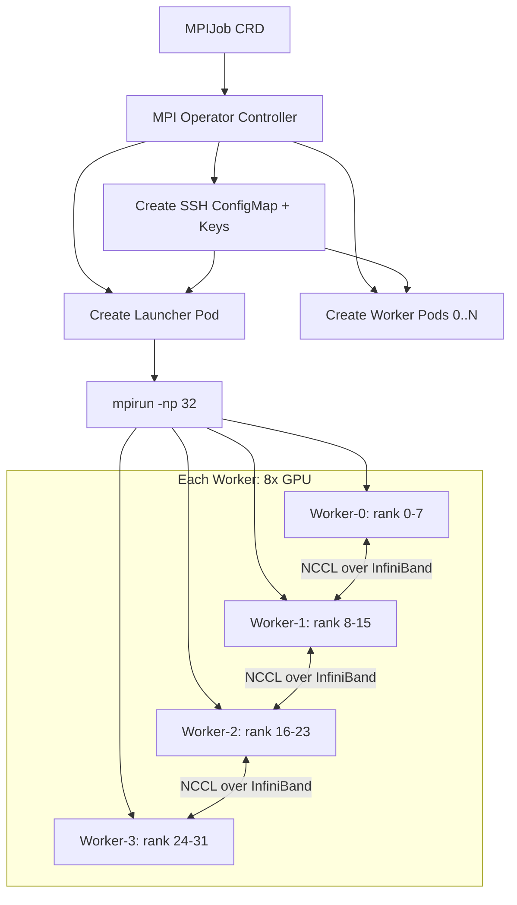

> 💡 **Quick Answer:** Install the MPI Operator (`mpi-operator`) to run distributed MPI jobs on Kubernetes. It manages launcher and worker pods, SSH key distribution, and hostfile generation automatically. Use `MPIJob` CRD for multi-node GPU training with Horovod, DeepSpeed, or raw `mpirun`.

## The Problem

Distributed GPU training traditionally uses MPI (Message Passing Interface):

- **Horovod** — data-parallel training with MPI+NCCL
- **DeepSpeed** — uses MPI for process launch and coordination
- **Custom HPC codes** — scientific simulations, molecular dynamics, CFD
- **SLURM → K8s migration** — teams moving from `srun` to Kubernetes need MPI support

Kubernetes doesn't natively understand MPI jobs. The MPI Operator bridges this gap.

## The Solution

### Step 1: Install MPI Operator

```bash
# Install MPI Operator v0.5+
kubectl apply -f https://raw.githubusercontent.com/kubeflow/mpi-operator/master/deploy/v2beta1/mpi-operator.yaml

# Verify
kubectl get pods -n mpi-operator
kubectl get crd mpijobs.kubeflow.org
```

### Step 2: Multi-Node GPU Training Job

```yaml
apiVersion: kubeflow.org/v2beta1
kind: MPIJob
metadata:
  name: llm-distributed-training
  namespace: ai-training
spec:
  slotsPerWorker: 8  # GPUs per worker node
  runPolicy:
    cleanPodPolicy: Running
    ttlSecondsAfterFinished: 3600
  mpiReplicaSpecs:
    Launcher:
      replicas: 1
      template:
        spec:
          containers:
            - name: launcher
              image: nvcr.io/nvidia/pytorch:24.12-py3
              command:
                - mpirun
                - --allow-run-as-root
                - -np
                - "32"  # Total processes (4 nodes × 8 GPUs)
                - -bind-to
                - none
                - -map-by
                - slot
                - -x
                - NCCL_DEBUG=INFO
                - -x
                - NCCL_IB_DISABLE=0
                - -x
                - NCCL_NET_GDR_LEVEL=5
                - -x
                - LD_LIBRARY_PATH
                - python3
                - /workspace/train.py
                - --model=llama-3.1-8b
                - --data=/shared/dataset
                - --output=/shared/checkpoints
                - --epochs=10
              resources:
                requests:
                  cpu: "2"
                  memory: 4Gi
              volumeMounts:
                - name: shared
                  mountPath: /shared
          volumes:
            - name: shared
              persistentVolumeClaim:
                claimName: training-shared-nfs
    Worker:
      replicas: 4  # 4 GPU nodes
      template:
        spec:
          containers:
            - name: worker
              image: nvcr.io/nvidia/pytorch:24.12-py3
              resources:
                limits:
                  nvidia.com/gpu: "8"
                  memory: 256Gi
                  cpu: "64"
                  # Request RDMA devices if available
                  # nvidia.com/rdma_shared_device: "1"
              volumeMounts:
                - name: shared
                  mountPath: /shared
                - name: shm
                  mountPath: /dev/shm
          volumes:
            - name: shared
              persistentVolumeClaim:
                claimName: training-shared-nfs
            - name: shm
              emptyDir:
                medium: Memory
                sizeLimit: 64Gi
```

### Step 3: Horovod Training Example

```yaml
apiVersion: kubeflow.org/v2beta1
kind: MPIJob
metadata:
  name: horovod-resnet50
  namespace: ai-training
spec:
  slotsPerWorker: 4
  mpiReplicaSpecs:
    Launcher:
      replicas: 1
      template:
        spec:
          containers:
            - name: launcher
              image: horovod/horovod:latest-gpu
              command:
                - horovodrun
                - -np
                - "16"
                - -H
                - "$(OMPI_MCA_orte_default_hostfile)"
                - --gloo  # or --mpi
                - python3
                - /examples/tensorflow2/tensorflow2_keras_mnist.py
    Worker:
      replicas: 4
      template:
        spec:
          containers:
            - name: worker
              image: horovod/horovod:latest-gpu
              resources:
                limits:
                  nvidia.com/gpu: "4"
                  memory: 64Gi
              volumeMounts:
                - name: shm
                  mountPath: /dev/shm
          volumes:
            - name: shm
              emptyDir:
                medium: Memory
                sizeLimit: 16Gi
```

### Step 4: Monitor MPI Job Progress

```bash
# Watch MPIJob status
kubectl get mpijob -n ai-training -w

# Check launcher logs (shows mpirun output)
kubectl logs -f \
  $(kubectl get pods -n ai-training -l training.kubeflow.org/job-name=llm-distributed-training,training.kubeflow.org/replica-type=launcher -o name) \
  -n ai-training

# Check worker logs
kubectl logs -f \
  $(kubectl get pods -n ai-training -l training.kubeflow.org/job-name=llm-distributed-training,training.kubeflow.org/replica-type=worker -o name | head -1) \
  -n ai-training

# Check NCCL communication
kubectl logs -f <worker-pod> | grep -i nccl
```

### MPI Operator Architecture



## Common Issues

### SSH between pods fails

```bash
# MPI Operator auto-generates SSH keys and distributes them
# If SSH fails, check:
kubectl exec -it <launcher-pod> -- ssh <worker-hostname>

# Ensure hostNetwork is not required
# Check that worker pods are reachable from launcher
kubectl exec -it <launcher-pod> -- ping <worker-pod-hostname>
```

### NCCL timeout errors

```yaml
# Increase NCCL timeout and debug
env:
  - name: NCCL_TIMEOUT
    value: "1800"
  - name: NCCL_DEBUG
    value: "INFO"
  - name: NCCL_SOCKET_IFNAME
    value: "eth0"
  - name: NCCL_IB_DISABLE
    value: "0"  # Enable InfiniBand
```

### Workers not scheduled together

```yaml
# Use pod affinity to co-locate workers
affinity:
  podAffinity:
    preferredDuringSchedulingIgnoredDuringExecution:
      - weight: 100
        podAffinityTerm:
          labelSelector:
            matchLabels:
              training.kubeflow.org/job-name: llm-distributed-training
          topologyKey: topology.kubernetes.io/zone
```

## Best Practices

- **`slotsPerWorker`** = number of GPUs per worker node
- **Large `/dev/shm`** — NCCL needs shared memory for GPU communication (64Gi for 8 GPUs)
- **InfiniBand** — set `NCCL_IB_DISABLE=0` and `NCCL_NET_GDR_LEVEL=5` for GPUDirect RDMA
- **NFS or Lustre** for shared storage — checkpoints and data accessible from all workers
- **`cleanPodPolicy: Running`** — keep pods alive for debugging if job fails
- **`ttlSecondsAfterFinished`** — auto-cleanup completed jobs after specified time

## Key Takeaways

- **MPI Operator** runs MPI jobs natively on Kubernetes via `MPIJob` CRD
- Manages **SSH keys, hostfile, launcher, and worker** pods automatically
- Supports **Horovod, DeepSpeed, mpirun** — any MPI-based training framework
- Launcher pod runs `mpirun` which distributes work to worker pods
- Essential for **multi-node GPU training** migrations from SLURM to Kubernetes
- Combine with **Volcano** or **Kueue** for gang scheduling (all workers start together)
