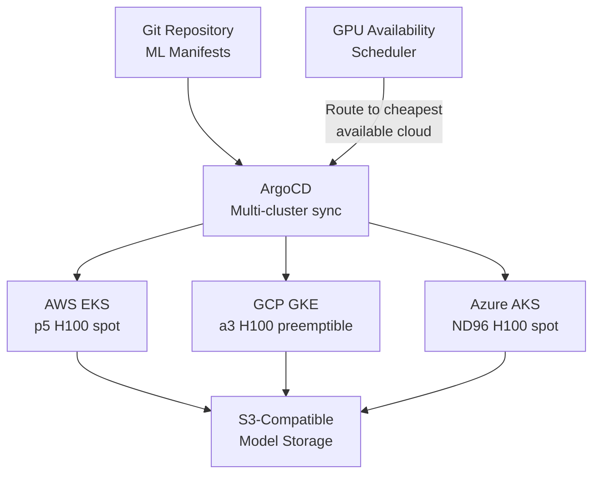

> 💡 **Quick Answer:** Use Kubernetes as the abstraction layer for multi-cloud AI: define GPU workloads as standard K8s manifests, deploy via ArgoCD ApplicationSets across EKS/GKE/AKS, and use spot/preemptible instances with checkpointing for 60-80% cost savings. Store models on cloud-agnostic S3-compatible storage.

## The Problem

GPU availability varies by cloud and region — H100s might be available on GCP but not AWS this week. Pricing differs by 2-3x between providers. Locking into one cloud means missing availability and overpaying. Kubernetes provides the portability layer to run AI workloads anywhere GPUs are available.

## The Solution

### GPU Instance Comparison

| GPU | AWS | GCP | Azure |
|-----|-----|-----|-------|
| A100 80GB | p4d.24xlarge ($32/hr) | a2-ultragpu-8g ($29/hr) | ND96amsr ($27/hr) |
| H100 80GB | p5.48xlarge ($98/hr) | a3-highgpu-8g ($85/hr) | ND96isr ($88/hr) |
| L4 24GB | g6.xlarge ($0.80/hr) | g2-standard-4 ($0.70/hr) | — |
| Spot/Preemptible | 60-70% off | 60-91% off | 60-80% off |

### Multi-Cloud Deployment with ArgoCD

```yaml
apiVersion: argoproj.io/v1alpha1
kind: ApplicationSet
metadata:
  name: inference-multicloud
  namespace: argocd
spec:
  generators:
    - clusters:
        selector:
          matchLabels:
            gpu-type: h100
  template:
    metadata:
      name: 'inference-{{name}}'
    spec:
      source:
        repoURL: https://git.example.com/ml/inference.git
        path: overlays/{{metadata.labels.cloud-provider}}
      destination:
        server: '{{server}}'
        namespace: inference
      syncPolicy:
        automated:
          selfHeal: true
```

### Spot Instance Training with Checkpointing

```yaml
apiVersion: kubeflow.org/v1
kind: PyTorchJob
metadata:
  name: resilient-training
spec:
  pytorchReplicaSpecs:
    Worker:
      replicas: 4
      template:
        spec:
          tolerations:
            - key: cloud.google.com/gke-spot
              operator: Equal
              value: "true"
              effect: NoSchedule
          containers:
            - name: pytorch
              command:
                - torchrun
                - --rdzv_backend=c10d
                - train.py
                - --checkpoint-dir=/checkpoints
                - --checkpoint-interval=500
                - --resume-from-checkpoint=latest
              volumeMounts:
                - name: checkpoints
                  mountPath: /checkpoints
          volumes:
            - name: checkpoints
              persistentVolumeClaim:
                claimName: training-checkpoints
```

### Cloud-Agnostic Model Storage

```yaml
# MinIO or any S3-compatible storage
apiVersion: v1
kind: Secret
metadata:
  name: model-storage
data:
  AWS_ACCESS_KEY_ID: <base64>
  AWS_SECRET_ACCESS_KEY: <base64>
  AWS_ENDPOINT_URL: <base64>  # MinIO or cloud S3 endpoint
```

Models stored on S3-compatible storage work across all clouds — no vendor lock-in.



## Common Issues

**Model not loading on different cloud**

Storage paths differ between providers. Use S3-compatible storage with a consistent endpoint URL. Never hardcode cloud-specific paths.

**Spot instance terminated mid-training**

Checkpointing is mandatory for spot/preemptible. Set `--checkpoint-interval=500` (steps) and resume from latest checkpoint on restart.

## Best Practices

- **S3-compatible storage for models** — works across all clouds
- **Checkpoint every 500 steps** on spot instances — 2 minutes of lost work max
- **ArgoCD ApplicationSets** for multi-cloud deployment — same manifest, different overlays
- **Monitor spot pricing** — shift workloads to cheapest available cloud
- **Keep inference on on-demand** — spot termination causes user-facing errors

## Key Takeaways

- Kubernetes provides the abstraction layer for multi-cloud AI workloads
- GPU availability and pricing varies 2-3x between cloud providers
- Spot/preemptible instances save 60-80% — but require checkpointing
- S3-compatible storage enables model portability across clouds
- ArgoCD ApplicationSets deploy the same workload across multiple clouds
