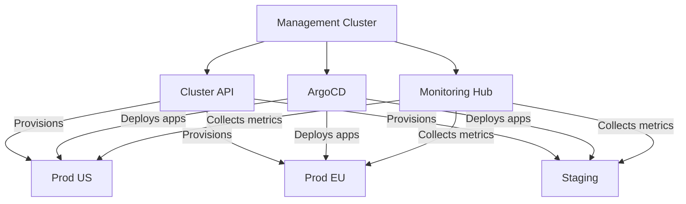

> 💡 **Quick Answer:** Manage multiple K8s clusters by: 1) `kubectl` contexts for manual switching, 2) ArgoCD ApplicationSets for GitOps fleet deployment, 3) Cluster API for lifecycle management, or 4) Rancher/OpenShift ACM for full platform management.

## The Problem

Organizations run multiple clusters for:
- Environment separation (dev/staging/prod)
- Geographic distribution (multi-region)
- Workload isolation (PCI, GPU, general)
- Disaster recovery (active-active or active-passive)

Managing them individually doesn't scale.

## The Solution

### kubectl Context Management

```bash
# List all configured clusters
kubectl config get-contexts
# CURRENT   NAME          CLUSTER       AUTHINFO    NAMESPACE
# *         prod-us       prod-us       admin       default
#           prod-eu       prod-eu       admin       default
#           staging       staging       dev         default

# Switch context
kubectl config use-context prod-eu

# Run command against specific context
kubectl --context=staging get pods

# Merge kubeconfigs
KUBECONFIG=~/.kube/prod.yaml:~/.kube/staging.yaml kubectl config view --flatten > ~/.kube/config

# Rename context for clarity
kubectl config rename-context kubernetes-admin@cluster prod-us-east
```

### ArgoCD Multi-Cluster GitOps

```yaml
# Register clusters in ArgoCD
# argocd cluster add prod-eu --name prod-eu

# ApplicationSet for fleet-wide deployment
apiVersion: argoproj.io/v1alpha1
kind: ApplicationSet
metadata:
  name: myapp-fleet
  namespace: argocd
spec:
  generators:
    - clusters:
        selector:
          matchLabels:
            env: production
  template:
    metadata:
      name: "myapp-{{name}}"
    spec:
      project: default
      source:
        repoURL: https://github.com/org/k8s-manifests.git
        targetRevision: main
        path: "apps/myapp/overlays/{{metadata.labels.region}}"
      destination:
        server: "{{server}}"
        namespace: myapp
      syncPolicy:
        automated:
          prune: true
          selfHeal: true
```

### Cluster API (Lifecycle Management)

```yaml
# Manage cluster lifecycle declaratively
apiVersion: cluster.x-k8s.io/v1beta1
kind: Cluster
metadata:
  name: prod-eu-west
  namespace: clusters
spec:
  clusterNetwork:
    pods:
      cidrBlocks: ["192.168.0.0/16"]
    services:
      cidrBlocks: ["10.128.0.0/12"]
  controlPlaneRef:
    apiVersion: controlplane.cluster.x-k8s.io/v1beta1
    kind: KubeadmControlPlane
    name: prod-eu-west-cp
  infrastructureRef:
    apiVersion: infrastructure.cluster.x-k8s.io/v1beta1
    kind: AWSCluster
    name: prod-eu-west
```

### Architecture Patterns



### Fleet Management Tools Comparison

| Tool | Use Case | Approach |
|------|----------|----------|
| kubectl contexts | Small teams, <5 clusters | Manual context switching |
| ArgoCD ApplicationSets | GitOps fleet deployment | Pull-based, declarative |
| Flux + Cluster API | Full lifecycle + deploy | GitOps native |
| Rancher | Platform management | UI + API, full lifecycle |
| OpenShift ACM | Red Hat enterprise | Policy-driven governance |
| Loft/vCluster | Virtual clusters | Multi-tenancy on single cluster |
| Crossplane | Infrastructure as code | Compositions, cloud resources |

### Service Mesh Multi-Cluster

```yaml
# Istio multi-cluster (shared trust domain)
# Link services across clusters
apiVersion: networking.istio.io/v1alpha3
kind: ServiceEntry
metadata:
  name: remote-service
spec:
  hosts:
    - myservice.namespace.global
  location: MESH_INTERNAL
  endpoints:
    - address: 10.1.2.3  # Remote cluster gateway IP
      ports:
        http: 15443
```

### Centralized Monitoring

```bash
# Thanos for multi-cluster Prometheus
# Each cluster runs Prometheus + Thanos Sidecar
# Central Thanos Query aggregates all clusters

# Or use Grafana Cloud / Datadog with cluster labels
# Add cluster label to all metrics:
# external_labels:
#   cluster: prod-us-east
#   region: us-east-1
```

## Common Issues

| Issue | Cause | Fix |
|-------|-------|-----|
| Wrong cluster deployed to | Context confusion | Use namespace-per-cluster or ArgoCD |
| Certificate expired on remote | kubeconfig token stale | Refresh credentials or use OIDC |
| Network connectivity | Clusters not peered | Set up VPN/peering between VPCs |
| Config drift between clusters | Manual changes | Enforce GitOps — no `kubectl apply` |
| Inconsistent versions | Clusters at different K8s versions | Use Cluster API for version management |

## Best Practices

1. **Use a management cluster** — single pane for fleet operations
2. **GitOps for all deployments** — ArgoCD ApplicationSets across clusters
3. **Standardize cluster labels** — `env`, `region`, `tier` for fleet targeting
4. **Separate kubeconfigs per cluster** — avoid accidental cross-cluster commands
5. **Centralize observability** — one Grafana for all clusters with cluster label

## Key Takeaways

- Start with kubectl contexts, graduate to ArgoCD/Flux for automation
- Management cluster pattern: one cluster manages the fleet's lifecycle and deployments
- Cluster API provisions clusters declaratively; ArgoCD deploys apps declaratively
- Label clusters consistently for ApplicationSet generators
- Multi-cluster service mesh (Istio/Linkerd) enables cross-cluster service discovery
