> 💡 **Quick Answer:** Three patterns: **Sidecar** (extends app—logging, syncing, proxying), **Ambassador** (proxies outbound traffic—connection pooling, retry logic), **Adapter** (transforms data—format conversion, protocol translation). All containers in a pod share network (localhost) and can share volumes.
>
> **Key concept:** Sidecar = enhances app; Ambassador = simplifies external access; Adapter = normalizes output.
>
> **Gotcha:** Multi-container pods are tightly coupled and scale together—use for genuinely dependent functionality, not loosely-coupled services.

## The Problem

Your application needs additional functionality like logging, proxying, or data transformation that should be decoupled from the main application container.

## The Solution

Use multi-container pod patterns (Sidecar, Ambassador, Adapter) to add capabilities to your pods while maintaining separation of concerns.

## Pattern Overview

```mermaid
flowchart TB
    subgraph sidecar["🔧 SIDECAR: Extends/enhances main container"]
        direction LR
        S_Main["📦 Main"]
        S_Sidecar["🔌 Sidecar<br/>(logging, sync, monitoring)"]
        S_Main <--> S_Sidecar
    end
    
    subgraph ambassador["🌐 AMBASSADOR: Proxy for external communication"]
        direction LR
        A_Main["📦 Main"]
        A_Ambassador["🚪 Ambassador"]
        A_External["☁️ External"]
        A_Main <--> A_Ambassador <--> A_External
    end
    
    subgraph adapter["🔄 ADAPTER: Standardizes output format"]
        direction LR
        AD_Main["📦 Main"]
        AD_Adapter["⚙️ Adapter"]
        AD_Monitoring["📊 Monitoring"]
        AD_Main --> AD_Adapter --> AD_Monitoring
    end
    
    sidecar ~~~ ambassador
    ambassador ~~~ adapter
```



## Pattern 1: Sidecar Pattern

The sidecar extends the main container's functionality. Common uses include log shipping, configuration sync, and service mesh proxies.

### Log Shipping Sidecar

```yaml
apiVersion: v1
kind: Pod
metadata:
  name: app-with-log-sidecar
  labels:
    app: myapp
spec:
  containers:
    # Main application container
    - name: main-app
      image: nginx:1.25
      ports:
        - containerPort: 80
      volumeMounts:
        - name: shared-logs
          mountPath: /var/log/nginx

    # Sidecar container for log shipping
    - name: log-shipper
      image: fluent/fluent-bit:2.2
      volumeMounts:
        - name: shared-logs
          mountPath: /var/log/nginx
          readOnly: true
        - name: fluent-bit-config
          mountPath: /fluent-bit/etc/
      resources:
        requests:
          memory: "64Mi"
          cpu: "50m"
        limits:
          memory: "128Mi"
          cpu: "100m"

  volumes:
    - name: shared-logs
      emptyDir: {}
    - name: fluent-bit-config
      configMap:
        name: fluent-bit-config
---
apiVersion: v1
kind: ConfigMap
metadata:
  name: fluent-bit-config
data:
  fluent-bit.conf: |
    [SERVICE]
        Flush         5
        Log_Level     info
        Daemon        off

    [INPUT]
        Name          tail
        Path          /var/log/nginx/*.log
        Tag           nginx.*
        Refresh_Interval 5

    [OUTPUT]
        Name          stdout
        Match         *
```

### Git Sync Sidecar

```yaml
apiVersion: v1
kind: Pod
metadata:
  name: app-with-git-sync
spec:
  containers:
    - name: web-server
      image: nginx:1.25
      volumeMounts:
        - name: html-content
          mountPath: /usr/share/nginx/html
          readOnly: true

    - name: git-sync
      image: registry.k8s.io/git-sync/git-sync:v4.2.1
      args:
        - --repo=https://github.com/example/static-content
        - --root=/git
        - --period=60s
        - --link=current
      volumeMounts:
        - name: html-content
          mountPath: /git
      securityContext:
        runAsUser: 65534  # nobody user

  volumes:
    - name: html-content
      emptyDir: {}
```

## Pattern 2: Ambassador Pattern

The ambassador container proxies network connections to and from the main container, handling concerns like connection pooling, retries, or protocol translation.

### Database Connection Ambassador

```yaml
apiVersion: v1
kind: Pod
metadata:
  name: app-with-db-ambassador
spec:
  containers:
    # Main application - connects to localhost:5432
    - name: main-app
      image: myapp:1.0
      env:
        - name: DATABASE_HOST
          value: "localhost"
        - name: DATABASE_PORT
          value: "5432"
      ports:
        - containerPort: 8080

    # Ambassador - handles database connection pooling
    - name: db-ambassador
      image: pgbouncer/pgbouncer:1.21.0
      ports:
        - containerPort: 5432
      env:
        - name: DATABASES_HOST
          value: "postgres-primary.database.svc.cluster.local"
        - name: DATABASES_PORT
          value: "5432"
        - name: DATABASES_USER
          valueFrom:
            secretKeyRef:
              name: db-credentials
              key: username
        - name: DATABASES_PASSWORD
          valueFrom:
            secretKeyRef:
              name: db-credentials
              key: password
        - name: DATABASES_DBNAME
          value: "myapp"
        - name: PGBOUNCER_POOL_MODE
          value: "transaction"
        - name: PGBOUNCER_MAX_CLIENT_CONN
          value: "100"
      resources:
        requests:
          memory: "64Mi"
          cpu: "50m"
        limits:
          memory: "128Mi"
          cpu: "100m"
```

### Redis Ambassador with Sentinel

```yaml
apiVersion: v1
kind: Pod
metadata:
  name: app-with-redis-ambassador
spec:
  containers:
    - name: main-app
      image: myapp:1.0
      env:
        - name: REDIS_HOST
          value: "localhost"
        - name: REDIS_PORT
          value: "6379"

    # Ambassador handles Redis Sentinel failover
    - name: redis-ambassador
      image: haproxy:2.9
      ports:
        - containerPort: 6379
      volumeMounts:
        - name: haproxy-config
          mountPath: /usr/local/etc/haproxy/haproxy.cfg
          subPath: haproxy.cfg

  volumes:
    - name: haproxy-config
      configMap:
        name: redis-haproxy-config
---
apiVersion: v1
kind: ConfigMap
metadata:
  name: redis-haproxy-config
data:
  haproxy.cfg: |
    defaults
      mode tcp
      timeout connect 5s
      timeout client 30s
      timeout server 30s

    frontend redis_frontend
      bind *:6379
      default_backend redis_backend

    backend redis_backend
      option tcp-check
      tcp-check send PING\r\n
      tcp-check expect string +PONG
      server redis1 redis-0.redis.default.svc.cluster.local:6379 check
      server redis2 redis-1.redis.default.svc.cluster.local:6379 check backup
      server redis3 redis-2.redis.default.svc.cluster.local:6379 check backup
```

## Pattern 3: Adapter Pattern

The adapter container transforms the output of the main container into a format expected by external systems, commonly used for metrics and logging.

### Prometheus Metrics Adapter

```yaml
apiVersion: v1
kind: Pod
metadata:
  name: app-with-metrics-adapter
  annotations:
    prometheus.io/scrape: "true"
    prometheus.io/port: "9113"
spec:
  containers:
    # Main application with proprietary metrics format
    - name: main-app
      image: nginx:1.25
      ports:
        - containerPort: 80
      volumeMounts:
        - name: nginx-config
          mountPath: /etc/nginx/conf.d/

    # Adapter - converts nginx stats to Prometheus format
    - name: nginx-prometheus-adapter
      image: nginx/nginx-prometheus-exporter:1.0
      args:
        - -nginx.scrape-uri=http://localhost:8080/nginx_status
      ports:
        - containerPort: 9113
          name: metrics
      resources:
        requests:
          memory: "32Mi"
          cpu: "25m"
        limits:
          memory: "64Mi"
          cpu: "50m"

  volumes:
    - name: nginx-config
      configMap:
        name: nginx-status-config
---
apiVersion: v1
kind: ConfigMap
metadata:
  name: nginx-status-config
data:
  status.conf: |
    server {
        listen 8080;
        location /nginx_status {
            stub_status on;
            access_log off;
            allow 127.0.0.1;
            deny all;
        }
    }
```

### Log Format Adapter

```yaml
apiVersion: v1
kind: Pod
metadata:
  name: legacy-app-with-adapter
spec:
  containers:
    # Legacy application with custom log format
    - name: legacy-app
      image: legacy-app:1.0
      volumeMounts:
        - name: app-logs
          mountPath: /var/log/app

    # Adapter - converts legacy logs to JSON format
    - name: log-adapter
      image: busybox:1.36
      command:
        - /bin/sh
        - -c
        - |
          tail -F /var/log/app/app.log | while read line; do
            timestamp=$(echo "$line" | cut -d' ' -f1-2)
            level=$(echo "$line" | cut -d' ' -f3)
            message=$(echo "$line" | cut -d' ' -f4-)
            echo "{\"timestamp\":\"$timestamp\",\"level\":\"$level\",\"message\":\"$message\"}"
          done
      volumeMounts:
        - name: app-logs
          mountPath: /var/log/app
          readOnly: true

  volumes:
    - name: app-logs
      emptyDir: {}
```

## Shared Resources Between Containers

### Shared Volume Communication

```yaml
apiVersion: v1
kind: Pod
metadata:
  name: shared-volume-example
spec:
  containers:
    - name: producer
      image: busybox:1.36
      command:
        - /bin/sh
        - -c
        - |
          while true; do
            echo "$(date): Data from producer" >> /shared/data.txt
            sleep 10
          done
      volumeMounts:
        - name: shared-data
          mountPath: /shared

    - name: consumer
      image: busybox:1.36
      command:
        - /bin/sh
        - -c
        - |
          while true; do
            if [ -f /shared/data.txt ]; then
              cat /shared/data.txt
            fi
            sleep 5
          done
      volumeMounts:
        - name: shared-data
          mountPath: /shared
          readOnly: true

  volumes:
    - name: shared-data
      emptyDir: {}
```

### Network Communication via localhost

```yaml
apiVersion: v1
kind: Pod
metadata:
  name: localhost-communication
spec:
  containers:
    - name: web-app
      image: nginx:1.25
      ports:
        - containerPort: 80
      # Can access cache at localhost:6379

    - name: cache
      image: redis:7
      ports:
        - containerPort: 6379
      # Accessible by web-app via localhost
```

## Best Practices

### 1. Resource Management

Always set resource requests and limits for all containers:

```yaml
containers:
  - name: main-app
    resources:
      requests:
        memory: "256Mi"
        cpu: "250m"
      limits:
        memory: "512Mi"
        cpu: "500m"

  - name: sidecar
    resources:
      requests:
        memory: "64Mi"
        cpu: "50m"
      limits:
        memory: "128Mi"
        cpu: "100m"
```

### 2. Lifecycle Management

Ensure proper startup and shutdown ordering:

```yaml
containers:
  - name: main-app
    lifecycle:
      preStop:
        exec:
          command: ["/bin/sh", "-c", "sleep 5"]

  - name: sidecar
    lifecycle:
      preStop:
        exec:
          command: ["/bin/sh", "-c", "sleep 10"]  # Shutdown after main
```

### 3. Health Checks

Configure probes for all containers:

```yaml
containers:
  - name: main-app
    livenessProbe:
      httpGet:
        path: /healthz
        port: 8080
      initialDelaySeconds: 10
    readinessProbe:
      httpGet:
        path: /ready
        port: 8080

  - name: sidecar
    livenessProbe:
      exec:
        command: ["pgrep", "-x", "fluent-bit"]
```

## When to Use Each Pattern

| Pattern | Use Case | Example |
|---------|----------|---------|
| Sidecar | Extend functionality | Logging, monitoring, config sync |
| Ambassador | Proxy connections | Connection pooling, circuit breaker |
| Adapter | Transform output | Metrics export, log formatting |

## Verification Commands

```bash
# Check all containers are running
kubectl get pod app-with-log-sidecar -o jsonpath='{.status.containerStatuses[*].name}'

# View logs from specific container
kubectl logs app-with-log-sidecar -c log-shipper

# Execute command in specific container
kubectl exec app-with-log-sidecar -c main-app -- cat /var/log/nginx/access.log

# Check shared volume contents
kubectl exec app-with-log-sidecar -c log-shipper -- ls -la /var/log/nginx/
```

## Common Pitfalls

1. **Forgetting resource limits on sidecars**: Can starve the main container
2. **Not handling container startup order**: Use init containers for dependencies
3. **Sharing sensitive data insecurely**: Use Secrets, not environment variables in shared volumes
4. **Ignoring sidecar failures**: Configure appropriate restart policies

## Summary

Multi-container pod patterns enable separation of concerns while keeping related containers tightly coupled. Choose the pattern based on your specific needs: sidecar for extension, ambassador for proxying, and adapter for transformation.

---

## 📘 Go Further with Kubernetes Recipes

**Love this recipe? There's so much more!** This is just one of **100+ hands-on recipes** in our comprehensive **[Kubernetes Recipes book](https://amzn.to/3DzC8QA)**.

Inside the book, you'll master:
- ✅ Production-ready deployment strategies
- ✅ Advanced networking and security patterns  
- ✅ Observability, monitoring, and troubleshooting
- ✅ Real-world best practices from industry experts

> *"The practical, recipe-based approach made complex Kubernetes concepts finally click for me."*

**👉 [Get Your Copy Now](https://amzn.to/3DzC8QA)** — Start building production-grade Kubernetes skills today!
