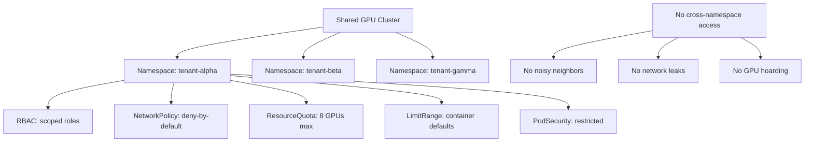

> 💡 **Quick Answer:** Use namespaces as the hard isolation boundary for GPU tenants. Combine scoped ServiceAccounts (no cross-namespace verbs), deny-by-default NetworkPolicy, ResourceQuotas for GPU/CPU/memory caps, and Pod Security Standards to prevent privileged escalation on shared nodes.

## The Problem

When multiple teams share a GPU cluster, "it runs" ≠ "it's safe to share." Without isolation, you get noisy neighbors hoarding GPU memory (latency spikes), queue explosions where jobs starve, driver drift from privileged containers, and cross-tenant network access. The loudest team wins.

## The Solution

Treat namespace isolation as the hard boundary. Every tenant gets a namespace with RBAC, NetworkPolicy, quotas, and scheduling constraints — all managed via GitOps so provisioning is a Git PR, not a ticket.

### Namespace Per Tenant

```yaml
apiVersion: v1
kind: Namespace
metadata:
  name: tenant-alpha
  labels:
    tenant: alpha
    environment: production
    gpu-enabled: "true"
  annotations:
    openshift.io/description: "Team Alpha - ML Training"
    openshift.io/display-name: "Tenant Alpha"
    scheduler.alpha.kubernetes.io/defaultTolerations: >
      [{"key":"nvidia.com/gpu","operator":"Exists","effect":"NoSchedule"}]
```

### Scoped RBAC — No Cross-Namespace Verbs

```yaml
apiVersion: rbac.authorization.k8s.io/v1
kind: Role
metadata:
  name: tenant-user
  namespace: tenant-alpha
rules:
  - apiGroups: [""]
    resources: ["pods", "pods/log", "pods/exec", "services", "configmaps", "secrets", "persistentvolumeclaims"]
    verbs: ["get", "list", "watch", "create", "update", "delete"]
  - apiGroups: ["apps"]
    resources: ["deployments", "statefulsets"]
    verbs: ["get", "list", "watch", "create", "update", "delete"]
  - apiGroups: ["batch"]
    resources: ["jobs", "cronjobs"]
    verbs: ["get", "list", "watch", "create", "update", "delete"]
  - apiGroups: ["kubeflow.org"]
    resources: ["pytorchjobs", "mpijobs"]
    verbs: ["get", "list", "watch", "create", "update", "delete"]
  # NO access to: nodes, clusterroles, namespaces, PVs, CRDs
---
apiVersion: rbac.authorization.k8s.io/v1
kind: RoleBinding
metadata:
  name: tenant-alpha-users
  namespace: tenant-alpha
subjects:
  - kind: Group
    name: tenant-alpha-team
    apiGroup: rbac.authorization.k8s.io
roleRef:
  kind: Role
  name: tenant-user
  apiGroup: rbac.authorization.k8s.io
```

### Deny-by-Default NetworkPolicy

```yaml
apiVersion: networking.k8s.io/v1
kind: NetworkPolicy
metadata:
  name: deny-all
  namespace: tenant-alpha
spec:
  podSelector: {}
  policyTypes:
    - Ingress
    - Egress
---
apiVersion: networking.k8s.io/v1
kind: NetworkPolicy
metadata:
  name: allow-same-namespace
  namespace: tenant-alpha
spec:
  podSelector: {}
  policyTypes:
    - Ingress
    - Egress
  ingress:
    - from:
        - podSelector: {}
  egress:
    - to:
        - podSelector: {}
    - to:
        - namespaceSelector:
            matchLabels:
              kubernetes.io/metadata.name: kube-system
      ports:
        - protocol: UDP
          port: 53
    - to:
        - namespaceSelector:
            matchLabels:
              kubernetes.io/metadata.name: openshift-ingress
```

### GPU ResourceQuota

```yaml
apiVersion: v1
kind: ResourceQuota
metadata:
  name: gpu-quota
  namespace: tenant-alpha
spec:
  hard:
    requests.nvidia.com/gpu: "8"
    limits.nvidia.com/gpu: "8"
    requests.cpu: "64"
    limits.cpu: "128"
    requests.memory: 256Gi
    limits.memory: 512Gi
    pods: "50"
    persistentvolumeclaims: "20"
---
apiVersion: v1
kind: LimitRange
metadata:
  name: default-limits
  namespace: tenant-alpha
spec:
  limits:
    - type: Container
      default:
        cpu: "2"
        memory: 8Gi
      defaultRequest:
        cpu: 500m
        memory: 2Gi
      max:
        cpu: "32"
        memory: 128Gi
        nvidia.com/gpu: "8"
```

### Pod Security Standards

```yaml
# On OpenShift, use SCCs; on vanilla K8s, use Pod Security Standards
apiVersion: v1
kind: Namespace
metadata:
  name: tenant-alpha
  labels:
    pod-security.kubernetes.io/enforce: restricted
    pod-security.kubernetes.io/audit: restricted
    pod-security.kubernetes.io/warn: restricted
    # Note: GPU workloads may need 'baseline' for device plugin access
```

### Admission Webhook (Prevent Misconfigs)

```yaml
# OPA Gatekeeper constraint: no privileged pods on shared nodes
apiVersion: constraints.gatekeeper.sh/v1beta1
kind: K8sNoPrivilegedContainers
metadata:
  name: no-privileged-gpu-tenants
spec:
  match:
    kinds:
      - apiGroups: [""]
        kinds: ["Pod"]
    namespaceSelector:
      matchLabels:
        gpu-enabled: "true"
  parameters:
    message: "Privileged containers not allowed in GPU tenant namespaces"
```



## Common Issues

- **GPU pods can't schedule after quota set** — ensure `requests.nvidia.com/gpu` is set, not just `limits`; pods must explicitly request GPUs
- **DNS resolution broken** — deny-all egress blocks DNS; add egress rule for kube-system port 53
- **Training jobs can't communicate across pods** — allow intra-namespace traffic in NetworkPolicy ingress/egress
- **NCCL fails with NetworkPolicy** — NCCL uses dynamic ports; allow all ports within namespace or use specific port ranges
- **Privileged SCC needed for GPU** — GPU device plugin may require elevated SCC; use dedicated SCC scoped to GPU namespaces only

## Best Practices

- Namespace = tenant boundary — never share namespaces between teams
- Deny-by-default NetworkPolicy in every tenant namespace
- ResourceQuotas prevent GPU hoarding; LimitRange sets sensible defaults
- Scoped RBAC — no cross-namespace verbs, no node access, no cluster-level resources
- Deploy all tenant configs via GitOps — PR = provisioning, git revert = rollback
- Admission webhooks catch misconfigs before they reach the cluster
- Label namespaces consistently (`tenant`, `environment`, `gpu-enabled`) for policy targeting

## Key Takeaways

- "It runs" ≠ "it's safe to share" — isolation must be enforced, not assumed
- Namespaces + RBAC + NetworkPolicy + Quotas form the four pillars of multi-tenant GPU isolation
- GitOps-driven provisioning eliminates manual steps and ensures auditability
- Admission webhooks provide the final safety net before workloads deploy
- Every layer must be explicit: default-deny networking, zero cross-namespace access, hard GPU caps
