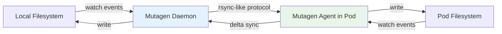

> 💡 **Quick Answer:** Mutagen syncs files in real-time between your local filesystem and a Kubernetes pod using `kubernetes://namespace/pod/container` URLs. Unlike `kubectl cp`, Mutagen watches for changes and syncs bidirectionally — enabling local-IDE + remote-cluster development.

## The Problem

Developing against a Kubernetes cluster is painful:
- `kubectl cp` is manual and one-shot — no watching for changes
- Building + pushing images for every code change is slow
- Local environments don't match production (dependencies, services, GPUs)
- You want IDE features locally but execution in the cluster

## The Solution

Mutagen provides real-time bidirectional file sync between local and Kubernetes pods.

### Install Mutagen

```bash
# macOS
brew install mutagen-io/mutagen/mutagen

# Linux
curl -fsSL https://github.com/mutagen-io/mutagen/releases/download/v0.18.1/mutagen_linux_amd64_v0.18.1.tar.gz | tar xz
sudo mv mutagen /usr/local/bin/

# Verify
mutagen version
```

### Basic Sync to a Pod

```bash
# Syntax: mutagen sync create <local-path> kubernetes://<namespace>/<pod>/<container>/<remote-path>

# Sync current directory to pod
mutagen sync create ./src kubernetes://default/myapp-pod/app/src

# Specify namespace and container explicitly
mutagen sync create ./src kubernetes://production/myapp-6f7b9c4d5-abc12/main/app/src

# With label selector (auto-resolves pod)
mutagen sync create ./src kubernetes://default/myapp-pod/app/src \
  --name=dev-sync
```

### Configuration File (mutagen.yml)

```yaml
# mutagen.yml — place in project root
sync:
  app-code:
    alpha: "./src"
    beta: "kubernetes://default/myapp-pod/main/app/src"
    mode: "two-way-resolved"
    ignore:
      vcs: true
      paths:
        - "node_modules/"
        - "__pycache__/"
        - "*.pyc"
        - ".git/"
        - "dist/"
    permissions:
      defaultFileMode: 0644
      defaultDirectoryMode: 0755

  config:
    alpha: "./config"
    beta: "kubernetes://default/myapp-pod/main/etc/app"
    mode: "one-way-replica"  # Local → Pod only
```

### Sync Modes

```bash
# Two-way sync (bidirectional)
mutagen sync create ./src kubernetes://ns/pod/container/path \
  --sync-mode=two-way-resolved

# One-way: local → pod (most common for dev)
mutagen sync create ./src kubernetes://ns/pod/container/path \
  --sync-mode=one-way-replica

# One-way: pod → local (pull artifacts)
mutagen sync create kubernetes://ns/pod/container/path ./output \
  --sync-mode=one-way-replica
```

### Architecture



### Manage Sync Sessions

```bash
# List active syncs
mutagen sync list

# Monitor sync status
mutagen sync monitor dev-sync

# Pause/resume
mutagen sync pause dev-sync
mutagen sync resume dev-sync

# Force re-sync (resolve conflicts)
mutagen sync reset dev-sync

# Delete sync session
mutagen sync terminate dev-sync

# Start all sessions from mutagen.yml
mutagen project start

# Stop all
mutagen project terminate
```

### Port Forwarding with Mutagen

```bash
# Forward remote port to local
mutagen forward create tcp:localhost:8080 kubernetes://default/myapp-pod/main:tcp::8080

# Combine file sync + port forward for full dev experience
mutagen project start  # Uses mutagen.yml for both
```

### Development Workflow

```bash
# 1. Deploy your app with a dev-mode Deployment (no resource limits, debug enabled)
kubectl apply -f deploy/dev.yaml

# 2. Start Mutagen sync
mutagen sync create ./src kubernetes://default/myapp-dev-pod/app/src \
  --sync-mode=one-way-replica \
  --ignore-vcs \
  --ignore="node_modules/,dist/,.next/" \
  --name=dev

# 3. Forward the dev port
mutagen forward create tcp:localhost:3000 kubernetes://default/myapp-dev-pod/main:tcp::3000

# 4. Edit locally in your IDE — changes sync in <1s
# 5. App hot-reloads in the pod (nodemon/air/etc.)
# 6. Access via localhost:3000
```

## Common Issues

| Issue | Cause | Fix |
|-------|-------|-----|
| "unable to connect" | Pod doesn't exist or wrong name | Check pod name with `kubectl get pods` |
| Slow initial sync | Large directory (node_modules) | Add ignore patterns |
| Sync conflicts | Bidirectional with both sides editing | Use `one-way-replica` for dev |
| Permission errors | Container runs as non-root | Set `permissions.defaultFileMode` |
| Pod recreated during deploy | Session breaks | Use Deployment label, recreate session |
| Agent install fails | No `tar` or `sh` in container | Use a dev image with shell |

## Best Practices

1. **Use `one-way-replica` for development** — local is source of truth
2. **Ignore `node_modules`, `.git`, build artifacts** — sync only source code
3. **Use `mutagen.yml` in your repo** — team shares the same dev config
4. **Pair with hot-reload** (nodemon, air, watchexec) in the pod for instant feedback
5. **Separate dev Deployment** — don't mutagen into production pods

## Key Takeaways

- Mutagen provides real-time file sync to Kubernetes pods — unlike one-shot `kubectl cp`
- URL format: `kubernetes://namespace/pod/container/path`
- `one-way-replica` (local→pod) is safest for development workflows
- Combine with port-forward for full "local IDE + remote cluster" experience
- Always ignore VCS, dependencies, and build artifacts for fast sync
