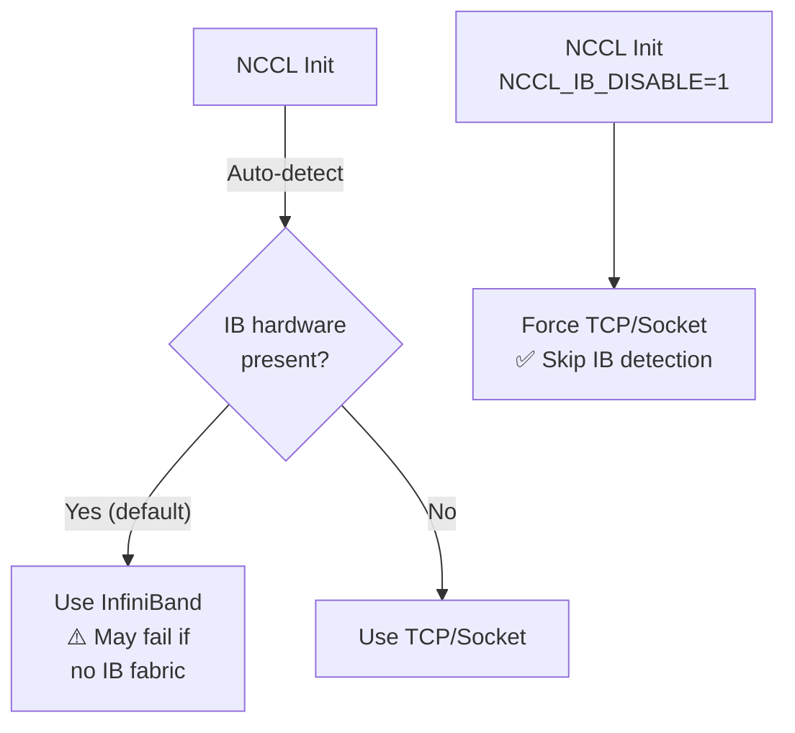

> 💡 **Quick Answer:** Set `NCCL_IB_DISABLE=1` when your cluster has InfiniBand hardware detected but you want NCCL to use TCP/Ethernet instead. Common scenarios: IB drivers installed but no IB fabric, mixed IB/Ethernet nodes, or IB errors during training. Without this flag, NCCL auto-detects IB and attempts to use it — failing silently or hanging if the fabric isn't properly configured.

## The Problem

NCCL (NVIDIA Collective Communications Library) auto-detects network interfaces. When InfiniBand hardware or drivers are present — even if not connected to an IB fabric — NCCL selects IB as the transport. This causes hangs, timeouts, or `unhandled system error` during distributed training. The `NCCL_IB_DISABLE` variable forces NCCL to skip IB and use TCP sockets instead.



## The Solution

### Set in Kubernetes Pod

```yaml
apiVersion: v1
kind: Pod
metadata:
  name: training-job
spec:
  containers:
    - name: trainer
      image: nvcr.io/nvidia/pytorch:24.07-py3
      env:
        # Disable InfiniBand — use TCP/Ethernet
        - name: NCCL_IB_DISABLE
          value: "1"
        # Specify which Ethernet interface to use
        - name: NCCL_SOCKET_IFNAME
          value: "eth0"
        # Optional: improve TCP performance
        - name: NCCL_SOCKET_NTHREADS
          value: "4"
        - name: NCCL_NSOCKS_PERTHREAD
          value: "4"
```

### Set in PyTorchJob

```yaml
apiVersion: kubeflow.org/v1
kind: PyTorchJob
metadata:
  name: distributed-training
spec:
  pytorchReplicaSpecs:
    Master:
      template:
        spec:
          containers:
            - name: pytorch
              env:
                - name: NCCL_IB_DISABLE
                  value: "1"
                - name: NCCL_SOCKET_IFNAME
                  value: "eth0"
    Worker:
      replicas: 3
      template:
        spec:
          containers:
            - name: pytorch
              env:
                - name: NCCL_IB_DISABLE
                  value: "1"
                - name: NCCL_SOCKET_IFNAME
                  value: "eth0"
```

### When to Use NCCL_IB_DISABLE=1

| Scenario | Set NCCL_IB_DISABLE? | Why |
|----------|----------------------|-----|
| Cloud VMs (AWS, GCP, Azure) without IB | **Yes** | IB drivers often pre-installed but no fabric |
| On-prem with InfiniBand fabric | **No** | IB provides 200-400 Gb/s vs ~25 Gb/s TCP |
| Mixed IB + Ethernet nodes | **Yes** on Ethernet nodes | Prevents IB selection on non-IB nodes |
| IB errors during NCCL init | **Yes** (temporary) | Unblock training while debugging IB |
| Single-node multi-GPU | **No** | NCCL uses NVLink/PCIe, not network |
| EFA on AWS (Elastic Fabric Adapter) | **Yes** | Use `FI_PROVIDER=efa` instead of IB |

### Diagnose IB Issues

```bash
# Check if IB devices are detected
ibstat 2>/dev/null || echo "No IB tools installed"

# Check NCCL's transport selection
NCCL_DEBUG=INFO python -c "
import torch
import torch.distributed as dist
dist.init_process_group('nccl')
" 2>&1 | grep -i "ib\|socket\|net\|transport"

# Expected output with IB disabled:
# NCCL INFO NET/Socket : Using [0]eth0:10.0.0.5<0>
# (no IB/RDMA lines)

# Expected output with IB enabled:
# NCCL INFO NET/IB : Using [0]mlx5_0:1/IB [1]mlx5_1:1/IB
```

### Performance Comparison

```bash
# Run NCCL all-reduce benchmark with IB
NCCL_IB_DISABLE=0 \
  /opt/nccl-tests/build/all_reduce_perf -b 1M -e 1G -f 2 -g 1

# Run with TCP/Socket
NCCL_IB_DISABLE=1 NCCL_SOCKET_IFNAME=eth0 \
  /opt/nccl-tests/build/all_reduce_perf -b 1M -e 1G -f 2 -g 1

# Typical results (8 GPUs across 2 nodes):
# IB HDR (200Gb/s):    ~180 GB/s bus bandwidth
# TCP 25GbE:           ~20 GB/s bus bandwidth
# TCP 100GbE:          ~80 GB/s bus bandwidth
```

## Related NCCL Environment Variables

| Variable | Purpose | Default |
|----------|---------|---------|
| `NCCL_IB_DISABLE=1` | Skip InfiniBand, use TCP | 0 (IB auto-detected) |
| `NCCL_SOCKET_IFNAME=eth0` | Which interface for TCP | Auto-detect |
| `NCCL_IB_HCA=mlx5_0` | Which IB device to use | All detected |
| `NCCL_IB_GID_INDEX=3` | RoCE GID index | 0 |
| `NCCL_NET_GDR_LEVEL=5` | GPUDirect RDMA level | Auto |
| `NCCL_DEBUG=INFO` | Enable debug logging | WARN |
| `NCCL_P2P_DISABLE=1` | Disable GPU peer-to-peer | 0 |

## Common Issues

| Issue | Cause | Fix |
|-------|-------|-----|
| NCCL hang on init | IB detected but no fabric | Set `NCCL_IB_DISABLE=1` |
| `unhandled system error` | IB driver version mismatch | Update MLNX_OFED or disable IB |
| Slow training with IB disabled | TCP much slower than IB | Fix IB fabric or upgrade to 100GbE |
| `ib_register_peer_memory_client` error | nvidia-peermem module issue | `modprobe nvidia-peermem` or disable GPUDirect |
| Wrong interface selected | Multiple NICs present | Set `NCCL_SOCKET_IFNAME` explicitly |

## Best Practices

- **Don't disable IB if you have working InfiniBand** — 10× performance difference
- **Always set `NCCL_SOCKET_IFNAME` with IB disabled** — prevents NCCL picking loopback
- **Use `NCCL_DEBUG=INFO` to diagnose** — shows exactly which transport NCCL selects
- **Set in ConfigMap for consistency** — all training pods get the same NCCL config
- **Test with nccl-tests before training** — verify bandwidth before wasting GPU hours
- **Consider EFA on AWS** — better than TCP, different from IB (`NCCL_IB_DISABLE=1` + `FI_PROVIDER=efa`)

## Key Takeaways

- `NCCL_IB_DISABLE=1` forces NCCL to use TCP instead of InfiniBand
- Needed when IB hardware/drivers exist but no IB fabric is connected
- Common in cloud VMs where MLNX_OFED is pre-installed
- Always pair with `NCCL_SOCKET_IFNAME` to select the right interface
- IB is 5-10× faster than TCP — only disable when IB isn't available
- Use `NCCL_DEBUG=INFO` to verify which transport NCCL actually uses
