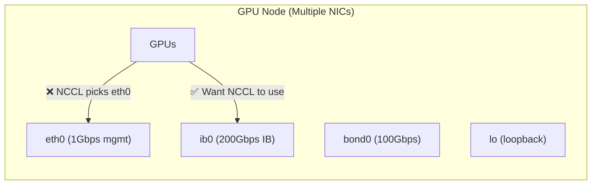

> 💡 **Quick Answer:** \`NCCL_SOCKET_IFNAME\` tells NCCL which network interface to use for GPU-to-GPU communication. Set it to your high-speed interface (e.g., \`eth0\`, \`bond0\`, \`ib0\`) to avoid NCCL using a slow or wrong interface. Prefix with \`^{name}\` to exclude interfaces.

## The Problem

Multi-node GPU training on Kubernetes uses NCCL (NVIDIA Collective Communications Library) for GPU-to-GPU data transfers. By default, NCCL auto-detects the network interface — but on nodes with multiple NICs (management, storage, high-speed fabric), it often picks the wrong one, causing:

- NCCL timeouts (\`NCCL WARN Timeout\`)
- Extremely slow all-reduce operations
- Training jobs hanging at initialization
- Non-deterministic failures (works sometimes, not others)



## The Solution

### Basic Usage

```yaml
env:
  # Use a specific interface
  - name: NCCL_SOCKET_IFNAME
    value: "eth0"

  # Use InfiniBand
  - name: NCCL_SOCKET_IFNAME
    value: "ib0"

  # Use a bonded interface
  - name: NCCL_SOCKET_IFNAME
    value: "bond0"

  # Prefix match (any interface starting with "eth")
  - name: NCCL_SOCKET_IFNAME
    value: "eth"

  # Exclude interfaces (use ^ prefix)
  - name: NCCL_SOCKET_IFNAME
    value: "^lo,docker0,veth"
```

### Common Configurations

| Cluster Type | NCCL_SOCKET_IFNAME | Notes |
|-------------|-------------------|-------|
| Cloud (AWS/GCP/Azure) | \`eth0\` or \`ens5\` | Primary high-speed NIC |
| On-prem InfiniBand | \`ib0\` | IB fabric for RDMA |
| Bonded NICs | \`bond0\` | Aggregated link |
| SR-IOV | \`net1\` | Multus secondary interface |
| Exclusion list | \`^lo,docker0,veth,flannel,cni0\` | Block known slow/CNI interfaces |

### Kubernetes Deployment Example

```yaml
apiVersion: apps/v1
kind: Deployment
metadata:
  name: distributed-training
spec:
  template:
    spec:
      containers:
        - name: trainer
          image: nvcr.io/nvidia/pytorch:24.04-py3
          env:
            # Network interface selection
            - name: NCCL_SOCKET_IFNAME
              value: "bond0"

            # Complementary NCCL settings
            - name: NCCL_IB_DISABLE
              value: "0"           # Enable InfiniBand (0=enabled)
            - name: NCCL_IB_HCA
              value: "mlx5"        # Use Mellanox HCA
            - name: NCCL_NET_GDR_LEVEL
              value: "5"           # GPUDirect RDMA level
            - name: NCCL_DEBUG
              value: "INFO"        # Enable debug logging

            # Timeout (increase for large clusters)
            - name: NCCL_TIMEOUT
              value: "1800000"     # 30 minutes in ms
          resources:
            limits:
              nvidia.com/gpu: 8
```

### How to Find the Right Interface

```bash
# On a GPU node, check available interfaces
kubectl exec -it gpu-pod -- ip addr show

# Look for high-speed interfaces:
# - ib0/ib1: InfiniBand (100-400 Gbps)
# - bond0: Bonded NICs
# - eth0/ens5: Primary ethernet
# - net1/net2: SR-IOV/Multus secondary interfaces

# Check interface speed
kubectl exec -it gpu-pod -- ethtool eth0 | grep Speed
# Speed: 100000Mb/s  ← 100 Gbps, good for NCCL

kubectl exec -it gpu-pod -- ethtool eth1 | grep Speed
# Speed: 1000Mb/s    ← 1 Gbps, too slow for NCCL

# For InfiniBand
kubectl exec -it gpu-pod -- ibstat | grep -A5 "Port 1"
# Rate: 200 Gbps
```

### Using Downward API for Dynamic Configuration

```yaml
# If interface name varies by node, use an init container
initContainers:
  - name: detect-interface
    image: busybox
    command:
      - sh
      - -c
      - |
        # Find the fastest non-loopback interface
        IFACE=$(ip route get 10.0.0.1 | awk '{print $5; exit}')
        echo "NCCL_SOCKET_IFNAME=$IFACE" > /config/nccl.env
    volumeMounts:
      - name: config
        mountPath: /config

containers:
  - name: trainer
    envFrom:
      - configMapRef:
          name: nccl-config
    # Or read from the init container output
```

### PyTorch Distributed Training Job

```yaml
apiVersion: kubeflow.org/v1
kind: PyTorchJob
metadata:
  name: multi-node-training
spec:
  pytorchReplicaSpecs:
    Master:
      replicas: 1
      template:
        spec:
          containers:
            - name: pytorch
              image: nvcr.io/nvidia/pytorch:24.04-py3
              env:
                - name: NCCL_SOCKET_IFNAME
                  value: "^lo,docker0"
                - name: NCCL_DEBUG
                  value: "INFO"
              resources:
                limits:
                  nvidia.com/gpu: 8
    Worker:
      replicas: 3
      template:
        spec:
          containers:
            - name: pytorch
              image: nvcr.io/nvidia/pytorch:24.04-py3
              env:
                - name: NCCL_SOCKET_IFNAME
                  value: "^lo,docker0"
                - name: NCCL_DEBUG
                  value: "INFO"
              resources:
                limits:
                  nvidia.com/gpu: 8
```

### Related NCCL Environment Variables

| Variable | Purpose | Example |
|----------|---------|---------|
| \`NCCL_SOCKET_IFNAME\` | Network interface for sockets | \`bond0\` or \`^lo,docker0\` |
| \`NCCL_IB_DISABLE\` | Disable InfiniBand | \`0\` (enabled) or \`1\` (disabled) |
| \`NCCL_IB_HCA\` | InfiniBand HCA device | \`mlx5_0\` or \`mlx5\` |
| \`NCCL_NET_GDR_LEVEL\` | GPUDirect RDMA level | \`5\` (max) |
| \`NCCL_TIMEOUT\` | Operation timeout (ms) | \`1800000\` (30 min) |
| \`NCCL_DEBUG\` | Debug logging level | \`INFO\`, \`WARN\`, \`TRACE\` |
| \`NCCL_TOPO_DUMP_FILE\` | Dump topology to file | \`/tmp/nccl-topo.xml\` |
| \`NCCL_P2P_LEVEL\` | P2P communication level | \`NVL\` (NVLink) |
| \`NCCL_ALGO\` | Algorithm selection | \`Ring\`, \`Tree\`, \`CollNet\` |

### Debug NCCL Interface Selection

```bash
# Set NCCL_DEBUG=INFO to see which interface NCCL picks
# In pod logs you'll see:
# NCCL INFO NET/Socket : Using [0]bond0:10.0.1.5<0>
# NCCL INFO NET/IB : Using [0]mlx5_0:1/IB [1]mlx5_1:1/IB

# If you see the wrong interface:
# NCCL INFO NET/Socket : Using [0]eth1:192.168.1.5<0>  ← management NIC!
# Fix: set NCCL_SOCKET_IFNAME=bond0 (or ^eth1)

# Dump topology for analysis
env:
  - name: NCCL_TOPO_DUMP_FILE
    value: "/tmp/nccl-topo.xml"
```

## Common Issues

| Issue | Cause | Fix |
|-------|-------|-----|
| \`NCCL WARN Timeout\` | Wrong interface selected | Set \`NCCL_SOCKET_IFNAME\` explicitly |
| Slow all-reduce | Using 1Gbps management NIC | Point to high-speed fabric interface |
| \`No usable listening socket\` | Interface doesn't exist in pod | Check \`ip addr\` inside pod; may need Multus for secondary NICs |
| Works single-node, fails multi | Loopback used intra-node | Exclude \`lo\`: \`NCCL_SOCKET_IFNAME=^lo\` |
| \`Call to ibv_modify_qp failed\` | IB interface wrong | Set \`NCCL_IB_HCA=mlx5_0\` explicitly |
| Intermittent timeouts | Interface flapping | Use bonded interface; increase \`NCCL_TIMEOUT\` |

## Best Practices

- **Always set \`NCCL_SOCKET_IFNAME\` explicitly** — never rely on auto-detection in production
- **Use exclusion (\`^\`) for flexibility** — \`^lo,docker0,veth\` works across node types
- **Enable \`NCCL_DEBUG=INFO\` during setup** — verify interface selection, disable in production
- **Match interface across all nodes** — all workers must use the same interface name
- **Increase \`NCCL_TIMEOUT\` for large clusters** — default may be too short for 32+ nodes
- **Test with \`nccl-tests\` first** — validate networking before training

## Key Takeaways

- \`NCCL_SOCKET_IFNAME\` controls which network interface NCCL uses for GPU communication
- Prefix match (\`eth\`) selects any interface starting with that name
- Exclusion (\`^lo,docker0\`) blocks specific interfaces — often more portable
- Always verify with \`NCCL_DEBUG=INFO\` to confirm the right interface is selected
- On InfiniBand clusters, also set \`NCCL_IB_HCA\` and \`NCCL_IB_DISABLE=0\`
- Wrong interface selection is the #1 cause of multi-node NCCL timeouts
