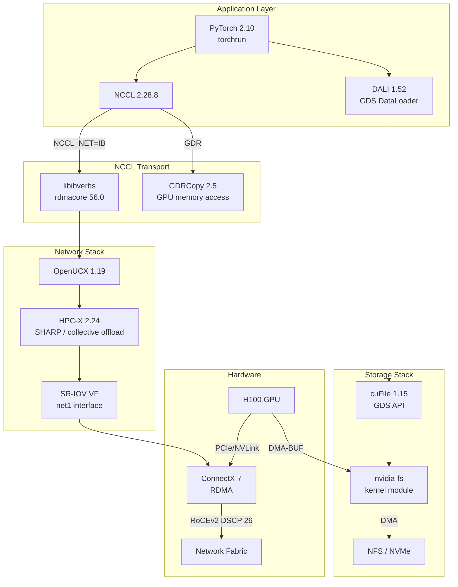

> 💡 **Quick Answer:** Set `NCCL_DEBUG=INFO`, `NCCL_SOCKET_IFNAME=net1` (SR-IOV secondary interface), enable IOMMU passthrough (`iommu=pt`) for GDS/GPUDirect RDMA, and run `torchrun` with the PyTorch 25.11 NGC container (NCCL 2.28.8, CUDA 13.0, MOFED 5.4). Verify NCCL logs show `NET/IB` transport and `GPU Direct RDMA` enabled.

## The Problem

Multi-node GPU training requires NCCL (NVIDIA Collective Communications Library) to move tensors between GPUs across nodes. For maximum performance:
- **SR-IOV** provides dedicated virtual network functions per pod — no shared NIC contention
- **GPUDirect RDMA (GDR)** transfers data directly between GPU memory and NIC — bypasses CPU
- **GPUDirect Storage (GDS)** reads training data directly from NVMe/NFS into GPU memory — bypasses page cache
- **IOMMU passthrough** is required for DMA between GPU and NIC PCI devices

Without proper configuration, NCCL falls back to TCP over the primary CNI interface — 10-100× slower than RDMA.

## The Solution

### Infrastructure Prerequisites

#### 1. IOMMU Configuration

IOMMU must be enabled in passthrough mode for GPUDirect RDMA and GDS:

```yaml
# OpenShift MachineConfig
apiVersion: machineconfiguration.openshift.io/v1
kind: MachineConfig
metadata:
  labels:
    machineconfiguration.openshift.io/role: gpu-worker
  name: 99-iommu-passthrough
spec:
  kernelArguments:
    - intel_iommu=on
    - iommu=pt
```

For AMD systems:
```yaml
  kernelArguments:
    - amd_iommu=on
    - iommu=pt
```

Why `iommu=pt` (passthrough)?
- **Without `iommu=pt`**: All DMA goes through IOMMU translation — adds latency
- **With `iommu=pt`**: Devices assigned to the host kernel bypass IOMMU translation; only devices assigned to VMs/containers use IOMMU isolation
- **Required for GDR**: GPU-to-NIC DMA needs direct physical address access

Verify after reboot:
```bash
# Check IOMMU is enabled
dmesg | grep -i iommu
# Intel-IOMMU: enabled
# DMAR: IOMMU enabled

# Check passthrough mode
cat /proc/cmdline | grep iommu=pt
```

#### 2. SR-IOV Network Configuration

```yaml
apiVersion: sriovnetwork.openshift.io/v1
kind: SriovNetworkNodePolicy
metadata:
  name: rdma-sriov-policy
  namespace: openshift-sriov-network-operator
spec:
  nodeSelector:
    node-role.kubernetes.io/gpu-worker: ""
  resourceName: mellanoxrdma
  numVfs: 8
  nicSelector:
    vendor: "15b3"
    deviceID: "101d"    # ConnectX-7
    pfNames: ["ens2f0"]
  deviceType: netdevice   # Required for RDMA verbs (not vfio-pci)
  isRdma: true
  linkType: ETH
---
apiVersion: sriovnetwork.openshift.io/v1
kind: SriovNetwork
metadata:
  name: rdma-network
  namespace: openshift-sriov-network-operator
spec:
  resourceName: mellanoxrdma
  networkNamespace: ai-training
  ipam: |
    {
      "type": "whereabouts",
      "range": "10.0.100.0/24"
    }
```

> ⚠️ `deviceType: netdevice` is mandatory for RDMA. `vfio-pci` bypasses the kernel network stack — no RDMA verbs available.

#### 3. GPU Operator with Open Kernel Modules

GPUDirect RDMA requires open kernel modules (DMA-BUF support):

```yaml
apiVersion: nvidia.com/v1
kind: ClusterPolicy
metadata:
  name: gpu-cluster-policy
spec:
  driver:
    useOpenKernelModules: true
  gdrcopy:
    enabled: true
  gds:
    enabled: true
```

### PyTorch 25.11 Container Stack

The NGC PyTorch 25.11 container bundles the complete RDMA/GDS stack:

| Component | Version | Purpose |
|-----------|---------|---------|
| CUDA | 13.0.2 | GPU compute runtime |
| PyTorch | 2.10.0a0 | Training framework |
| NCCL | 2.28.8 | GPU collective communications |
| MOFED | 5.4 (rdmacore 56.0) | Mellanox RDMA driver userspace |
| HPC-X | 2.24.1 | MPI + RDMA collective acceleration |
| OpenUCX | 1.19.0 | Unified communication framework |
| GDRCopy | 2.5.1 | Low-latency GPU memory copy |
| cuFile | 1.15.1.6 | GPUDirect Storage API |
| OpenMPI | 4.1.7 | Multi-node process management |
| NVSHMEM | 3.4.5 | NVIDIA symmetric memory |
| AWS OFI NCCL | 1.17.0 | EFA/libfabric NCCL plugin |
| TensorRT | 10.14.1 | Inference optimization |
| Transformer Engine | 2.9 | FP8 training support |
| DALI | 1.52.0 | GPU data loading pipeline |
| DOCA | 3.1.0 | DPU/NIC offload SDK |

### Pod Manifest

```yaml
apiVersion: v1
kind: Pod
metadata:
  name: pytorch-nccl-training
  namespace: ai-training
  annotations:
    k8s.v1.cni.cncf.io/networks: rdma-network
spec:
  containers:
    - name: training
      image: nvcr.io/nvidia/pytorch:25.11-py3
      command:
        - /bin/bash
        - -c
        - |
          # NCCL configuration
          export NCCL_DEBUG=INFO
          export NCCL_SOCKET_IFNAME=net1
          export NCCL_NET=IB

          # GPUDirect RDMA
          export NCCL_NET_GDR_LEVEL=SYS
          export NCCL_NET_GDR_READ=1

          # Performance tuning
          export NCCL_IB_QPS_PER_CONNECTION=4
          export NCCL_IB_GID_INDEX=3

          # GDS for data loading (if cuFile/GDS enabled)
          export CUFILE_ENV_PATH_JSON=/etc/cufile.json

          # Run training
          torchrun \
            --nproc_per_node=$NUM_GPUS \
            --nnodes=$WORLD_SIZE \
            --node_rank=$RANK \
            --master_addr=$MASTER_ADDR \
            --master_port=29500 \
            multinode.py --batch_size 32 1000 25
      env:
        - name: NUM_GPUS
          value: "8"
        - name: WORLD_SIZE
          value: "2"
        - name: RANK
          valueFrom:
            fieldRef:
              fieldPath: metadata.annotations['batch.kubernetes.io/job-completion-index']
        - name: MASTER_ADDR
          value: "pytorch-nccl-training-0.training-headless"
      resources:
        limits:
          nvidia.com/gpu: "8"
          openshift.io/mellanoxrdma: "1"
      securityContext:
        capabilities:
          add: ["IPC_LOCK"]
      volumeMounts:
        - name: dshm
          mountPath: /dev/shm
        - name: training-data
          mountPath: /data
  volumes:
    - name: dshm
      emptyDir:
        medium: Memory
        sizeLimit: 64Gi
    - name: training-data
      persistentVolumeClaim:
        claimName: training-data-pvc
```

### NCCL Environment Variables Explained

#### Core Settings

| Variable | Value | Purpose |
|----------|-------|---------|
| `NCCL_DEBUG` | `INFO` | Show transport selection and connection details |
| `NCCL_SOCKET_IFNAME` | `net1` | Use SR-IOV secondary interface (not pod eth0) |
| `NCCL_NET` | `IB` | Force InfiniBand/RoCE transport (not TCP) |

#### GPUDirect RDMA

| Variable | Value | Purpose |
|----------|-------|---------|
| `NCCL_NET_GDR_LEVEL` | `SYS` | Enable GDR across PCIe switches/NUMA nodes |
| `NCCL_NET_GDR_READ` | `1` | Enable GPU-initiated RDMA reads (not just writes) |

GDR levels (from most restrictive to least):
- `LOC` — same PCIe switch only
- `PIX` — same PCIe complex
- `PXB` — cross PCIe bridge
- `PHB` — same NUMA node
- `SYS` — anywhere in the system (most permissive, required for cross-NUMA)

#### Performance Tuning

| Variable | Value | Purpose |
|----------|-------|---------|
| `NCCL_IB_QPS_PER_CONNECTION` | `4` | Queue pairs per connection (more = higher throughput) |
| `NCCL_IB_GID_INDEX` | `3` | RoCEv2 GID index (IPv4 RoCEv2 = index 3 typically) |
| `NCCL_IB_TC` | `106` | Traffic class (DSCP 26/AF31 for lossless queue) |
| `NCCL_ALGO` | `Ring,Tree` | Algorithm selection (Ring for bandwidth, Tree for latency) |
| `NCCL_PROTO` | `Simple,LL,LL128` | Protocol selection (LL128 for small messages) |

### Multi-Node with LeaderWorkerSet

```yaml
apiVersion: leaderworkerset.x-k8s.io/v1
kind: LeaderWorkerSet
metadata:
  name: pytorch-training
  namespace: ai-training
spec:
  replicas: 1
  leaderWorkerTemplate:
    size: 2
    restartPolicy: RecreateGroupOnPodRestart
    leaderTemplate:
      metadata:
        annotations:
          k8s.v1.cni.cncf.io/networks: rdma-network
      spec:
        containers:
          - name: training
            image: nvcr.io/nvidia/pytorch:25.11-py3
            command: ["/bin/bash", "-c"]
            args:
              - |
                export NCCL_DEBUG=INFO
                export NCCL_SOCKET_IFNAME=net1
                export NCCL_NET=IB
                export NCCL_NET_GDR_LEVEL=SYS
                export NCCL_NET_GDR_READ=1
                
                torchrun \
                  --nproc_per_node=8 \
                  --nnodes=2 \
                  --node_rank=0 \
                  --master_addr=$(hostname) \
                  --master_port=29500 \
                  multinode.py --batch_size 32 1000 25
            resources:
              limits:
                nvidia.com/gpu: "8"
                openshift.io/mellanoxrdma: "1"
            securityContext:
              capabilities:
                add: ["IPC_LOCK"]
            volumeMounts:
              - name: dshm
                mountPath: /dev/shm
        volumes:
          - name: dshm
            emptyDir:
              medium: Memory
              sizeLimit: 64Gi
    workerTemplate:
      metadata:
        annotations:
          k8s.v1.cni.cncf.io/networks: rdma-network
      spec:
        containers:
          - name: training
            image: nvcr.io/nvidia/pytorch:25.11-py3
            command: ["/bin/bash", "-c"]
            args:
              - |
                export NCCL_DEBUG=INFO
                export NCCL_SOCKET_IFNAME=net1
                export NCCL_NET=IB
                export NCCL_NET_GDR_LEVEL=SYS
                export NCCL_NET_GDR_READ=1
                
                torchrun \
                  --nproc_per_node=8 \
                  --nnodes=2 \
                  --node_rank=1 \
                  --master_addr=${LWS_LEADER_ADDRESS} \
                  --master_port=29500 \
                  multinode.py --batch_size 32 1000 25
            resources:
              limits:
                nvidia.com/gpu: "8"
                openshift.io/mellanoxrdma: "1"
            securityContext:
              capabilities:
                add: ["IPC_LOCK"]
            volumeMounts:
              - name: dshm
                mountPath: /dev/shm
        volumes:
          - name: dshm
            emptyDir:
              medium: Memory
              sizeLimit: 64Gi
```

### GPUDirect Storage (GDS) Configuration

GDS allows training data to flow directly from NVMe/NFS storage into GPU memory:

```json
{
  "logging": {
    "level": 2
  },
  "profile": {
    "nvtx": false
  },
  "properties": {
    "max_direct_io_size_kb": 16384,
    "max_device_cache_size_kb": 131072,
    "max_device_pinned_mem_size_kb": 33554432,
    "max_batch_io_timeout_msecs": 5,
    "max_batch_io_size": 128
  },
  "fs": {
    "generic": {
      "posix_pool_size": 1024,
      "posix_unaligned_writes": false
    },
    "lustre": {
      "mount_table": []
    },
    "nfs": {
      "mount_table": [
        { "mountpoint": "/data", "servers": ["nfs.example.com"] }
      ]
    }
  }
}
```

Save as `/etc/cufile.json` and set:
```bash
export CUFILE_ENV_PATH_JSON=/etc/cufile.json
```

GDS requires:
- `nvidia-fs` kernel module loaded (GPU Operator handles this with `gds.enabled: true`)
- NFS server with `localio` support or NVMe storage
- cuFile API in the application (PyTorch DataLoader doesn't use GDS by default — use DALI with GDS backend)

### Verification

#### NCCL Transport Check

```bash
# Look for these lines in NCCL_DEBUG=INFO output:

# ✅ RDMA detected
# NCCL INFO NET/IB : Using [0]mlx5_2:1/RoCE [RO]; OOB net1:10.0.100.10<0>

# ✅ GPUDirect RDMA enabled
# NCCL INFO GPU Direct RDMA Enabled for HCA 0 (PCI 0000:ca:00.0)

# ✅ GDRCopy available
# NCCL INFO GDRCOPY : Enabled gdrcopy 2.5

# ❌ TCP fallback (bad — RDMA not working)
# NCCL INFO NET/Socket : Using [0]eth0:10.128.0.15<0>
```

#### Bandwidth Verification

```bash
# NCCL all-reduce benchmark (inside the container)
cd /opt/nccl-tests
mpirun -np 16 --host node0:8,node1:8 \
  -x NCCL_DEBUG=INFO \
  -x NCCL_SOCKET_IFNAME=net1 \
  -x NCCL_NET=IB \
  -x NCCL_NET_GDR_LEVEL=SYS \
  ./build/all_reduce_perf -b 8 -e 8G -f 2 -g 1

# Expected: ~380 GB/s bus bandwidth for 8×H100 + HDR200 IB
# If seeing <50 GB/s, RDMA is not active
```

#### GDS Verification

```bash
# Check nvidia-fs module
lsmod | grep nvidia_fs

# GDS stats
cat /proc/driver/nvidia-fs/stats
# Should show non-zero reads/writes after running GDS-enabled workload

# cuFile test
/usr/local/cuda/gds/tools/gdsio -f /data/testfile -d 0 -w 4 -s 1G -x 0 -I 1
```



## Common Issues

**NCCL falls back to NET/Socket despite SR-IOV**

Check `NCCL_SOCKET_IFNAME=net1` matches the actual SR-IOV interface name. Verify with:
```bash
ip addr show net1
ibv_devinfo  # Should show mlx5_X device in PORT_ACTIVE state
```

**"NCCL WARN IB : Unable to open GID index 3"**

GID index varies by RoCE version and IP configuration:
```bash
show_gids  # List all GID table entries
# Use the index corresponding to RoCEv2 + IPv4
```
Set `NCCL_IB_GID_INDEX` to match.

**GPUDirect RDMA not available — "GPU Direct RDMA Disabled"**

Three requirements:
1. Open kernel modules: `useOpenKernelModules: true` in GPU Operator
2. IOMMU passthrough: `iommu=pt` kernel parameter
3. `nvidia-peermem` module loaded: `lsmod | grep nvidia_peermem`

**cuFile errors — "nvidia-fs module not loaded"**

GDS requires the `nvidia-fs` kernel module:
```bash
lsmod | grep nvidia_fs
# If missing, check GPU Operator ClusterPolicy gds.enabled: true
```

**OOM during NCCL initialization — "/dev/shm too small"**

NCCL uses shared memory for intra-node communication. Size `/dev/shm` appropriately:
```yaml
volumes:
  - name: dshm
    emptyDir:
      medium: Memory
      sizeLimit: 64Gi  # 8 GPUs × 8GB per GPU
```

**IPC_LOCK capability denied**

RDMA memory registration requires `IPC_LOCK`:
```yaml
securityContext:
  capabilities:
    add: ["IPC_LOCK"]
```
On OpenShift, this requires a custom SCC (not `restricted-v2`).

## Best Practices

- **Always verify NCCL transport** with `NCCL_DEBUG=INFO` before running production training — one misconfigured variable can silently fall back to TCP
- **Pin `NCCL_SOCKET_IFNAME=net1`** to the SR-IOV interface — NCCL may auto-detect the wrong interface
- **Set `NCCL_NET_GDR_LEVEL=SYS`** for multi-socket systems — restrictive levels cause fallback on cross-NUMA GPU-NIC pairs
- **Size `/dev/shm` at 8GB per GPU** minimum — NCCL shared memory buffers scale with GPU count
- **Use `IPC_LOCK` capability**, not full `privileged` — minimum privilege for RDMA memory pinning
- **IOMMU passthrough (`iommu=pt`) is non-negotiable** for GDR and GDS
- **Run NCCL all-reduce benchmark first** — establishes baseline bandwidth before training
- **Pin container image versions** (e.g., `pytorch:25.11-py3`) — NCCL behavior can change between releases
- **Match MOFED versions** between host driver and container userspace — mismatches cause `libibverbs` errors
- **Use LeaderWorkerSet** for multi-node training — handles leader election, worker discovery, and group restart

## Key Takeaways

- NCCL 2.28.8 in PyTorch 25.11 supports RDMA, GDR, GDS, and SHARP collective offload out of the box
- `NCCL_SOCKET_IFNAME=net1` + `NCCL_NET=IB` forces RDMA over the SR-IOV interface
- GPUDirect RDMA needs three things: open kernel modules, `iommu=pt`, and `nvidia-peermem`
- GPUDirect Storage bypasses CPU and page cache for training data — requires `nvidia-fs` module and cuFile API
- SR-IOV `deviceType: netdevice` (not `vfio-pci`) is mandatory for RDMA verbs
- `IPC_LOCK` capability is required for RDMA memory registration — use custom SCC on OpenShift
- Verify with `NCCL_DEBUG=INFO`: look for `NET/IB` (good) not `NET/Socket` (TCP fallback)
- The complete stack: IOMMU → GPU Operator (open modules + GDS) → SR-IOV → PFC/ECN → NCCL env vars → torchrun
