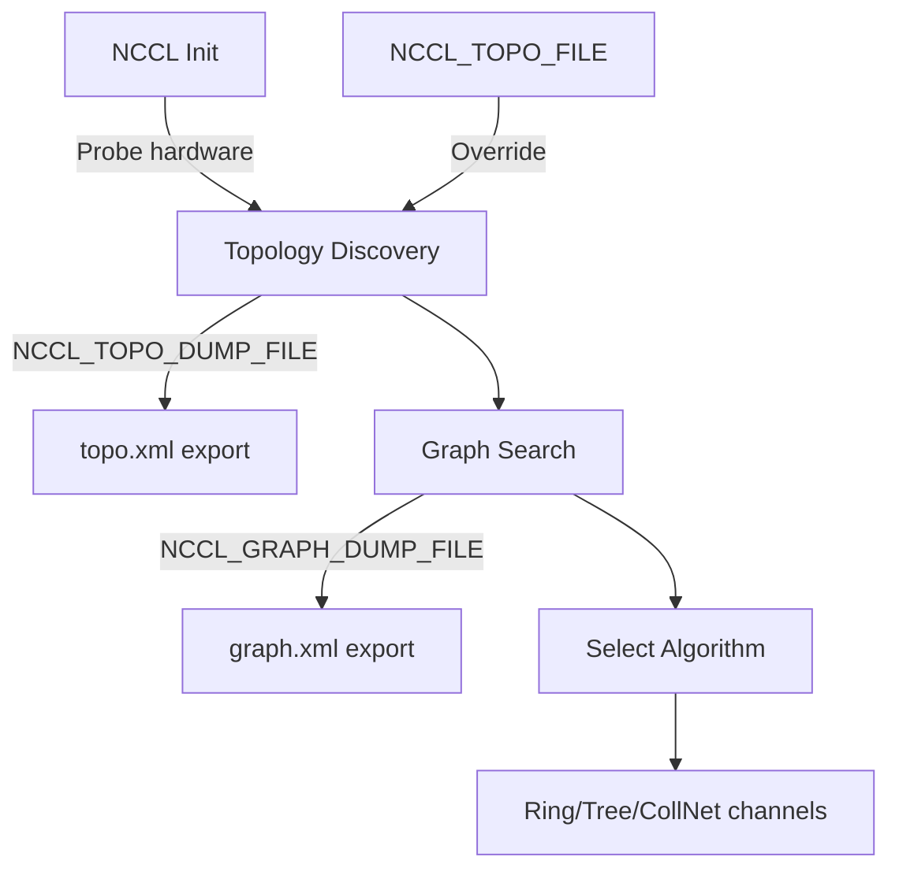

> 💡 **Quick Answer:** Set `NCCL_TOPO_DUMP_FILE=/tmp/nccl_topo.xml` to export the GPU/network topology graph that NCCL discovers. Analyze it to verify NVLink connectivity, PCIe affinity, InfiniBand paths, and identify suboptimal GPU communication routes.

## The Problem

Multi-GPU training is slow and you don't know why:
- NCCL picks suboptimal communication paths
- GPUs communicate over PCIe instead of NVLink
- InfiniBand isn't being used despite being configured
- Cross-node communication uses wrong NICs
- Need to verify topology matches hardware layout

## The Solution

### Capture Topology

```yaml
apiVersion: v1
kind: Pod
metadata:
  name: nccl-topo-debug
spec:
  containers:
    - name: debug
      image: nvcr.io/nvidia/pytorch:24.07-py3
      env:
        - name: NCCL_TOPO_DUMP_FILE
          value: "/workspace/nccl_topo.xml"
        - name: NCCL_DEBUG
          value: "INFO"
        - name: NCCL_DEBUG_SUBSYS
          value: "INIT,GRAPH"
      command: ["python", "-c", "import torch; torch.cuda.init(); import torch.distributed"]
      resources:
        limits:
          nvidia.com/gpu: 8
      volumeMounts:
        - name: workspace
          mountPath: /workspace
  volumes:
    - name: workspace
      emptyDir: {}
```

### Read the Topology File

```bash
# Copy topology file from pod
kubectl cp nccl-topo-debug:/workspace/nccl_topo.xml ./nccl_topo.xml

# The XML shows:
# - GPU devices and their PCIe bus IDs
# - NVLink connections between GPUs
# - NVSwitch (if present)
# - Network interfaces (IB/RoCE)
# - CPU affinity
# - PCIe topology tree
```

### Example Topology Output (8×H100 DGX)

```xml
<system version="1">
  <cpu numaid="0" affinity="0-63" arch="x86_64" vendor="GenuineIntel">
    <pci busid="0000:15:00.0" class="0x030000" vendor="0x10de" device="0x2330"
         subsystem_vendor="0x10de" subsystem_device="0x1839" link_speed="32 GT/s" link_width="16">
      <gpu dev="0" sm="90" mem="81920" gdr="1">
        <nvlink target="0000:16:00.0" count="18" tclass="0x030000"/>
        <nvlink target="0000:17:00.0" count="18" tclass="0x030000"/>
        <!-- NVSwitch connections to all other GPUs -->
      </gpu>
    </pci>
    <nic>
      <net name="mlx5_0" port="1" guid="0x..." speed="400000" latency="0.000000"
           gdr="1" maxconn="131072" coll="1"/>
    </nic>
  </cpu>
</system>
```

### Key Fields to Check

| Field | What to Look For | Issue If Wrong |
|-------|-----------------|----------------|
| `nvlink count` | 18 for NVSwitch, 2-4 for direct | Missing links = PCIe fallback |
| `gdr="1"` on NIC | GPUDirect RDMA enabled | `gdr="0"` = memory copies through CPU |
| `gdr="1"` on GPU | GPU supports GDR | Missing = no RDMA shortcut |
| `link_speed` | 32 GT/s (PCIe 5) or 64 GT/s (PCIe 6) | Lower = bottleneck |
| `speed` on NIC | 400000 (400Gb/s) or 200000 | Lower than expected = cable/config issue |
| `numaid` | CPU NUMA node | GPU on wrong NUMA = cross-socket traffic |

### Inject Custom Topology

```yaml
# Override NCCL's auto-detected topology (testing/workarounds)
env:
  - name: NCCL_TOPO_FILE
    value: "/workspace/custom_topo.xml"
```

```bash
# Use case: force NCCL to see correct topology when auto-detection fails
# (e.g., VMs hiding PCIe topology, or testing different configurations)

# Edit the XML to:
# - Add missing NVLink connections
# - Correct NIC speeds
# - Fix NUMA affinity
```

### Combine with NCCL_GRAPH_DUMP_FILE

```yaml
env:
  - name: NCCL_TOPO_DUMP_FILE
    value: "/workspace/nccl_topo.xml"
  - name: NCCL_GRAPH_DUMP_FILE
    value: "/workspace/nccl_graph.xml"
  - name: NCCL_DEBUG
    value: "INFO"
  - name: NCCL_DEBUG_SUBSYS
    value: "INIT,GRAPH,TUNING"
```

```bash
# NCCL_GRAPH_DUMP_FILE shows the actual communication channels NCCL selected:
# - Which algorithm (Ring, Tree, CollNetDirect)
# - Which GPUs talk to which over NVLink vs PCIe vs IB
# - The ring order for AllReduce
```

### Verify NVLink vs PCIe Path

```bash
# On the node (or in container with nvidia-smi):
nvidia-smi topo -m

#         GPU0  GPU1  GPU2  GPU3  GPU4  GPU5  GPU6  GPU7  NIC0
# GPU0     X    NV18  NV18  NV18  NV18  NV18  NV18  NV18  SYS
# GPU1    NV18   X    NV18  NV18  NV18  NV18  NV18  NV18  SYS
# ...

# NV18 = 18 NVLink connections (via NVSwitch)
# SYS  = Through CPU/PCIe (slow for GPU-GPU)
# PHB  = Through PCIe host bridge
# PXB  = Through PCIe switch
# PIX  = Through single PCIe switch
```

### Architecture



## Common Issues

| Issue | Cause | Fix |
|-------|-------|-----|
| No NVLink in topology | GPU Operator not configuring NVSwitch | Check `nvidia-fabricmanager` is running |
| `gdr="0"` on all NICs | nvidia_peermem not loaded | Load module: `modprobe nvidia_peermem` |
| Wrong NIC speed | Auto-negotiation failed | Check switch port config, cable |
| Missing GPUs in topology | Device plugin not exposing all | Verify `nvidia-smi` sees all GPUs |
| Topology shows PCIe only | Running in VM without passthrough | Use GPU passthrough or bare metal |

## Best Practices

1. **Always dump topology on new clusters** — verify hardware matches expectations
2. **Compare topo.xml to hardware spec** — NVLink count should match product sheet
3. **Check `gdr="1"` on NICs** — GPUDirect RDMA dramatically improves multi-node performance
4. **Use `NCCL_GRAPH_DUMP_FILE` alongside** — topology is what's available, graph is what's used
5. **Archive topology files** — baseline for comparison when performance degrades

## Key Takeaways

- `NCCL_TOPO_DUMP_FILE` exports the hardware topology NCCL discovers
- Check NVLink connections (count=18 for NVSwitch), GDR status, NIC speeds
- `NCCL_TOPO_FILE` can inject/override topology (testing or VM workarounds)
- `NCCL_GRAPH_DUMP_FILE` shows what NCCL actually chose to use (algorithms + channels)
- `nvidia-smi topo -m` gives a quick human-readable topology matrix
