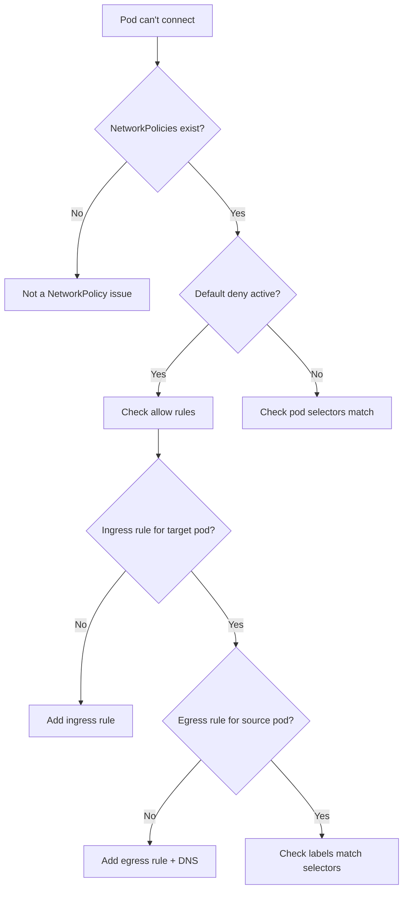

> 💡 **Quick Answer:** Run `kubectl get networkpolicy -n <namespace>` to see active policies. A default-deny policy blocks all traffic unless explicitly allowed. Test connectivity with `kubectl exec <pod> -- curl -m5 <target-service>`. Missing ingress or egress rules are the #1 cause.

## The Problem

Pods in the same namespace can't communicate, or cross-namespace traffic is blocked. Services return connection timeouts instead of responses. You recently applied NetworkPolicies and now things are broken.

## The Solution

### Step 1: Identify Active Policies

```bash
# List all NetworkPolicies in the namespace
kubectl get networkpolicy -n myapp
# NAME              POD-SELECTOR   AGE
# default-deny      <none>         5d    ← Applies to ALL pods
# allow-frontend    app=frontend   5d

# Check what each policy allows
kubectl describe networkpolicy default-deny -n myapp
```

### Step 2: Understand the Default Deny

```yaml
# This policy blocks ALL ingress to ALL pods in the namespace
apiVersion: networking.k8s.io/v1
kind: NetworkPolicy
metadata:
  name: default-deny-ingress
spec:
  podSelector: {}    # Empty = all pods
  policyTypes:
    - Ingress
  # No ingress rules = deny all ingress
```

**Key rule:** Once ANY NetworkPolicy selects a pod, traffic not explicitly allowed is denied. No NetworkPolicy = all traffic allowed.

### Step 3: Test Connectivity

```bash
# From source pod, test reaching the target
kubectl exec -n myapp deploy/frontend -- curl -m5 http://backend-svc:8080/health
# If timeout → NetworkPolicy blocking
# If connection refused → service/pod issue, not network policy

# Test DNS resolution
kubectl exec -n myapp deploy/frontend -- nslookup backend-svc
# If DNS fails → check egress policy allows DNS (port 53)
```

### Step 4: Fix Missing Rules

**Allow frontend → backend:**
```yaml
apiVersion: networking.k8s.io/v1
kind: NetworkPolicy
metadata:
  name: allow-frontend-to-backend
  namespace: myapp
spec:
  podSelector:
    matchLabels:
      app: backend
  policyTypes:
    - Ingress
  ingress:
    - from:
        - podSelector:
            matchLabels:
              app: frontend
      ports:
        - protocol: TCP
          port: 8080
```

**Allow DNS egress (critical!):**
```yaml
apiVersion: networking.k8s.io/v1
kind: NetworkPolicy
metadata:
  name: allow-dns
  namespace: myapp
spec:
  podSelector: {}
  policyTypes:
    - Egress
  egress:
    - to: []
      ports:
        - protocol: UDP
          port: 53
        - protocol: TCP
          port: 53
```



## Common Issues

### Forgot DNS Egress

The #1 NetworkPolicy mistake. If you have an egress policy but forgot to allow UDP/TCP port 53, pods can't resolve service names.

### Labels Don't Match

```bash
# Check actual pod labels
kubectl get pods -n myapp --show-labels
# Verify they match the NetworkPolicy selector
```

### Cross-Namespace Traffic

```yaml
# Allow ingress from pods in namespace "monitoring"
ingress:
  - from:
      - namespaceSelector:
          matchLabels:
            kubernetes.io/metadata.name: monitoring
```

## Best Practices

- **Always allow DNS** when using egress policies
- **Label namespaces** for cross-namespace policies
- **Test policies in a staging environment** before production
- **Start permissive, then tighten** — easier than debugging locked-out services
- **Use `kubectl exec` to test** — don't rely on external tools

## Key Takeaways

- NetworkPolicies are additive allow rules on top of an implicit deny
- No NetworkPolicy = all traffic allowed; one policy = only explicitly allowed traffic
- Always include DNS (port 53 UDP+TCP) in egress policies
- Check pod labels match policy selectors — mismatches silently fail
- Test with `kubectl exec` from source pod to target service
