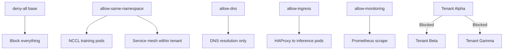

> 💡 **Quick Answer:** Apply a deny-all NetworkPolicy first, then add allow rules for intra-namespace traffic (including NCCL ports), DNS egress to kube-system, and specific cross-namespace services. NCCL uses dynamic ports — allow all ports within namespace.

## The Problem

Without NetworkPolicy, any pod can reach any other pod across namespaces. A compromised training job in tenant-alpha could scan and access services in tenant-beta. GPU workloads add complexity because NCCL distributed training uses dynamic high ports for inter-pod communication.

## The Solution

### Deny All (Base Policy)

```yaml
apiVersion: networking.k8s.io/v1
kind: NetworkPolicy
metadata:
  name: deny-all
  namespace: tenant-alpha
spec:
  podSelector: {}
  policyTypes:
    - Ingress
    - Egress
```

### Allow Intra-Namespace (Including NCCL)

```yaml
apiVersion: networking.k8s.io/v1
kind: NetworkPolicy
metadata:
  name: allow-same-namespace
  namespace: tenant-alpha
spec:
  podSelector: {}
  policyTypes:
    - Ingress
    - Egress
  ingress:
    - from:
        - podSelector: {}
      # All ports — NCCL uses dynamic ports (29500, 29400, etc.)
  egress:
    - to:
        - podSelector: {}
```

### Allow DNS

```yaml
apiVersion: networking.k8s.io/v1
kind: NetworkPolicy
metadata:
  name: allow-dns
  namespace: tenant-alpha
spec:
  podSelector: {}
  policyTypes:
    - Egress
  egress:
    - to:
        - namespaceSelector:
            matchLabels:
              kubernetes.io/metadata.name: kube-system
      ports:
        - protocol: UDP
          port: 53
        - protocol: TCP
          port: 53
    - to:
        - namespaceSelector:
            matchLabels:
              kubernetes.io/metadata.name: openshift-dns
      ports:
        - protocol: UDP
          port: 5353
        - protocol: TCP
          port: 5353
```

### Allow Ingress from HAProxy

```yaml
apiVersion: networking.k8s.io/v1
kind: NetworkPolicy
metadata:
  name: allow-ingress
  namespace: tenant-alpha
spec:
  podSelector:
    matchLabels:
      app: inference-server
  policyTypes:
    - Ingress
  ingress:
    - from:
        - namespaceSelector:
            matchLabels:
              kubernetes.io/metadata.name: openshift-ingress
      ports:
        - port: 8080
```

### Allow Monitoring Scrape

```yaml
apiVersion: networking.k8s.io/v1
kind: NetworkPolicy
metadata:
  name: allow-monitoring
  namespace: tenant-alpha
spec:
  podSelector: {}
  policyTypes:
    - Ingress
  ingress:
    - from:
        - namespaceSelector:
            matchLabels:
              kubernetes.io/metadata.name: openshift-monitoring
      ports:
        - port: 9090
        - port: 9400    # DCGM exporter
```



## Common Issues

- **NCCL training fails** — deny-all blocks inter-pod communication; allow-same-namespace must cover all ports (NCCL uses 29400-29500+ dynamically)
- **DNS resolution fails** — OpenShift uses port 5353 on openshift-dns, not standard 53 on kube-system
- **Prometheus can't scrape** — add allow-monitoring policy for openshift-monitoring namespace
- **External image pulls blocked** — egress to container registries may need explicit allow rules

## Best Practices

- Always start with deny-all, then add specific allows
- Allow all ports within namespace for NCCL — restricting ports breaks distributed training
- Include DNS egress in every tenant — pods can't function without name resolution
- Test NetworkPolicy with `kubectl exec` + `curl` before deploying training jobs
- Use namespace labels (not IP ranges) for policy selectors — IPs change, labels don't

## Key Takeaways

- Deny-by-default is the foundation of multi-tenant GPU security
- NCCL needs all ports allowed between pods in the same namespace
- DNS egress is required for basic pod functionality
- Cross-namespace traffic is blocked — each tenant is isolated
- NetworkPolicy is enforced by the CNI plugin (OVN-Kubernetes on OpenShift)
