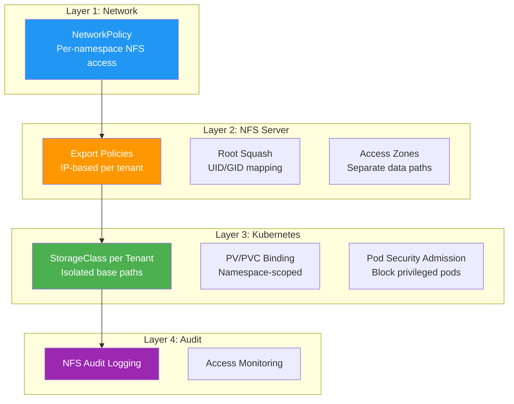

> 💡 **Quick Answer:** NFS tenant segregation in Kubernetes combines server-side export policies (IP-based access, root squash, read-only enforcement), dedicated exports per namespace, NetworkPolicy restricting NFS traffic by tenant, and CSI driver provisioning with per-StorageClass export paths. Defense in depth: no single layer is sufficient alone.

## The Problem

Multi-tenant Kubernetes clusters sharing a single NFS server face serious isolation risks:

- **Tenant A can mount Tenant B's data** — NFS exports are typically wide-open to the cluster CIDR
- **Root in a container means root on NFS** — `no_root_squash` lets privileged pods own everything
- **No network isolation** — any pod can reach the NFS server on port 2049
- **Shared provisioner creates cross-tenant paths** — dynamic PVs land in the same parent directory
- **NFS has no authentication** — access control is IP-based only; no user identity
- **Compliance violations** — PCI-DSS, HIPAA, and SOC2 require data segregation between tenants

## The Solution

### Defense-in-Depth Architecture



### Layer 1: NFS Server Export Policies

Create separate exports per tenant with strict access controls:

```bash
# /etc/exports — one export per tenant, IP-restricted

# Tenant A: only nodes in subnet 10.10.1.0/24
/srv/nfs/tenant-a  10.10.1.0/24(rw,sync,root_squash,all_squash,anonuid=1000,anongid=1000,no_subtree_check)

# Tenant B: only nodes in subnet 10.10.2.0/24
/srv/nfs/tenant-b  10.10.2.0/24(rw,sync,root_squash,all_squash,anonuid=2000,anongid=2000,no_subtree_check)

# Tenant C (read-only): analytics team
/srv/nfs/tenant-c  10.10.3.0/24(ro,sync,root_squash,all_squash,anonuid=3000,anongid=3000,no_subtree_check)

# Shared read-only: common datasets
/srv/nfs/shared    10.10.0.0/16(ro,sync,root_squash,all_squash,anonuid=65534,anongid=65534,no_subtree_check)
```

Key export options:

| Option | Purpose |
|--------|---------|
| `root_squash` | Map root (UID 0) to anonymous — **always enable** |
| `all_squash` | Map ALL UIDs to anonymous — strongest isolation |
| `anonuid/anongid` | Set the squashed UID/GID per tenant — unique per export |
| `ro` | Read-only access for analytics/reporting tenants |
| `no_subtree_check` | Performance: don't verify file is in subtree on each access |

```bash
# Apply and verify
exportfs -ra
exportfs -v
# /srv/nfs/tenant-a   10.10.1.0/24(sync,wdelay,root_squash,all_squash,anonuid=1000,anongid=1000,...)
# /srv/nfs/tenant-b   10.10.2.0/24(sync,wdelay,root_squash,all_squash,anonuid=2000,anongid=2000,...)
```

#### Directory Structure and Permissions

```bash
#!/bin/bash
# setup-tenant-exports.sh — create isolated tenant directories

NFS_ROOT="/srv/nfs"
TENANTS=("tenant-a:1000" "tenant-b:2000" "tenant-c:3000")

for entry in "${TENANTS[@]}"; do
    TENANT="${entry%%:*}"
    UID_GID="${entry##*:}"
    
    # Create tenant root
    mkdir -p "${NFS_ROOT}/${TENANT}"
    
    # Set ownership to tenant's anonymous UID/GID
    chown "${UID_GID}:${UID_GID}" "${NFS_ROOT}/${TENANT}"
    
    # 770: owner+group full access, others nothing
    chmod 770 "${NFS_ROOT}/${TENANT}"
    
    # Set sticky bit to prevent cross-user file deletion
    chmod +t "${NFS_ROOT}/${TENANT}"
    
    echo "Created ${NFS_ROOT}/${TENANT} (UID:GID ${UID_GID}:${UID_GID})"
done

# Shared read-only directory
mkdir -p "${NFS_ROOT}/shared"
chown 65534:65534 "${NFS_ROOT}/shared"
chmod 755 "${NFS_ROOT}/shared"
```

### Layer 2: Per-Tenant StorageClass

```yaml
# StorageClass for Tenant A — provisions PVs under /srv/nfs/tenant-a
apiVersion: storage.k8s.io/v1
kind: StorageClass
metadata:
  name: nfs-tenant-a
provisioner: nfs.csi.k8s.io
parameters:
  server: nfs-server.example.com
  share: /srv/nfs/tenant-a
  subDir: "${pvc.metadata.namespace}/${pvc.metadata.name}"
  mountPermissions: "0770"
mountOptions:
  - nfsvers=4.1
  - hard
  - nconnect=4
reclaimPolicy: Delete
volumeBindingMode: Immediate
allowedTopologies: []

---
# StorageClass for Tenant B
apiVersion: storage.k8s.io/v1
kind: StorageClass
metadata:
  name: nfs-tenant-b
provisioner: nfs.csi.k8s.io
parameters:
  server: nfs-server.example.com
  share: /srv/nfs/tenant-b
  subDir: "${pvc.metadata.namespace}/${pvc.metadata.name}"
  mountPermissions: "0770"
mountOptions:
  - nfsvers=4.1
  - hard
  - nconnect=4
reclaimPolicy: Delete
volumeBindingMode: Immediate

---
# StorageClass for Shared read-only
apiVersion: storage.k8s.io/v1
kind: StorageClass
metadata:
  name: nfs-shared-readonly
provisioner: nfs.csi.k8s.io
parameters:
  server: nfs-server.example.com
  share: /srv/nfs/shared
mountOptions:
  - nfsvers=4.1
  - hard
  - ro
reclaimPolicy: Retain
```

### Layer 3: Restrict StorageClass per Namespace

Use ResourceQuotas to enforce which StorageClass each tenant can use:

```yaml
# Tenant A namespace — can ONLY use nfs-tenant-a StorageClass
apiVersion: v1
kind: Namespace
metadata:
  name: tenant-a
  labels:
    tenant: a
    pod-security.kubernetes.io/enforce: restricted

---
apiVersion: v1
kind: ResourceQuota
metadata:
  name: storage-quota
  namespace: tenant-a
spec:
  hard:
    # Allow tenant-a StorageClass
    nfs-tenant-a.storageclass.storage.k8s.io/requests.storage: "500Gi"
    nfs-tenant-a.storageclass.storage.k8s.io/persistentvolumeclaims: "50"
    # Block other tenant StorageClasses (set to 0)
    nfs-tenant-b.storageclass.storage.k8s.io/requests.storage: "0"
    nfs-tenant-b.storageclass.storage.k8s.io/persistentvolumeclaims: "0"
    nfs-shared-readonly.storageclass.storage.k8s.io/requests.storage: "100Gi"

---
# Tenant B namespace
apiVersion: v1
kind: Namespace
metadata:
  name: tenant-b
  labels:
    tenant: b
    pod-security.kubernetes.io/enforce: restricted

---
apiVersion: v1
kind: ResourceQuota
metadata:
  name: storage-quota
  namespace: tenant-b
spec:
  hard:
    nfs-tenant-b.storageclass.storage.k8s.io/requests.storage: "1Ti"
    nfs-tenant-b.storageclass.storage.k8s.io/persistentvolumeclaims: "100"
    nfs-tenant-a.storageclass.storage.k8s.io/requests.storage: "0"
    nfs-tenant-a.storageclass.storage.k8s.io/persistentvolumeclaims: "0"
```

### Layer 4: NetworkPolicy for NFS Traffic

Restrict which pods can reach the NFS server:

```yaml
# Default deny all egress in tenant namespaces
apiVersion: networking.k8s.io/v1
kind: NetworkPolicy
metadata:
  name: default-deny-egress
  namespace: tenant-a
spec:
  podSelector: {}
  policyTypes:
  - Egress

---
# Allow NFS traffic ONLY from tenant-a to the NFS server
apiVersion: networking.k8s.io/v1
kind: NetworkPolicy
metadata:
  name: allow-nfs-egress
  namespace: tenant-a
spec:
  podSelector: {}
  policyTypes:
  - Egress
  egress:
  # NFS server
  - to:
    - ipBlock:
        cidr: 10.0.100.10/32  # NFS server IP
    ports:
    - protocol: TCP
      port: 2049    # NFSv4
    - protocol: TCP
      port: 111     # portmapper (NFSv3)
  # DNS (required for NFS hostname resolution)
  - to:
    - namespaceSelector:
        matchLabels:
          kubernetes.io/metadata.name: kube-system
      podSelector:
        matchLabels:
          k8s-app: kube-dns
    ports:
    - protocol: UDP
      port: 53
    - protocol: TCP
      port: 53
  # Kubernetes API (required for CSI driver)
  - to:
    - ipBlock:
        cidr: 10.0.0.1/32  # API server
    ports:
    - protocol: TCP
      port: 6443
```

### Layer 5: ValidatingAdmissionPolicy (K8s 1.28+)

Prevent tenants from creating PVs that point to other tenant's exports:

```yaml
# Prevent PVC from using wrong StorageClass
apiVersion: admissionregistration.k8s.io/v1
kind: ValidatingAdmissionPolicy
metadata:
  name: enforce-tenant-storageclass
spec:
  failurePolicy: Fail
  matchConstraints:
    resourceRules:
    - apiGroups: [""]
      apiVersions: ["v1"]
      operations: ["CREATE"]
      resources: ["persistentvolumeclaims"]
  validations:
  - expression: |
      !has(object.spec.storageClassName) ||
      object.spec.storageClassName.startsWith("nfs-tenant-" + namespaceObject.metadata.labels["tenant"]) ||
      object.spec.storageClassName == "nfs-shared-readonly"
    message: "PVC must use your tenant's StorageClass or nfs-shared-readonly"

---
apiVersion: admissionregistration.k8s.io/v1
kind: ValidatingAdmissionPolicyBinding
metadata:
  name: enforce-tenant-storageclass
spec:
  policyName: enforce-tenant-storageclass
  validationActions: [Deny]
  matchResources:
    namespaceSelector:
      matchExpressions:
      - key: tenant
        operator: Exists

---
# Block direct NFS hostPath or manual PV creation
apiVersion: admissionregistration.k8s.io/v1
kind: ValidatingAdmissionPolicy
metadata:
  name: block-direct-nfs-mount
spec:
  failurePolicy: Fail
  matchConstraints:
    resourceRules:
    - apiGroups: [""]
      apiVersions: ["v1"]
      operations: ["CREATE", "UPDATE"]
      resources: ["pods"]
  validations:
  - expression: |
      !object.spec.volumes.exists(v, 
        has(v.nfs) || 
        (has(v.hostPath) && v.hostPath.path.startsWith("/srv/nfs"))
      )
    message: "Direct NFS mounts and hostPath to /srv/nfs are not allowed. Use a PVC with your tenant StorageClass."
```

### Layer 6: NFS Audit Logging

```bash
# On the NFS server — enable audit logging
# /etc/nfs.conf
[exports]
rootdir=/srv/nfs

[nfsd]
debug=1

# Audit with auditd
cat >> /etc/audit/rules.d/nfs-audit.rules << 'EOF'
# Log all NFS export access
-w /srv/nfs/tenant-a -p rwxa -k nfs-tenant-a
-w /srv/nfs/tenant-b -p rwxa -k nfs-tenant-b
-w /srv/nfs/tenant-c -p rwxa -k nfs-tenant-c
# Log export config changes
-w /etc/exports -p wa -k nfs-exports-change
-w /etc/exports.d/ -p wa -k nfs-exports-change
EOF

augenrules --load
```

```yaml
# Kubernetes-side: audit PV/PVC creation
apiVersion: audit.k8s.io/v1
kind: Policy
rules:
- level: RequestResponse
  resources:
  - group: ""
    resources: ["persistentvolumes", "persistentvolumeclaims"]
  namespaces: ["tenant-a", "tenant-b", "tenant-c"]
```

### Monitoring and Compliance Verification

```bash
#!/bin/bash
# nfs-tenant-audit.sh — verify tenant segregation

echo "=== NFS Tenant Segregation Audit ==="
echo "Date: $(date)"
echo ""

# 1. Check export policies
echo "--- NFS Exports ---"
exportfs -v | while read line; do
    echo "  $line"
done

# 2. Verify directory permissions
echo ""
echo "--- Directory Permissions ---"
for dir in /srv/nfs/tenant-*; do
    PERMS=$(stat -c '%a %U:%G' "$dir")
    echo "  $dir → $PERMS"
done

# 3. Check active NFS connections per tenant
echo ""
echo "--- Active NFS Clients ---"
ss -tn state established '( dport = :2049 )' | awk 'NR>1 {print $4}' | sort -u | while read client; do
    echo "  Client: $client"
done

# 4. Verify StorageClass→Namespace binding
echo ""
echo "--- PVC StorageClass Usage ---"
kubectl get pvc -A -o custom-columns=\
"NAMESPACE:.metadata.namespace,\
PVC:.metadata.name,\
STORAGECLASS:.spec.storageClassName,\
STATUS:.status.phase" | grep -E "tenant-"

# 5. Check for policy violations
echo ""
echo "--- Cross-Tenant Violations ---"
kubectl get pvc -n tenant-a -o json | jq -r '.items[] | select(.spec.storageClassName != "nfs-tenant-a" and .spec.storageClassName != "nfs-shared-readonly") | "⚠️  \(.metadata.name) uses \(.spec.storageClassName)"'
kubectl get pvc -n tenant-b -o json | jq -r '.items[] | select(.spec.storageClassName != "nfs-tenant-b" and .spec.storageClassName != "nfs-shared-readonly") | "⚠️  \(.metadata.name) uses \(.spec.storageClassName)"'

echo ""
echo "--- NetworkPolicy Check ---"
for ns in tenant-a tenant-b tenant-c; do
    NP_COUNT=$(kubectl get networkpolicy -n $ns --no-headers 2>/dev/null | wc -l)
    echo "  $ns: $NP_COUNT NetworkPolicies"
    [ "$NP_COUNT" -eq 0 ] && echo "  ⚠️  No NetworkPolicy — NFS traffic unrestricted!"
done

echo ""
echo "=== Audit Complete ==="
```

### Enterprise: Scale-Out NAS Access Zones

For enterprise NAS (NetApp, Dell PowerScale/Isilon, Pure Storage):

```yaml
# PowerScale access zone per tenant (conceptual config)
# Each zone gets its own SMB/NFS namespace, auth provider, and IP pool

# Tenant A zone: 10.10.1.0/24 → /ifs/tenant-a
# Tenant B zone: 10.10.2.0/24 → /ifs/tenant-b

# StorageClass referencing PowerScale CSI with access zone
apiVersion: storage.k8s.io/v1
kind: StorageClass
metadata:
  name: powerscale-tenant-a
provisioner: csi-isilon.dellemc.com
parameters:
  AccessZone: "tenant-a-zone"
  IsiPath: "/ifs/tenant-a"
  AzServiceIP: "10.10.1.100"
  RootClientEnabled: "false"
reclaimPolicy: Delete
```

## Common Issues

**Pods can still mount other tenant's exports**

NFS access control is IP-based. If all worker nodes share the same subnet, export restrictions are ineffective. Solutions: use dedicated node pools per tenant with different subnets, or rely on NetworkPolicy + admission webhooks as the primary control.

**all_squash breaks applications expecting specific UIDs**

Use `anonuid`/`anongid` matching the application's expected UID. For example, if the app runs as UID 1000, set `anonuid=1000`. The `securityContext.runAsUser` in the pod spec must match.

**CSI driver creates subdirectories as root**

The NFS CSI driver provisioner needs write access to create subdirectories. Use a service account export with limited scope, or pre-create tenant subdirectories and use static PVs.

**NFSv3 requires additional ports for NetworkPolicy**

NFSv3 uses portmapper (111), mountd, and statd on dynamic ports. Pin these ports in NFS config (`/etc/nfs.conf`) or use NFSv4 exclusively (single port 2049).

## Best Practices

- **Use NFSv4.1+ exclusively** — single port (2049), built-in locking, simpler firewall rules
- **Enable `all_squash` + per-tenant `anonuid`** — strongest UID isolation
- **Never use `no_root_squash`** — a privileged container becomes root on the NFS share
- **Combine NetworkPolicy + export restrictions** — defense in depth, no single point of failure
- **Restrict StorageClass per namespace** — ResourceQuota with 0-limit blocks wrong class usage
- **Block direct NFS volume mounts** — admission policy prevents bypass of StorageClass controls
- **Audit regularly** — run segregation verification scripts weekly
- **Use `fsGroupChangePolicy: OnRootMismatch`** — avoids slow recursive chown on large volumes

## Key Takeaways

- NFS tenant segregation requires 6 layers: exports, directories, StorageClass, ResourceQuota, NetworkPolicy, and admission policies
- `all_squash` + unique `anonuid`/`anongid` per tenant provides server-side UID isolation
- NetworkPolicy restricts NFS traffic to authorized namespaces only
- ValidatingAdmissionPolicy prevents tenants from using wrong StorageClass or direct NFS mounts
- Enterprise NAS access zones provide the strongest isolation with dedicated IP pools and namespaces
- Regular audits are essential — verify exports, permissions, PVC bindings, and NetworkPolicy coverage
