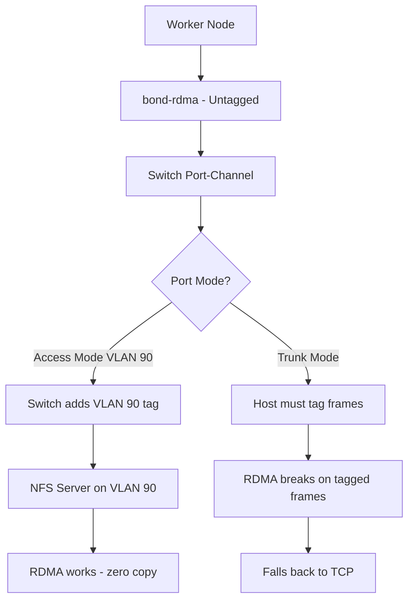

> 💡 **Quick Answer:** Bond multiple RDMA NICs with NNCP using `active-backup` mode (safest for RDMA) and configure the switch port-channel in **access mode** for the NFS VLAN. No VLAN tagging on the host — the switch assigns the VLAN on the aggregated link.

## The Problem

A single RDMA NIC for NFSoRDMA is a single point of failure. You need link redundancy, but:

- **VLAN tagging breaks RDMA** — can't use trunk mode with tagged VLANs on the host
- **Bond + VLAN sub-interface won't work** — RDMA can't go through a VLAN interface
- **Switch aggregation must be in access mode** — the port-channel must be an access port, not a trunk

The solution is bonding at the host with access-mode port-channel on the switch — VLAN membership is handled entirely by the switch, and the host sees only untagged frames on the bond.

## The Solution

### Step 1: Switch Port-Channel in Access Mode

Configure the switch first — aggregate ports in access mode:

```text
! Cisco NX-OS example
! Create port-channel in access mode
interface port-channel10
  description worker-0-nfsordma-bond
  switchport mode access
  switchport access vlan 90
  mtu 9216
  spanning-tree port type edge
  no lacp suspend-individual

! Member ports
interface Ethernet1/10
  description worker-0-rdma-nic1
  switchport mode access
  switchport access vlan 90
  mtu 9216
  channel-group 10 mode active

interface Ethernet1/11
  description worker-0-rdma-nic2
  switchport mode access
  switchport access vlan 90
  mtu 9216
  channel-group 10 mode active
```

```text
! Juniper QFX example
set interfaces ae0 aggregated-ether-options lacp active
set interfaces ae0 unit 0 family ethernet-switching interface-mode access
set interfaces ae0 unit 0 family ethernet-switching vlan members nfs-rdma-vlan90

set interfaces xe-0/0/10 ether-options 802.3ad ae0
set interfaces xe-0/0/11 ether-options 802.3ad ae0
```

### Step 2: Bond Configuration with NNCP

```yaml
apiVersion: nmstate.io/v1
kind: NodeNetworkConfigurationPolicy
metadata:
  name: worker-0-nfsordma-bond
spec:
  nodeSelector:
    kubernetes.io/hostname: worker-0
  desiredState:
    interfaces:
      # RDMA NIC ports — no IP, no VLAN
      - name: ens3f0
        type: ethernet
        state: up
        mtu: 9000
        ipv4:
          enabled: false
        ipv6:
          enabled: false
      - name: ens3f1
        type: ethernet
        state: up
        mtu: 9000
        ipv4:
          enabled: false
        ipv6:
          enabled: false
      # Bond — untagged, access mode handled by switch
      - name: bond-rdma
        type: bond
        state: up
        mtu: 9000
        ipv4:
          enabled: true
          dhcp: false
          address:
            - ip: 10.90.0.10
              prefix-length: 24
        ipv6:
          enabled: false
        link-aggregation:
          mode: 802.3ad
          options:
            miimon: "100"
            lacp_rate: "fast"
            xmit_hash_policy: "layer3+4"
          port:
            - ens3f0
            - ens3f1
    routes:
      config:
        - destination: 10.90.0.0/24
          next-hop-interface: bond-rdma
          metric: 100
```

### Step 3: Active-Backup Alternative

If your switch doesn't support LACP on access ports, use active-backup — no switch configuration needed:

```yaml
apiVersion: nmstate.io/v1
kind: NodeNetworkConfigurationPolicy
metadata:
  name: worker-0-nfsordma-bond-ab
spec:
  nodeSelector:
    kubernetes.io/hostname: worker-0
  desiredState:
    interfaces:
      - name: ens3f0
        type: ethernet
        state: up
        mtu: 9000
        ipv4:
          enabled: false
        ipv6:
          enabled: false
      - name: ens3f1
        type: ethernet
        state: up
        mtu: 9000
        ipv4:
          enabled: false
        ipv6:
          enabled: false
      - name: bond-rdma
        type: bond
        state: up
        mtu: 9000
        ipv4:
          enabled: true
          dhcp: false
          address:
            - ip: 10.90.0.10
              prefix-length: 24
        ipv6:
          enabled: false
        link-aggregation:
          mode: active-backup
          options:
            miimon: "100"
            primary: ens3f0
            fail_over_mac: "active"
          port:
            - ens3f0
            - ens3f1
```

### Step 4: Verify Bond and RDMA

```bash
# Check bond status
oc debug node/worker-0 -- chroot /host cat /proc/net/bonding/bond-rdma

# Verify RDMA still works through bond
oc debug node/worker-0 -- chroot /host rdma link show

# Test RDMA bandwidth
oc debug node/worker-0 -- chroot /host \
  ib_write_bw -d mlx5_0 --report_gbits 10.90.0.1

# Verify no VLAN tagging on bond
oc debug node/worker-0 -- chroot /host \
  ip -d link show bond-rdma | grep vlan
# Should return nothing — no VLAN configured
```

### Access Mode vs Trunk Mode



## Common Issues

### LACP bond on access port not negotiating

```bash
# Some switches don't support LACP on access ports
# Solution 1: Use static LAG (no LACP) on both sides
# Switch: channel-group 10 mode on (not active/passive)
# Host bond mode: balance-xor or balance-rr

# Solution 2: Use active-backup (no switch config needed)
# Host bond mode: active-backup with fail_over_mac
```

### RDMA device not mapping to bond interface

```bash
# RDMA devices map to physical NICs, not bonds
# The bond works at L2, RDMA goes through the active physical port
rdma link show
# You'll see mlx5_0 -> ens3f0 and mlx5_1 -> ens3f1
# Not mlx5_X -> bond-rdma

# This is expected — RDMA bypasses the kernel networking stack
# The bond provides L2 failover; RDMA uses the underlying device
```

### fail_over_mac needed for active-backup RDMA bonds

```yaml
# Without fail_over_mac, the backup NIC keeps its original MAC
# Some switches reject traffic from unexpected MACs on access ports
link-aggregation:
  mode: active-backup
  options:
    fail_over_mac: "active"  # Bond MAC follows active port
```

## Best Practices

- **Use access mode on the switch port-channel** — VLAN tagging at the switch, not the host
- **Prefer active-backup for RDMA bonds** — simplest, works with any switch, predictable failover
- **Set `fail_over_mac: active`** for active-backup — ensures consistent MAC on the active port
- **Use LACP only if the switch supports LACP on access ports** — not all vendors support this
- **MTU 9000 on bond, ports, and switch** — all must match for RDMA to work
- **Test RDMA after bonding** — verify with `ib_write_bw` through the bonded path

## Key Takeaways

- NFSoRDMA bonding requires **access mode on the switch port-channel** — no trunk, no host-side VLAN
- **Active-backup** is the safest bond mode for RDMA — no switch LACP configuration needed
- **802.3ad (LACP)** works only if the switch supports LACP on access-mode port-channels
- RDMA devices map to **physical NICs**, not the bond interface — this is by design
- The switch handles VLAN membership — the host sees only **untagged frames** on the bond
