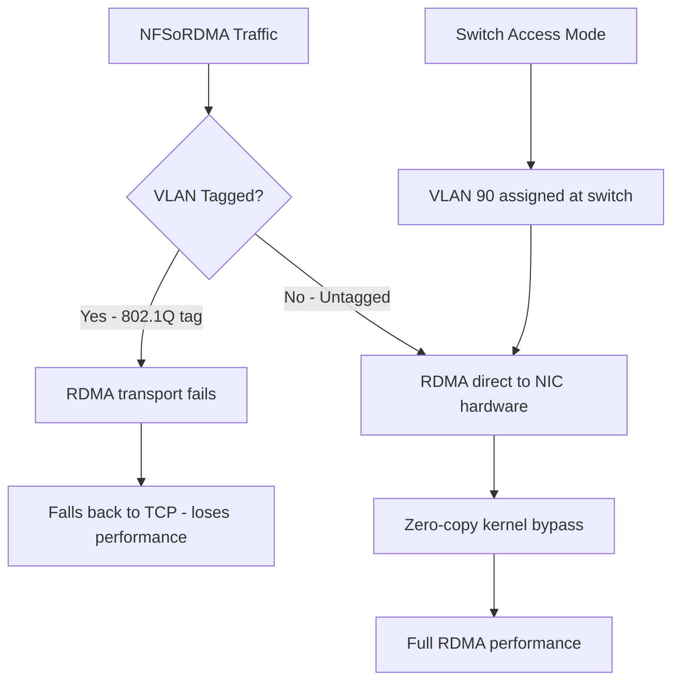

> 💡 **Quick Answer:** NFSoRDMA does not support VLAN-tagged interfaces — the RDMA transport requires a dedicated, untagged NIC. Configure switch ports in **access mode** for the NFS VLAN and assign static IPs directly on the physical interface via NNCP.

## The Problem

NFS over RDMA (NFSoRDMA) provides kernel-bypass, zero-copy data transfers for NFS storage — dramatically reducing latency and CPU overhead. However, it has a critical networking constraint:

- **No VLAN tagging** — RDMA transports (RoCEv1/v2, iWARP) do not support 802.1Q tagged frames on the host side
- **Dedicated NICs required** — you cannot share a VLAN-trunked NIC between NFSoRDMA and other traffic
- **Switch must handle VLAN membership** — ports must be configured in access mode, assigning the NFS VLAN at the switch level
- **MTU must match end-to-end** — RDMA is sensitive to MTU mismatches

Teams often waste hours trying to get NFSoRDMA working over VLAN sub-interfaces, only to find RDMA connections fail silently.

## The Solution

### Step 1: Identify Dedicated RDMA NICs

```bash
# Find RDMA-capable interfaces
oc debug node/worker-0 -- chroot /host rdma link show

# Check for Mellanox ConnectX NICs
oc debug node/worker-0 -- chroot /host lspci | grep -i mellanox

# Verify RDMA device mapping
oc debug node/worker-0 -- chroot /host ls /sys/class/infiniband/
# e.g., mlx5_0, mlx5_1

# Map RDMA device to netdev
oc debug node/worker-0 -- chroot /host \
  rdma link show mlx5_0/1
# Output: link mlx5_0/1 state ACTIVE physical_state LINK_UP netdev ens3f0
```

### Step 2: Configure Dedicated NIC with NNCP

No VLANs — direct IP on the physical interface:

```yaml
apiVersion: nmstate.io/v1
kind: NodeNetworkConfigurationPolicy
metadata:
  name: worker-0-nfsordma
spec:
  nodeSelector:
    kubernetes.io/hostname: worker-0
  desiredState:
    interfaces:
      # Dedicated NIC for NFSoRDMA — NO VLAN tagging
      - name: ens3f0
        type: ethernet
        state: up
        mtu: 9000
        ipv4:
          enabled: true
          dhcp: false
          address:
            - ip: 10.90.0.10
              prefix-length: 24
        ipv6:
          enabled: false
        # Ensure no VLAN sub-interfaces exist on this NIC
    routes:
      config:
        - destination: 10.90.0.0/24
          next-hop-interface: ens3f0
          metric: 100
```

### Step 3: Switch Port Configuration (Access Mode)

The switch handles VLAN membership — not the host:

```text
! Cisco IOS / NX-OS example
interface Ethernet1/10
  description worker-0-nfsordma
  switchport mode access
  switchport access vlan 90
  mtu 9216
  spanning-tree port type edge
  no shutdown

! For multiple workers, repeat per port:
interface Ethernet1/11
  description worker-1-nfsordma
  switchport mode access
  switchport access vlan 90
  mtu 9216
  spanning-tree port type edge
```

### Step 4: Verify RDMA Connectivity

```bash
# Test RDMA connectivity (requires perftest package)
# On NFS server:
ib_write_bw -d mlx5_0

# On worker node:
oc debug node/worker-0 -- chroot /host \
  ib_write_bw -d mlx5_0 10.90.0.1

# Verify NFS mount uses RDMA
oc debug node/worker-0 -- chroot /host \
  mount -t nfs -o rdma,port=20049 10.90.0.1:/export /mnt/nfsordma

# Check RDMA transport is active
oc debug node/worker-0 -- chroot /host \
  cat /proc/fs/nfsd/portlist
# Should show rdma port 20049
```

### Why No VLAN Tagging



## Common Issues

### RDMA connection fails over VLAN interface

```bash
# This will NOT work:
# ip link add link ens3f0 name ens3f0.90 type vlan id 90
# RDMA cannot use VLAN sub-interfaces

# Solution: remove VLAN interface, use access mode on switch
oc debug node/worker-0 -- chroot /host \
  ip link delete ens3f0.90 2>/dev/null

# Ensure NNCP has no VLAN defined on the RDMA NIC
```

### NFS mounts but uses TCP instead of RDMA

```bash
# Verify mount options include rdma and port 20049
mount | grep nfs
# Should show: proto=rdma

# If TCP, check:
# 1. NFS server has RDMA enabled (nfs.conf: rdma=y, rdma-port=20049)
# 2. Client kernel module loaded
oc debug node/worker-0 -- chroot /host \
  modprobe svcrdma xprtrdma

# 3. No firewall blocking RDMA port 20049
```

### MTU mismatch causes RDMA errors

```bash
# All hops must match: NIC, switch port, NFS server
# Check worker
oc debug node/worker-0 -- chroot /host ip link show ens3f0 | grep mtu
# Check NFS server
ssh nfs-server ip link show ens3f0 | grep mtu
# Both must be 9000
```

## Best Practices

- **Dedicate NICs for NFSoRDMA** — never share with VLAN-tagged traffic
- **Configure switch ports in access mode** — VLAN membership at the switch, not the host
- **Use MTU 9000 end-to-end** — NIC, switch, and NFS server must all match
- **Use per-node NNCPs** — each worker gets a unique static IP on the NFS RDMA network
- **Load RDMA kernel modules** — ensure `xprtrdma` and `svcrdma` are loaded on clients and server
- **Test with `ib_write_bw`** before mounting NFS — verify raw RDMA connectivity first

## Key Takeaways

- **NFSoRDMA does not support VLAN tagging** — RDMA transports require untagged frames
- Use **dedicated NICs** with direct IP assignment, no VLAN sub-interfaces
- **Switch access mode** handles VLAN membership — the host sees only untagged frames
- Always verify RDMA connectivity with `ib_write_bw` before configuring NFS mounts
- MTU 9000 must be consistent across **NIC, switch port, and NFS server**
