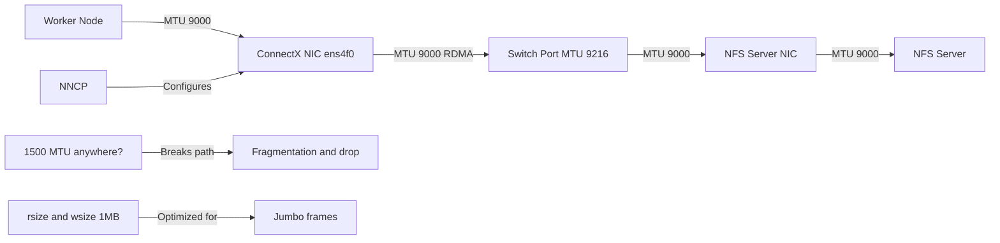

> 💡 **Quick Answer:** Set MTU 9000 on the RDMA-capable NIC via NodeNetworkConfigurationPolicy (NNCP), verify end-to-end jumbo frame support on the switch fabric, and configure NFS mount with `rsize=1048576,wsize=1048576` to fully utilize the larger frame size.

## The Problem

Default 1500-byte MTU creates excessive packet fragmentation for RDMA workloads. NFSoRDMA transfers large sequential blocks (1MB+), and each block gets split into thousands of small frames. This wastes CPU cycles on packet processing and reduces throughput by 30-40% compared to jumbo frames.

## The Solution

Enable 9000 MTU (jumbo frames) end-to-end: switch ports, host NICs, and NFS mount options. Every hop in the path must support the same MTU — a single 1500 MTU link breaks the entire chain.

### NNCP for Jumbo Frame NIC

```yaml
apiVersion: nmstate.io/v1
kind: NodeNetworkConfigurationPolicy
metadata:
  name: rdma-nic-mtu9000
spec:
  nodeSelector:
    node-role.kubernetes.io/worker: ""
    feature.node.kubernetes.io/rdma: "true"
  desiredState:
    interfaces:
      - name: ens4f0  # RDMA-capable NIC
        type: ethernet
        state: up
        mtu: 9000
        ipv4:
          enabled: true
          address:
            - ip: "{{ ansible_host_rdma_ip }}"
              prefix-length: 24
          dhcp: false
        ethtool:
          feature:
            rx-gro: true
            tx-gso: true
            rx-checksum: true
```

### Bonded RDMA Interface with Jumbo Frames

```yaml
apiVersion: nmstate.io/v1
kind: NodeNetworkConfigurationPolicy
metadata:
  name: rdma-bond-mtu9000
spec:
  nodeSelector:
    node-role.kubernetes.io/worker: ""
    feature.node.kubernetes.io/rdma: "true"
  desiredState:
    interfaces:
      - name: bond-rdma
        type: bond
        state: up
        mtu: 9000
        ipv4:
          enabled: true
          address:
            - ip: 10.100.0.11
              prefix-length: 24
          dhcp: false
        link-aggregation:
          mode: 802.3ad
          options:
            miimon: "100"
            xmit_hash_policy: layer3+4
          port:
            - ens4f0
            - ens4f1
      # Member interfaces must also have MTU 9000
      - name: ens4f0
        type: ethernet
        state: up
        mtu: 9000
      - name: ens4f1
        type: ethernet
        state: up
        mtu: 9000
```

### Per-Node Static IP with Jumbo Frames

```yaml
# Worker node 1
apiVersion: nmstate.io/v1
kind: NodeNetworkConfigurationPolicy
metadata:
  name: rdma-mtu9000-worker1
spec:
  nodeSelector:
    kubernetes.io/hostname: worker-1
  desiredState:
    interfaces:
      - name: ens4f0
        type: ethernet
        state: up
        mtu: 9000
        ipv4:
          enabled: true
          address:
            - ip: 10.100.0.11
              prefix-length: 24
          dhcp: false
    routes:
      config:
        - destination: 10.100.0.0/24
          next-hop-interface: ens4f0
---
# Worker node 2
apiVersion: nmstate.io/v1
kind: NodeNetworkConfigurationPolicy
metadata:
  name: rdma-mtu9000-worker2
spec:
  nodeSelector:
    kubernetes.io/hostname: worker-2
  desiredState:
    interfaces:
      - name: ens4f0
        type: ethernet
        state: up
        mtu: 9000
        ipv4:
          enabled: true
          address:
            - ip: 10.100.0.12
              prefix-length: 24
          dhcp: false
    routes:
      config:
        - destination: 10.100.0.0/24
          next-hop-interface: ens4f0
```

### NFS Server MTU Configuration

```bash
# On the NFS server — set MTU 9000 on the RDMA interface
ip link set dev ens4f0 mtu 9000

# Persistent via /etc/sysconfig/network-scripts/ifcfg-ens4f0
# MTU=9000

# Or via NetworkManager
nmcli con mod rdma-conn 802-3-ethernet.mtu 9000
nmcli con up rdma-conn

# Verify
ip link show ens4f0 | grep mtu
# ens4f0: <BROADCAST,MULTICAST,UP,LOWER_UP> mtu 9000 ...
```

### Switch Configuration (Example: Cisco Nexus)

```
! Enable jumbo frames on switch ports connected to RDMA NICs
interface Ethernet1/1-1/4
  description RDMA-NIC-Workers
  switchport mode access
  switchport access vlan 100
  mtu 9216  ! Switch MTU slightly larger to accommodate headers

! Verify
show interface Ethernet1/1 | include MTU
```

### Verify End-to-End MTU

```bash
# From worker node — test jumbo frame path to NFS server
# -M do = don't fragment, -s 8972 = payload (9000 - 28 bytes IP/ICMP header)
ping -M do -s 8972 -c 3 10.100.0.1

# If this fails, there's a 1500 MTU hop in the path
# Reduce size to find the actual MTU:
ping -M do -s 4000 -c 1 10.100.0.1
ping -M do -s 6000 -c 1 10.100.0.1
ping -M do -s 8000 -c 1 10.100.0.1

# Verify RDMA interface MTU on each worker
for node in worker-{1..4}; do
  echo "=== ${node} ==="
  ssh ${node} "ip link show ens4f0 | grep mtu"
done

# Verify NFS mount is using RDMA with proper rsize/wsize
mount | grep nfs
# 10.100.0.1:/export on /mnt/nfs type nfs (rw,proto=rdma,port=20049,rsize=1048576,wsize=1048576)
```

### NFS Mount with Jumbo Frame Optimization

```yaml
# PV mount options optimized for jumbo frames
apiVersion: v1
kind: PersistentVolume
metadata:
  name: nfsordma-jumbo
spec:
  capacity:
    storage: 1Ti
  accessModes:
    - ReadWriteMany
  nfs:
    server: 10.100.0.1
    path: /export/data
  mountOptions:
    - proto=rdma
    - port=20049
    - vers=4.1
    - rsize=1048576   # 1MB read size — matches jumbo frame efficiency
    - wsize=1048576   # 1MB write size
    - hard
    - timeo=600
    - retrans=2
    - nconnect=8      # Multiple RDMA connections for parallelism
```

### Performance Comparison Script

```bash
#!/bin/bash
# Compare throughput: 1500 MTU vs 9000 MTU
echo "=== Testing NFSoRDMA throughput ==="

# Sequential write test
echo "Sequential write (1MB blocks):"
dd if=/dev/zero of=/mnt/nfs/test-jumbo bs=1M count=4096 oflag=direct 2>&1 | tail -1

# Sequential read test
echo "Sequential read (1MB blocks):"
dd if=/mnt/nfs/test-jumbo of=/dev/null bs=1M iflag=direct 2>&1 | tail -1

# Cleanup
rm -f /mnt/nfs/test-jumbo

# Expected improvement with jumbo frames:
# 1500 MTU: ~3-4 GB/s (ConnectX-6 100GbE)
# 9000 MTU: ~5-6 GB/s (30-50% improvement)
# Reason: fewer packets, less CPU overhead, better RDMA efficiency
```



## Common Issues

- **`ping -M do -s 8972` fails** — a hop in the path has MTU < 9000; check switch port MTU and any intermediate routers
- **NNCP stuck in Progressing** — NMState operator may timeout if NIC is in use; drain node first with `kubectl drain`
- **Bond member MTU mismatch** — all bond member interfaces must have MTU ≥ bond MTU; set member MTU before bond MTU
- **NFS mount falls back to TCP** — `proto=rdma` mount option requires NFS server to listen on port 20049; verify `rpcinfo -p | grep 20049`
- **Performance not improving** — verify MTU end-to-end including NFS server; check `ethtool -S ens4f0 | grep drop` for dropped frames

## Best Practices

- Always verify MTU end-to-end before deploying workloads: node → switch → NFS server
- Set switch MTU to 9216 (slightly larger) to accommodate L2 headers
- Use `nconnect=8` with jumbo frames for maximum parallelism
- Set `rsize=1048576,wsize=1048576` — 1MB blocks align with jumbo frame efficiency
- Configure MTU via NNCP (not manually) for persistence across reboots
- Monitor `ethtool -S` counters for frame drops and errors after MTU change
- Drain nodes before applying NNCP MTU changes to avoid disrupting running pods

## Key Takeaways

- Jumbo frames (MTU 9000) improve NFSoRDMA throughput by 30-50%
- Every link in the path must support the same MTU — one 1500 hop breaks it
- NNCP manages MTU persistently on Kubernetes worker nodes
- `ping -M do -s 8972` is the definitive test for end-to-end jumbo support
- Combine with `rsize/wsize=1048576` and `nconnect=8` for maximum performance
