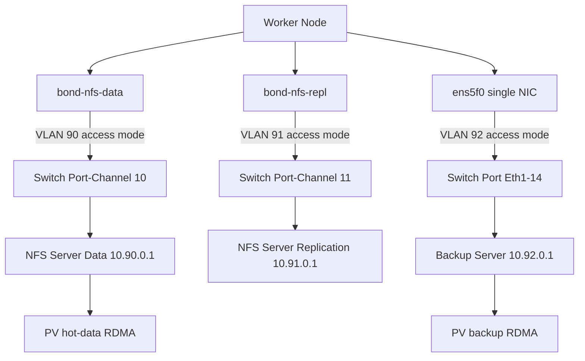

> 💡 **Quick Answer:** Since NFSoRDMA can't use VLAN tagging, each VLAN needs its own **dedicated NIC** (or bonded pair) with the switch port in **access mode** for that VLAN. Multiple VLANs = multiple dedicated NICs.

## The Problem

Production storage environments often need multiple isolated networks:

- **VLAN 90** — Client NFS data (pod read/write)
- **VLAN 91** — NFS server replication (cluster sync)
- **VLAN 92** — Backup traffic (snapshots, DR)

With normal networking, you'd create VLAN sub-interfaces on a single NIC. But NFSoRDMA doesn't support VLAN tagging — so each VLAN requires a dedicated physical NIC with the switch port in access mode for that specific VLAN.

## The Solution

### Step 1: Network Architecture

Map each storage VLAN to a dedicated NIC pair:

| VLAN | Purpose | Worker NICs | Switch Ports | Bond | IP Range |
|------|---------|-------------|-------------|------|----------|
| 90 | NFS client data | ens3f0 + ens3f1 | Eth1/10-11 | bond-nfs-data | 10.90.0.0/24 |
| 91 | NFS replication | ens4f0 + ens4f1 | Eth1/12-13 | bond-nfs-repl | 10.91.0.0/24 |
| 92 | Backup | ens5f0 | Eth1/14 | (none) | 10.92.0.0/24 |

### Step 2: Switch Configuration

Each port or port-channel in access mode for its VLAN:

```text
! VLAN 90 — NFS client data (bonded, LACP)
interface port-channel10
  switchport mode access
  switchport access vlan 90
  mtu 9216
interface Ethernet1/10
  switchport mode access
  switchport access vlan 90
  channel-group 10 mode active
  mtu 9216
interface Ethernet1/11
  switchport mode access
  switchport access vlan 90
  channel-group 10 mode active
  mtu 9216

! VLAN 91 — NFS replication (bonded, LACP)
interface port-channel11
  switchport mode access
  switchport access vlan 91
  mtu 9216
interface Ethernet1/12
  switchport mode access
  switchport access vlan 91
  channel-group 11 mode active
  mtu 9216
interface Ethernet1/13
  switchport mode access
  switchport access vlan 91
  channel-group 11 mode active
  mtu 9216

! VLAN 92 — Backup (single NIC, no bond)
interface Ethernet1/14
  switchport mode access
  switchport access vlan 92
  mtu 9216
```

### Step 3: NNCP for All Storage Networks

```yaml
apiVersion: nmstate.io/v1
kind: NodeNetworkConfigurationPolicy
metadata:
  name: worker-0-nfsordma-multi
spec:
  nodeSelector:
    kubernetes.io/hostname: worker-0
  desiredState:
    interfaces:
      # ==========================================
      # VLAN 90: NFS Client Data (bond)
      # ==========================================
      - name: ens3f0
        type: ethernet
        state: up
        mtu: 9000
        ipv4:
          enabled: false
        ipv6:
          enabled: false
      - name: ens3f1
        type: ethernet
        state: up
        mtu: 9000
        ipv4:
          enabled: false
        ipv6:
          enabled: false
      - name: bond-nfs-data
        type: bond
        state: up
        mtu: 9000
        ipv4:
          enabled: true
          dhcp: false
          address:
            - ip: 10.90.0.10
              prefix-length: 24
        ipv6:
          enabled: false
        link-aggregation:
          mode: 802.3ad
          options:
            miimon: "100"
            lacp_rate: "fast"
          port:
            - ens3f0
            - ens3f1

      # ==========================================
      # VLAN 91: NFS Replication (bond)
      # ==========================================
      - name: ens4f0
        type: ethernet
        state: up
        mtu: 9000
        ipv4:
          enabled: false
        ipv6:
          enabled: false
      - name: ens4f1
        type: ethernet
        state: up
        mtu: 9000
        ipv4:
          enabled: false
        ipv6:
          enabled: false
      - name: bond-nfs-repl
        type: bond
        state: up
        mtu: 9000
        ipv4:
          enabled: true
          dhcp: false
          address:
            - ip: 10.91.0.10
              prefix-length: 24
        ipv6:
          enabled: false
        link-aggregation:
          mode: 802.3ad
          options:
            miimon: "100"
            lacp_rate: "fast"
          port:
            - ens4f0
            - ens4f1

      # ==========================================
      # VLAN 92: Backup (single NIC, no bond)
      # ==========================================
      - name: ens5f0
        type: ethernet
        state: up
        mtu: 9000
        ipv4:
          enabled: true
          dhcp: false
          address:
            - ip: 10.92.0.10
              prefix-length: 24
        ipv6:
          enabled: false

    routes:
      config:
        - destination: 10.90.0.0/24
          next-hop-interface: bond-nfs-data
          metric: 100
        - destination: 10.91.0.0/24
          next-hop-interface: bond-nfs-repl
          metric: 100
        - destination: 10.92.0.0/24
          next-hop-interface: ens5f0
          metric: 100
```

### Step 4: PVs for Different Storage Tiers

```yaml
# High-performance data PV (VLAN 90 — bonded RDMA)
apiVersion: v1
kind: PersistentVolume
metadata:
  name: nfsordma-hot-data
spec:
  capacity:
    storage: 5Ti
  accessModes:
    - ReadWriteMany
  nfs:
    server: 10.90.0.1
    path: /exports/hot
  mountOptions:
    - rdma
    - port=20049
    - vers=4.2
    - rsize=1048576
    - wsize=1048576
---
# Backup PV (VLAN 92 — single NIC, lower priority)
apiVersion: v1
kind: PersistentVolume
metadata:
  name: nfsordma-backup
spec:
  capacity:
    storage: 20Ti
  accessModes:
    - ReadWriteMany
  nfs:
    server: 10.92.0.1
    path: /exports/backup
  mountOptions:
    - rdma
    - port=20049
    - vers=4.2
    - rsize=524288
    - wsize=524288
```

### Step 5: Verify All Paths

```bash
# Check all bonds and NICs
for iface in bond-nfs-data bond-nfs-repl ens5f0; do
  echo "=== $iface ==="
  oc debug node/worker-0 -- chroot /host ip addr show $iface | grep -E "inet |mtu"
done

# Test RDMA on each path
for server in 10.90.0.1 10.91.0.1 10.92.0.1; do
  echo "=== RDMA to $server ==="
  oc debug node/worker-0 -- chroot /host \
    ib_write_bw -d mlx5_0 --report_gbits $server 2>&1 | tail -1
done
```



## Common Issues

### Running out of NIC ports

```text
# Each VLAN needs dedicated NICs — this adds up fast
# Solutions:
# 1. Use dual-port NICs (ConnectX-5 has 2 ports per card)
# 2. Bond only critical paths (data), single NIC for backup
# 3. Use RDMA only for hot data, TCP NFS for cold/backup
# 4. Consider fewer VLANs with firewall rules instead
```

### Different RDMA devices per bond

```bash
# Each NIC pair maps to different RDMA devices
# ens3f0/ens3f1 → mlx5_0/mlx5_1 (VLAN 90 data)
# ens4f0/ens4f1 → mlx5_2/mlx5_3 (VLAN 91 replication)
# ens5f0        → mlx5_4        (VLAN 92 backup)

# Map them:
oc debug node/worker-0 -- chroot /host rdma link show
```

### Switch port-channel VLAN mismatch

```bash
# All member ports must be in the SAME access VLAN
# Mismatched VLANs on port-channel members = suspended ports

# Verify on switch:
# show port-channel summary
# show interface Ethernet1/10 switchport
```

## Best Practices

- **One dedicated NIC (or bond) per VLAN** — this is the fundamental NFSoRDMA constraint
- **Bond critical paths, single-NIC for non-critical** — save NIC slots by bonding only data and replication
- **Use dual-port RDMA NICs** — ConnectX-5/6 dual-port cards give 2 ports per PCIe slot
- **Consistent naming** — use descriptive bond names (`bond-nfs-data`, `bond-nfs-repl`) not generic (`bond0`, `bond1`)
- **Separate routing tables if needed** — use policy-based routing to ensure NFS traffic exits the correct interface
- **Consider TCP NFS for backup** — RDMA overhead may not be worth it for sequential backup workloads

## Key Takeaways

- Multiple VLANs with NFSoRDMA require **multiple dedicated NICs** — one per VLAN
- Each switch port or port-channel must be in **access mode** for its specific VLAN
- **Bond critical paths** (data, replication) and use single NICs for lower-priority traffic (backup)
- This architecture requires more NIC ports — plan PCIe slots and use **dual-port RDMA cards**
- All traffic remains **untagged on the host** — the switch handles all VLAN membership
