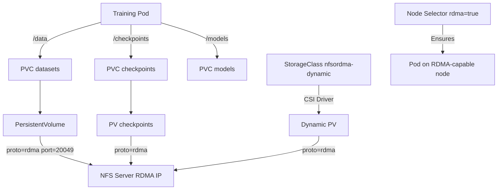

> 💡 **Quick Answer:** Create a PersistentVolume with `nfs.server` pointing to the RDMA IP and `mountOptions: [proto=rdma, port=20049, vers=4.1]` to get NFS storage over RDMA with ReadWriteMany access.

## The Problem

Standard NFS over TCP wastes CPU on protocol overhead and maxes out at 3-4 GB/s even on 100GbE. AI training workloads need shared storage with near-line-rate throughput and low latency. You need to expose NFSoRDMA storage as Kubernetes PersistentVolumes that pods can consume transparently.

## The Solution

Create PVs with RDMA mount options that bypass TCP/IP, delivering 10-12 GB/s throughput with microsecond latency. Use static PVs for dedicated shares or the NFS CSI driver for dynamic provisioning.

### Static PV with RDMA Mount Options

```yaml
apiVersion: v1
kind: PersistentVolume
metadata:
  name: nfsordma-data
  labels:
    storage-type: rdma
    purpose: ai-training
spec:
  capacity:
    storage: 10Ti
  accessModes:
    - ReadWriteMany
  persistentVolumeReclaimPolicy: Retain
  nfs:
    server: 10.100.0.1      # RDMA interface IP of NFS server
    path: /export/ai-data
  mountOptions:
    - proto=rdma
    - port=20049             # NFSoRDMA port (not standard 2049)
    - vers=4.1
    - rsize=1048576          # 1MB read blocks
    - wsize=1048576          # 1MB write blocks
    - hard
    - timeo=600
    - retrans=2
    - nconnect=8             # 8 parallel RDMA connections
---
apiVersion: v1
kind: PersistentVolumeClaim
metadata:
  name: ai-training-data
  namespace: ai-workloads
spec:
  accessModes:
    - ReadWriteMany
  resources:
    requests:
      storage: 10Ti
  selector:
    matchLabels:
      storage-type: rdma
      purpose: ai-training
```

### Multiple PVs for Different Workloads

```yaml
# Dataset storage — large sequential reads
apiVersion: v1
kind: PersistentVolume
metadata:
  name: nfsordma-datasets
  labels:
    storage-type: rdma
    purpose: datasets
spec:
  capacity:
    storage: 50Ti
  accessModes:
    - ReadWriteMany
  persistentVolumeReclaimPolicy: Retain
  nfs:
    server: 10.100.0.1
    path: /export/datasets
  mountOptions:
    - proto=rdma
    - port=20049
    - vers=4.1
    - rsize=1048576
    - wsize=1048576
    - hard
    - nconnect=16            # More connections for parallel reads
    - noatime                # Skip access time updates
---
# Checkpoint storage — frequent small writes
apiVersion: v1
kind: PersistentVolume
metadata:
  name: nfsordma-checkpoints
  labels:
    storage-type: rdma
    purpose: checkpoints
spec:
  capacity:
    storage: 5Ti
  accessModes:
    - ReadWriteMany
  persistentVolumeReclaimPolicy: Retain
  nfs:
    server: 10.100.0.1
    path: /export/checkpoints
  mountOptions:
    - proto=rdma
    - port=20049
    - vers=4.1
    - rsize=1048576
    - wsize=1048576
    - hard
    - sync                   # Sync writes for checkpoint integrity
    - nconnect=4
---
# Model output storage
apiVersion: v1
kind: PersistentVolume
metadata:
  name: nfsordma-models
  labels:
    storage-type: rdma
    purpose: models
spec:
  capacity:
    storage: 2Ti
  accessModes:
    - ReadWriteMany
  persistentVolumeReclaimPolicy: Retain
  nfs:
    server: 10.100.0.1
    path: /export/models
  mountOptions:
    - proto=rdma
    - port=20049
    - vers=4.1
    - rsize=1048576
    - wsize=1048576
    - hard
    - nconnect=8
```

### PVCs for AI Training Pods

```yaml
apiVersion: v1
kind: PersistentVolumeClaim
metadata:
  name: datasets
  namespace: ai-workloads
spec:
  accessModes:
    - ReadWriteMany
  resources:
    requests:
      storage: 50Ti
  selector:
    matchLabels:
      storage-type: rdma
      purpose: datasets
---
apiVersion: v1
kind: PersistentVolumeClaim
metadata:
  name: checkpoints
  namespace: ai-workloads
spec:
  accessModes:
    - ReadWriteMany
  resources:
    requests:
      storage: 5Ti
  selector:
    matchLabels:
      storage-type: rdma
      purpose: checkpoints
---
apiVersion: v1
kind: PersistentVolumeClaim
metadata:
  name: models
  namespace: ai-workloads
spec:
  accessModes:
    - ReadWriteMany
  resources:
    requests:
      storage: 2Ti
  selector:
    matchLabels:
      storage-type: rdma
      purpose: models
```

### Pod Using NFSoRDMA Volumes

```yaml
apiVersion: v1
kind: Pod
metadata:
  name: training-job
  namespace: ai-workloads
spec:
  nodeSelector:
    feature.node.kubernetes.io/rdma: "true"
  containers:
    - name: trainer
      image: nvcr.io/nvidia/pytorch:24.03-py3
      command: ["torchrun", "--nproc_per_node=8", "train.py"]
      resources:
        limits:
          nvidia.com/gpu: 8
      volumeMounts:
        - name: datasets
          mountPath: /data
          readOnly: true
        - name: checkpoints
          mountPath: /checkpoints
        - name: models
          mountPath: /models
  volumes:
    - name: datasets
      persistentVolumeClaim:
        claimName: datasets
    - name: checkpoints
      persistentVolumeClaim:
        claimName: checkpoints
    - name: models
      persistentVolumeClaim:
        claimName: models
```

### Dynamic Provisioning with NFS CSI Driver

```bash
# Install NFS CSI driver
helm repo add csi-driver-nfs https://raw.githubusercontent.com/kubernetes-csi/csi-driver-nfs/master/charts
helm install csi-driver-nfs csi-driver-nfs/csi-driver-nfs \
  --namespace kube-system \
  --set driver.mountPermissions=0777
```

```yaml
apiVersion: storage.k8s.io/v1
kind: StorageClass
metadata:
  name: nfsordma-dynamic
provisioner: nfs.csi.k8s.io
parameters:
  server: 10.100.0.1
  share: /export/dynamic
mountOptions:
  - proto=rdma
  - port=20049
  - vers=4.1
  - rsize=1048576
  - wsize=1048576
  - hard
  - nconnect=8
reclaimPolicy: Delete
volumeBindingMode: Immediate
allowVolumeExpansion: true
---
# Dynamic PVC — CSI driver creates subdirectory automatically
apiVersion: v1
kind: PersistentVolumeClaim
metadata:
  name: dynamic-rdma-storage
  namespace: ai-workloads
spec:
  storageClassName: nfsordma-dynamic
  accessModes:
    - ReadWriteMany
  resources:
    requests:
      storage: 500Gi
```

### Verify RDMA Mount

```bash
# Check mount is using RDMA transport
kubectl exec -n ai-workloads training-job -- mount | grep nfs
# 10.100.0.1:/export/datasets on /data type nfs4 (ro,proto=rdma,port=20049,...)

# Verify RDMA connections
kubectl exec -n ai-workloads training-job -- cat /proc/mounts | grep rdma

# Performance test from inside the pod
kubectl exec -n ai-workloads training-job -- \
  dd if=/data/test-file of=/dev/null bs=1M count=4096 iflag=direct
# Expected: 8-12 GB/s with RDMA + jumbo frames

# Check NFS stats
kubectl exec -n ai-workloads training-job -- nfsstat -c
```



## Common Issues

- **Mount fails with `proto=rdma`** — node must have RDMA kernel modules loaded (`rdma_cm`, `ib_core`); verify with `lsmod | grep rdma`
- **PVC stuck Pending** — check label selectors match between PV and PVC; verify PV is `Available` not `Released`
- **Slow performance despite RDMA** — check `nconnect` value; verify jumbo frames (MTU 9000) end-to-end; check `noatime` for read-heavy workloads
- **Permission denied on mount** — NFS server exports must allow the node IPs; check `/etc/exports` on NFS server
- **Pod scheduled on non-RDMA node** — add `nodeSelector` with `feature.node.kubernetes.io/rdma: "true"` to ensure RDMA-capable placement

## Best Practices

- Use `proto=rdma,port=20049` — standard NFS port 2049 uses TCP
- Set `nconnect=8` minimum, `nconnect=16` for dataset reads with many workers
- Always use `hard` mount — `soft` mounts can cause silent data corruption
- Separate PVs by purpose (datasets, checkpoints, models) for different mount options
- Use `noatime` for read-heavy workloads to reduce metadata overhead
- Use `sync` for checkpoint PVs to ensure write durability
- Label PVs with `storage-type: rdma` for selector-based PVC binding
- Add `nodeSelector` to pods to ensure scheduling on RDMA-capable nodes

## Key Takeaways

- NFSoRDMA PVs use `proto=rdma,port=20049` mount options for RDMA transport
- ReadWriteMany access enables shared storage across multi-node training jobs
- Static PVs for dedicated shares, NFS CSI driver for dynamic provisioning
- `nconnect` multiplies parallelism, `rsize/wsize=1048576` optimizes block size
- Always pair with jumbo frames (MTU 9000) and RDMA node selectors
