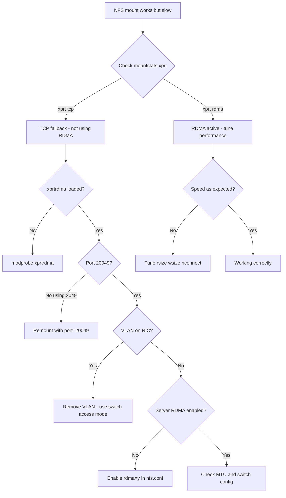

> 💡 **Quick Answer:** Check `mountstats` for `xprt: rdma` (not `tcp`). If RDMA fails, verify: 1) `xprtrdma` module loaded, 2) NFS server port 20049 RDMA enabled, 3) no VLAN tagging on the interface, 4) MTU matches end-to-end.

## The Problem

NFSoRDMA fails silently — NFS mounts succeed but fall back to TCP without any error. You see normal NFS operation but at TCP speeds instead of RDMA speeds. Common scenarios:

- **Mount works but uses TCP** — most common issue, hard to detect
- **RDMA connection refused** — NFS server not configured for RDMA
- **Intermittent RDMA failures** — MTU mismatch, switch misconfiguration
- **Performance below expectations** — wrong rsize/wsize, congestion, buffer issues

## The Solution

### Step 1: Diagnostic Checklist

Run through this checklist systematically:

```bash
# 1. Is xprtrdma module loaded?
oc debug node/worker-0 -- chroot /host lsmod | grep rdma
# Expected: xprtrdma, ib_core, mlx5_ib, rdma_cm

# 2. Are RDMA devices present?
oc debug node/worker-0 -- chroot /host rdma link show
# Expected: link mlx5_0/1 state ACTIVE netdev ens3f0

# 3. Is the NIC RDMA-capable and up?
oc debug node/worker-0 -- chroot /host ibstat
# Expected: State: Active, Physical state: LinkUp

# 4. Is there a VLAN sub-interface? (should NOT exist)
oc debug node/worker-0 -- chroot /host ip -d link show | grep vlan
# Expected: nothing on RDMA interfaces

# 5. Does MTU match?
oc debug node/worker-0 -- chroot /host ip link show ens3f0 | grep mtu
# Expected: mtu 9000

# 6. Is the NFS server listening on RDMA?
oc debug node/worker-0 -- chroot /host \
  rpcinfo -T rdma 10.90.0.1 nfs 4
# Expected: program 100003 version 4 ready and waiting

# 7. Can RDMA reach the server?
oc debug node/worker-0 -- chroot /host \
  ib_write_lat -d mlx5_0 10.90.0.1
# Expected: latency ~1-2 microseconds
```

### Step 2: Detect TCP Fallback

The most critical check — is NFS actually using RDMA?

```bash
# Check mountstats for transport type
oc debug node/worker-0 -- chroot /host \
  cat /proc/self/mountstats | grep -A20 "10.90.0.1"

# Look for this line:
# xprt: rdma 0 0 ... ← RDMA is working
# xprt: tcp 0 ... ← fell back to TCP!

# Quick one-liner
oc debug node/worker-0 -- chroot /host \
  grep -E "xprt:" /proc/self/mountstats
```

### Step 3: Fix Common TCP Fallback Causes

```bash
# Cause 1: Module not loaded
oc debug node/worker-0 -- chroot /host modprobe xprtrdma
# Permanent fix: MachineConfig (see nfsordma-worker-node-setup)

# Cause 2: Wrong port
# Must use port=20049 for RDMA, NOT default 2049
mount -t nfs4 -o rdma,port=20049 10.90.0.1:/export /mnt

# Cause 3: VLAN interface instead of dedicated NIC
# Remove any VLAN sub-interface on the RDMA NIC
ip link delete ens3f0.90 2>/dev/null
# Use switch access mode instead

# Cause 4: NFS server not configured for RDMA
# On NFS server, check /etc/nfs.conf:
# [nfsd]
# rdma=y
# rdma-port=20049
```

### Step 4: Performance Benchmarking

```bash
# Raw RDMA bandwidth test
# Server side:
ib_write_bw -d mlx5_0 --report_gbits

# Client side:
oc debug node/worker-0 -- chroot /host \
  ib_write_bw -d mlx5_0 --report_gbits 10.90.0.1
# Expected: 90-100 Gbps for ConnectX-6, 40-50 for ConnectX-5

# Raw RDMA latency test
# Server: ib_write_lat -d mlx5_0
# Client:
oc debug node/worker-0 -- chroot /host \
  ib_write_lat -d mlx5_0 10.90.0.1
# Expected: 1-2 microseconds

# NFS over RDMA throughput (sequential write)
oc debug node/worker-0 -- chroot /host \
  dd if=/dev/zero of=/mnt/nfsordma/bench bs=1M count=4096 oflag=direct
# Expected: 2-5 GB/s (vs 0.5-1 GB/s over TCP)

# NFS over RDMA throughput (fio random read)
oc debug node/worker-0 -- chroot /host \
  fio --name=randread --ioengine=libaio --direct=1 \
  --bs=4k --iodepth=64 --numjobs=4 \
  --rw=randread --size=1G \
  --directory=/mnt/nfsordma \
  --group_reporting
```

### Step 5: Performance Tuning

```bash
# Optimal NFS mount options for RDMA
mount -t nfs4 -o \
  rdma,\
  port=20049,\
  vers=4.2,\
  rsize=1048576,\
  wsize=1048576,\
  hard,\
  nointr,\
  nconnect=8 \
  10.90.0.1:/exports/data /mnt/nfsordma

# nconnect=8 creates multiple RDMA connections
# rsize/wsize=1M maximizes per-operation transfer size
```

```yaml
# PV with optimized mount options
apiVersion: v1
kind: PersistentVolume
metadata:
  name: nfsordma-tuned
spec:
  capacity:
    storage: 1Ti
  accessModes:
    - ReadWriteMany
  nfs:
    server: 10.90.0.1
    path: /exports/data
  mountOptions:
    - rdma
    - port=20049
    - vers=4.2
    - rsize=1048576
    - wsize=1048576
    - hard
    - nconnect=8
```

### Step 6: Monitor RDMA Health

```bash
# Check RDMA error counters
oc debug node/worker-0 -- chroot /host \
  rdma statistic show link mlx5_0/1

# Check for packet drops
oc debug node/worker-0 -- chroot /host \
  ethtool -S ens3f0 | grep -E "drop|err|discard"

# Monitor NFS RDMA statistics
oc debug node/worker-0 -- chroot /host \
  nfsstat -c | head -20

# Watch for RDMA connection resets
oc debug node/worker-0 -- chroot /host \
  dmesg | grep -i rdma | tail -20
```

### Troubleshooting Decision Tree



## Common Issues

### RDMA connection resets under load

```bash
# Check for RNR (Receiver Not Ready) retries
oc debug node/worker-0 -- chroot /host \
  rdma statistic show link mlx5_0/1 | grep rnr

# Increase RNR retry count
oc debug node/worker-0 -- chroot /host \
  sysctl -w net.rdma.rnr_retry=7

# Check for congestion
oc debug node/worker-0 -- chroot /host \
  mlnx_qos -i ens3f0
```

### nconnect not supported

```bash
# nconnect requires kernel 5.3+ and NFSv4.x
# Check kernel version
oc debug node/worker-0 -- chroot /host uname -r

# If nconnect is not available, increase rsize/wsize instead
# and use multiple PV mounts from different export paths
```

### RDMA works node-to-node but not to NFS server

```bash
# Switch may have different VLAN config for server ports
# Verify server port is also in access mode for the same VLAN

# Check ARP resolution
oc debug node/worker-0 -- chroot /host \
  arping -I ens3f0 10.90.0.1

# Check for firewall blocking RDMA
# RDMA uses different ports than TCP NFS
# Ensure port 20049 (NFS RDMA) is open
```

## Best Practices

- **Always verify with mountstats** — the only reliable way to confirm RDMA transport
- **Benchmark before and after** — measure TCP NFS first, then RDMA, to quantify improvement
- **Use `nconnect=8`** for multi-stream parallelism — multiplies throughput for concurrent I/O
- **Set `rsize=1048576` and `wsize=1048576`** — 1MB buffers maximize RDMA transfer efficiency
- **Monitor RDMA error counters** — `rdma statistic show` catches hardware issues early
- **Check `dmesg` for RDMA errors** — silent failures often log kernel messages
- **Keep a TCP NFS backup path** — if RDMA fails, workloads can fall back to TCP NFS on the management network

## Key Takeaways

- NFSoRDMA **silently falls back to TCP** — always verify with `/proc/self/mountstats`
- The diagnostic checklist: module loaded → RDMA devices present → no VLAN tagging → MTU match → server port 20049
- **`nconnect=8`** with large `rsize`/`wsize` maximizes RDMA throughput
- Raw RDMA should deliver **90-100 Gbps** (ConnectX-6); NFS over RDMA achieves **2-5 GB/s** at the application level
- Monitor `rdma statistic show` and `ethtool -S` for hardware-level errors
- TCP fallback is the most common problem — caused by missing module, wrong port, VLAN tagging, or server misconfiguration
