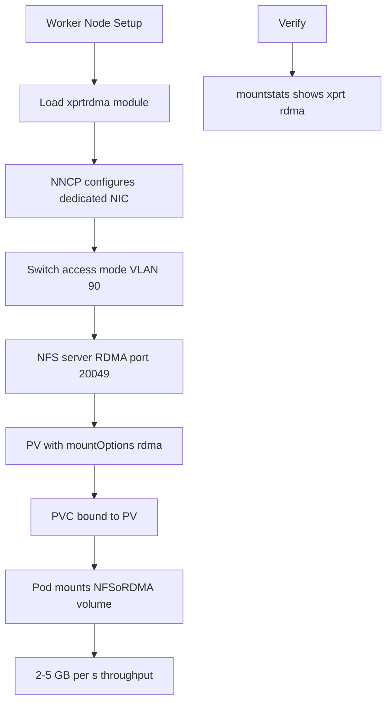

> 💡 **Quick Answer:** Load `xprtrdma` kernel module on workers, mount NFS with `-o rdma,port=20049`, and create PersistentVolumes targeting the RDMA mount. Verify RDMA transport with `/proc/self/mountstats`.

## The Problem

After configuring dedicated NICs and switch access mode for NFSoRDMA, the worker nodes need:

- **RDMA kernel modules** loaded — `xprtrdma` for the NFS client transport
- **NFS client configured for RDMA** — default NFS mounts use TCP, not RDMA
- **PersistentVolumes using RDMA** — Kubernetes workloads must use the RDMA-backed NFS mount
- **Verification** — confirming traffic actually uses RDMA, not falling back to TCP

## The Solution

### Step 1: Load RDMA Kernel Modules

Create a MachineConfig to load modules at boot (OpenShift) or a DaemonSet for vanilla Kubernetes:

```yaml
# OpenShift MachineConfig
apiVersion: machineconfiguration.openshift.io/v1
kind: MachineConfig
metadata:
  name: 99-worker-rdma-modules
  labels:
    machineconfiguration.openshift.io/role: worker
spec:
  config:
    ignition:
      version: 3.2.0
    storage:
      files:
        - path: /etc/modules-load.d/rdma-nfs.conf
          mode: 0644
          contents:
            source: data:text/plain;charset=utf-8,xprtrdma%0Asvcrdma%0Ardma_ucm%0Ardma_cm%0Aib_ipoib
```

```yaml
# Vanilla Kubernetes DaemonSet
apiVersion: apps/v1
kind: DaemonSet
metadata:
  name: rdma-module-loader
  namespace: kube-system
spec:
  selector:
    matchLabels:
      app: rdma-modules
  template:
    metadata:
      labels:
        app: rdma-modules
    spec:
      nodeSelector:
        node-role.kubernetes.io/worker: ""
      hostNetwork: true
      hostPID: true
      initContainers:
        - name: load-modules
          image: registry.access.redhat.com/ubi9/ubi-minimal:latest
          securityContext:
            privileged: true
          command:
            - /bin/sh
            - -c
            - |
              nsenter -t 1 -m -u -i -n -- modprobe xprtrdma
              nsenter -t 1 -m -u -i -n -- modprobe svcrdma
              echo "RDMA modules loaded"
      containers:
        - name: sleep
          image: registry.access.redhat.com/ubi9/ubi-minimal:latest
          command: ["sleep", "infinity"]
```

### Step 2: NFS Server RDMA Configuration

Ensure the NFS server exports over RDMA:

```bash
# /etc/nfs.conf on NFS server
[nfsd]
rdma=y
rdma-port=20049
vers3=n
vers4=y
vers4.1=y
vers4.2=y

# Restart NFS server
systemctl restart nfs-server

# Verify RDMA listening
cat /proc/fs/nfsd/portlist
# Should show: rdma 20049
```

### Step 3: Manual RDMA Mount Test

Test on a worker before creating PVs:

```bash
# Mount NFS over RDMA
oc debug node/worker-0 -- chroot /host \
  mkdir -p /mnt/nfsordma

oc debug node/worker-0 -- chroot /host \
  mount -t nfs4 -o rdma,port=20049,vers=4.2 \
  10.90.0.1:/exports/data /mnt/nfsordma

# Verify RDMA transport
oc debug node/worker-0 -- chroot /host \
  grep -A5 "10.90.0.1" /proc/self/mountstats | grep xprt
# Should show: xprt: rdma ... (not tcp)

# Benchmark
oc debug node/worker-0 -- chroot /host \
  dd if=/dev/zero of=/mnt/nfsordma/test bs=1M count=1024 oflag=direct
# Expected: 2-5 GB/s with RDMA vs 500MB-1GB/s with TCP
```

### Step 4: PersistentVolume with RDMA NFS

```yaml
apiVersion: v1
kind: PersistentVolume
metadata:
  name: nfsordma-data
spec:
  capacity:
    storage: 1Ti
  accessModes:
    - ReadWriteMany
  persistentVolumeReclaimPolicy: Retain
  nfs:
    server: 10.90.0.1
    path: /exports/data
  mountOptions:
    - rdma
    - port=20049
    - vers=4.2
    - hard
    - rsize=1048576
    - wsize=1048576
---
apiVersion: v1
kind: PersistentVolumeClaim
metadata:
  name: training-data
  namespace: ai-workloads
spec:
  accessModes:
    - ReadWriteMany
  resources:
    requests:
      storage: 1Ti
  volumeName: nfsordma-data
---
apiVersion: v1
kind: Pod
metadata:
  name: gpu-training
  namespace: ai-workloads
spec:
  containers:
    - name: training
      image: nvcr.io/nvidia/pytorch:24.01-py3
      volumeMounts:
        - name: data
          mountPath: /data
      resources:
        requests:
          nvidia.com/gpu: 1
  volumes:
    - name: data
      persistentVolumeClaim:
        claimName: training-data
```

### Step 5: Verify RDMA in Running Pods

```bash
# Check mount options inside the pod
oc exec gpu-training -n ai-workloads -- mount | grep nfs
# Should show: proto=rdma

# Check mountstats from the node
NODE=$(oc get pod gpu-training -n ai-workloads -o jsonpath='{.spec.nodeName}')
oc debug node/$NODE -- chroot /host \
  grep -A10 "10.90.0.1" /proc/self/mountstats
```



## Common Issues

### Mount succeeds but uses TCP

```bash
# Check if xprtrdma module is loaded
oc debug node/worker-0 -- chroot /host lsmod | grep rdma

# Check NFS server is listening on RDMA port
# From worker:
oc debug node/worker-0 -- chroot /host \
  rpcinfo -p 10.90.0.1 | grep 20049

# Verify mountOptions include both 'rdma' AND 'port=20049'
oc get pv nfsordma-data -o yaml | grep -A5 mountOptions
```

### Pod cannot mount NFS RDMA volume

```bash
# The kubelet mounts NFS — it needs RDMA modules on the node
# Verify modules are loaded on the node running the pod
NODE=$(oc get pod <pod> -o jsonpath='{.spec.nodeName}')
oc debug node/$NODE -- chroot /host lsmod | grep xprtrdma

# Check kubelet mount logs
oc debug node/$NODE -- chroot /host \
  journalctl -u kubelet --since "5 min ago" | grep -i nfs
```

### rsize/wsize not applied

```yaml
# Ensure mountOptions are in the PV, not PVC
mountOptions:
  - rdma
  - port=20049
  - rsize=1048576   # 1MB read buffer
  - wsize=1048576   # 1MB write buffer
  - vers=4.2
```

## Best Practices

- **Load RDMA modules at boot** — use MachineConfig (OpenShift) or DaemonSet initContainer
- **Always specify `port=20049`** — the default NFS port (2049) uses TCP
- **Use large rsize/wsize** — 1MB buffers maximize RDMA throughput
- **Set `hard` mount option** — prevents data corruption on transient network issues
- **Verify with mountstats** — confirm `xprt: rdma` after every mount
- **Use NFSv4.2** — required for server-side copy and other RDMA optimizations
- **Benchmark before production** — `dd` or `fio` to confirm RDMA throughput (should be 2-5x TCP)

## Key Takeaways

- Worker nodes need `xprtrdma` kernel module for NFS RDMA client transport
- NFS server must listen on **port 20049** with `rdma=y` in nfs.conf
- PersistentVolumes use **`mountOptions: [rdma, port=20049]`** to enable RDMA transport
- Always verify with `/proc/self/mountstats` — look for `xprt: rdma`, not `xprt: tcp`
- NFSoRDMA delivers **2-5x throughput** compared to NFS over TCP — critical for AI/GPU workloads
