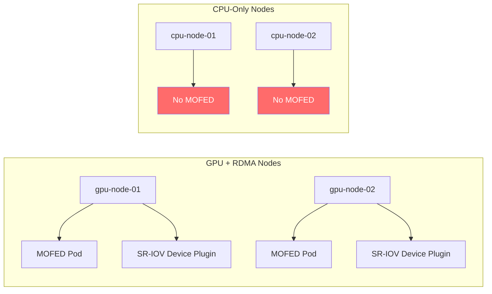

> 💡 **Quick Answer:** Use `nodeAffinity` in the NicClusterPolicy to target only nodes with Mellanox NICs using NFD labels like `feature.node.kubernetes.io/pci-15b3.present=true`, preventing MOFED DaemonSets from running on non-RDMA nodes.

## The Problem

In heterogeneous clusters, you have a mix of GPU nodes with Mellanox NICs and regular compute nodes without them. Without node selection, the MOFED DaemonSet attempts to install RDMA drivers on every node, causing:

- **Failed pods on non-RDMA nodes** — no compatible hardware
- **Wasted resources** — unnecessary driver compilation attempts
- **Noisy alerts** — constant CrashLoopBackOff on nodes that don't need MOFED

## The Solution

### Step 1: Identify RDMA-Capable Nodes

```bash
# Check NFD labels for Mellanox NICs (vendor ID 15b3)
kubectl get nodes -o json | jq -r '
  .items[] | select(.metadata.labels["feature.node.kubernetes.io/pci-15b3.present"] == "true") |
  .metadata.name
'

# List all network-related NFD labels
kubectl get node <gpu-node> -o json | jq '
  .metadata.labels | to_entries[] | select(.key | contains("network")) | {(.key): .value}
'
```

### Step 2: Configure NicClusterPolicy with Node Selection

```yaml
apiVersion: mellanox.com/v1alpha1
kind: NicClusterPolicy
metadata:
  name: nic-cluster-policy
spec:
  ofedDriver:
    image: mofed
    repository: nvcr.io/nvstaging/mellanox
    version: "24.07-0.6.1.0"
    nodeAffinity:
      requiredDuringSchedulingIgnoredDuringExecution:
        nodeSelectorTerms:
          - matchExpressions:
              # Only nodes with Mellanox NICs
              - key: feature.node.kubernetes.io/pci-15b3.present
                operator: In
                values: ["true"]
              # Exclude control plane nodes
              - key: node-role.kubernetes.io/control-plane
                operator: DoesNotExist
    startupProbe:
      initialDelaySeconds: 10
      periodSeconds: 20
  sriovDevicePlugin:
    image: sriov-network-device-plugin
    repository: ghcr.io/k8snetworkplumbingwg
    version: "v3.7.0"
    nodeAffinity:
      requiredDuringSchedulingIgnoredDuringExecution:
        nodeSelectorTerms:
          - matchExpressions:
              - key: feature.node.kubernetes.io/network-sriov.capable
                operator: In
                values: ["true"]
    config: |
      {
        "resourceList": [
          {
            "resourcePrefix": "nvidia.com",
            "resourceName": "rdma_vf",
            "selectors": {
              "vendors": ["15b3"],
              "isRdma": true
            }
          }
        ]
      }
  secondaryNetwork:
    multus:
      image: multus-cni
      repository: ghcr.io/k8snetworkplumbingwg
      version: "v4.1.0"
    # Multus runs on ALL nodes (needed for pod networking)
```

### Step 3: Label Nodes for Specific Roles

```bash
# Label GPU+RDMA nodes
kubectl label node gpu-node-01 nvidia.com/rdma-capable=true
kubectl label node gpu-node-02 nvidia.com/rdma-capable=true

# Use custom labels in NicClusterPolicy
```

```yaml
# Using custom labels for finer control
ofedDriver:
  nodeAffinity:
    requiredDuringSchedulingIgnoredDuringExecution:
      nodeSelectorTerms:
        - matchExpressions:
            - key: nvidia.com/rdma-capable
              operator: In
              values: ["true"]
```

### Step 4: Verify Correct Scheduling

```bash
# MOFED pods should only run on RDMA nodes
kubectl get pods -n nvidia-network-operator -l app=mofed-ubuntu -o wide

# Device plugin should only run on SR-IOV nodes
kubectl get pods -n nvidia-network-operator -l app=sriov-device-plugin -o wide

# Non-RDMA nodes should have no MOFED pods
kubectl get pods -n nvidia-network-operator --field-selector spec.nodeName=non-gpu-node
# Expected: No resources found
```



## Common Issues

### NFD Labels Not Present

Node Feature Discovery must be enabled:

```bash
# Verify NFD is running
kubectl get pods -n node-feature-discovery

# If missing, enable via GPU Operator or Network Operator
helm upgrade network-operator nvidia/network-operator \
  --set nfd.enabled=true
```

### MOFED Running on Wrong Nodes

```bash
# Check which nodeAffinity is set
kubectl get daemonset -n nvidia-network-operator mofed-ubuntu -o yaml | \
  grep -A20 "nodeAffinity"
```

## Best Practices

- **Use NFD labels** — `feature.node.kubernetes.io/pci-15b3.present` is auto-detected, no manual labeling needed
- **Exclude control plane** — add `node-role.kubernetes.io/control-plane: DoesNotExist`
- **Deploy Multus everywhere** — unlike MOFED, Multus needs to run on all nodes for pod networking
- **Use `requiredDuringScheduling`** — not `preferred`, to prevent MOFED on non-RDMA nodes entirely

## Key Takeaways

- NicClusterPolicy supports `nodeAffinity` per component — target MOFED and device plugin only to RDMA-capable nodes
- Use NFD auto-detected labels for PCI vendor and SR-IOV capability
- Multus should run cluster-wide; MOFED and device plugin should be scoped to RDMA nodes
