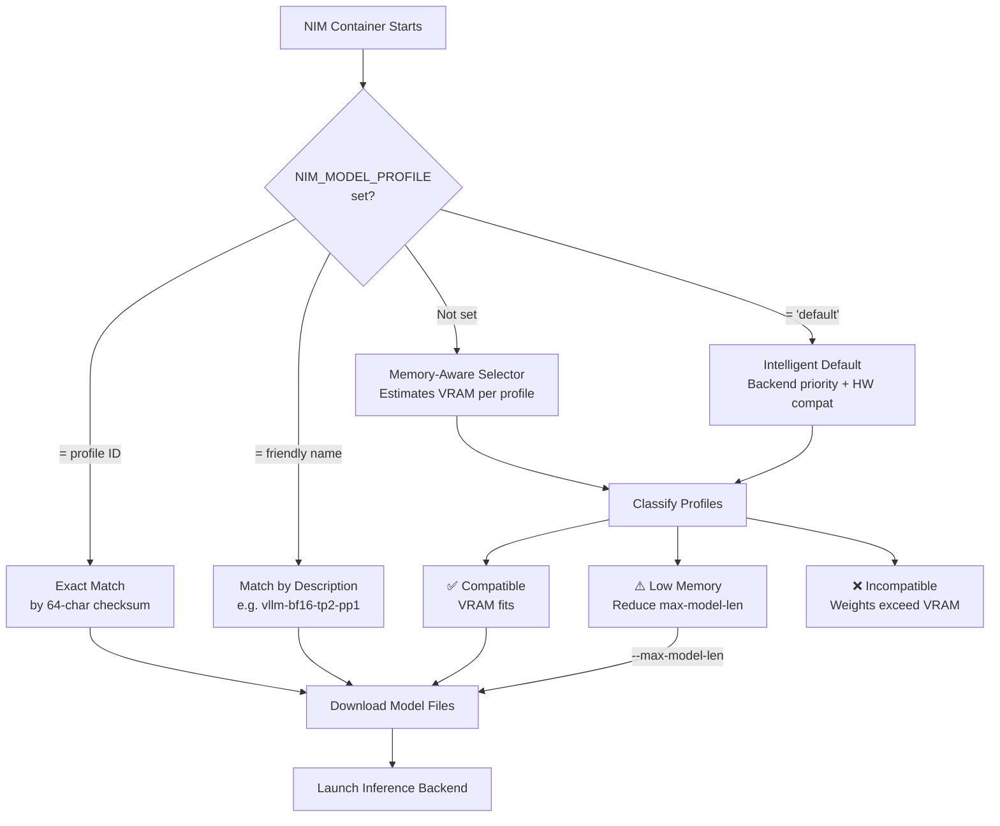

> 💡 **Quick Answer:** Set `NIM_MODEL_PROFILE` in your Pod spec to select a specific inference profile (precision, tensor parallelism, LoRA). Use `list-model-profiles` to discover available profiles and their VRAM requirements. Without it, NIM auto-selects the best profile for your GPU hardware.

## The Problem

NVIDIA NIM containers ship with multiple model profiles — different combinations of precision (bf16, fp8, nvfp4), tensor parallelism (TP), pipeline parallelism (PP), and LoRA support. Choosing the wrong profile wastes GPU memory, fails to start, or leaves performance on the table. You need to understand how profile selection works and how to pin the right profile for your Kubernetes deployment.



## The Solution

### Profile Naming Convention

NIM profiles follow a consistent naming pattern:

```
vllm-<precision>-tp<N>-pp<M>[-lora]
```

| Component | Values | Meaning |
|-----------|--------|---------|
| Backend | `vllm` | vLLM inference engine |
| Precision | `bf16`, `fp8`, `mxfp4`, `nvfp4` | Quantization format |
| `tp<N>` | `tp1`, `tp2`, `tp4`, `tp8` | Tensor parallelism (GPU count) |
| `pp<M>` | `pp1`, `pp2` | Pipeline parallelism stages |
| `-lora` | optional | LoRA adapter support enabled |

**Examples:**
- `vllm-bf16-tp1-pp1` — BF16 on 1 GPU, no LoRA
- `vllm-fp8-tp4-pp1-lora` — FP8 quantized across 4 GPUs with LoRA
- `vllm-bf16-tp8-pp2` — BF16 across 8 GPUs with 2-stage pipeline parallelism (multinode)

### List Available Profiles

Before deploying, discover which profiles your NIM container supports:

```yaml
# Job to list profiles on your cluster's GPUs
apiVersion: batch/v1
kind: Job
metadata:
  name: nim-list-profiles
  namespace: nim
spec:
  template:
    spec:
      restartPolicy: Never
      containers:
        - name: list-profiles
          image: nvcr.io/nim/meta/llama-3.1-8b-instruct:1.7.3
          command: ["list-model-profiles"]
          resources:
            limits:
              nvidia.com/gpu: "1"
          volumeMounts:
            - name: nim-cache
              mountPath: /opt/nim/.cache
      volumes:
        - name: nim-cache
          persistentVolumeClaim:
            claimName: nim-cache-pvc
```

```bash
# Check the output
kubectl logs job/nim-list-profiles -n nim
```

Example output:

```
MODEL PROFILES
- Compatible with system and runnable:
  - dcec66a5... (vllm-bf16-tp1-pp1) [requires >=18 GB/gpu]
  - With LoRA support:
    - d66193b8... (vllm-bf16-tp1-pp1-feat_lora) [requires >=22 GB/gpu]
- Compatible with system but low memory:
  - a1b2c3d4... (vllm-bf16-tp1-pp1) [requires >=45 GB/gpu, try --max-model-len=4096 to reduce to >=30 GB/gpu]
- Incompatible with system:
  - 27af459c... (vllm-bf16-tp2-pp1)
```

### Deploy with Automatic Profile Selection

When you don't set `NIM_MODEL_PROFILE`, NIM picks the best compatible profile automatically:

```yaml
apiVersion: apps/v1
kind: Deployment
metadata:
  name: nim-llama-auto
  namespace: nim
spec:
  replicas: 1
  selector:
    matchLabels:
      app: nim-llama
  template:
    metadata:
      labels:
        app: nim-llama
    spec:
      containers:
        - name: nim
          image: nvcr.io/nim/meta/llama-3.1-8b-instruct:1.7.3
          ports:
            - containerPort: 8000
          env:
            - name: NGC_API_KEY
              valueFrom:
                secretKeyRef:
                  name: ngc-secret
                  key: NGC_API_KEY
            # No NIM_MODEL_PROFILE → auto-selects best fit
          resources:
            limits:
              nvidia.com/gpu: "1"
          volumeMounts:
            - name: nim-cache
              mountPath: /opt/nim/.cache
      volumes:
        - name: nim-cache
          persistentVolumeClaim:
            claimName: nim-cache-pvc
```

### Deploy with Explicit Profile Selection

Pin a specific profile for deterministic, reproducible deployments:

```yaml
apiVersion: apps/v1
kind: Deployment
metadata:
  name: nim-llama-fp8
  namespace: nim
spec:
  replicas: 1
  selector:
    matchLabels:
      app: nim-llama-fp8
  template:
    metadata:
      labels:
        app: nim-llama-fp8
    spec:
      containers:
        - name: nim
          image: nvcr.io/nim/meta/llama-3.1-8b-instruct:1.7.3
          ports:
            - containerPort: 8000
          env:
            - name: NGC_API_KEY
              valueFrom:
                secretKeyRef:
                  name: ngc-secret
                  key: NGC_API_KEY
            # Option A: Select by friendly name
            - name: NIM_MODEL_PROFILE
              value: "vllm-fp8-tp1-pp1"
            # Option B: Select by profile ID (most deterministic)
            # - name: NIM_MODEL_PROFILE
            #   value: "70edb8bb9f8511ce2ea195e3caebcc3c7191dc27fea0c8d4acf9c0d9a69e43cd"
          resources:
            limits:
              nvidia.com/gpu: "1"
          volumeMounts:
            - name: nim-cache
              mountPath: /opt/nim/.cache
      volumes:
        - name: nim-cache
          persistentVolumeClaim:
            claimName: nim-cache-pvc
```

### Deploy with LoRA Support

```yaml
env:
  - name: NIM_MODEL_PROFILE
    value: "vllm-bf16-tp1-pp1-feat_lora"
  - name: NIM_PEFT_SOURCE
    value: "/lora-adapters"
  - name: NIM_PEFT_REFRESH_INTERVAL
    value: "600"  # Check for new adapters every 10 min
```

### Multi-GPU Tensor Parallelism

For large models that need multiple GPUs:

```yaml
apiVersion: apps/v1
kind: Deployment
metadata:
  name: nim-llama-70b
  namespace: nim
spec:
  replicas: 1
  selector:
    matchLabels:
      app: nim-llama-70b
  template:
    metadata:
      labels:
        app: nim-llama-70b
    spec:
      containers:
        - name: nim
          image: nvcr.io/nim/meta/llama-3.1-70b-instruct:1.7.3
          ports:
            - containerPort: 8000
          env:
            - name: NGC_API_KEY
              valueFrom:
                secretKeyRef:
                  name: ngc-secret
                  key: NGC_API_KEY
            - name: NIM_MODEL_PROFILE
              value: "vllm-fp8-tp4-pp1"
          resources:
            limits:
              nvidia.com/gpu: "4"
          volumeMounts:
            - name: nim-cache
              mountPath: /opt/nim/.cache
            - name: dshm
              mountPath: /dev/shm
      volumes:
        - name: nim-cache
          persistentVolumeClaim:
            claimName: nim-cache-pvc
        - name: dshm
          emptyDir:
            medium: Memory
            sizeLimit: 16Gi
```

### Low Memory: Reduce Context Length

When a profile is flagged as "low memory", reduce `--max-model-len`:

```yaml
env:
  - name: NIM_MODEL_PROFILE
    value: "vllm-bf16-tp1-pp1"
args:
  - "--max-model-len"
  - "4096"   # Reduce from default (e.g., 128K) to fit VRAM
```

### Override Profile Settings with vLLM CLI Args

Backend-native CLI args take precedence over profile defaults:

```yaml
containers:
  - name: nim
    image: nvcr.io/nim/meta/llama-3.1-8b-instruct:1.7.3
    env:
      - name: NIM_MODEL_PROFILE
        value: "vllm-bf16-tp2-pp1"
    args:
      # These override the profile's TP setting
      - "--tensor-parallel-size"
      - "4"
      - "--max-model-len"
      - "8192"
      - "--enable-lora"
```

**Precedence hierarchy:**
1. **vLLM CLI args** (highest) — `--tensor-parallel-size`, `--max-model-len`, etc.
2. **NIM_MODEL_PROFILE** — profile defaults applied if not overridden
3. **Auto-selection** (lowest) — hardware-based automatic pick

### Profile Selection Decision Matrix

| Scenario | NIM_MODEL_PROFILE | GPU Request | Notes |
|----------|-------------------|-------------|-------|
| Quick dev/test | *(not set)* | 1 | Auto-selects best single-GPU profile |
| Production (pinned) | `vllm-fp8-tp1-pp1` | 1 | FP8 saves ~50% VRAM vs bf16 |
| Production with LoRA | `vllm-bf16-tp1-pp1-feat_lora` | 1 | Needs ~4GB extra VRAM for adapters |
| Large model (70B) | `vllm-fp8-tp4-pp1` | 4 | FP8 on 4× H100/A100 |
| Very large (405B) | `vllm-bf16-tp8-pp2` | 16 (multinode) | 8 GPUs × 2 pipeline stages |
| Constrained VRAM | `vllm-fp8-tp1-pp1` + `--max-model-len 4096` | 1 | Trade context length for fit |
| Deterministic CI/CD | `<64-char profile ID>` | varies | Immune to tag/name changes |

## Common Issues

| Issue | Cause | Fix |
|-------|-------|-----|
| `No compatible profiles found` | GPU VRAM too small for any profile | Use a quantized profile (fp8/nvfp4) or increase TP |
| Container OOMKilled | Profile fits weights but not KV cache at full context | Add `--max-model-len 4096` (or lower) |
| Wrong profile selected | Auto-selection picked unexpected profile | Pin with `NIM_MODEL_PROFILE` explicitly |
| `Profile not found` | Typo in profile name or ID | Run `list-model-profiles` to verify exact names |
| LoRA not working | Non-LoRA profile selected | Use profile with `-feat_lora` suffix |
| Slow startup | Downloading model files each time | Use a PVC for `/opt/nim/.cache` to persist downloads |
| vLLM arg ignored | Arg syntax wrong | Args go in `args:` field, not `env:` — e.g., `["--tensor-parallel-size", "4"]` |

## Best Practices

- **Always run `list-model-profiles` first** — discover what's available before deploying
- **Pin profiles in production** — use explicit `NIM_MODEL_PROFILE` for reproducibility
- **Use profile IDs for CI/CD** — 64-char IDs are immutable; friendly names may change across versions
- **Prefer FP8 over BF16 when available** — ~50% VRAM savings with minimal quality loss on H100/L40S
- **Mount `/dev/shm` for multi-GPU** — tensor parallelism needs shared memory for NCCL
- **Cache models on PVC** — avoid re-downloading on every pod restart
- **Set `NIM_MODEL_PROFILE=default`** — better than no setting; triggers intelligent selection with backend priority

## Key Takeaways

- NIM model profiles define precision, tensor/pipeline parallelism, and LoRA support per deployment
- `list-model-profiles` shows compatible, low-memory, and incompatible profiles for your hardware
- Pin `NIM_MODEL_PROFILE` by ID or friendly name for deterministic production deployments
- vLLM CLI args override profile defaults — useful for tuning `max-model-len` and TP
- FP8 quantization is the sweet spot for H100/A100 — halves VRAM with negligible quality impact
