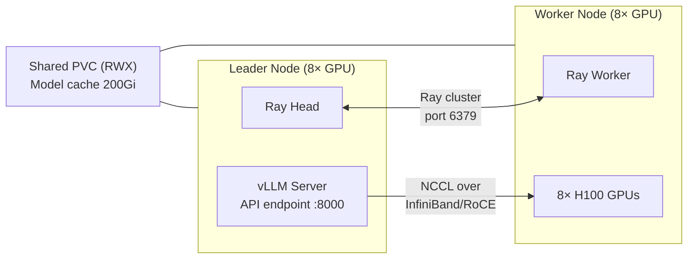

> 💡 **Quick Answer:** Enable `multiNode.enabled=true` in the NIM Helm chart with `tensorParallelSize` and `pipelineParallelSize` values. NIM uses LeaderWorkerSet + Ray for cluster formation and vLLM for distributed execution. The leader downloads the model to shared storage (RWX PVC); workers join via Ray and provide GPU resources.

## The Problem

Very large language models like Llama 3.1 405B (810GB in BF16) or DeepSeek-R1 (1.2TB) cannot fit on a single node's GPU memory. Even with 8× H100 80GB (640GB total), you need multiple nodes. NIM supports multi-node deployment using Ray for cluster orchestration and vLLM for distributed model parallelism, but setting it up on Kubernetes requires LeaderWorkerSet, shared storage, and proper NCCL networking configuration.



## The Solution

### Prerequisites

**1. Install LeaderWorkerSet CRD:**

```bash
kubectl apply --server-side -f \
  https://github.com/kubernetes-sigs/lws/releases/latest/download/manifests.yaml
```

**2. Create NGC API secret:**

```bash
kubectl create secret generic ngc-api \
  --from-literal=NGC_API_KEY=<your-ngc-key>
```

**3. Create image pull secret for NGC registry:**

```bash
kubectl create secret docker-registry nvcr-imagepull \
  --docker-server=nvcr.io \
  --docker-username='$oauthtoken' \
  --docker-password=<your-ngc-key>
```

**4. Ensure shared storage** — a StorageClass that supports `ReadWriteMany` (NFS, CephFS, Lustre, etc.)

**5. High-speed networking** — InfiniBand or RoCE strongly recommended for cross-node NCCL traffic.

### Parallelism Strategies

NIM splits model weights across nodes using two strategies:

| Strategy | What it splits | When to use |
|----------|---------------|-------------|
| **Tensor Parallelism (TP)** | Model layers across GPUs | Within a node (fast NVLink) |
| **Pipeline Parallelism (PP)** | Model stages across nodes | Across nodes (slower network) |

**Rule of thumb:** Set TP = GPUs per node, PP = number of nodes.

```
Total GPUs = TP × PP

Example: Llama 405B on 2 nodes × 8 GPUs
  TP = 8  (split layers across 8 GPUs per node)
  PP = 2  (split stages across 2 nodes)
  Total = 16 GPUs
```

For high-bandwidth interconnects (InfiniBand), you can also use multi-node TP:

```
Example: TP=16, PP=1 across 2 nodes × 8 GPUs
  One TP group spans both nodes
  Requires RDMA for acceptable latency
```

### Deploy Llama 3.1 405B (TP=8, PP=2)

```yaml
# values-llama-405b.yaml
image:
  repository: nvcr.io/nim/meta/llama-3.1-405b-instruct
  tag: "1.7.3"

model:
  ngcAPISecret: ngc-api
  jsonLogging: false   # REQUIRED: JSON logging breaks Ray workers

multiNode:
  enabled: true
  workers: 1                # 1 worker + 1 leader = 2 nodes total
  tensorParallelSize: 8     # 8 GPUs per node
  pipelineParallelSize: 2   # 2 pipeline stages (1 per node)

resources:
  limits:
    nvidia.com/gpu: 8
  requests:
    nvidia.com/gpu: 8

persistence:
  enabled: true
  size: 200Gi
  accessMode: ReadWriteMany
  storageClass: nfs-csi     # Must support RWX

imagePullSecrets:
  - name: nvcr-imagepull
```

```bash
# Install
helm install nim-405b nim-llm/ -f values-llama-405b.yaml

# Monitor
kubectl get pods -w
# nim-405b-0 (leader) — downloads model, starts Ray head + vLLM
# nim-405b-0-1 (worker) — joins Ray cluster, provides GPUs
```

### Deploy DeepSeek-R1 (TP=8, PP=2)

```yaml
# values-deepseek-r1.yaml
image:
  repository: nvcr.io/nim/deepseek-ai/deepseek-r1
  tag: "1.7.3"

model:
  ngcAPISecret: ngc-api
  jsonLogging: false

multiNode:
  enabled: true
  workers: 1
  tensorParallelSize: 8
  pipelineParallelSize: 2

resources:
  limits:
    nvidia.com/gpu: 8
  requests:
    nvidia.com/gpu: 8

persistence:
  enabled: true
  size: 300Gi               # DeepSeek-R1 is larger
  accessMode: ReadWriteMany
  storageClass: nfs-csi

imagePullSecrets:
  - name: nvcr-imagepull
```

### Multi-Node Tensor Parallelism (TP=16)

For InfiniBand-equipped clusters where you want a single TP group spanning nodes:

```yaml
multiNode:
  enabled: true
  workers: 1
  tensorParallelSize: 16    # Single TP group across 2 nodes
  pipelineParallelSize: 1   # No pipeline split

env:
  - name: NCCL_IB_DISABLE
    value: "0"              # Enable InfiniBand
  - name: NCCL_NET_GDR_LEVEL
    value: "5"              # GPUDirect RDMA
```

> ⚠️ Multi-node TP requires high-bandwidth, low-latency interconnect (InfiniBand/RoCE with RDMA). Ethernet-only clusters should use PP instead.

### Profile Selection

Two approaches to select the model profile:

**Option A: TP/PP values (recommended)**

```bash
helm install nim-llm nim-llm/ \
  --set multiNode.enabled=true \
  --set multiNode.workers=1 \
  --set multiNode.tensorParallelSize=8 \
  --set multiNode.pipelineParallelSize=2
```

NIM injects `NIM_TENSOR_PARALLEL_SIZE` and `NIM_PIPELINE_PARALLEL_SIZE` and auto-selects the matching profile.

**Option B: Explicit profile name**

```bash
helm install nim-llm nim-llm/ \
  --set multiNode.enabled=true \
  --set multiNode.workers=1 \
  --set model.profile=vllm-bf16-tp8-pp2
```

### Model Storage Options

**Shared PVC (recommended):**

```yaml
persistence:
  enabled: true
  size: 200Gi
  accessMode: ReadWriteMany       # REQUIRED for multi-node
  storageClass: nfs-csi
  # Or use a pre-created PVC:
  # existingClaim: nim-model-cache  # Survives helm uninstall
```

**NFS direct mount:**

```yaml
persistence:
  enabled: true
nfs:
  enabled: true
  server: "10.0.1.50"
  path: "/exports/nim-cache"
```

**Independent downloads (not recommended):**

Without shared storage, each node downloads the model independently to `emptyDir`. Wastes time and bandwidth.

### Model-Free Deployment (Hugging Face Models)

Deploy any HF model across multiple nodes without a pre-built NIM container:

```yaml
image:
  repository: nvcr.io/nim/nim-llm
  tag: "2.0.2"

model:
  modelPath: "hf://meta-llama/Llama-3.1-405B-Instruct"
  ngcAPISecret: ngc-api
  hfTokenSecret: hf-token      # Secret with HF_TOKEN key
  jsonLogging: false

multiNode:
  enabled: true
  workers: 1
  tensorParallelSize: 8
  pipelineParallelSize: 2

persistence:
  enabled: true
  size: 200Gi
  accessMode: ReadWriteMany
  storageClass: nfs-csi
```

```bash
# Create HF token secret
kubectl create secret generic hf-token \
  --from-literal=HF_TOKEN=<your-hf-token>
```

### NCCL Tuning for Multi-Node

```yaml
# Add to Helm values
env:
  # InfiniBand settings
  - name: NCCL_IB_DISABLE
    value: "0"                    # 0 = enable IB
  - name: NCCL_NET_GDR_LEVEL
    value: "5"                    # GPUDirect RDMA level
  - name: NCCL_IB_HCA
    value: "mlx5"                 # HCA device filter
  # Debugging
  - name: NCCL_DEBUG
    value: "WARN"                 # Use INFO for troubleshooting
  # For Ethernet-only (no IB)
  # - name: NCCL_SOCKET_IFNAME
  #   value: "eth0"
  # - name: NCCL_IB_DISABLE
  #   value: "1"
```

### Verify Deployment

```bash
# Check all pods are running
kubectl get pods
# NAME            READY   STATUS    RESTARTS   AGE
# nim-405b-0      1/1     Running   0          12m   (leader)
# nim-405b-0-1    1/1     Running   0          12m   (worker)

# Check leader logs for Ray cluster formation
kubectl logs nim-405b-0 | grep -E "Ray|worker|GPU"
# Ray head started at 10.244.1.5:6379
# Worker 10.244.2.8 connected with 8 GPUs
# Total GPUs in cluster: 16

# Check profile selection
kubectl logs nim-405b-0 | grep "profile"
# Selected profile: vllm-bf16-tp8-pp2

# Test inference
kubectl port-forward svc/nim-405b 8000:8000
curl -s http://localhost:8000/v1/chat/completions \
  -H "Content-Type: application/json" \
  -d '{
    "model": "meta/llama-3.1-405b-instruct",
    "messages": [{"role": "user", "content": "Hello"}],
    "max_tokens": 64
  }'
```

### Helm Values Quick Reference

| Parameter | Description | Default |
|-----------|-------------|---------|
| `multiNode.enabled` | Enable multi-node mode | `false` |
| `multiNode.workers` | Worker pods (total nodes = workers + 1) | `1` |
| `multiNode.tensorParallelSize` | GPUs per TP group | `0` |
| `multiNode.pipelineParallelSize` | Pipeline stages across nodes | `0` |
| `multiNode.ray.port` | Ray head communication port | `6379` |
| `model.profile` | Explicit profile name or hash | `""` |
| `model.jsonLogging` | JSON log format (**must be false**) | `true` |
| `model.hfTokenSecret` | Secret name for HF_TOKEN | `""` |
| `persistence.accessMode` | PVC access mode (**must be RWX**) | `ReadWriteOnce` |

## Common Issues

| Issue | Cause | Fix |
|-------|-------|-----|
| Worker fails to start with log formatter error | `jsonLogging` is `true` | Set `model.jsonLogging: false` — NIM JSON formatter not available in Ray workers |
| Worker can't join Ray cluster | Network policy blocking port 6379 | Allow TCP 6379 between leader and worker pods |
| PVC mount fails on worker | PVC is `ReadWriteOnce` | Change to `ReadWriteMany` — RWO can't mount on multiple nodes |
| NCCL timeout | No RDMA, slow Ethernet between nodes | Use PP instead of multi-node TP, or enable InfiniBand |
| Model download on every restart | No persistent storage | Use PVC with `existingClaim` — survives `helm uninstall` |
| `LWS_LEADER_ADDRESS` not set | LeaderWorkerSet CRD not installed | Install LWS: `kubectl apply --server-side -f https://github.com/kubernetes-sigs/lws/releases/latest/download/manifests.yaml` |
| Pods pending (insufficient GPUs) | Not enough GPU nodes | Verify `nvidia.com/gpu` availability: `kubectl describe nodes \| grep nvidia.com/gpu` |
| Profile not found | TP/PP and profile both unset | Must set either `tensorParallelSize/pipelineParallelSize` OR `model.profile` |

## Best Practices

- **Always disable JSON logging** — `model.jsonLogging: false` is mandatory for multi-node
- **Use shared storage** — RWX PVC lets the leader download once; workers read from cache
- **Use `existingClaim`** — pre-created PVC persists across Helm upgrades and reinstalls
- **TP within node, PP across nodes** — NVLink is 10-50× faster than network; keep TP intra-node
- **Pin image versions** — use `tag: "1.7.3"` not `latest` for reproducible deployments
- **Size PVC for your model** — 200Gi for 405B BF16, 300Gi for DeepSeek-R1, 100Gi for FP8 quantized
- **InfiniBand for multi-node TP** — if using TP across nodes, RDMA is not optional

## Key Takeaways

- NIM multi-node uses LeaderWorkerSet + Ray + vLLM for distributed inference across Kubernetes nodes
- Set TP = GPUs per node, PP = number of nodes as the default strategy
- Shared RWX storage eliminates redundant model downloads across nodes
- JSON logging must be disabled — it crashes Ray worker processes
- The NIM Helm chart handles all Ray cluster formation and vLLM distributed execution automatically
- Multi-node TP (single TP group spanning nodes) requires InfiniBand/RoCE for production performance
