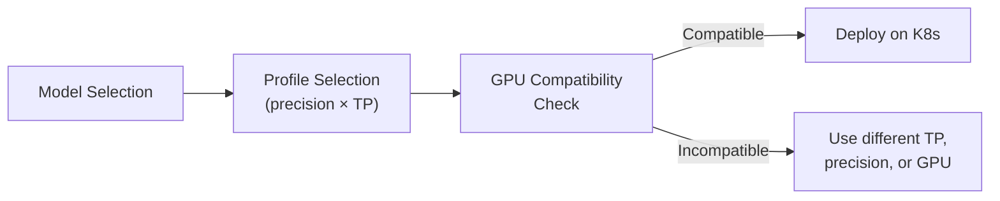

> 💡 **Quick Answer:** NIM LLM 2.x supports model-specific containers (Llama 3.1/3.3, GPT-OSS, Nemotron, StarCoder2) and model-free NIM for any vLLM-supported model. Profiles range from BF16 to NVFP4 quantization with TP1–TP8. Verified GPUs include A100, H100, H200, L40S, B200, B300, GH200, GB200, and Blackwell RTX PRO.

## The Problem

Before deploying NIM on Kubernetes, you need to know which models are supported, which precision profiles are available, and whether your GPU hardware is verified. Mismatches between model, profile, and GPU cause deployment failures or degraded performance. This reference provides the complete NIM LLM 2.x support matrix.



## The Solution

### NIM LLM 2.x Supported Models

| Model | Container Image | NIM Version | Sizes | Key Feature |
|-------|----------------|-------------|-------|-------------|
| **GPT-OSS 120B** | `nim/openai/gpt-oss-120b` | 2.0.1 | 120B | OpenAI open-source, MXFP4 only |
| **GPT-OSS 20B** | `nim/openai/gpt-oss-20b` | 2.0.1 | 20B | OpenAI open-source, MXFP4 only |
| **Llama 3.1 8B Instruct** | `nim/meta/llama-3.1-8b-instruct` | 2.0.1 | 8B | BF16/FP8/NVFP4 + LoRA |
| **Llama 3.1 70B Instruct** | `nim/meta/llama-3.1-70b-instruct` | 2.0.1 | 70B | BF16/FP8/NVFP4 + LoRA |
| **Llama 3.3 70B Instruct** | `nim/meta/llama-3.3-70b-instruct` | 2.0.1 | 70B | BF16/FP8/NVFP4 + LoRA |
| **Nemotron Super 49B** | `nim/nvidia/llama-3.3-nemotron-super-49b-v1.5` | 2.0.1 | 49B | BF16/FP8/NVFP4 + LoRA |
| **Nemotron 3 Nano** | `nim/nvidia/nemotron-3-nano` | 2.0.1 | Small | BF16/FP8/NVFP4 + LoRA |
| **Nemotron 3 Super 120B** | `nim/nvidia/nemotron-3-super-120b-a12b` | 2.0.2 | 120B MoE | GPU-dependent profiles |
| **StarCoder2 7B** | `nim/bigcode/starcoder2-7b` | 2.0.1 | 7B | Code generation, BF16 only |
| **Model-Free NIM** | `nim/nvidia/model-free-nim` | 2.0.1 | Any | Any vLLM-supported model |

### Profile Matrix: Llama 3.1/3.3 70B

The most common enterprise deployment — full profile coverage:

| Precision | TP1 | TP2 | TP4 | TP8 |
|-----------|-----|-----|-----|-----|
| **BF16** | `vllm-bf16-tp1-pp1` | `vllm-bf16-tp2-pp1` | `vllm-bf16-tp4-pp1` | `vllm-bf16-tp8-pp1` |
| **BF16 + LoRA** | `vllm-bf16-tp1-pp1-lora` | `vllm-bf16-tp2-pp1-lora` | `vllm-bf16-tp4-pp1-lora` | `vllm-bf16-tp8-pp1-lora` |
| **FP8** | `vllm-fp8-tp1-pp1` | `vllm-fp8-tp2-pp1` | `vllm-fp8-tp4-pp1` | `vllm-fp8-tp8-pp1` |
| **FP8 + LoRA** | `vllm-fp8-tp1-pp1-lora` | `vllm-fp8-tp2-pp1-lora` | `vllm-fp8-tp4-pp1-lora` | `vllm-fp8-tp8-pp1-lora` |
| **NVFP4** | `vllm-nvfp4-tp1-pp1` | `vllm-nvfp4-tp2-pp1` | `vllm-nvfp4-tp4-pp1` | `vllm-nvfp4-tp8-pp1` |
| **NVFP4 + LoRA** | `vllm-nvfp4-tp1-pp1-lora` | `vllm-nvfp4-tp2-pp1-lora` | `vllm-nvfp4-tp4-pp1-lora` | `vllm-nvfp4-tp8-pp1-lora` |

### Profile Matrix: Llama 3.1 8B

Single-GPU model — TP1 only:

| Precision | TP1 |
|-----------|-----|
| **BF16** | `vllm-bf16-tp1-pp1` |
| **BF16 + LoRA** | `vllm-bf16-tp1-pp1-lora` |
| **FP8** | `vllm-fp8-tp1-pp1` |
| **FP8 + LoRA** | `vllm-fp8-tp1-pp1-lora` |
| **NVFP4** | `vllm-nvfp4-tp1-pp1` |
| **NVFP4 + LoRA** | `vllm-nvfp4-tp1-pp1-lora` |

### Profile Matrix: GPT-OSS (20B / 120B)

MXFP4 quantization only (new precision format):

| Precision | TP1 | TP2 | TP4 | TP8 |
|-----------|-----|-----|-----|-----|
| **MXFP4** | `vllm-mxfp4-tp1-pp1` | `vllm-mxfp4-tp2-pp1` | `vllm-mxfp4-tp4-pp1` | `vllm-mxfp4-tp8-pp1` |
| **MXFP4 + LoRA** | `vllm-mxfp4-tp1-pp1-lora` | `vllm-mxfp4-tp2-pp1-lora` | `vllm-mxfp4-tp4-pp1-lora` | `vllm-mxfp4-tp8-pp1-lora` |

### Precision Format Comparison

| Format | VRAM Savings vs BF16 | Quality Impact | Best For |
|--------|---------------------|----------------|----------|
| **BF16** | Baseline | None | Maximum accuracy, LoRA fine-tuning |
| **FP8** | ~50% | Minimal | Production inference on H100/H200 |
| **NVFP4** | ~75% | Small | Cost-optimized, smaller GPUs |
| **MXFP4** | ~75% | Small | GPT-OSS models specifically |

### GPU Compatibility Matrix

Which GPUs work with which models:

| GPU | Llama 3.1 8B | Llama 3.1/3.3 70B | Nemotron 49B | Nemotron 120B | GPT-OSS 20B | GPT-OSS 120B | Model-Free |
|-----|:---:|:---:|:---:|:---:|:---:|:---:|:---:|
| **A10G** | — | ✅ | — | — | ✅ | — | — |
| **A100 40GB** | ✅ | ✅ | ✅ | ✅ | ✅ | ✅ | ✅ |
| **A100 80GB** | ✅ | ✅ | ✅ | ✅ | ✅ | ✅ | ✅ |
| **L40S** | ✅ | ✅ | ✅ | ✅ | ✅ | ✅ | — |
| **H100 80GB** | ✅ | ✅ | ✅ | ✅ | ✅ | ✅ | ✅ |
| **H100 NVL** | ✅ | ✅ | ✅ | ✅ | — | ✅ | ✅ |
| **H200** | ✅ | ✅ | ✅ | ✅ | ✅ | ✅ | ✅ |
| **H200 NVL** | ✅ | ✅ | ✅ | ✅ | — | — | ✅ |
| **GH200 144GB** | ✅ | ✅ | ✅ | ✅ | ✅ | ✅ | — |
| **GH200 480GB** | ✅ | ✅ | ✅ | — | ✅ | — | ✅ |
| **B200** | ✅ | ✅ | ✅ | ✅ | ✅ | ✅ | — |
| **B300 SXM6** | ✅ | ✅ | ✅ | ✅ | ✅ | ✅ | ✅ |
| **GB200** | ✅ | ✅ | ✅ | ✅ | ✅ | ✅ | — |
| **GB10** | ✅ | — | ✅ | — | ✅ | — | — |
| **RTX PRO 4500 Blackwell** | ✅ | — | ✅ | ✅ | — | — | ✅ |
| **RTX PRO 6000 Blackwell** | ✅ | ✅ | ✅ | ✅ | ✅ | ✅ | — |

### NIM LLM 1.x Models (Legacy)

Models still on NIM 1.x (1.15.0) — not yet migrated to 2.x:

| Model | Container | Notes |
|-------|-----------|-------|
| DeepSeek-V3.1-Terminus | `deepseek-ai/deepseek-v3.1-terminus` | Large MoE model |
| DeepSeek-V3.2-Exp | `deepseek-ai/deepseek-v32-exp-nim` | Experimental |
| GLM-5 | `zai-org/glm-5` | Chinese/English bilingual |
| MiniMax-M2.5 | `minimax-ai/minimax-m25` | Large MoE |
| Qwen3-32B | `qwen/qwen3-32b` | Also DGX Spark variant |
| Qwen3-Coder-Next | `qwen/qwen3-coder-next` | Code generation |
| Qwen3-Next-80B-A3B | `qwen/qwen3-next-80b-a3b-instruct` | MoE, also thinking variant |
| Nemotron Nano 9B v2 DGX Spark | `nvidia/nvidia-nemotron-nano-9b-v2-dgx-spark` | Edge deployment |
| Riva Translate 4B | `nvidia/riva-translate-4b-instruct-v1.1` | Translation NIM |
| Healthcare Text2SQL (8B/49B) | `nvidia/llama-3.1-nemotron-nano-8b-healthcare-text2sql-v1.0` | Domain-specific |

> For 1.x model details, see [NIM LLM 1.15.0 Supported Models](https://docs.nvidia.com/nim/large-language-models/1.15.0/supported-models.html).

### Model-Free NIM Validated Models

Officially tested with model-free NIM (`nim/nvidia/model-free-nim`):

- `gpt-oss-20b`
- `apriel-nemotron`
- `codestral`

> Any vLLM-supported architecture works with model-free NIM — these are just the officially validated ones.

### Recommended Profile by GPU (Llama 70B)

Quick reference for the most common deployment:

| GPU | VRAM | Recommended Profile | Min GPUs |
|-----|------|-------------------|----------|
| **A100 40GB** | 40GB | `vllm-fp8-tp4-pp1` | 4 |
| **A100 80GB** | 80GB | `vllm-fp8-tp2-pp1` | 2 |
| **L40S** | 48GB | `vllm-fp8-tp4-pp1` | 4 |
| **H100 80GB** | 80GB | `vllm-fp8-tp1-pp1` | 1 |
| **H200** | 141GB | `vllm-bf16-tp1-pp1` | 1 |
| **GH200 480GB** | 480GB | `vllm-bf16-tp1-pp1` | 1 |
| **B200** | 192GB | `vllm-bf16-tp1-pp1` | 1 |

### How to Verify on Your Cluster

```bash
# Check GPU type on your nodes
kubectl get nodes -o json | jq -r '.items[] | .metadata.name + ": " + .status.capacity["nvidia.com/gpu"] + " × " + (.metadata.labels["nvidia.com/gpu.product"] // "unknown")'

# List profiles for your specific hardware
kubectl run nim-profiles --rm -it --restart=Never \
  --image=nvcr.io/nim/meta/llama-3.1-70b-instruct:1.7.3 \
  --overrides='{"spec":{"containers":[{"name":"nim-profiles","image":"nvcr.io/nim/meta/llama-3.1-70b-instruct:1.7.3","command":["list-model-profiles"],"resources":{"limits":{"nvidia.com/gpu":"1"}}}]}}' \
  -- list-model-profiles
```

## Common Issues

| Issue | Cause | Fix |
|-------|-------|-----|
| `No compatible profiles` | GPU not verified or VRAM too small | Check GPU compatibility matrix above; use higher TP or FP8/NVFP4 |
| FP8 not available on A100 40GB | FP8 needs ≥ model weight size in VRAM | Use multi-GPU TP or NVFP4 for A100 40GB |
| NVFP4 not available on some models | Not all models have NVFP4 quantization | Fall back to FP8 or BF16 |
| Model stuck on 1.x NIM | Not yet migrated to 2.x | Use 1.x container tags; check [1.15.0 docs](https://docs.nvidia.com/nim/large-language-models/1.15.0/supported-models.html) |
| Blackwell GPUs not listed | NIM version too old | Update to NIM 2.0.1+ for Blackwell support |

## Best Practices

- **Start with FP8** — best VRAM/quality tradeoff on H100/H200/B200
- **Use NVFP4 for cost optimization** — 75% VRAM savings enables smaller GPU counts
- **Check `list-model-profiles`** — always verify on your actual hardware before deploying
- **Match NIM version to model** — some models require 2.0.2 (e.g., Nemotron 120B)
- **Model-free NIM for unsupported models** — any vLLM architecture works even if not in the matrix
- **Pin to verified GPU types** — use `nodeSelector` with `nvidia.com/gpu.product` label

## Key Takeaways

- NIM 2.x supports 10 model-specific containers + model-free NIM for any vLLM model
- Profiles combine precision (BF16/FP8/NVFP4/MXFP4) × tensor parallelism (TP1-TP8) × LoRA
- GPU verification spans A100 through Blackwell (B200/B300/GB200) and RTX PRO
- FP8 is the recommended default for H100/H200 — ~50% VRAM savings with minimal quality loss
- Always run `list-model-profiles` to confirm compatibility on your specific hardware
