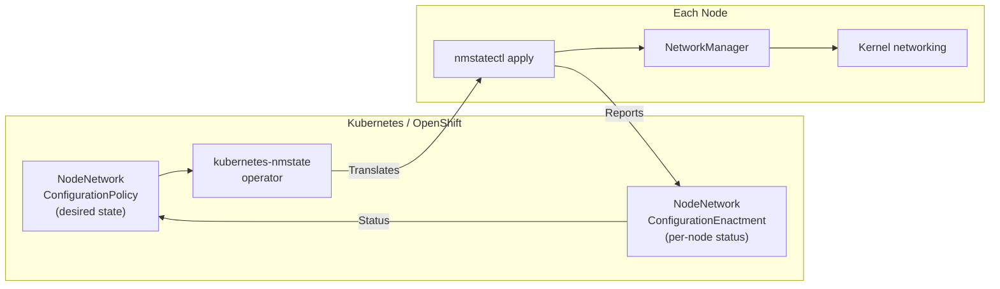
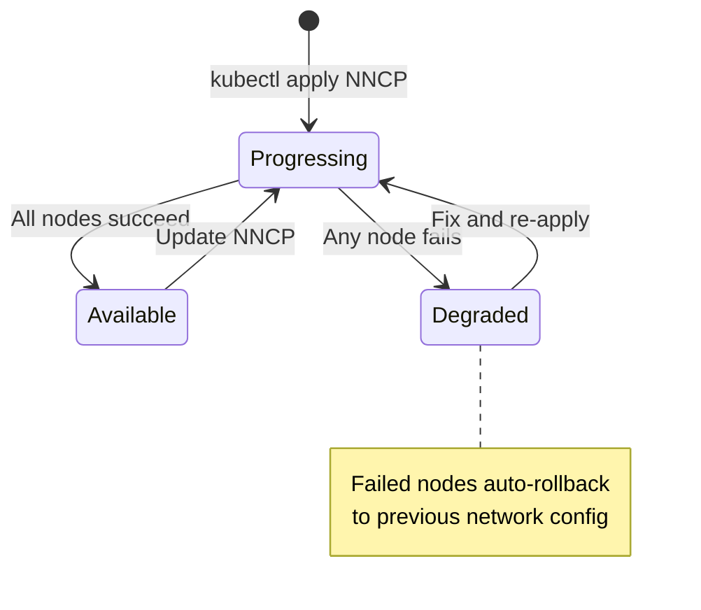

> 💡 **Quick Answer:** **NMState** is a declarative API for host networking. On the node, use `nmstatectl show` to see current state and `nmstatectl apply` to configure interfaces. In Kubernetes/OpenShift, create a `NodeNetworkConfigurationPolicy` (NNCP) — the kubernetes-nmstate operator translates it to nmstatectl on each matching node. The NNCP reports `Available` (success), `Progressing`, or `Degraded` (failed + auto-rollback).

## The Problem

Configuring node networking imperatively (ip/nmcli commands) is fragile, not auditable, and doesn't self-heal. NMState provides a declarative model: describe the desired network state, and NMState reconciles reality to match — on a single node via `nmstatectl` or fleet-wide via NNCP CRDs.



## Part 1: nmstatectl on the Node

### Install NMState

```bash
# RHEL/Rocky/Fedora
dnf install -y nmstate

# Ubuntu/Debian
apt install -y nmstate

# Verify
nmstatectl version
# 2.2.25
```

### Show Current Network State

```bash
# Full state (YAML)
nmstatectl show

# output:
# ---
# dns-resolver:
#   config:
#     server:
#       - 10.0.0.2
#   running:
#     server:
#       - 10.0.0.2
# routes:
#   config:
#     - destination: 0.0.0.0/0
#       next-hop-address: 10.0.0.1
#       next-hop-interface: ens3
# interfaces:
#   - name: ens3
#     type: ethernet
#     state: up
#     ipv4:
#       enabled: true
#       address:
#         - ip: 10.0.0.50
#           prefix-length: 24
#       dhcp: false
#   - name: ens8f0np0
#     type: ethernet
#     state: up
#     mtu: 9000
#     ...

# Show specific interface
nmstatectl show ens3

# JSON output (for scripting)
nmstatectl show --json

# Only show specific sections
nmstatectl show --json | jq '.interfaces[] | select(.name=="ens8f0np0")'
```

### Apply Desired State

```bash
# Create a desired state file
cat > desired-state.yaml << 'EOF'
interfaces:
  - name: ens8f0np0
    type: ethernet
    state: up
    mtu: 9000
    ipv4:
      enabled: true
      address:
        - ip: 10.10.1.50
          prefix-length: 24
      dhcp: false
    ipv6:
      enabled: false
EOF

# Apply it
nmstatectl apply desired-state.yaml
# Desired state applied to the system

# Verify
nmstatectl show ens8f0np0
```

### Dry Run (Preview Changes)

```bash
# See what would change without applying
nmstatectl apply --dry-run desired-state.yaml
```

### Create a Bond

```bash
cat > bond-state.yaml << 'EOF'
interfaces:
  - name: bond0
    type: bond
    state: up
    link-aggregation:
      mode: 802.3ad
      options:
        miimon: "100"
        lacp_rate: fast
      port:
        - ens8f0np0
        - ens8f1np1
    mtu: 9000
    ipv4:
      enabled: true
      address:
        - ip: 10.10.1.50
          prefix-length: 24
      dhcp: false
  - name: ens8f0np0
    type: ethernet
    state: up
    mtu: 9000
  - name: ens8f1np1
    type: ethernet
    state: up
    mtu: 9000
EOF

nmstatectl apply bond-state.yaml
```

### Create a VLAN

```bash
cat > vlan-state.yaml << 'EOF'
interfaces:
  - name: ens8f0np0.100
    type: vlan
    state: up
    vlan:
      base-iface: ens8f0np0
      id: 100
    ipv4:
      enabled: true
      address:
        - ip: 192.168.100.50
          prefix-length: 24
      dhcp: false
EOF

nmstatectl apply vlan-state.yaml
```

### Rollback

```bash
# NMState creates a checkpoint before applying
# If something breaks (like losing SSH), it auto-rolls back after 60s

# Manual rollback to previous state
nmstatectl rollback

# Set custom checkpoint timeout (seconds)
nmstatectl apply --timeout 120 desired-state.yaml
# If not confirmed within 120s, auto-rollback triggers
```

### Edit Current State

```bash
# Interactive edit — opens current state in $EDITOR
nmstatectl edit ens8f0np0

# Edit, save, and NMState applies the diff
```

## Part 2: NNCP in Kubernetes/OpenShift

### Install kubernetes-nmstate Operator

```yaml
# OpenShift: Install from OperatorHub or:
apiVersion: nmstate.io/v1
kind: NMState
metadata:
  name: nmstate
# This triggers the operator to deploy nmstate pods on all nodes
```

```bash
# Vanilla Kubernetes:
kubectl apply -f https://github.com/nmstate/kubernetes-nmstate/releases/download/v0.81.0/nmstate.io_nmstates.yaml
kubectl apply -f https://github.com/nmstate/kubernetes-nmstate/releases/download/v0.81.0/namespace.yaml
kubectl apply -f https://github.com/nmstate/kubernetes-nmstate/releases/download/v0.81.0/service_account.yaml
kubectl apply -f https://github.com/nmstate/kubernetes-nmstate/releases/download/v0.81.0/role.yaml
kubectl apply -f https://github.com/nmstate/kubernetes-nmstate/releases/download/v0.81.0/role_binding.yaml
kubectl apply -f https://github.com/nmstate/kubernetes-nmstate/releases/download/v0.81.0/operator.yaml

# Verify
kubectl get pods -n nmstate
# NAME                                   READY   STATUS    RESTARTS   AGE
# nmstate-handler-xxxxx                  1/1     Running   0          2m
# nmstate-operator-xxxxx                 1/1     Running   0          5m
```

### View Node Network State

```bash
# Each node has a NodeNetworkState (NNS) resource
kubectl get nns
# NAME         AGE
# worker-0     5d
# worker-1     5d
# worker-2     5d

# View a node's network state
kubectl get nns worker-0 -o yaml

# Quick check: interfaces on a node
kubectl get nns worker-0 -o jsonpath='{.status.currentState.interfaces[*].name}'
# ens3 ens8f0np0 ens8f1np1 lo bond0
```

### Create a NodeNetworkConfigurationPolicy

```yaml
apiVersion: nmstate.io/v1
kind: NodeNetworkConfigurationPolicy
metadata:
  name: rdma-nic-config
spec:
  nodeSelector:
    node-role.kubernetes.io/worker: ""
  desiredState:
    interfaces:
      - name: ens8f0np0
        type: ethernet
        state: up
        mtu: 9000
        ipv4:
          enabled: true
          dhcp: false
          address:
            - ip: 10.10.1.50
              prefix-length: 24
        ipv6:
          enabled: false
    routes:
      config:
        - destination: 10.10.0.0/16
          next-hop-interface: ens8f0np0
          next-hop-address: 10.10.1.1
```

```bash
kubectl apply -f rdma-nic-config.yaml
```

### Check NNCP Status

```bash
# Check policy status
kubectl get nncp
# NAME              STATUS      REASON
# rdma-nic-config   Available   SuccessfullyConfigured   ← ✅ Success

# Possible statuses:
# Available   — All matching nodes configured successfully
# Progressing — Still applying to some nodes
# Degraded    — Failed on one or more nodes (auto-rolled back)

# Detailed status
kubectl describe nncp rdma-nic-config
# ...
# Conditions:
#   Type:    Available
#   Status:  True
#   Reason:  SuccessfullyConfigured
#   Message: 3/3 nodes successfully configured
```

### Check Per-Node Enactment

```bash
# Each node gets a NodeNetworkConfigurationEnactment (NNCE)
kubectl get nnce
# NAME                              STATUS
# worker-0.rdma-nic-config          Available
# worker-1.rdma-nic-config          Available
# worker-2.rdma-nic-config          Available

# If a node failed:
kubectl get nnce worker-2.rdma-nic-config -o yaml
# status:
#   conditions:
#     - type: Failing
#       status: "True"
#       reason: ConfigurationFailed
#       message: "failed to apply desired state: ..."
```

### NNCP with PFC/ETS (IEEE 802.1Qaz)

```yaml
apiVersion: nmstate.io/v1
kind: NodeNetworkConfigurationPolicy
metadata:
  name: roce-pfc-ets
spec:
  nodeSelector:
    feature.node.kubernetes.io/network-sriov.capable: "true"
  desiredState:
    interfaces:
      - name: ens8f0np0
        type: ethernet
        state: up
        mtu: 9000
        ethernet:
          sr-iov:
            total-vfs: 0
        lldp:
          enabled: true
        ieee-8021Qaz:
          pfc:
            enabled:
              - 3
            delay: 0
          ets:
            traffic-class:
              - traffic-class: 0
                bandwidth: 70
                algorithm: enhanced-transmission-selection
              - traffic-class: 3
                bandwidth: 30
                algorithm: enhanced-transmission-selection
```

### NNCP for Bonded RDMA Interfaces

```yaml
apiVersion: nmstate.io/v1
kind: NodeNetworkConfigurationPolicy
metadata:
  name: rdma-bond
spec:
  nodeSelector:
    node-role.kubernetes.io/gpu-worker: ""
  desiredState:
    interfaces:
      - name: bond-rdma
        type: bond
        state: up
        link-aggregation:
          mode: 802.3ad
          options:
            miimon: "100"
            lacp_rate: fast
            xmit_hash_policy: layer3+4
          port:
            - ens8f0np0
            - ens8f1np1
        mtu: 9000
        ipv4:
          enabled: true
          dhcp: false
          address:
            - ip: 10.10.1.50
              prefix-length: 24
      - name: ens8f0np0
        type: ethernet
        state: up
        mtu: 9000
      - name: ens8f1np1
        type: ethernet
        state: up
        mtu: 9000
```

## Part 3: nmstatectl Troubleshooting on Node

When an NNCP fails, SSH into the node and debug with `nmstatectl`:

```bash
# Check what NMState sees as current state
nmstatectl show ens8f0np0

# Compare with desired state
nmstatectl show ens8f0np0 > current.yaml
diff current.yaml desired-state.yaml

# Apply manually to see the error
nmstatectl apply desired-state.yaml
# Error: InvalidArgument: Interface ens8f0np0: MTU 9000 exceeds
#   the maximum supported by the driver (1500 with current firmware)

# Check NetworkManager connection profiles
nmcli connection show
# NAME                UUID                                  TYPE      DEVICE
# ens8f0np0           a1b2c3d4-...                         ethernet  ens8f0np0

# Check NM connection details
nmcli connection show ens8f0np0

# Check NMState daemon logs
journalctl -u nmstate -f
# Or on OpenShift, check the handler pod:
# oc logs -n openshift-nmstate ds/nmstate-handler
```

### Common nmstatectl Commands

```bash
# Show all state
nmstatectl show

# Show one interface
nmstatectl show ens8f0np0

# Apply desired state
nmstatectl apply desired.yaml

# Apply with custom rollback timeout
nmstatectl apply --timeout 120 desired.yaml

# Commit (confirm after apply — prevents auto-rollback)
nmstatectl commit

# Rollback last change
nmstatectl rollback

# Dry run
nmstatectl apply --dry-run desired.yaml

# Edit interactively
nmstatectl edit ens8f0np0

# JSON output
nmstatectl show --json

# Version
nmstatectl version

# Generate state from current config (capture as code)
nmstatectl show > node-network-state.yaml
# This YAML can be used as a starting point for NNCP desiredState
```

### Capture Current State → Convert to NNCP

```bash
# Capture a node's interface config
nmstatectl show ens8f0np0 > /tmp/ens8f0np0-state.yaml

# Wrap it into an NNCP
cat > nncp-from-capture.yaml << EOF
apiVersion: nmstate.io/v1
kind: NodeNetworkConfigurationPolicy
metadata:
  name: captured-ens8f0np0
spec:
  nodeSelector:
    kubernetes.io/hostname: worker-0
  desiredState:
$(cat /tmp/ens8f0np0-state.yaml | sed 's/^/    /')
EOF
```

## NNCP Lifecycle



| Status | Meaning | Action |
|--------|---------|--------|
| **Available** | All matching nodes configured successfully | ✅ Done |
| **Progressing** | Still applying to nodes | Wait |
| **Degraded** | Failed on ≥1 node, rolled back | Check NNCE for error, fix NNCP |

## Common Issues

| Issue | Cause | Fix |
|-------|-------|-----|
| NNCP stuck Progressing | Node unreachable or handler pod not running | Check `nmstate-handler` pods, node status |
| NNCP Degraded | Invalid config (wrong interface name, unsupported option) | Check `kubectl get nnce <node>.<policy> -o yaml` for error message |
| nmstatectl apply fails | NetworkManager conflict or driver limitation | Check `journalctl -u NetworkManager`, verify firmware supports feature |
| Auto-rollback triggered | SSH lost during apply (timeout expired) | Increase `--timeout`, verify desired state doesn't break connectivity |
| Bond creation fails | Slave interfaces still have IP addresses | Set slave interface `ipv4.enabled: false` before bonding |
| VLAN fails | Parent interface not up | Ensure base interface `state: up` in same desiredState |

## Best Practices

- **Always use NNCP in production** — not manual nmstatectl on nodes
- **Test with nmstatectl first** — SSH to one node, apply manually, verify, then create NNCP
- **Node selector carefully** — wrong selector = wrong nodes get config
- **Check NNCE per-node** — NNCP shows aggregate status, NNCE shows individual node errors
- **Capture before changing** — `nmstatectl show > backup.yaml` before any manual change
- **Rollback timeout** — default 60s is usually fine; increase for complex configs
- **One NNCP per logical change** — don't bundle unrelated network changes

## Key Takeaways

- **nmstatectl** = declarative networking on a single node (show/apply/rollback)
- **NNCP** = declarative networking across a fleet via Kubernetes CRD
- NNCP status: **Available** (success), **Degraded** (failed + auto-rollback)
- NNCE shows per-node status when NNCP fails
- `nmstatectl show` captures current state as YAML → use as NNCP starting point
- Auto-rollback protects against network misconfigurations that break connectivity
- Always test on one node with `nmstatectl apply` before fleet-wide NNCP
