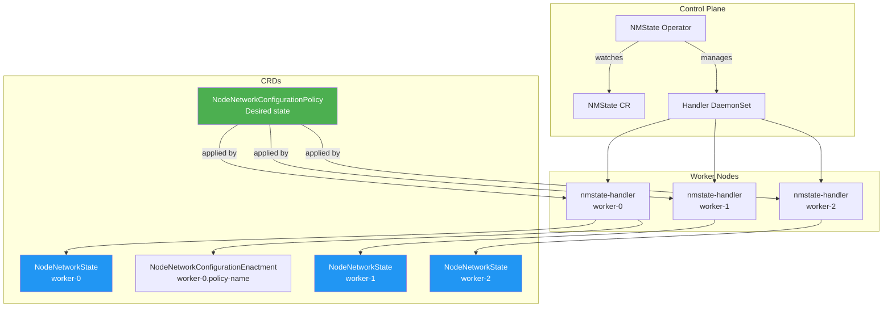

> 💡 **Quick Answer:** The NMState operator enables declarative host networking on Kubernetes and OpenShift. On OpenShift 4.x it's available in OperatorHub — install the operator, create an `NMState` CR instance, and the handler DaemonSet deploys to every node. On vanilla Kubernetes, deploy via Helm or raw manifests from the kubernetes-nmstate project.

## The Problem

Kubernetes manages pod networking through CNI plugins, but **host-level networking** — physical NICs, bonds, VLANs, bridges, routes, DNS — is left to the administrator. Without NMState:

- You SSH into each node to configure interfaces
- Network changes are imperative and hard to track
- No automatic rollback when a config breaks connectivity
- Inconsistent state across nodes in large clusters
- No Kubernetes-native way to audit node network configuration

## The Solution

### Option 1: OpenShift (OperatorHub)

#### Step 1: Install via OperatorHub

```yaml
# Create the namespace (usually already exists)
apiVersion: v1
kind: Namespace
metadata:
  name: openshift-nmstate

---
# OperatorGroup
apiVersion: operators.coreos.com/v1
kind: OperatorGroup
metadata:
  name: openshift-nmstate
  namespace: openshift-nmstate
spec:
  targetNamespaces:
  - openshift-nmstate

---
# Subscription
apiVersion: operators.coreos.com/v1alpha1
kind: Subscription
metadata:
  name: kubernetes-nmstate-operator
  namespace: openshift-nmstate
spec:
  channel: stable
  installPlanApproval: Automatic
  name: kubernetes-nmstate-operator
  source: redhat-operators
  sourceNamespace: openshift-marketplace
```

```bash
# Apply
kubectl apply -f nmstate-subscription.yaml

# Wait for operator pod
kubectl get pods -n openshift-nmstate -w
# NAME                                    READY   STATUS
# nmstate-operator-xxxxxxx                1/1     Running
```

#### Step 2: Create NMState Instance

The operator is installed but **not active** until you create the `NMState` CR:

```yaml
apiVersion: nmstate.io/v1
kind: NMState
metadata:
  name: nmstate
```

```bash
kubectl apply -f nmstate-instance.yaml

# Wait for handler DaemonSet to roll out (one pod per node)
kubectl get ds -n openshift-nmstate
# NAME              DESIRED   CURRENT   READY   NODE SELECTOR
# nmstate-handler   6         6         6       <none>

# Verify all handlers are running
kubectl get pods -n openshift-nmstate -l component=kubernetes-nmstate-handler
```

#### Step 3: Verify Node Network State

Once handlers are running, every node reports its network state:

```bash
# List all node network states
kubectl get nns
# NAME        AGE
# worker-0    2m
# worker-1    2m
# worker-2    2m
# master-0    2m

# Inspect a node's interfaces
kubectl get nns worker-0 -o jsonpath='{.status.currentState.interfaces[*].name}' | tr ' ' '\n'
# lo
# ens1f0
# ens1f1
# ens2f0np0
# ens2f1np0
# ovs-system
# br-ex

# Full detail for a specific interface
kubectl get nns worker-0 -o yaml | grep -A20 "name: ens1f0"
```

### Option 2: Vanilla Kubernetes (Helm)

```bash
# Add the kubernetes-nmstate Helm repo
helm repo add nmstate https://nmstate.io/kubernetes-nmstate
helm repo update

# Install the operator
helm install nmstate nmstate/kubernetes-nmstate \
  --namespace nmstate \
  --create-namespace \
  --set operator.replicas=1

# Verify
kubectl get pods -n nmstate
```

### Option 3: Vanilla Kubernetes (Manifests)

```bash
# Deploy from upstream manifests
kubectl apply -f https://github.com/nmstate/kubernetes-nmstate/releases/download/v0.82.0/nmstate.io_nmstates.yaml
kubectl apply -f https://github.com/nmstate/kubernetes-nmstate/releases/download/v0.82.0/namespace.yaml
kubectl apply -f https://github.com/nmstate/kubernetes-nmstate/releases/download/v0.82.0/service_account.yaml
kubectl apply -f https://github.com/nmstate/kubernetes-nmstate/releases/download/v0.82.0/role.yaml
kubectl apply -f https://github.com/nmstate/kubernetes-nmstate/releases/download/v0.82.0/role_binding.yaml
kubectl apply -f https://github.com/nmstate/kubernetes-nmstate/releases/download/v0.82.0/operator.yaml

# Create the NMState instance
cat <<EOF | kubectl apply -f -
apiVersion: nmstate.io/v1
kind: NMState
metadata:
  name: nmstate
EOF
```

### Architecture Overview



### The Three CRDs

| CRD | Scope | Purpose |
|-----|-------|---------|
| **NodeNetworkState** (NNS) | Per node | Read-only current state of all interfaces |
| **NodeNetworkConfigurationPolicy** (NNCP) | Cluster | Desired network state you apply |
| **NodeNetworkConfigurationEnactment** (NNCE) | Per node × policy | Status of each policy on each node |

### Operator Configuration Options

```yaml
apiVersion: nmstate.io/v1
kind: NMState
metadata:
  name: nmstate
spec:
  # Node selector — only deploy handlers to specific nodes
  nodeSelector:
    node-role.kubernetes.io/worker: ""
  
  # Tolerations — deploy on tainted nodes (e.g., GPU nodes)
  tolerations:
  - key: nvidia.com/gpu
    operator: Exists
    effect: NoSchedule
  
  # Infra node placement for the operator itself
  infraNodeSelector:
    node-role.kubernetes.io/infra: ""
  infraTolerations:
  - key: node-role.kubernetes.io/infra
    operator: Exists
```

### Health Check Script

```bash
#!/bin/bash
# nmstate-health.sh — verify NMState operator health

echo "=== NMState Operator ==="
kubectl get pods -n openshift-nmstate -l name=kubernetes-nmstate-operator \
  --no-headers -o custom-columns="POD:.metadata.name,STATUS:.status.phase,NODE:.spec.nodeName"

echo ""
echo "=== Handler DaemonSet ==="
kubectl get ds -n openshift-nmstate nmstate-handler \
  --no-headers -o custom-columns="DESIRED:.status.desiredNumberScheduled,READY:.status.numberReady,UPDATED:.status.updatedNumberScheduled"

echo ""
echo "=== Node Network States ==="
NNS_COUNT=$(kubectl get nns --no-headers 2>/dev/null | wc -l)
NODE_COUNT=$(kubectl get nodes --no-headers | wc -l)
echo "NNS objects: $NNS_COUNT / $NODE_COUNT nodes"

echo ""
echo "=== Active Policies ==="
kubectl get nncp --no-headers -o custom-columns="NAME:.metadata.name,STATUS:.status.conditions[-1].type,REASON:.status.conditions[-1].reason" 2>/dev/null || echo "No policies applied"

echo ""
echo "=== Degraded Enactments ==="
kubectl get nnce --no-headers 2>/dev/null | grep -v Available || echo "None — all healthy ✅"
```

### Upgrade the Operator

On OpenShift with `installPlanApproval: Automatic`, updates happen automatically. For manual approval:

```yaml
spec:
  installPlanApproval: Manual
```

```bash
# Check pending install plans
kubectl get installplan -n openshift-nmstate

# Approve an upgrade
kubectl patch installplan <plan-name> -n openshift-nmstate \
  --type merge -p '{"spec":{"approved":true}}'

# Verify new version
kubectl get csv -n openshift-nmstate
```

### Uninstall

```bash
# 1. Remove all NNCPs first (reverts network changes)
kubectl delete nncp --all

# 2. Wait for enactments to clear
kubectl get nnce  # Should show all removed

# 3. Delete the NMState instance
kubectl delete nmstate nmstate

# 4. Delete the subscription
kubectl delete subscription kubernetes-nmstate-operator -n openshift-nmstate

# 5. Delete the CSV
kubectl delete csv -n openshift-nmstate $(kubectl get csv -n openshift-nmstate -o name)

# 6. Clean up namespace
kubectl delete namespace openshift-nmstate
```

## Common Issues

**Handler pods not starting**

Check if nodes have NetworkManager running — NMState requires it. On minimal OS installs, NetworkManager may not be the default. Verify with `systemctl status NetworkManager` on the node.

**NNS not appearing for a node**

The handler pod on that node may be crashlooping. Check `kubectl logs -n openshift-nmstate nmstate-handler-<hash> -c nmstate-handler`. Common cause: incompatible NetworkManager version.

**Operator installed but no handlers**

You must create the `NMState` CR instance after installing the operator. The operator watches for this CR to deploy the handler DaemonSet.

**Permission denied on vanilla Kubernetes**

The handler needs privileged access to configure host networking. Ensure your PodSecurityPolicy or PodSecurityAdmission allows privileged pods in the nmstate namespace.

## Best Practices

- **Create the NMState CR immediately after operator install** — it's easy to forget
- **Use `nodeSelector` on the NMState CR** to limit handler deployment to nodes that need network config
- **Add tolerations for GPU/infra nodes** — tainted nodes won't get handlers otherwise
- **Check `nns` before writing any NNCP** — know your interface names
- **Use manual `installPlanApproval`** in production — test operator upgrades in staging first
- **Monitor handler pod health** — a crashed handler means that node can't process NNCPs
- **Keep the operator namespace separate** — don't install other workloads in openshift-nmstate

## Key Takeaways

- NMState operator is the foundation for declarative node networking on K8s/OpenShift
- Install path: Operator → NMState CR → Handlers deploy → NNS populated → Ready for NNCPs
- Three CRDs: NNS (current state), NNCP (desired state), NNCE (per-node status)
- On OpenShift: OperatorHub one-click install. On vanilla K8s: Helm or upstream manifests
- Always verify handlers are running and NNS objects exist before applying NNCPs
- Automatic 4-minute rollback protects against network misconfigurations
