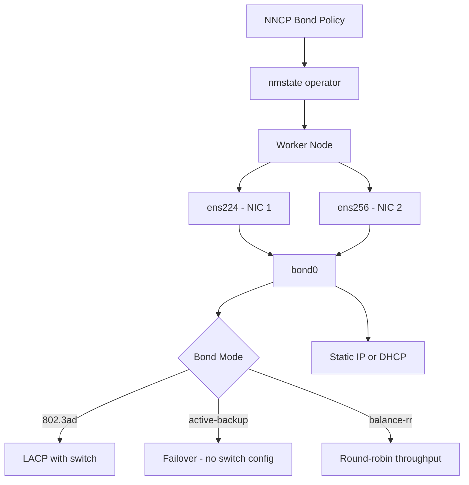

> 💡 **Quick Answer:** Define a `bond` interface in your NNCP `desiredState` with the desired mode (`802.3ad` for LACP, `active-backup` for failover), list port interfaces, and configure miimon for link monitoring.

## The Problem

Worker nodes with a single NIC are a single point of failure. When the link goes down, the node becomes unreachable, disrupting all workloads. You need:

- **Link redundancy** — automatic failover if a NIC or cable fails
- **Increased bandwidth** — aggregate multiple links for storage or GPU traffic
- **Consistent configuration** — same bond setup across all workers without SSH

## The Solution

### Step 1: LACP Bond (802.3ad)

The most common production configuration. Requires switch-side LACP configuration:

```yaml
apiVersion: nmstate.io/v1
kind: NodeNetworkConfigurationPolicy
metadata:
  name: worker-bond-lacp
spec:
  nodeSelector:
    node-role.kubernetes.io/worker: ""
  desiredState:
    interfaces:
      - name: bond0
        type: bond
        state: up
        ipv4:
          enabled: true
          dhcp: false
          address:
            - ip: 192.168.100.10
              prefix-length: 24
        ipv6:
          enabled: false
        link-aggregation:
          mode: 802.3ad
          options:
            miimon: "100"
            lacp_rate: "fast"
            xmit_hash_policy: "layer3+4"
          port:
            - ens224
            - ens256
      # Ensure port interfaces are up with no IP
      - name: ens224
        type: ethernet
        state: up
        ipv4:
          enabled: false
        ipv6:
          enabled: false
      - name: ens256
        type: ethernet
        state: up
        ipv4:
          enabled: false
        ipv6:
          enabled: false
```

### Step 2: Active-Backup Bond

No switch configuration required — works with any switch:

```yaml
apiVersion: nmstate.io/v1
kind: NodeNetworkConfigurationPolicy
metadata:
  name: worker-bond-active-backup
spec:
  nodeSelector:
    node-role.kubernetes.io/worker: ""
  desiredState:
    interfaces:
      - name: bond0
        type: bond
        state: up
        ipv4:
          enabled: true
          dhcp: false
          address:
            - ip: 10.10.0.10
              prefix-length: 24
        link-aggregation:
          mode: active-backup
          options:
            miimon: "100"
            primary: ens224
          port:
            - ens224
            - ens256
```

### Step 3: Balance-RR Bond

Round-robin for maximum throughput (requires switch support):

```yaml
apiVersion: nmstate.io/v1
kind: NodeNetworkConfigurationPolicy
metadata:
  name: worker-bond-rr
spec:
  nodeSelector:
    node-role.kubernetes.io/worker: ""
  desiredState:
    interfaces:
      - name: bond0
        type: bond
        state: up
        ipv4:
          enabled: true
          dhcp: true
        link-aggregation:
          mode: balance-rr
          options:
            miimon: "100"
          port:
            - ens224
            - ens256
```

### Step 4: Verify Bond Status

```bash
# Check NNCP status
oc get nncp worker-bond-lacp

# Verify bond on node
oc debug node/worker-0 -- chroot /host cat /proc/net/bonding/bond0

# Check link status
oc debug node/worker-0 -- chroot /host ip link show bond0
```

### Bond Mode Reference

| Mode | Name | Switch Config | Use Case |
|------|------|--------------|----------|
| `802.3ad` | LACP | Required | Production: bandwidth + redundancy |
| `active-backup` | Failover | None | Simple redundancy, any switch |
| `balance-rr` | Round-Robin | Required | Maximum throughput |
| `balance-xor` | XOR | Recommended | Predictable distribution |
| `balance-tlb` | TLB | None | Outbound load balancing |
| `balance-alb` | ALB | None | Full adaptive load balancing |



## Common Issues

### Bond created but no connectivity

```bash
# Verify port interfaces have no IP (IPs must be on bond only)
oc debug node/worker-0 -- chroot /host ip addr show ens224
# Should show NO inet address

# Check port interfaces are enslaved
oc debug node/worker-0 -- chroot /host cat /proc/net/bonding/bond0 | grep "Slave Interface"
```

### LACP bond not aggregating

```bash
# Check LACP partner info
oc debug node/worker-0 -- chroot /host cat /proc/net/bonding/bond0 | grep -A5 "Partner"

# Switch must have LACP enabled on the same ports
# Verify with: show lacp neighbor (Cisco) or similar
```

### miimon not detecting link failure

```yaml
# Decrease miimon interval for faster detection
link-aggregation:
  options:
    miimon: "50"    # Check every 50ms instead of 100ms
    downdelay: "200"
    updelay: "200"
```

## Best Practices

- **Use `802.3ad` (LACP) for production** — provides both redundancy and bandwidth aggregation
- **Use `active-backup` when switch LACP isn't available** — works with any switch, no configuration needed
- **Set `miimon: "100"`** — 100ms link monitoring is a good default; lower for faster failover
- **Set `xmit_hash_policy: "layer3+4"`** for LACP — distributes traffic based on IP and port for better balance
- **Always remove IPs from port interfaces** — only the bond interface should have addresses
- **Test failover** — disconnect a cable and verify traffic continues on the remaining link

## Key Takeaways

- NNCP bonds provide **declarative NIC redundancy** across all worker nodes
- `802.3ad` (LACP) is the recommended mode for production — combines redundancy with bandwidth aggregation
- `active-backup` requires **no switch configuration** and is the safest choice for unknown switch environments
- Port interfaces must have **no IP addresses** — all addressing goes on the bond interface
- Always verify with `cat /proc/net/bonding/bond0` to confirm port status and LACP negotiation
