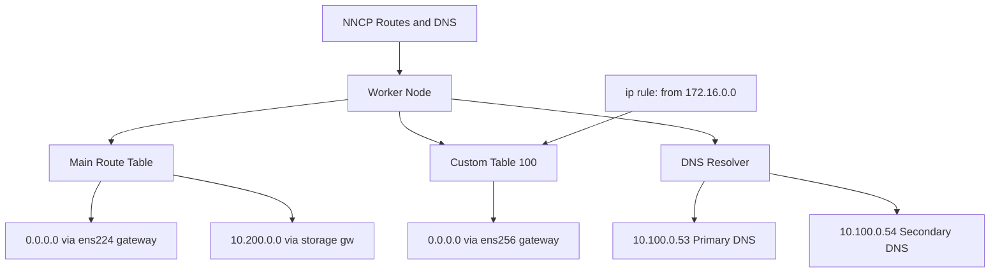

> 💡 **Quick Answer:** Add `routes.config` and `dns-resolver.config` sections to your NNCP `desiredState` to define static routes and DNS servers. Use `route-rules` for policy-based routing to direct traffic based on source IP.

## The Problem

Multi-NIC worker nodes need proper routing and DNS to function:

- **Storage traffic** must route through the storage VLAN, not the default gateway
- **GPU/RDMA traffic** needs dedicated routes to remote GPU nodes
- **DNS resolution** for internal services may differ per network segment
- **Policy-based routing** ensures return traffic exits the correct interface

Without explicit routes, all traffic goes through the default gateway on the primary interface, even when a dedicated interface exists for that subnet.

## The Solution

### Step 1: Static Routes

```yaml
apiVersion: nmstate.io/v1
kind: NodeNetworkConfigurationPolicy
metadata:
  name: worker-routes
spec:
  nodeSelector:
    node-role.kubernetes.io/worker: ""
  desiredState:
    interfaces:
      - name: ens224
        type: ethernet
        state: up
        ipv4:
          enabled: true
          dhcp: false
          address:
            - ip: 10.100.0.10
              prefix-length: 24
    routes:
      config:
        # Route storage traffic through storage gateway
        - destination: 10.200.0.0/16
          next-hop-address: 10.100.0.1
          next-hop-interface: ens224
          metric: 100
        # Route to remote GPU cluster
        - destination: 10.50.0.0/24
          next-hop-address: 10.100.0.1
          next-hop-interface: ens224
          metric: 150
```

### Step 2: Default Gateway on Secondary Interface

```yaml
apiVersion: nmstate.io/v1
kind: NodeNetworkConfigurationPolicy
metadata:
  name: worker-secondary-gateway
spec:
  nodeSelector:
    node-role.kubernetes.io/worker: ""
  desiredState:
    interfaces:
      - name: ens256
        type: ethernet
        state: up
        ipv4:
          enabled: true
          dhcp: false
          address:
            - ip: 172.16.0.10
              prefix-length: 24
    routes:
      config:
        # Default route with higher metric (lower priority)
        - destination: 0.0.0.0/0
          next-hop-address: 172.16.0.1
          next-hop-interface: ens256
          metric: 200
```

### Step 3: DNS Configuration

```yaml
apiVersion: nmstate.io/v1
kind: NodeNetworkConfigurationPolicy
metadata:
  name: worker-dns
spec:
  nodeSelector:
    node-role.kubernetes.io/worker: ""
  desiredState:
    dns-resolver:
      config:
        server:
          - 10.100.0.53
          - 10.100.0.54
        search:
          - storage.internal.example.com
          - internal.example.com
```

### Step 4: Policy-Based Routing

Ensure traffic from a specific source IP exits through the correct interface:

```yaml
apiVersion: nmstate.io/v1
kind: NodeNetworkConfigurationPolicy
metadata:
  name: worker-policy-routing
spec:
  nodeSelector:
    node-role.kubernetes.io/worker: ""
  desiredState:
    interfaces:
      - name: ens224
        type: ethernet
        state: up
        ipv4:
          enabled: true
          dhcp: false
          address:
            - ip: 10.100.0.10
              prefix-length: 24
      - name: ens256
        type: ethernet
        state: up
        ipv4:
          enabled: true
          dhcp: false
          address:
            - ip: 172.16.0.10
              prefix-length: 24
    routes:
      config:
        # Default route for main table
        - destination: 0.0.0.0/0
          next-hop-address: 10.100.0.1
          next-hop-interface: ens224
          metric: 100
        # Route in custom table 100
        - destination: 0.0.0.0/0
          next-hop-address: 172.16.0.1
          next-hop-interface: ens256
          table-id: 100
    route-rules:
      config:
        # Traffic from 172.16.0.0/24 uses table 100
        - ip-from: 172.16.0.0/24
          route-table: 100
          priority: 100
```

### Step 5: Verify

```bash
# Check routes
oc debug node/worker-0 -- chroot /host ip route show

# Check policy routing rules
oc debug node/worker-0 -- chroot /host ip rule show

# Check custom routing table
oc debug node/worker-0 -- chroot /host ip route show table 100

# Verify DNS
oc debug node/worker-0 -- chroot /host cat /etc/resolv.conf
```



## Common Issues

### Route conflicts with existing routes

```bash
# Check existing routes before applying
oc debug node/worker-0 -- chroot /host ip route show

# Remove conflicting routes by setting state absent
routes:
  config:
    - destination: 10.200.0.0/16
      next-hop-interface: ens224
      state: absent
```

### DNS changes not taking effect

```bash
# nmstate configures NetworkManager, which manages resolv.conf
# Verify NetworkManager is managing DNS
oc debug node/worker-0 -- chroot /host nmcli general

# Check connection DNS settings
oc debug node/worker-0 -- chroot /host nmcli connection show ens224 | grep dns
```

### Policy routing not working

```bash
# Verify rule is installed
oc debug node/worker-0 -- chroot /host ip rule list

# Test routing from specific source
oc debug node/worker-0 -- chroot /host \
  ip route get 8.8.8.8 from 172.16.0.10
```

## Best Practices

- **Use higher metrics for secondary default routes** — prevents overriding the primary cluster gateway
- **Use policy-based routing** for multi-homed workers — ensures return traffic exits the correct interface
- **Set `auto-routes: false`** on DHCP interfaces to prevent DHCP-assigned routes from conflicting
- **Document your routing tables** — record table IDs and their purpose (e.g., table 100 = external traffic)
- **Test routes before deploying workloads** — verify with `ip route get <destination> from <source>`
- **Keep DNS configuration consistent** — all workers in the same network segment should use the same DNS servers

## Key Takeaways

- NNCP manages **static routes**, **DNS servers**, and **policy-based routing** through the Kubernetes API
- Use `routes.config` for static routes with destination, gateway, interface, and metric
- Use `route-rules.config` with `table-id` for **policy-based routing** — essential for multi-NIC workers
- DNS is configured via `dns-resolver.config` with servers and search domains
- Always use **higher metrics** for secondary default routes to avoid breaking cluster connectivity
