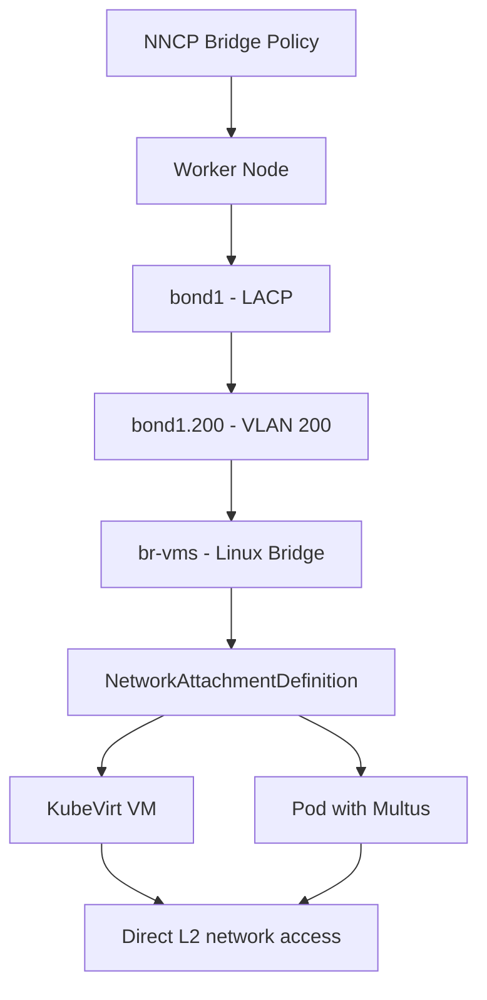

> 💡 **Quick Answer:** Define a `linux-bridge` interface in your NNCP with physical NICs or bonds as ports. Use `NetworkAttachmentDefinition` to connect KubeVirt VMs or pods to the bridge for direct L2 network access.

## The Problem

KubeVirt virtual machines and certain pod workloads need direct Layer 2 access to external networks — not just Kubernetes overlay networking. You need Linux bridges on worker nodes for:

- **VM networking** — KubeVirt VMs connecting to existing VLANs
- **Legacy integration** — workloads requiring broadcast domain access
- **Bare-metal services** — pods with real network presence (DHCP servers, network appliances)
- **Migration from VMware** — VMs expecting bridged networking

## The Solution

### Step 1: Simple Bridge with Physical NIC

```yaml
apiVersion: nmstate.io/v1
kind: NodeNetworkConfigurationPolicy
metadata:
  name: worker-bridge-external
spec:
  nodeSelector:
    node-role.kubernetes.io/worker: ""
  desiredState:
    interfaces:
      - name: br-external
        type: linux-bridge
        state: up
        ipv4:
          enabled: false
        ipv6:
          enabled: false
        bridge:
          options:
            stp:
              enabled: true
            group-forward-mask: 0
          port:
            - name: ens256
              stp-hairpin-mode: false
              stp-path-cost: 100
              stp-priority: 32
```

### Step 2: Bridge on Bond + VLAN (Production Pattern)

```yaml
apiVersion: nmstate.io/v1
kind: NodeNetworkConfigurationPolicy
metadata:
  name: worker-bridge-vm-network
spec:
  nodeSelector:
    node-role.kubernetes.io/worker: ""
  desiredState:
    interfaces:
      # Bond
      - name: bond1
        type: bond
        state: up
        ipv4:
          enabled: false
        ipv6:
          enabled: false
        link-aggregation:
          mode: 802.3ad
          options:
            miimon: "100"
          port:
            - ens224
            - ens256
      - name: ens224
        type: ethernet
        state: up
        ipv4:
          enabled: false
        ipv6:
          enabled: false
      - name: ens256
        type: ethernet
        state: up
        ipv4:
          enabled: false
        ipv6:
          enabled: false
      # VLAN on bond
      - name: bond1.200
        type: vlan
        state: up
        vlan:
          base-iface: bond1
          id: 200
        ipv4:
          enabled: false
      # Bridge on VLAN
      - name: br-vms
        type: linux-bridge
        state: up
        ipv4:
          enabled: false
        ipv6:
          enabled: false
        bridge:
          options:
            stp:
              enabled: false
          port:
            - name: bond1.200
```

### Step 3: Create NetworkAttachmentDefinition

Connect pods and VMs to the bridge:

```yaml
apiVersion: k8s.cni.cncf.io/v1
kind: NetworkAttachmentDefinition
metadata:
  name: vm-network
  namespace: my-vms
spec:
  config: |
    {
      "cniVersion": "0.3.1",
      "name": "vm-network",
      "type": "bridge",
      "bridge": "br-vms",
      "vlan": 200,
      "ipam": {}
    }
```

### Step 4: Attach a KubeVirt VM to the Bridge

```yaml
apiVersion: kubevirt.io/v1
kind: VirtualMachine
metadata:
  name: my-vm
  namespace: my-vms
spec:
  running: true
  template:
    spec:
      domain:
        devices:
          interfaces:
            - name: default
              masquerade: {}
            - name: external
              bridge: {}
        resources:
          requests:
            memory: 4Gi
      networks:
        - name: default
          pod: {}
        - name: external
          multus:
            networkName: vm-network
```

### Step 5: Verify

```bash
# Check bridge on node
oc debug node/worker-0 -- chroot /host bridge link show

# Check bridge details
oc debug node/worker-0 -- chroot /host ip link show br-vms

# Verify NAD is created
oc get net-attach-def -n my-vms
```



## Common Issues

### Bridge causes network loop

```yaml
# Enable STP to prevent loops
bridge:
  options:
    stp:
      enabled: true
      forward-delay: 15
      hello-time: 2
      max-age: 20
```

### VM gets no DHCP address

```bash
# Verify bridge has the VLAN port attached
oc debug node/worker-0 -- chroot /host bridge link show br-vms

# Check DHCP traffic is reaching the bridge
oc debug node/worker-0 -- chroot /host tcpdump -i br-vms -n port 67 or port 68
```

### Node loses connectivity after bridge creation

```yaml
# Never bridge the primary cluster network interface!
# Only bridge secondary/dedicated interfaces
# If you accidentally bridged the primary NIC:
# The nmstate operator will auto-rollback after timeout
```

## Best Practices

- **Never bridge the primary cluster NIC** — only use secondary interfaces for bridges
- **Use bond + VLAN + bridge** for production KubeVirt — provides redundancy, segmentation, and VM connectivity
- **Disable STP** when the bridge has only one uplink — reduces convergence time
- **Enable STP** when multiple uplinks could create loops
- **Use NetworkAttachmentDefinition** with Multus to expose bridges to pods and VMs
- **Keep bridge IPs disabled** — VMs and pods get their own IPs via DHCP or static config

## Key Takeaways

- Linux bridges on worker nodes enable **direct L2 access** for KubeVirt VMs and Multus-attached pods
- The production pattern is **bond + VLAN + bridge** — redundancy, segmentation, and bridging in one stack
- Use `NetworkAttachmentDefinition` with the `bridge` CNI plugin to connect workloads
- **Never bridge the primary cluster interface** — the nmstate operator will rollback, but you'll lose connectivity briefly
- STP should be enabled when multiple bridge ports could create network loops
