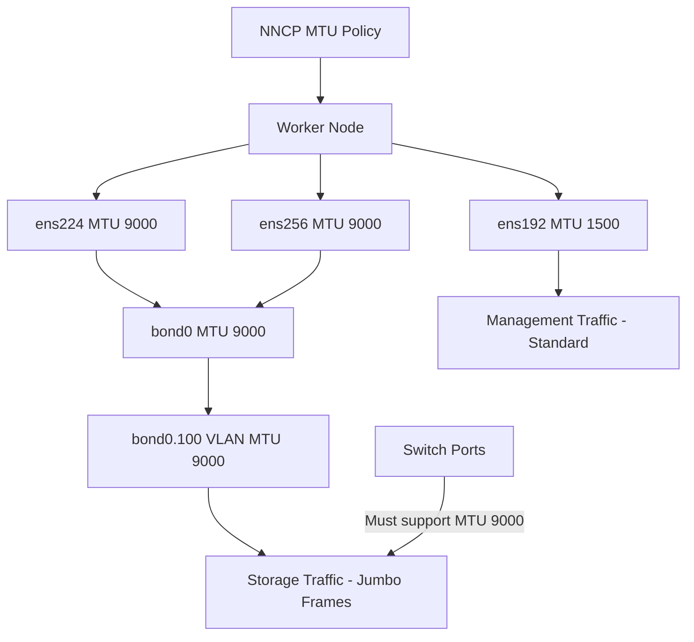

> 💡 **Quick Answer:** Set `mtu: 9000` on your interfaces in the NNCP `desiredState`. Configure MTU bottom-up: physical NIC first, then bond, then VLAN, then bridge. Every hop in the path must support the MTU — including switches.

## The Problem

The default MTU of 1500 bytes adds overhead for large data transfers:

- **Storage traffic** — Ceph, NFS, iSCSI transfers are fragmented into small packets
- **GPU/RDMA** — large tensor transfers benefit from fewer, larger packets
- **Backup and replication** — bulk data movement is slower with small MTU
- **VM live migration** — KubeVirt VM memory transfer is latency-sensitive

Jumbo frames (MTU 9000) reduce CPU overhead and increase throughput by 10-30% for large sequential transfers.

## The Solution

### Step 1: Physical NIC MTU

```yaml
apiVersion: nmstate.io/v1
kind: NodeNetworkConfigurationPolicy
metadata:
  name: worker-mtu-storage
spec:
  nodeSelector:
    node-role.kubernetes.io/worker: ""
  desiredState:
    interfaces:
      - name: ens224
        type: ethernet
        state: up
        mtu: 9000
        ipv4:
          enabled: true
          dhcp: false
          address:
            - ip: 10.100.0.10
              prefix-length: 24
```

### Step 2: MTU on Bond + VLAN Stack

Set MTU bottom-up — parent must be >= child:

```yaml
apiVersion: nmstate.io/v1
kind: NodeNetworkConfigurationPolicy
metadata:
  name: worker-jumbo-stack
spec:
  nodeSelector:
    node-role.kubernetes.io/worker: ""
  desiredState:
    interfaces:
      # Physical NICs — MTU 9000
      - name: ens224
        type: ethernet
        state: up
        mtu: 9000
        ipv4:
          enabled: false
      - name: ens256
        type: ethernet
        state: up
        mtu: 9000
        ipv4:
          enabled: false
      # Bond — MTU 9000
      - name: bond0
        type: bond
        state: up
        mtu: 9000
        ipv4:
          enabled: false
        link-aggregation:
          mode: 802.3ad
          options:
            miimon: "100"
          port:
            - ens224
            - ens256
      # VLAN — MTU 9000 (inherits from bond)
      - name: bond0.100
        type: vlan
        state: up
        mtu: 9000
        vlan:
          base-iface: bond0
          id: 100
        ipv4:
          enabled: true
          dhcp: false
          address:
            - ip: 10.100.0.10
              prefix-length: 24
```

### Step 3: Mixed MTU — Different Networks

```yaml
apiVersion: nmstate.io/v1
kind: NodeNetworkConfigurationPolicy
metadata:
  name: worker-mixed-mtu
spec:
  nodeSelector:
    node-role.kubernetes.io/worker: ""
  desiredState:
    interfaces:
      # Management — standard MTU
      - name: ens192
        type: ethernet
        state: up
        mtu: 1500
        ipv4:
          enabled: true
          dhcp: true
      # Storage — jumbo frames
      - name: ens224
        type: ethernet
        state: up
        mtu: 9000
        ipv4:
          enabled: true
          dhcp: false
          address:
            - ip: 10.100.0.10
              prefix-length: 24
      # GPU RDMA — jumbo frames
      - name: ens256
        type: ethernet
        state: up
        mtu: 9000
        ipv4:
          enabled: true
          dhcp: false
          address:
            - ip: 10.50.0.10
              prefix-length: 24
```

### Step 4: Verify End-to-End MTU

```bash
# Check interface MTU
oc debug node/worker-0 -- chroot /host ip link show ens224 | grep mtu

# Test MTU path with ping (don't fragment flag)
oc debug node/worker-0 -- chroot /host \
  ping -M do -s 8972 -c 3 10.100.0.1
# 8972 + 28 (IP+ICMP headers) = 9000

# Check all interface MTUs on a node
oc debug node/worker-0 -- chroot /host \
  ip -o link show | awk '{print $2, $NF}' | grep mtu
```

### MTU Size Reference

| MTU | Name | Use Case |
|-----|------|----------|
| 1500 | Standard | Default, management, internet-facing |
| 4000 | Baby jumbo | Some cloud providers (Azure) |
| 9000 | Jumbo frames | Storage, RDMA, HPC, AI training |
| 9216 | Extended jumbo | Some switch vendors' maximum |



## Common Issues

### Jumbo frames working on node but not in pods

```bash
# Pod MTU is set by the CNI plugin, not by node MTU
# For Multus secondary interfaces, set MTU in the NAD:
# "mtu": 9000 in the CNI config

# For the primary pod network (OVN-Kubernetes):
# oc patch network.operator cluster --type merge \
#   --patch '{"spec":{"defaultNetwork":{"ovnKubernetesConfig":{"mtu":8900}}}}'
```

### Asymmetric MTU causes packet drops

```bash
# All hops must support the same MTU
# Test each hop:
ping -M do -s 8972 -c 3 <gateway>
ping -M do -s 8972 -c 3 <switch-ip>
ping -M do -s 8972 -c 3 <destination>

# If any hop fails, it doesn't support jumbo frames
```

### Bond MTU not applying to ports

```yaml
# Set MTU explicitly on each port interface
# nmstate may not auto-propagate MTU to bond ports
interfaces:
  - name: ens224
    type: ethernet
    mtu: 9000     # Explicit on port
  - name: bond0
    type: bond
    mtu: 9000     # Explicit on bond
```

## Best Practices

- **Set MTU bottom-up** — physical NIC >= bond >= VLAN >= bridge
- **Verify end-to-end** before deploying workloads — use `ping -M do -s 8972` to test the full path
- **Don't change primary interface MTU** unless the entire cluster network supports it
- **Use 9000 for storage and RDMA** — the performance improvement is significant for bulk transfers
- **Keep management interfaces at 1500** — not all network equipment supports jumbo frames
- **Configure switches first** — the switch must support the MTU before nodes can use it
- **Set MTU in NADs too** — pod secondary interfaces need MTU configured in the NetworkAttachmentDefinition

## Key Takeaways

- Jumbo frames (MTU 9000) reduce CPU overhead and increase throughput by **10-30%** for large transfers
- Configure MTU **bottom-up**: physical NIC → bond → VLAN → bridge — parent must be >= child
- **Every network hop** must support the MTU — including switches, routers, and firewalls
- Use `ping -M do -s 8972` to verify the MTU path (8972 + 28 headers = 9000)
- Keep **management interfaces at 1500** and only enable jumbo frames on storage, RDMA, and GPU networks
