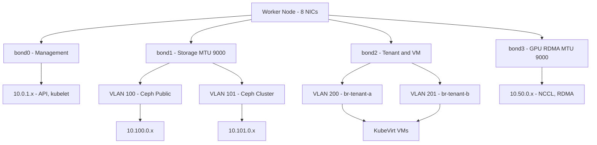

> 💡 **Quick Answer:** Use separate bonded interfaces for each traffic class — management (bond0), storage (bond1), tenant/VM (bond2), and GPU/RDMA (bond3). Layer VLANs on bonds for sub-segmentation and Linux bridges on top for KubeVirt VM access.

## The Problem

Production Kubernetes worker nodes handle multiple types of traffic that must be separated for performance, security, and reliability:

- **Management/API** — kubelet, kube-proxy, API server communication
- **Storage** — Ceph OSD replication, NFS mounts, iSCSI targets
- **Tenant/VM** — KubeVirt VM external networking, multi-tenant isolation
- **GPU/RDMA** — distributed AI training, inter-node tensor transfers

Mixing all traffic on a single NIC creates contention — a large Ceph rebalance can starve GPU training traffic. Proper multi-NIC architecture with NNCP provides declarative, reproducible network configuration across the fleet.

## The Solution

### Complete Multi-NIC Architecture

A typical 4-bond production worker node:

```yaml
apiVersion: nmstate.io/v1
kind: NodeNetworkConfigurationPolicy
metadata:
  name: worker-0-multi-nic
spec:
  nodeSelector:
    kubernetes.io/hostname: worker-0
  maxUnavailable: 1
  desiredState:
    interfaces:
      # ==========================================
      # Bond 0: Management (ens192 + ens193)
      # ==========================================
      - name: ens192
        type: ethernet
        state: up
        ipv4:
          enabled: false
        ipv6:
          enabled: false
      - name: ens193
        type: ethernet
        state: up
        ipv4:
          enabled: false
        ipv6:
          enabled: false
      - name: bond0
        type: bond
        state: up
        ipv4:
          enabled: true
          dhcp: false
          address:
            - ip: 10.0.1.10
              prefix-length: 24
        ipv6:
          enabled: false
        link-aggregation:
          mode: active-backup
          options:
            miimon: "100"
            primary: ens192
          port:
            - ens192
            - ens193

      # ==========================================
      # Bond 1: Storage (ens224 + ens225) MTU 9000
      # ==========================================
      - name: ens224
        type: ethernet
        state: up
        mtu: 9000
        ipv4:
          enabled: false
        ipv6:
          enabled: false
      - name: ens225
        type: ethernet
        state: up
        mtu: 9000
        ipv4:
          enabled: false
        ipv6:
          enabled: false
      - name: bond1
        type: bond
        state: up
        mtu: 9000
        ipv4:
          enabled: false
        ipv6:
          enabled: false
        link-aggregation:
          mode: 802.3ad
          options:
            miimon: "100"
            lacp_rate: "fast"
            xmit_hash_policy: "layer3+4"
          port:
            - ens224
            - ens225

      # Storage VLANs on bond1
      - name: bond1.100
        type: vlan
        state: up
        mtu: 9000
        vlan:
          base-iface: bond1
          id: 100
        ipv4:
          enabled: true
          dhcp: false
          address:
            - ip: 10.100.0.10
              prefix-length: 24
      - name: bond1.101
        type: vlan
        state: up
        mtu: 9000
        vlan:
          base-iface: bond1
          id: 101
        ipv4:
          enabled: true
          dhcp: false
          address:
            - ip: 10.101.0.10
              prefix-length: 24

      # ==========================================
      # Bond 2: Tenant and VM (ens256 + ens257)
      # ==========================================
      - name: ens256
        type: ethernet
        state: up
        ipv4:
          enabled: false
        ipv6:
          enabled: false
      - name: ens257
        type: ethernet
        state: up
        ipv4:
          enabled: false
        ipv6:
          enabled: false
      - name: bond2
        type: bond
        state: up
        ipv4:
          enabled: false
        ipv6:
          enabled: false
        link-aggregation:
          mode: 802.3ad
          options:
            miimon: "100"
          port:
            - ens256
            - ens257

      # Tenant VLANs with bridges for KubeVirt
      - name: bond2.200
        type: vlan
        state: up
        vlan:
          base-iface: bond2
          id: 200
        ipv4:
          enabled: false
      - name: br-tenant-a
        type: linux-bridge
        state: up
        ipv4:
          enabled: false
        ipv6:
          enabled: false
        bridge:
          options:
            stp:
              enabled: false
          port:
            - name: bond2.200

      - name: bond2.201
        type: vlan
        state: up
        vlan:
          base-iface: bond2
          id: 201
        ipv4:
          enabled: false
      - name: br-tenant-b
        type: linux-bridge
        state: up
        ipv4:
          enabled: false
        ipv6:
          enabled: false
        bridge:
          options:
            stp:
              enabled: false
          port:
            - name: bond2.201

      # ==========================================
      # Bond 3: GPU RDMA (ens320 + ens321) MTU 9000
      # ==========================================
      - name: ens320
        type: ethernet
        state: up
        mtu: 9000
        ipv4:
          enabled: false
        ipv6:
          enabled: false
      - name: ens321
        type: ethernet
        state: up
        mtu: 9000
        ipv4:
          enabled: false
        ipv6:
          enabled: false
      - name: bond3
        type: bond
        state: up
        mtu: 9000
        ipv4:
          enabled: true
          dhcp: false
          address:
            - ip: 10.50.0.10
              prefix-length: 24
        ipv6:
          enabled: false
        link-aggregation:
          mode: 802.3ad
          options:
            miimon: "100"
            xmit_hash_policy: "layer3+4"
          port:
            - ens320
            - ens321

    # ==========================================
    # Routing
    # ==========================================
    routes:
      config:
        # Default gateway via management bond
        - destination: 0.0.0.0/0
          next-hop-address: 10.0.1.1
          next-hop-interface: bond0
          metric: 100
        # Storage network routes
        - destination: 10.200.0.0/16
          next-hop-address: 10.100.0.1
          next-hop-interface: bond1.100
          metric: 100
        # GPU cluster routes
        - destination: 10.50.0.0/16
          next-hop-address: 10.50.0.1
          next-hop-interface: bond3
          metric: 100

    dns-resolver:
      config:
        server:
          - 10.0.1.53
          - 10.0.1.54
        search:
          - cluster.internal.example.com
```

### NetworkAttachmentDefinitions

Create NADs to expose these networks to pods:

```yaml
# Storage network for Ceph
apiVersion: k8s.cni.cncf.io/v1
kind: NetworkAttachmentDefinition
metadata:
  name: storage-ceph
  namespace: openshift-storage
spec:
  config: |
    {
      "cniVersion": "0.3.1",
      "type": "macvlan",
      "master": "bond1.100",
      "mode": "bridge",
      "mtu": 9000,
      "ipam": {
        "type": "whereabouts",
        "range": "10.100.0.0/24",
        "exclude": ["10.100.0.1/32", "10.100.0.0/28"]
      }
    }
---
# Tenant A VM network
apiVersion: k8s.cni.cncf.io/v1
kind: NetworkAttachmentDefinition
metadata:
  name: tenant-a-network
  namespace: tenant-a
spec:
  config: |
    {
      "cniVersion": "0.3.1",
      "type": "bridge",
      "bridge": "br-tenant-a",
      "ipam": {}
    }
---
# GPU RDMA network
apiVersion: k8s.cni.cncf.io/v1
kind: NetworkAttachmentDefinition
metadata:
  name: gpu-rdma
  namespace: ai-workloads
spec:
  config: |
    {
      "cniVersion": "0.3.1",
      "type": "macvlan",
      "master": "bond3",
      "mode": "bridge",
      "mtu": 9000,
      "ipam": {
        "type": "whereabouts",
        "range": "10.50.0.0/24",
        "exclude": ["10.50.0.1/32", "10.50.0.0/28"]
      }
    }
```

### Verification

```bash
# Check all bonds
for bond in bond0 bond1 bond2 bond3; do
  echo "=== $bond ==="
  oc debug node/worker-0 -- chroot /host cat /proc/net/bonding/$bond 2>/dev/null | head -10
done

# Check all VLANs
oc debug node/worker-0 -- chroot /host ls /proc/net/vlan/

# Check bridges
oc debug node/worker-0 -- chroot /host bridge link show

# Check routes
oc debug node/worker-0 -- chroot /host ip route show

# Check MTU on all interfaces
oc debug node/worker-0 -- chroot /host ip -o link show | awk '{print $2, $(NF-1), $NF}'
```



## Common Issues

### Too many interfaces cause NNCP timeout

```yaml
# Large NNCPs with many interfaces take longer to apply
# Increase the rollback timeout
metadata:
  annotations:
    nmstate.io/rollback-timeout: "480"
```

### Interface names differ across node hardware

```bash
# Use consistent naming via udev rules or
# Create per-node NNCPs with hostname selectors
# List interfaces on all workers to find discrepancies
for node in $(oc get nodes -l node-role.kubernetes.io/worker -o name); do
  echo "=== $node ==="
  oc get nns $(basename $node) -o jsonpath='{.status.currentState.interfaces[*].name}' | tr ' ' '\n' | grep -E '^(ens|eth|enp)'
done
```

### Bond and VLAN ordering issues

```yaml
# The nmstate operator handles dependency ordering
# But ensure the NNCP defines interfaces in order:
# 1. Physical NICs (ports)
# 2. Bonds (using the physical NICs)
# 3. VLANs (on bonds)
# 4. Bridges (on VLANs)
```

## Best Practices

- **Separate traffic classes onto separate bonds** — management, storage, tenant, GPU should never share NICs
- **Use active-backup for management** — simplest, no switch config needed, protects API connectivity
- **Use 802.3ad (LACP) for data bonds** — storage and GPU benefit from aggregated bandwidth
- **Jumbo frames only on storage and GPU** — keep management at MTU 1500
- **Use per-node NNCPs for unique IPs** — share a common NNCP template but customize per hostname
- **Roll out one node at a time** — always set `maxUnavailable: 1` for multi-NIC changes
- **Test the complete stack** — verify bond, VLAN, bridge, and routing together before production
- **Document the architecture** — create a network diagram mapping NICs to bonds to VLANs to bridges

## Key Takeaways

- A production multi-NIC architecture uses **4 bond pairs** (8 NICs) for full traffic separation
- Stack layers as: **physical NIC → bond → VLAN → bridge** (for VM access)
- Management uses **active-backup** (no switch config), data networks use **802.3ad** (LACP)
- **Jumbo frames (MTU 9000)** on storage and GPU networks, standard MTU on management
- Use **NetworkAttachmentDefinitions** with Multus to expose each network to pods and VMs
- **NNCP handles the full stack** declaratively — from physical NIC configuration to routing and DNS
